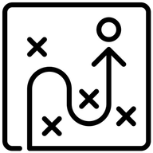

# PicNexus

<div align="center">



**图床上传工具** — 快捷上传，随处引用

[](LICENSE)
[]()
[]()

</div>

## 这是什么？

一个跨平台桌面端图床管理工具。选好图床，拖入图片，拿到链接。支持同时上传到多个图床，一次上传、多处备份，本地管理所有上传历史。

## 核心功能

- **多图床并行上传** — 信号量限流，部分失败不阻断整体上传
- **16+ 图床支持** — 从开箱即用到私有存储，覆盖主流图床服务
- **图片压缩** — JPEG / WebP / 等比缩放，Rust 原生处理
- **上传历史管理** — SQLite 本地存储，支持分页、模糊搜索、收藏、时间轴浏览
- **链接格式输出** — Markdown / HTML / BBCode / 纯 URL，上传完成自动复制
- **剪贴板监听** — 截图后自动上传
- **配置加密存储** — AES-GCM 加密敏感信息，密钥存系统 Keyring
- **云同步** — WebDAV / 本地备份同步
- **图床健康检测** — 定期检查服务可用性
- **深浅色主题** — CSS 变量驱动，一键切换
- **CLI 模式** — 命令行上传
- **Obsidian 插件** — 编辑器集成

## 支持的图床

| 分类 | 图床 | 认证方式 |
|------|------|---------|
| 开箱即用 | 京东、七鱼 | 无需配置 |
| Cookie 认证 | 微博、知乎、牛客、纳米、哔哩哔哩、超星 | 浏览器 Cookie |
| Token / API Key | SM.MS、GitHub、Imgur | API Token |
| 私有存储 | R2、腾讯云 COS、阿里云 OSS、七牛云、又拍云 | Access Key |
| 自定义 S3 | 任何 S3 兼容存储 | Access Key |

## 技术栈

| 层级 | 技术 |
|------|------|
| 桌面框架 | Tauri 2.0 |
| 前端 | Vue 3 + TypeScript + Vite 5 |
| UI 组件 | PrimeVue 4.5 |
| 后端 | Rust（reqwest + tokio） |
| 图片处理 | mozjpeg + imagequant + webp |
| 数据库 | SQLite |
| 加密 | AES-GCM |

## 架构概览

```
Vue 3 前端（Composition API）
├── Views — 上传 / 历史 / 时间轴 / 收藏 / 设置
├── 32 个 Composables — 业务逻辑复用层
├── Core — MultiServiceUploader 多图床编排 + LinkGenerator 链接生成
├── Uploaders — 工厂 + 策略模式，每个图床一个上传器实现
└── Services — HistoryDatabase (SQLite) + Store (AES-GCM 加密配置)

Rust 后端（Tauri Commands）
├── 各图床上传命令（签名认证 + HTTP 请求）
├── 图片处理（压缩 / 格式转换 / 元数据提取）
└── 系统交互（剪贴板 / 文件系统 / 全局快捷键）
```

**设计亮点：**

- **工厂 + 策略模式** — 上传器可插拔，新增图床只需实现接口
- **信号量并发控制** — 每图床最多 2 个并发，避免被限流
- **结构化错误体系** — 统一错误码 + 可重试标记，部分失败不影响整体
- **加密配置存储** — 敏感信息（Cookie、Token）AES-GCM 加密，密钥存系统 Keyring
- **配置版本迁移** — 自动从旧版本配置平滑升级

## 开发

```bash
npm install
npm run tauri dev
```

构建：`npm run tauri build`

需要 Node.js 18+ 和 Rust 环境。

## 免责声明

本项目是一个图片上传辅助工具，不提供任何存储服务。用户应自行遵守所使用平台的服务条款，因使用本软件所产生的一切后果由使用者自行承担。

## 许可证

[PolyForm Shield 1.0.0](LICENSE) — 禁止用于竞争性用途
