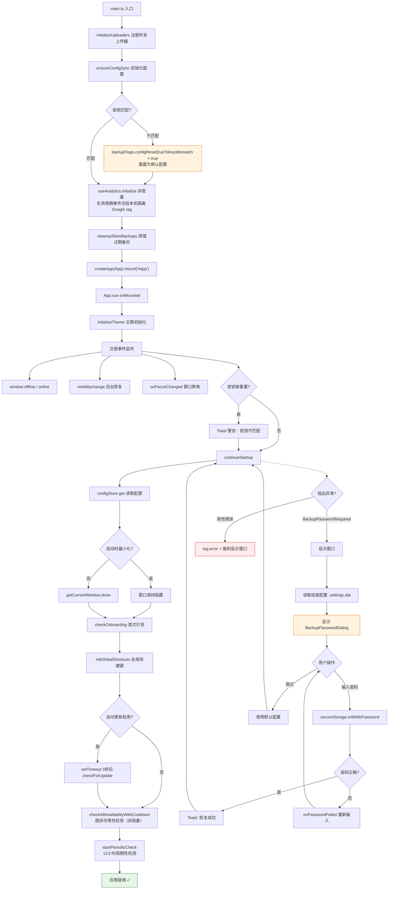
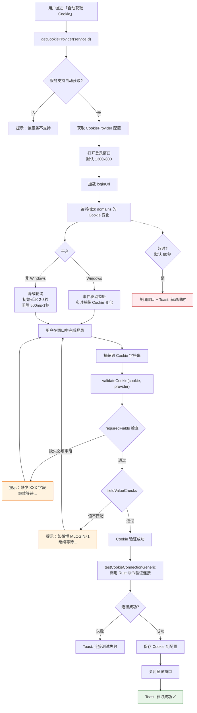

# 应用生命周期

> 应用启动流程和 Cookie 登录流程。排查启动异常、登录失败时查看此文档。

---

## 图 8：应用启动流程

展示从 `main.ts` 初始化到应用就绪的完整步骤。重点关注**密码恢复分支**和**非阻塞初始化**。

> **关键源文件**：`src/main.ts`、`src/App.vue`

---

## 图 9：Cookie 登录流程

展示自动获取 Cookie 的完整流程。排查**登录窗口无反应**或**Cookie 验证失败**时查看。

> **关键源文件**：`src/config/cookieProviders.ts`、`src/composables/useConfig.ts`

### 支持自动获取 Cookie 的服务

| 服务 | loginUrl | 必填 Cookie 字段 | 值检查 |
|------|----------|-----------------|--------|
| 微博 | m.weibo.cn | SUB, SUBP | MLOGIN=1 |
| 牛客 | nowcoder.com | — | — |
| 知乎 | zhihu.com | — | — |
| 纳米 | nami.cc | — | — |
| B站 | bilibili.com | — | — |
| 超星 | chaoxing.com | — | — |

---

## 排查指南

| 现象 | 可能原因 | 对照图表位置 |
|------|---------|-------------|
| 启动后白屏 | continueStartup 异常但窗口未显示 | 图8 ERR 分支 |
| 弹出密码输入框 | 更换设备或迁移，密钥不匹配 | 图8 PWD 分支 |
| 启动时 Toast 警告"密钥不匹配" | 之前密钥失效，已重置为默认 | 图8 节点 K → K1 |
| 主题未生效 | initializeTheme 在事件监听之前，检查 effectiveTheme | 图8 节点 I |
| 自动更新未触发 | config.autoUpdate.enabled = false | 图8 节点 O |
| GA4 日志显示发送失败 | 不影响应用挂载；仅 `first_run` 会在下次启动重试，`app_start` 不补发 | 图8 节点 E |
| 登录窗口打开但 Cookie 获取不到 | 域名不在 domains 列表 / 平台降级轮询延迟 | 图9 节点 G → H |
| Cookie 获取后提示失败 | requiredFields 缺失或 fieldValueChecks 不通过 | 图9 节点 N → O |
| 登录超时 | 用户未完成登录 / Cookie 事件未触发 | 图9 TIMEOUT 分支 |

---

## 相关文档

- [休眠白屏修复](../reference/troubleshooting/sleep-resume-white-screen.md) — SQLite 连接丢失 + WebView reload 失败
- [Tauri CSP nonce 问题](../reference/troubleshooting/tauri-csp-nonce-blocks-primevue-styles.md) — 启动后样式异常的排查
- [系统总览](./system-overview.md) — 宏观架构分层与模块关系
- [数据持久化](./data-persistence.md) — 启动时加载的配置/历史存储机制
