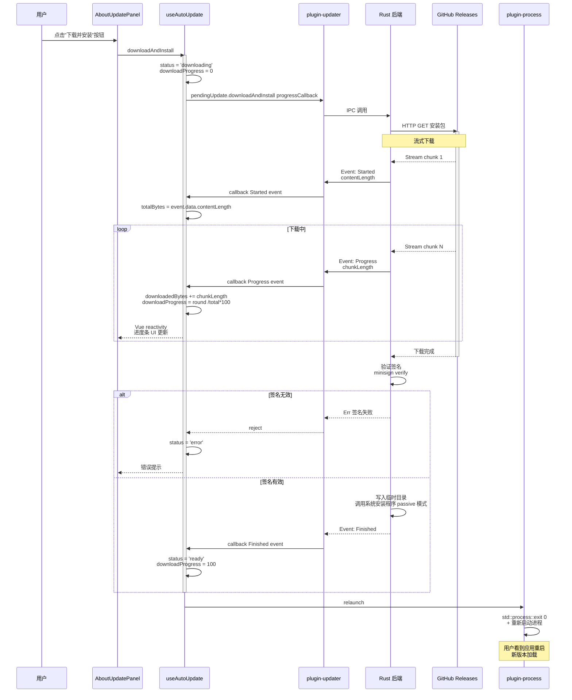
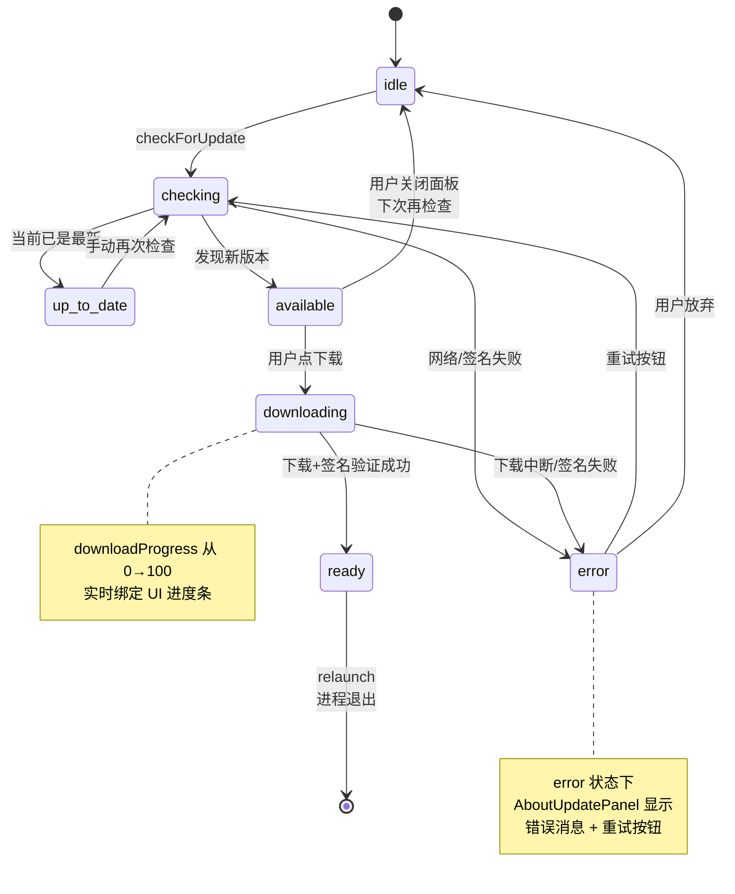

# 自动更新流程

> 从版本检查到签名验证、下载进度、安装重启的完整链路。**改更新源、调整签名机制、处理更新失败**时优先查看此文档。

## 概览

PicNexus 采用 **Tauri 官方 `tauri-plugin-updater` + GitHub Releases + minisign 签名** 的标准方案。核心特性:

- **更新源**:`https://github.com/joeyliu6/PicNexus/releases/latest/download/latest.json`
- **签名**:minisign 公钥内嵌在 `tauri.conf.json`,私钥由 CI 的 GitHub Secrets 管理
- **安装模式**:Windows 使用 `passive`(静默安装,用户可见进度但无需交互)
- **触发方式**:启动时自动检查(由 `autoUpdateEnabled` 配置开关控制) + 手动点击
- **状态机**:`idle → checking → (available | up-to-date | error) → downloading → ready → 重启`
- **发布流程**:`git tag v*` → GitHub Actions `release.yml` → `tauri-action` 自动签名 + 上传 `latest.json`

---

## 图 1:检查更新的启动流程

展示从 App 挂载到"有新版本可用"的完整路径,包含**自动检查开关**和**错误回退**两个关键分支。

> **关键源文件**:`src/composables/useAutoUpdate.ts`(L1~L118)、`src/App.vue`(L14、L32 onMounted)、`src-tauri/tauri.conf.json`(L56~L64 updater 配置)

```mermaid
flowchart TD
    A[App.vue mounted] --> B{config.autoUpdateEnabled?}
    B -- false --> B1[跳过自动检查<br/>用户可手动触发]
    B -- true --> C[useAutoUpdate.checkForUpdate]

    C --> C1[status = 'checking']
    C1 --> D[@tauri-apps/plugin-updater<br/>check]

    D --> E[IPC 调用 Rust updater 插件]
    E --> F[HTTP GET<br/>endpoints[0] latest.json]

    F --> G{响应成功?}
    G -- 否 网络失败 --> G1[status = 'error'<br/>log.warn 但不弹窗]
    G -- 是 --> H[解析 latest.json]

    H --> I[验证签名<br/>pubkey minisign]
    I --> J{签名有效?}
    J -- 否 --> J1[抛错<br/>status = 'error']
    J -- 是 --> K[对比版本号]

    K --> L{有新版本?}
    L -- 否 --> L1[status = 'up-to-date'<br/>lastCheckTime 更新]
    L -- 是 --> M[status = 'available'<br/>pendingUpdate 保存]

    M --> M1[updateInfo 赋值:<br/>version / date / body]
    M1 --> N[AboutUpdatePanel<br/>显示'有新版可用']
    N --> O{用户点击下载?}
    O -- 是 --> P[进入下载安装流程<br/>图 2]
    O -- 否 --> O1[保持 available 状态<br/>下次启动重检]

    style A fill:#e3f2fd,stroke:#1976d2
    style M fill:#e8f5e9,stroke:#2e7d32
    style G1 fill:#ffebee,stroke:#c62828
    style J1 fill:#ffebee,stroke:#c62828
    style B1 fill:#fff3e0,stroke:#ef6c00
```

---

## 图 2:下载、安装、重启时序

展示用户点击"下载并安装"后的完整时序,重点关注**进度事件**和**重启调用**。

> **关键源文件**:`src/composables/useAutoUpdate.ts`(L69~L106 downloadAndInstall)



---

## 图 3:状态机完整转换表

展示 `useAutoUpdate` 的状态机。排查"按钮卡在某个状态"时对照这张图。



---

## 图 4:发布侧的签名生成流程(CI)

展示 `git tag v*` 到 Releases 上架 `latest.json` 的 CI 流程。改签名密钥或发布源时对照这张图。

> **关键源文件**:`.github/workflows/release.yml`(L27~L38)、`src-tauri/tauri.conf.json` pubkey 字段

```mermaid
flowchart TD
    A[开发者本地<br/>git tag v1.0.3] --> B[git push --tags]
    B --> C[GitHub Actions 触发<br/>release.yml]

    C --> D[tauri-apps/tauri-action]
    D --> E[从 Secrets 取私钥]
    E --> E1[TAURI_SIGNING_PRIVATE_KEY]
    E --> E2[TAURI_SIGNING_PRIVATE_KEY_PASSWORD]

    E1 & E2 --> F[tauri build --ci]
    F --> G[生成安装包<br/>.exe / .dmg / .AppImage]
    G --> H[minisign 对产物签名]
    H --> I[生成 .sig 签名文件]

    I --> J{includeUpdaterJson?}
    J -- true --> K[自动生成 latest.json]
    K --> K1[包含:<br/>version / pub_date / notes<br/>platforms { signature, url }]

    K1 --> L[上传到 GitHub Release]
    L --> L1[安装包]
    L --> L2[.sig 签名文件]
    L --> L3[latest.json]

    %% 客户端验证
    L3 -.读取.-> CV[客户端 check]
    CV --> CV1[用 tauri.conf.json 的 pubkey<br/>验证 latest.json 中的 signature]

    style A fill:#e3f2fd,stroke:#1976d2
    style L fill:#e8f5e9,stroke:#2e7d32
    style CV1 fill:#f3e5f5,stroke:#7b1fa2
```

**关键要点**:

- **版本号同步**:`package.json` 和 `tauri.conf.json` 都有 `version` 字段,必须同步(Tauri CLI 会在构建时校验)
- **私钥管理**:`TAURI_SIGNING_PRIVATE_KEY` 存在 GitHub Secrets,**不能提交到仓库**
- **公钥嵌入**:`tauri.conf.json` 的 `pubkey` 是 base64 编码的 minisign 公钥,修改私钥后必须同步更新公钥,否则所有存量用户无法验证新版
- **密钥轮换的代价**:换私钥等于让所有旧版本用户"脱离"自动更新 → 必须手动下载新版

---

## 排查指南

| 现象 | 可能原因 | 对照图表位置 |
|------|---------|-------------|
| 启动时完全不检查更新 | `config.autoUpdateEnabled = false` | 图1 B |
| `checking` 卡住不动 | 网络无法访问 github.com / endpoints 失效 | 图1 F |
| "检查更新"返回 `error` 无详情 | 签名验证失败(公钥不匹配) | 图1 J1 |
| 下载进度条不动 | Rust 侧事件发送失败或前端 callback 丢失 | 图2 loop |
| 下载完成后无反应 | `relaunch` 调用失败,或 `process:allow-restart` 权限未配置 | 图2 PR |
| 用户反馈"签名无效" | CI 换了私钥但没同步更新 `pubkey` | 图4 CV1 |
| Windows 上安装需要手动确认 | `installMode` 配成 `basicUi` 而非 `passive` | `tauri.conf.json` |
| 老版本用户收不到更新 | `latest.json` 未正确上传或 Release 是 draft 状态 | 图4 L3 |
| 新版本号冲突 | `package.json` 和 `tauri.conf.json` 版本不一致 | 图4 F |

---

## 相关文档

- [系统总览](./system-overview.md) — 宏观架构分层
- [应用生命周期](./app-lifecycle.md) — 启动时自动检查的集成位置
- [IPC 命令层](./ipc-command-flow.md) — updater 插件作为 Plugin 的注册方式
- [设置 UI 架构](./settings-ui-architecture.md) — `autoUpdateEnabled` 开关如何绑定
