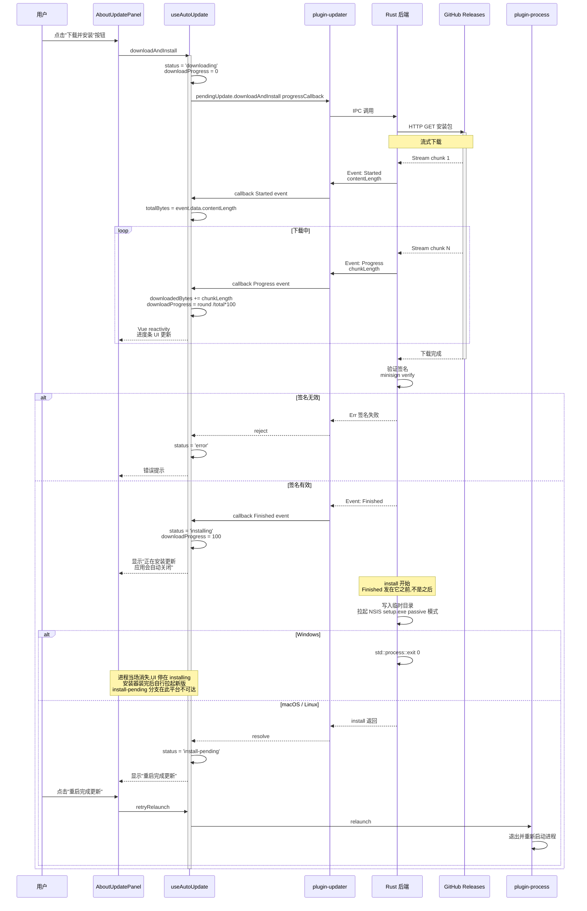
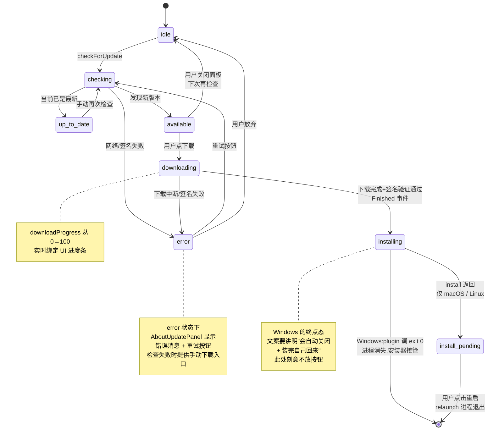

# 自动更新流程

> 从版本检查到签名验证、下载进度、安装重启的完整链路。**改更新源、调整签名机制、处理更新失败**时优先查看此文档。

## 概览

PicNexus 采用 **Tauri 官方 `tauri-plugin-updater` + GitHub Releases + minisign 签名** 的标准方案。核心特性:

- **更新源**:`https://github.com/joeyliu6/PicNexus/releases/latest/download/latest.json`
- **签名**:minisign 公钥内嵌在 `tauri.conf.json`,私钥由 CI 的 GitHub Secrets 管理
- **安装模式**:Windows 使用 `passive`(静默安装,用户可见进度但无需交互)
- **Windows 更新包**:走 NSIS `x64-setup.exe`,由 CI 改写 `latest.json` 保证(见图 4);MSI 仅作手动下载资产
- **触发方式**:启动时自动检查(由 `autoUpdateEnabled` 配置开关控制) + 手动点击
- **状态机**:`idle → checking → (available | up-to-date | error) → downloading → installing → install-pending(仅 macOS/Linux) → 用户点击重启`
- **发布流程**:`git tag v*` → GitHub Actions `release.yml` → 从 `CHANGELOG.md` 摘出本版本段落作 Release 正文(缺失即失败) → 桌面端签名产物 + Obsidian 插件产物 → 最终 `SHA256SUMS.txt`

---

## 图 1:检查更新的启动流程

展示从 App 挂载到"有新版本可用"的完整路径,包含**自动检查开关**和**错误回退**两个关键分支。

> **关键源文件**:`src/composables/useAutoUpdate.ts`(L1~L118)、`src/App.vue`(L14、L32 onMounted)、`src-tauri/tauri.conf.json`(L56~L64 updater 配置)

```mermaid
flowchart TD
    A[App.vue mounted] --> B{config.autoUpdateEnabled?}
    B -- false --> B1[跳过自动检查<br/>用户可手动触发]
    B -- true --> C[useAutoUpdate.checkForUpdate]

    C --> C1[status = 'checking']
    C1 --> D[@tauri-apps/plugin-updater<br/>check]

    D --> E[IPC 调用 Rust updater 插件]
    E --> F[HTTP GET<br/>endpoints[0] latest.json]

    F --> G{响应成功?}
    G -- 否 网络失败 --> G1[status = 'error'<br/>log.warn 但不弹窗]
    G -- 是 --> H[解析 latest.json]

    H --> I[验证签名<br/>pubkey minisign]
    I --> J{签名有效?}
    J -- 否 --> J1[抛错<br/>status = 'error']
    J -- 是 --> K[对比版本号]

    K --> L{有新版本?}
    L -- 否 --> L1[status = 'up-to-date'<br/>lastCheckTime 更新]
    L -- 是 --> M[status = 'available'<br/>pendingUpdate 保存]

    M --> M1[updateInfo 赋值:<br/>version / date / body]
    M1 --> N[AboutUpdatePanel<br/>显示'有新版可用']
    N --> O{用户点击下载?}
    O -- 是 --> P[进入下载安装流程<br/>图 2]
    O -- 否 --> O1[保持 available 状态<br/>下次启动重检]

    style A fill:#e3f2fd,stroke:#1976d2
    style M fill:#e8f5e9,stroke:#2e7d32
    style G1 fill:#ffebee,stroke:#c62828
    style J1 fill:#ffebee,stroke:#c62828
    style B1 fill:#fff3e0,stroke:#ef6c00
```

---

## 图 2:下载、安装、重启时序

展示用户点击"下载并安装"后的完整时序,重点关注**进度事件**和**重启调用**。

> **关键源文件**:`src/composables/useAutoUpdate.ts`(L69~L106 downloadAndInstall)

```mermaid
sequenceDiagram
    participant U as 用户
    participant V as AboutUpdatePanel
    participant H as useAutoUpdate
    participant P as plugin-updater
    participant R as Rust 后端
    participant GH as GitHub Releases
    participant PR as plugin-process

    U->>V: 点击"下载并安装"按钮
    V->>H: downloadAndInstall
    activate H

    H->>H: status = 'downloading'<br/>downloadProgress = 0

    H->>P: pendingUpdate.downloadAndInstall progressCallback
    P->>R: IPC 调用
    R->>GH: HTTP GET 安装包
    activate GH

    Note over R,GH: 流式下载

    GH-->>R: Stream chunk 1
    R->>P: Event: Started<br/>contentLength
    P->>H: callback Started event
    H->>H: totalBytes = event.data.contentLength

    loop 下载中
        GH-->>R: Stream chunk N
        R->>P: Event: Progress<br/>chunkLength
        P->>H: callback Progress event
        H->>H: downloadedBytes += chunkLength<br/>downloadProgress = round /total*100
        H-->>V: Vue reactivity<br/>进度条 UI 更新
    end

    GH-->>R: 下载完成
    deactivate GH
    R->>R: 验证签名<br/>minisign verify

    alt 签名无效
        R-->>P: Err 签名失败
        P-->>H: reject
        H->>H: status = 'error'
        H-->>V: 错误提示
    else 签名有效
        R-->>P: Event: Finished
        P->>H: callback Finished event
        H->>H: status = 'installing'<br/>downloadProgress = 100
        H-->>V: 显示"正在安装更新<br/>应用会自动关闭"

        Note over R: install 开始<br/>Finished 发在它之前,不是之后
        R->>R: 写入临时目录<br/>拉起 NSIS setup.exe passive 模式

        alt Windows
            R->>R: std::process::exit 0
            Note over H,V: 进程当场消失,UI 停在 installing<br/>安装器装完后自行拉起新版<br/>install-pending 分支在此平台不可达
        else macOS / Linux
            R-->>P: install 返回
            P-->>H: resolve
            H->>H: status = 'install-pending'
            H-->>V: 显示"重启完成更新"
            U->>V: 点击"重启完成更新"
            V->>H: retryRelaunch
            H->>PR: relaunch
            PR->>PR: 退出并重新启动进程
        end
    end

    deactivate H
```

> ⚠️ **Windows 上"重启完成更新"按钮永远不会出现**:`tauri-plugin-updater` 的 `install_inner`
> 在 `ShellExecuteW` 拉起安装器之后紧跟着 `std::process::exit(0)`,`downloadAndInstall()` 的
> `await` 永不返回。[useAutoUpdate.ts](../../src/composables/useAutoUpdate.ts) 里 `install-pending`
> 的赋值、`retryRelaunch()`、UpdateCard 的 `install-pending` 分支都只服务 macOS / Linux。
> `installing` 态就是为了填补 Windows 这段"应用消失、安装器在跑"的空窗期(实测 NSIS 之前的
> MSI 方案要 79 秒)。

---

## 图 3:状态机完整转换表

展示 `useAutoUpdate` 的状态机。排查"按钮卡在某个状态"时对照这张图。

```mermaid
stateDiagram-v2
    [*] --> idle

    idle --> checking: checkForUpdate
    checking --> up_to_date: 当前已是最新
    checking --> available: 发现新版本
    checking --> error: 网络/签名失败

    available --> downloading: 用户点下载
    available --> idle: 用户关闭面板<br/>下次再检查

    downloading --> installing: 下载完成+签名验证通过<br/>Finished 事件
    downloading --> error: 下载中断/签名失败

    installing --> [*]: Windows:plugin 调 exit 0<br/>进程消失,安装器接管
    installing --> install_pending: install 返回<br/>仅 macOS / Linux

    install_pending --> [*]: 用户点击重启<br/>relaunch 进程退出

    up_to_date --> checking: 手动再次检查
    error --> checking: 重试按钮
    error --> idle: 用户放弃

    note right of error
      error 状态下
      AboutUpdatePanel 显示
      错误消息 + 重试按钮
      检查失败时提供手动下载入口
    end note

    note right of downloading
      downloadProgress 从 0→100
      实时绑定 UI 进度条
    end note

    note right of installing
      Windows 的终点态
      文案要讲明"会自动关闭
      + 装完自己回来"
      此处刻意不放按钮
    end note
```

---

## 图 4:发布侧的签名生成流程(CI)

展示 `git tag v*` 到 Releases 上架 `latest.json` 的 CI 流程。改签名密钥或发布源时对照这张图。

> **关键源文件**:`.github/workflows/release.yml`、`scripts/extract-changelog-section.mjs`、`.github/workflows/release-obsidian-plugin.yml`、`src-tauri/tauri.conf.json` pubkey 字段

```mermaid
flowchart TD
    A[开发者本地<br/>git tag v1.0.3] --> B[git push --tags]
    B --> C[GitHub Actions 触发<br/>release.yml]

    C --> CL[changelog job<br/>tag 版本 == tauri.conf.json?<br/>从 CHANGELOG.md 摘 ## x.y.z 段落]
    CL -- 段落缺失 --> CLX[整个 workflow 失败<br/>补写段落后重打 tag]
    CL -- 正文 --> D[tauri-apps/tauri-action<br/>releaseBody = 该段落]
    D --> E[从 Secrets 取私钥]
    E --> E1[TAURI_SIGNING_PRIVATE_KEY]
    E --> E2[TAURI_SIGNING_PRIVATE_KEY_PASSWORD]

    E1 & E2 --> F[tauri build --ci]
    F --> G[生成安装包<br/>.exe / .dmg / .AppImage]
    G --> H[minisign 对产物签名]
    H --> I[生成 .sig 签名文件]

    I --> J{includeUpdaterJson?}
    J -- true --> K[自动生成 latest.json]
    K --> K1[包含:<br/>version / pub_date / notes<br/>platforms { signature, url }]

    K1 --> L[上传到 GitHub Release]
    L --> L1[安装包]
    L --> L2[.sig 签名文件]
    L --> L3[latest.json]

    L --> OP[构建并校验 Obsidian 插件]
    OP --> OP1[同步 plugins/obsidian 快照]
    OP1 --> OP2[独立仓库 Release<br/>标签不带 v]
    OP2 --> OP3[桌面端 Release<br/>picnexus-obsidian-*.zip]
    L1 & L2 & L3 & OP3 --> FIX[改写 latest.json<br/>windows-x86_64 指向 NSIS<br/>删除 windows-x86_64-msi]
    FIX --> SUM[生成最终 SHA256SUMS.txt]

    %% 客户端验证
    FIX -.读取.-> CV[客户端 check]
    CV --> CV1[用 tauri.conf.json 的 pubkey<br/>验证 latest.json 中的 signature]

    style A fill:#e3f2fd,stroke:#1976d2
    style CLX fill:#ffebee,stroke:#c62828
    style L fill:#e8f5e9,stroke:#2e7d32
    style CV1 fill:#f3e5f5,stroke:#7b1fa2
```

**关键要点**:

- **版本号同步**:`package.json` 和 `tauri.conf.json` 都有 `version` 字段,必须同步(Tauri CLI 会在构建时校验);tag 还必须与 `tauri.conf.json` 一致,`changelog` job 会先拦
- **Release 正文来自 CHANGELOG.md**:`changelog` job 用 `scripts/extract-changelog-section.mjs` 摘出 `## [x.y.z]` 段落(去掉标题行和段末 `---`)喂给 `releaseBody`,同时写进 run summary。
  段落格式就是 Release 说明本身:一行一条、面向用户、按感知度排序,由做 bump 提交的人(通常是 AI 会话)在发版时写好。
  以前用 git-cliff 拼 commit 首行当"初稿"、靠发版清单提醒人工重写成中文,v1.1.2 就是漏了重写把英文初稿发了出去。
  现在没有初稿这一环:CHANGELOG 段落缺失就在任何构建开始前失败,补写并提交后 `git tag -f vX.Y.Z && git push -f origin vX.Y.Z` 重跑(job 读的是 tag 指向那个提交里的文件)
- **私钥管理**:`TAURI_SIGNING_PRIVATE_KEY` 存在 GitHub Secrets,**不能提交到仓库**
- **公钥嵌入**:`tauri.conf.json` 的 `pubkey` 是 base64 编码的 minisign 公钥,修改私钥后必须同步更新公钥,否则所有存量用户无法验证新版
- **密钥轮换的代价**:换私钥等于让所有旧版本用户"脱离"自动更新 → 必须手动下载新版
- **插件版本独立**:`plugins/obsidian/manifest.json` 决定插件标签；代码未变化时可以复用已有插件 Release
- **跨仓库凭证**:`OBSIDIAN_PLUGIN_RELEASE_TOKEN` 只授予独立插件仓库 Contents 读写权限；目标仓库可由 `OBSIDIAN_PLUGIN_REPOSITORY` Repository Variable 覆盖
- **发布顺序**:`release-checklist` 等待 Obsidian 插件 ZIP 上传完成后再生成 `SHA256SUMS.txt`
- **Windows 更新包必须是 NSIS**:tauri-action 生成的 `latest.json` 会把通用键 `windows-x86_64`
  填成 MSI(65.7MB,走 Windows Installer 事务,实测安装 79 秒),而 NSIS `x64-setup.exe` 只有
  42.7MB 且是自解压。客户端本该先查 `windows-x86_64-{installer}`,但那依赖二进制里的
  `__TAURI_BUNDLE_TYPE` 打包戳——实测产物里它仍是未替换的 `__TAURI_BUNDLE_TYPE_VAR_UNK`,
  `bundle_type()` 返回 `None`,于是**所有** Windows 用户都落到通用键上拿 MSI。
  CI 的改写步骤同时删掉 `windows-x86_64-msi`:将来打包戳修好后,MSI 安装的用户会优先查那个键,
  留着它等于埋一颗"又跌回 MSI"的雷。
- **改写必须早于校验和**:`Point Windows updater at the NSIS installer` 跑在
  `Generate SHA256SUMS for draft release` 之前,否则 `SHA256SUMS.txt` 对不上改写后的 `latest.json`

---

## 失败文案对照表

`plugin-updater` 抛的是英文技术原文（如 `error sending request for url (https://...)`），**界面不直接渲染它**。
`src/utils/updateFailureMessage.ts` 的 `formatUpdateFailure(phase, raw)` 把它翻成中文标题 + 可执行建议，
英文原文移进副行的 tooltip（悬停可见），日志侧由 `log.error` 原样保留。

> 规则来自 `tauri-plugin-updater-2.10.0/src/error.rs` 的 `#[error(...)]` 清单；
> 透传变体（`Reqwest` / `Minisign` / `Io`）按底层库 Display 匹配。**改规则前先对一遍源码，别凭印象加正则。**

用户报障时用这张表反查原始错误：

| 用户看到的标题 | 对应的原始错误 | 真实含义 |
|---------------|---------------|---------|
| 连不上更新服务器 | `error sending request`（reqwest 透传）/ 超时 | DNS、TCP、TLS 层没通，国内访问 github.com 最常见 |
| 更新包下载中断 | 同上，但发生在下载阶段 | 已找到新版本，下载中途断了 |
| 暂时读不到更新信息 | `Could not fetch a valid release JSON from the remote`、JSON 解析失败 | **latest.json 返回 404 也走这里**——插件不把非 2xx 当错误，只 log 后落到 `ReleaseNotFound` |
| 更新包校验未通过 | `The signature verification failed` 等 minisign 错误 | 签名不匹配，通常是 CI 换了私钥没同步 `pubkey`。**文案刻意不劝重试** |
| 当前系统暂无更新包 | `the platform ... was not found in the response platforms object` | latest.json 里没有当前平台的条目 |
| 更新包下载失败 | `Download request failed with status: {code}` | 服务器答了但不是文件，状态码会拼进提示 |
| 没有权限完成更新安装 | `os error 5` / `拒绝访问` / `Authentication failed or was cancelled` | Windows 权限不足或用户取消提权 |
| 更新安装失败 | `Failed to install package`、解压/临时目录类错误 | 包下来了装不进去 |
| 更新功能未正确配置 | `Updater does not have any endpoints set.` 等 | 应用自身配置问题，**提示明说重试无效** |
| 检查更新失败 / 下载更新失败 | 未命中任何规则 | 兜底文案 |

**两个容易踩的坑**：

- 规则**按声明顺序匹配，顺序即优先级**。权限必须排在安装前（`os error 5` 本身是 Io 错误），
  HTTP 状态码必须排在网络前（`Error::Network` 是插件自己拼的串，不是连接失败）。
- 签名规则**刻意不匹配裸 `signature`**：latest.json 少字段时 serde 报 `missing field \`signature\``，
  那是发布配置漏了，不是包被篡改，必须落到"读不到更新信息"。

错误卡片**不弹 toast**：卡片自己已渲染原因和「重试 / 手动下载」按钮，再弹同文案 toast 属于双重反馈，
见 [notification-patterns.md](../design/notification-patterns.md) 通用原则 1 与 3。

---

## 排查指南

| 现象 | 可能原因 | 对照图表位置 |
|------|---------|-------------|
| 启动时完全不检查更新 | `config.autoUpdateEnabled = false` | 图1 B |
| `checking` 卡住不动 | 网络无法访问 github.com / endpoints 失效 | 图1 F |
| 用户报"更新包校验未通过" | 签名验证失败(公钥不匹配) | 图1 J1、失败文案对照表 |
| 用户报"暂时读不到更新信息" | latest.json 404 / 未上传 / Release 仍是 draft | 图4 L3、失败文案对照表 |
| 想看错误的英文原文 | 界面只显示中文，原文在副行 tooltip 里；日志中由 `log.error` 保留 | `updateFailureMessage.ts` |
| 下载进度条不动 | Rust 侧事件发送失败或前端 callback 丢失 | 图2 loop |
| 下载完成后无反应 | `install-pending` 状态未渲染,或 `process:allow-restart` 权限未配置导致点击重启失败 | 图2 PR |
| Windows 更新后没出现"重启完成更新"按钮 | **平台预期行为**,不是 bug:plugin 在拉起安装器后 `exit(0)`,UI 停在 `installing` | 图2 Windows 分支 |
| Windows 更新下载量异常大 / 安装慢回一分多钟 | `latest.json` 的 `windows-x86_64` 又指回了 MSI——CI 改写步骤失败或被移除 | 图4 FIX |
| Windows 安装期出现长时间空白无提示 | `installing` 分支未渲染,或 `Finished` 事件没设置该状态 | 图3 installing |
| 用户反馈"签名无效" | CI 换了私钥但没同步更新 `pubkey` | 图4 CV1 |
| Windows 上安装需要手动确认 | `installMode` 配成 `basicUi` 而非 `passive` | `tauri.conf.json` |
| 老版本用户收不到更新 | `latest.json` 未正确上传或 Release 是 draft 状态 | 图4 L3 |
| 新版本号冲突 | `package.json` 和 `tauri.conf.json` 版本不一致 | 图4 F |
| Release 正文是英文 commit 清单 / 为空 | 正文来自 `CHANGELOG.md`,不再有 git-cliff 初稿;检查 `changelog` job 的 summary 与 `## [x.y.z]` 段落 | 图4 CL |
| 推了 tag 但 workflow 秒失败,一个包都没构建 | `changelog` job 拦下:CHANGELOG 缺该版本段落,或 tag 与 `tauri.conf.json` 版本不一致 | 图4 CLX |
| 插件发布提示版本冲突 | 同一插件版本的运行文件发生变化 | 提升 `plugins/obsidian/manifest.json` 及关联版本文件 |
| 插件仓库同步失败 | Token 无写权限或目标仓库存在人工分叉 | 检查细粒度 Token；按主仓库源码人工协调分叉 |
| 桌面端 Draft 缺少最终校验和 | Obsidian 插件任务失败，最终任务被阻断 | 修复插件任务并重新运行工作流 |

---

## 相关文档

- [系统总览](./system-overview.md) — 宏观架构分层
- [应用生命周期](./app-lifecycle.md) — 启动时自动检查的集成位置
- [IPC 命令层](./ipc-command-flow.md) — updater 插件作为 Plugin 的注册方式
- [设置 UI 架构](./settings-ui-architecture.md) — `autoUpdateEnabled` 开关如何绑定
- [Obsidian 插件发布](../reference/guides/obsidian-plugin-release.md) — 独立仓库、BRAT 与官方提交
