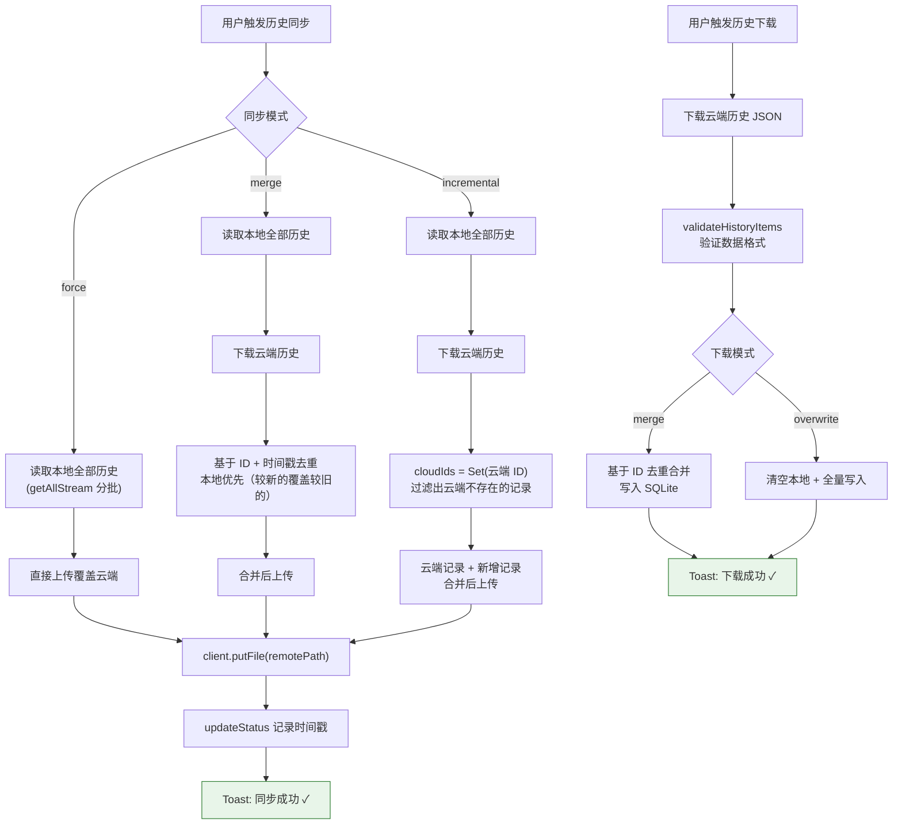
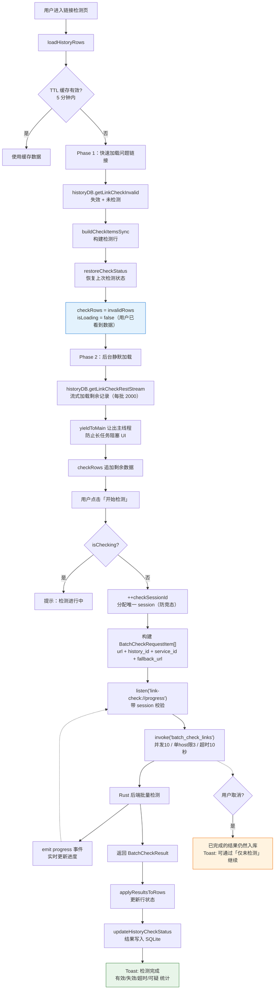
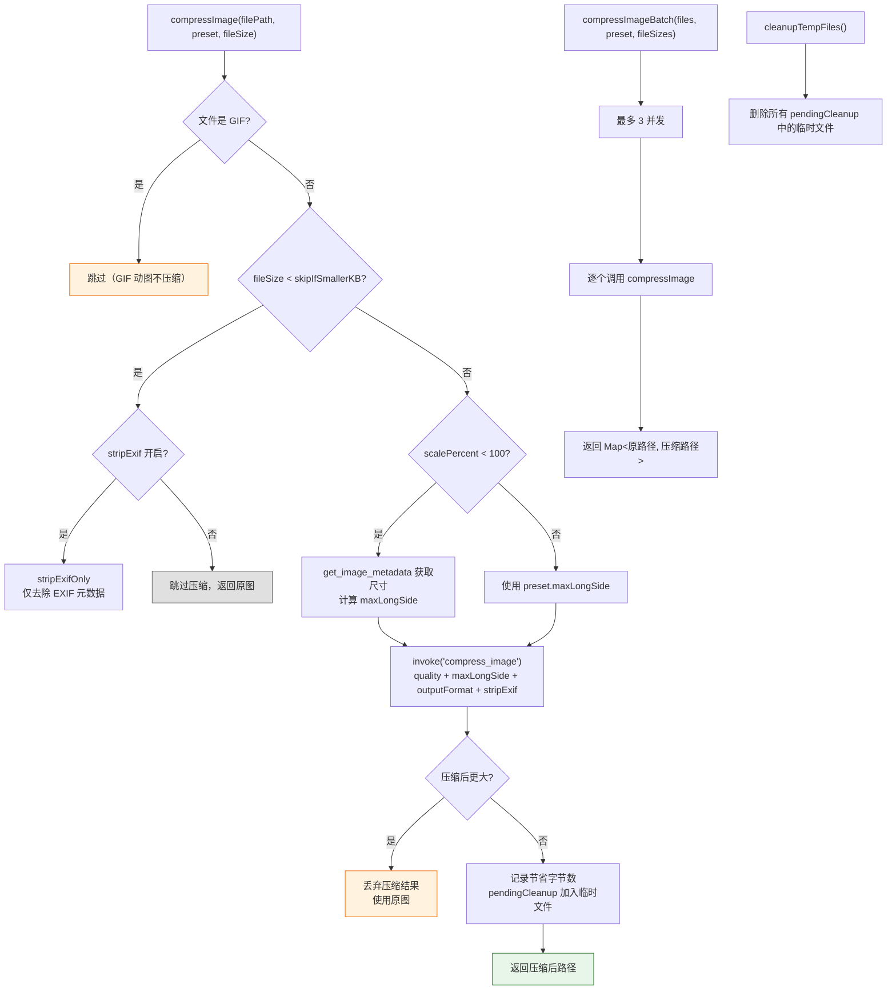

# 辅助功能流程

> WebDAV 同步、链接检测、图片压缩、备份恢复的数据流图解。

---

## 图 10：WebDAV 同步流程

展示配置同步和历史记录同步的完整路径，重点关注**三种同步模式**和**冲突处理**。

> **关键源文件**：`src/composables/useWebDAVSync.ts`

### 配置同步

```mermaid
flowchart TD
    subgraph 上传配置
        U1[用户触发上传] --> U2{isSyncing?}
        U2 -- 是 --> U2X[提示：同步中]
        U2 -- 否 --> U3["getClient(profile)<br/>连接 WebDAV"]
        U3 --> U4["configStore.get('config')<br/>读取本地配置"]
        U4 --> U5["client.putFile(remotePath, JSON)<br/>上传到云端"]
        U5 --> U6[updateStatus 记录时间戳]
        U6 --> U7["Toast: 上传成功 ✓"]
    end

    subgraph 下载配置
        D1[用户触发下载] --> D2{isSyncing?}
        D2 -- 是 --> D2X[提示：同步中]
        D2 -- 否 --> D3["getClient(profile)<br/>连接 WebDAV"]
        D3 --> D4["client.getFile(remotePath)<br/>下载远程配置"]
        D4 --> D5{内容存在?}
        D5 -- 否 --> D5X[错误：云端不存在]
        D5 -- 是 --> D6["JSON.parse + isValidUserConfig<br/>验证格式"]
        D6 --> D7{同步模式}
        D7 -- merge --> D8["合并：保留本地 WebDAV 配置<br/>其余用远程覆盖"]
        D7 -- overwrite --> D9[直接覆盖本地]
        D8 & D9 --> D10["configStore.set + save"]
        D10 --> D11["Toast: 下载成功 ✓"]
    end

    style U7 fill:#e8f5e9,stroke:#2e7d32
    style D11 fill:#e8f5e9,stroke:#2e7d32
    style D5X fill:#ffebee,stroke:#c62828
```

### 历史记录同步

---

## 图 11：链接检测流程

展示两阶段加载和批量检测的完整路径。排查**检测卡住**或**结果不准**时查看。
> 深度展开（服务感知请求、并发控制、动画状态机、智能策略）见 [链接检测流程](./link-check-flow.md)。

> **关键源文件**：`src/composables/link-check/useLinkCheck.ts`、`src/composables/link-check/linkCheckDataBuilder.ts`

---

## 图 12：图片压缩预处理流程

展示上传前的图片压缩决策逻辑。排查**压缩不生效**或**输出文件异常**时查看。

> **关键源文件**：`src/composables/useImageCompress.ts`

### 压缩预设参数说明

| 参数 | 说明 | 默认值 |
|------|------|--------|
| quality | 压缩质量（1-100） | 80 |
| maxLongSide | 最长边像素上限 | 0（不限） |
| scalePercent | 缩放百分比 | 100（不缩放） |
| outputFormat | 输出格式 | 保持原格式 |
| stripExif | 去除 EXIF 元数据 | false |
| skipIfSmallerKB | 小于此值跳过压缩 | 0（不跳过） |

---

## 图 13：备份与恢复流程

展示本地备份和云端备份的导入导出路径。

> **关键源文件**：`src/composables/backup-sync/useBackupSync.ts`

```mermaid
flowchart TD
    subgraph 本地导出
        LE1[用户点击导出] --> LE2[读取当前配置 / 历史]
        LE2 --> LE3[序列化为 JSON]
        LE3 --> LE4["saveDialog 选择保存路径"]
        LE4 --> LE5[writeTextFile 写入文件]
        LE5 --> LE6["Toast: 导出成功 ✓"]
    end

    subgraph 本地导入
        LI1[用户点击导入] --> LI2["openDialog 选择文件"]
        LI2 --> LI3["JSON.parse 解析"]
        LI3 --> LI4{文件加密?}
        LI4 -- 是 --> LI5["tryDecryptContent<br/>要求输入密码"]
        LI5 --> LI6{密码正确?}
        LI6 -- 否 --> LI7[提示密码错误，重试]
        LI7 --> LI5
        LI6 -- 是 --> LI8[解密成功]
        LI4 -- 否 --> LI8[明文数据]
        LI8 --> LI9{导入策略}
        LI9 -- 合并 --> LI10["保留本地 + 追加导入数据"]
        LI9 -- 覆盖 --> LI11[清空本地 + 写入导入数据]
        LI10 & LI11 --> LI12["Toast: 导入成功 ✓"]
    end

    subgraph 云端备份
        CB1[用户触发云端备份] --> CB2[WebDAV 上传配置 / 历史]
        CB2 --> CB3["详见图 10 WebDAV 同步流程"]
    end

    style LE6 fill:#e8f5e9,stroke:#2e7d32
    style LI12 fill:#e8f5e9,stroke:#2e7d32
```

---

## 排查指南

| 现象 | 可能原因 | 对照图表位置 |
|------|---------|-------------|
| WebDAV 上传失败 | 连接信息错误 / 远程路径不存在 | 图10 上传配置 U3 |
| 下载后 WebDAV 配置丢失 | merge 模式未保留本地 WebDAV 字段 | 图10 下载配置 D8 |
| 历史同步后数据重复 | 同步模式选错（应选 merge 而非 force） | 图10 历史同步 B |
| 链接检测进度不更新 | Rust 后端未 emit progress 事件 / session 不匹配 | 图11 节点 Q → T |
| 检测取消后数据丢失 | 正常现象：已完成的结果会入库 | 图11 CANCEL 分支 |
| 压缩后文件反而更大 | 原图已高度压缩，回退使用原图 | 图12 节点 I → I1 |
| 小图片未被压缩 | skipIfSmallerKB 阈值跳过了小文件 | 图12 节点 C |
| GIF 上传后不动了 | 压缩跳过 GIF，但图床可能不支持 | 图12 节点 B → B1 |
| 导入备份提示密码 | 备份文件已加密（来自其他设备） | 图13 本地导入 LI4 → LI5 |

---

## 相关文档

- [Composables API](../reference/api/composables.md) — useWebDAVSync / useAutoSync 接口索引
- [链接检测性能优化](../reference/patterns/link-check-large-dataset.md) — 5 万条记录场景的优化方案
- [同步流程](./sync-flow.md) — WebDAV 配置/历史同步的完整流程
- [链接检测流程（深度展开）](./link-check-flow.md) — 服务感知请求、并发控制、动画状态机
- [文档修复流程](./md-rescue-flow.md) — MD 文件失效图片链接的自动检测与修复
- [批量迁移流程](./batch-migrate-flow.md) — 跨图床批量迁移图片
