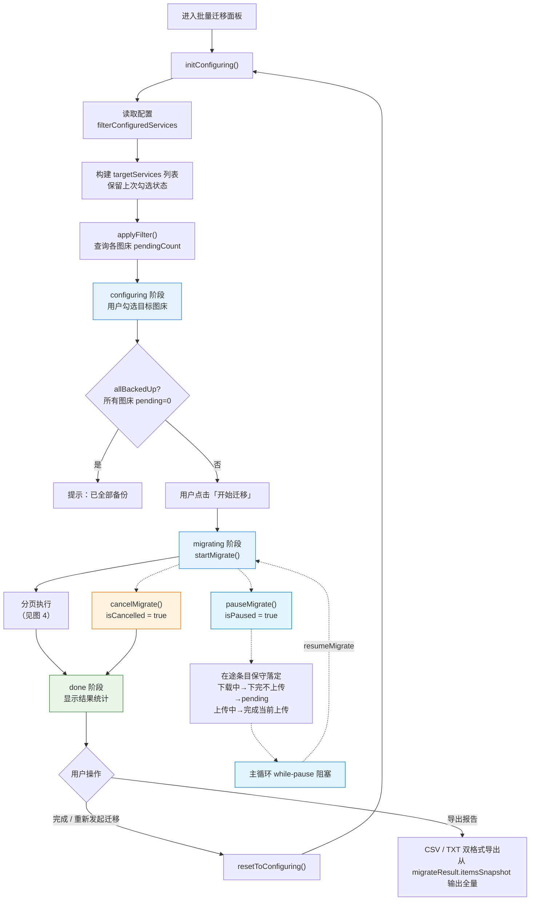
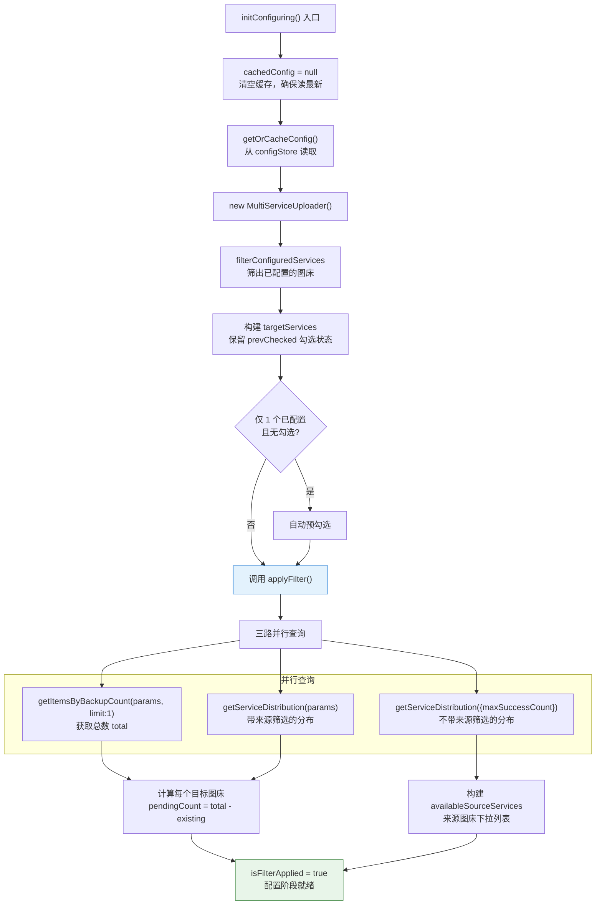
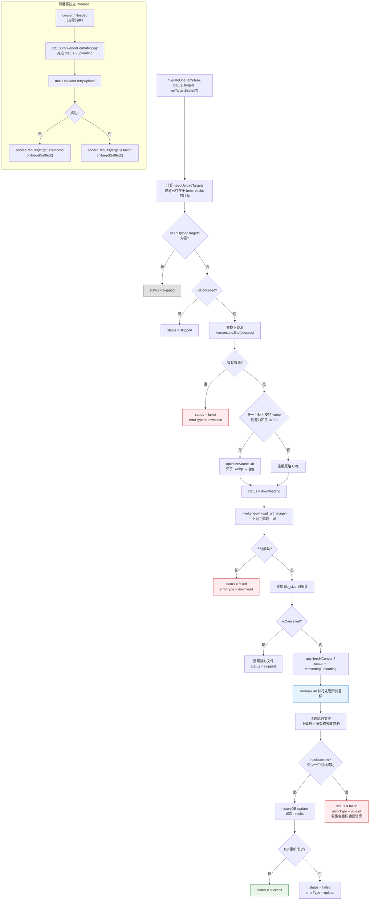
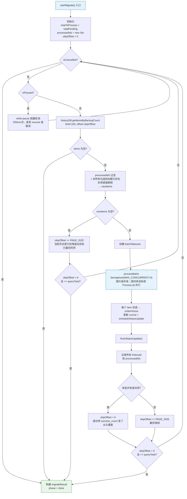
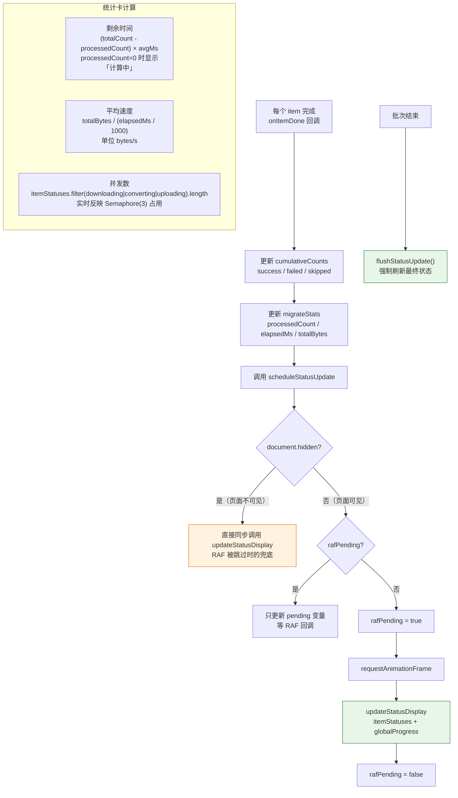

# 批量迁移流程

> 将图片从一个图床批量迁移到另一个图床。选择目标 → 筛选范围 → 下载 + 上传 → 更新历史记录。
> 排查「迁移速度慢」「格式转换失败」「重复迁移」时查看此文档。

---

## 图 1：四阶段总览

展示从 configuring 到 done 的整体流程，以及各阶段间的状态转移。

> **关键源文件**：`src/types/batchMigrate.ts`（`MigratePhase`）、`src/composables/useBatchMigrate.ts`（`useBatchMigrateManager`）
>
> **UI 组装**：`migrating` 与 `done` 阶段**共用同一个 `MigrateProgressPhase.vue` 面板**，结构统一为「状态 chip 过滤条（`MigrateStatusFilterChips`）+ 可滚动列表 + 底栏」。两态列表都用统一的 `MigrateItemRow`：
> - **首行**：文件名（mono）+ 状态 chip（失败 chip 的 `v-tooltip` 悬停显示 `errorTooltipText`）
> - **次行**：`存在于 [existing chips] → [target chips]` + 右侧上下文操作按钮；其中：
>   - `existing` chips 读 `MigrateItemStatus.existingServiceIds`（迁移前已成功的图床快照）
>   - `target` chips **始终按 `targetServiceIds` 渲染**（选了几个目标就显几个），`serviceResults[sid]` 只决定着色：`success → 'new'`（绿环）/ `failed → 'failed'`（红环）/ 未写入或 `pending → 'pending'`（蓝环）；未写入代表"取消前没轮到尝试"
>   - 右侧按钮随状态切换：成功态显示「复制新 URL」（调 `historyDB` 查新增 target 的 URL）；done + failed 态显示「重试」
>
> 底栏 `MigrateBottomBar` 左侧从左到右：**分页条**（`MigratePagination`，仅 `displayList.length > PAGE_SIZE` 时挂载） + **运行状态 pill**（运行中/正在暂停/已暂停）+ `MigrateStatsSummary`；右侧是操作按钮组（done 态：导出报告 | 完成 | 【全部重试：有失败项才挂】| 重新发起迁移）。进入 done 态时若有失败自动选中「失败」chip 并重置滚动。
>
> **统计信息位置**：已完成数/速率/剩余时间/目标图床整合到 `MigrateStatsSummary`；运行态 pill 独立于统计条，收进底栏。

---

## 图 2：配置与筛选阶段

展示 `initConfiguring` 和 `applyFilter` 中双重分布查询的逻辑。解答「pendingCount 怎么算」。

> **关键源文件**：`src/composables/useBatchMigrate.ts`（`initConfiguring`、`applyFilter`）

### 双重分布查询说明

| 查询 | 参数 | 用途 |
|------|------|------|
| 带来源筛选 | `maxSuccessCount` + `hasServiceId` + `timestampAfter` | 计算满足筛选条件的图片中，各目标图床的已有数量（total - existing = pending） |
| 不带来源筛选 | `maxSuccessCount` + `timestampAfter` | 列出所有有记录的来源图床及其数量（构建筛选下拉列表） |

### UI 筛选维度（MigrateFilterPopover）

配置阶段的「从这里」栏目标签右侧有一个 `pi-sliders-h` 图标，点击打开 Popover 面板，聚合以下精细化筛选：

| 维度 | Composable 状态 | 作用面 | 默认值 |
|------|----------------|--------|--------|
| 备份数阈值 | `maxSuccessCount` | 数据库 `success_count <= X` | 999（全部） |
| 上传时间范围 | `timestampAfterMs` | 数据库 `timestamp >= X`（经 `timestampRangePresets` 转绝对时间戳） | null（全部时间） |

任一维度非默认时，触发按钮会挂徽章显示简短描述（如 `<2 · 最近 30 天`）。`resetToConfiguring()` 会把两者一并复位。

---

## 图 3：单图迁移管线（并行上传版）

展示 `migrateOneItem` 中单张图片从下载到**多目标并行上传**的完整管线，包含格式转换逻辑。

> **关键源文件**：`src/composables/batchMigrate/migrateCore.ts`（`migrateOneItem`、`optimizeSourceUrl`、`convertIfNeeded`）
>
> **status 取值**：`pending | downloading | converting | uploading | success | failed | skipped`。并行上传后，`status` 在"当前阶段聚合值"语义下工作：
> - 有任一目标还在转换 → `converting`
> - 任一目标已进入上传（或无需转换） → `uploading`
> - 所有目标落定 → 终态（hasSuccess ? success : failed）
>
> `convertedFormat` 字段：只要任一目标真触发了 `compress_image`，就写入 `'jpeg'`，UI 用它区分「已转 JPEG」与「格式兼容」。`sourceUrl` 在下载入口处填充。
>
> **并行上传关键点**：
> - 所有目标通过 `Promise.all` 同时发起（内部 try/catch，Promise.all 不会因单目标失败而 reject）
> - 每个目标完成后**立即写 `status.serviceResults[targetId]`**，然后调用 `onTargetSettled` 回调——外层用它触发 RAF 节流的 `scheduleStatusUpdate`，让 UI chip 一个个变色（不是等整条落定一起跳）
> - 取消（`isCancelled=true`）不会打断已发起的并行上传；只影响主循环下一张图不被取出
> - 信号量 `MAX_CONCURRENT=3` 控制图片级并发。由于每张图只向每个图床发 1 次上传，**每图床的峰值并发数 = MAX_CONCURRENT（= 3），与目标数无关**

### 格式兼容性表

| 场景 | 检测方法 | 处理 | 状态 chip 文案（终态） |
|------|---------|------|--------------|
| 知乎 webp → 不支持 webp 的目标 | `needsFormatConversion(targetId, 'webp')` | URL 改后缀 `.webp` → `.jpg`（知乎原生支持），下载后 ext='jpg' | **已完成**（URL 优化已生效，未调 `compress_image`，`convertedFormat` 未写入） |
| 下载文件格式不被目标支持 | `needsFormatConversion(targetId, ext)` 在循环内按 target 探测 | `status='converting'` → `compress_image` 转 jpeg（quality=92）→ `convertedFormat='jpeg'` → `status='uploading'` | **已转 JPEG**（由 `convertedFormat` 字段驱动） |
| 目标图床无格式白名单（对象存储类） | `needsFormatConversion` 返回 false | 直接上传原文件 | **已完成** |

> 状态 chip 映射集中在 `src/components/views/linkcheck/migrate/composables/useStatusChip.ts` 的 `getStatusChipMeta()`。原"三段管道（下载 → 适配 → 上传）"已由单个状态 chip 替代，过程态（`downloading/converting/uploading`）以 chip 文字切换呈现。

> 公共图床（有白名单）：京东、牛客、B 站、知乎、超星、SM.MS、Imgur、奇遇；对象存储（无限制）：R2、腾讯云、阿里云、七牛、又拍、GitHub、微博、纳米。详见 `src/constants/serviceFormats.ts`。

> 转换失败统一归 `errorType='upload'`——不引入独立 `convert` errorType 是为了避免 `getErrorInfo` / `MigrateStatusBanner` / CSV 导出多处映射联动。

---

## 图 4：分页执行与 offset 策略

展示 `startMigrate` 中分页查询、去重、offset 重置的循环逻辑。排查「重复迁移」或「漏处理」。

> **关键源文件**：`src/composables/useBatchMigrate.ts`（`startMigrate`）

### offset 重置策略说明

| 场景 | skipOffset 变化 | 原因 |
|------|----------------|------|
| 本批次有成功项 | 重置为 0 | 成功项 `success_count` 变化影响排序，需从头重查 |
| 本批次无成功项 | +PAGE_SIZE | 这些项暂时无法迁移，翻页查找后续项 |
| 当前页全是已处理项 | +PAGE_SIZE | 通过 `processedIds` 过滤后 newItems 为空 |
| 当前页全是"所有勾选目标已备份"的项 | +PAGE_SIZE | 预过滤后 newItems 为空——不计入 skipped 统计，也不显示在结果列表 |
| 暂停期间被"持有"的 pending 条目 | 不入 processedIds | resume 后可以被下一批查询重新拾取；主循环的 while-pause 轮询在 resume 后解除阻塞 |
| `skipOffset > 0 且 >= queryTotal` | 终止循环 | 防无限翻页（`> 0` 守卫确保 offset=0 时不误终止） |

### 暂停的保守策略说明

用户点击暂停后 `isPaused.value = true`，主循环在拉取下一批前阻塞。在途条目的落定分三种情况：

| 在途阶段 | 保守策略 | 代码位置 |
|---------|---------|---------|
| 未开始下载（刚拿到 semaphore permit） | `migrateOneItem` 入口 `if (isPaused) return` —— 保持 `status='pending'`，`onItemDone` 不计入统计，不入 `processedIds` | `migrateCore.ts` `migrateOneItem` 入口 |
| 下载中 | 下载本身无法中断（Tauri `download_url_image` 无 abort），下载完成后检查 `isPaused`——清理临时文件 + 状态回退为 `'pending'` | `migrateCore.ts` 下载成功分支 |
| 上传中 | 不中断——所有目标已通过 `Promise.all` 并行发起，等每个目标自然完成或 HTTP 超时；暂停/取消都只影响下一张图不被主循环取出 | `migrateCore.ts` Promise.all 并行块 |

**UI 反馈**：`isPausing = isPaused && concurrentCount > 0` —— 只要有条目还在途就显示"正在暂停..."；所有在途条目落定后 `isPausing` 自然 flip 到 false，底栏切换为"已暂停 + 继续"按钮。

---

## 图 5：RAF 节流与 UI 更新

展示 `scheduleStatusUpdate` 中 requestAnimationFrame 节流和页面隐藏同步更新的机制。

> **关键源文件**：`src/composables/useBatchMigrate.ts`（`scheduleStatusUpdate`、`flushStatusUpdate`、统计卡 computed）

### 实时统计卡计算

| 统计项 | 公式 | 边界情况 |
|--------|------|---------|
| 剩余时间 | `(totalCount - processedCount) × (elapsedMs / processedCount)` | `processedCount=0` 时显示「计算中」 |
| 平均速度 | `totalBytes / (elapsedMs / 1000)` bytes/s | `elapsedMs=0` 时返回 0 |
| 并发数 | `itemStatuses.filter(s => downloading \| converting \| uploading).length` | 实时反映 Semaphore(3) 占用数 |

---

## 图 6：统一列表视图（chip 过滤驱动）

2026-04-22 精简：砍掉固定槽位 + 最近完成快照的双重机制。`migrating` 和 `done` 两态都走同一条数据路径：数据源 → chip 过滤 → `MigrateItemRow` 单行渲染。

> **为什么砍**：`MAX_CONCURRENT` 从 2 升到 4 后，固定槽位视觉密度不再匹配实际并发；用户也想直接按 chip 切换去看「处理中 / 已完成 / 失败 / 已跳过」分桶，而不是被"活跃槽 + 快照"的分区结构束缚。

> **关键源文件**：`src/components/views/linkcheck/migrate/MigrateProgressPhase.vue`（`rawList` / `displayList` / `filterCounts` 三个 computed）、`src/components/views/linkcheck/migrate/components/MigrateItemRow.vue`

| 态 | 数据源 | 排序 |
|----|--------|------|
| `migrating` | `allItemStatuses`（批次开始时 prepend，新批在前） | `filter='all'` 时：活跃项（pending/downloading/converting/uploading）前置，终态后置；其它 filter 直接按数据源顺序 |
| `done` | `migrateResult.itemsSnapshot`（失败行合并 `failures[].details`） | 不额外排序 |

### 分页切片

`displayList` 过滤 + 排序后由 `PAGE_SIZE=100` 切出 `visibleList`，仅当前页条目渲染为 DOM。`pageByFilter: Map<MigrateStatusFilter, number>` 保留每个 filter 的独立页码，切 chip 不丢上下文；`totalPages` 变小时自动 clamp。进入 done 态 / 切换 phase 时分页记忆清空。分页仅在 `displayList.length > PAGE_SIZE` 时挂载到 `MigrateBottomBar` 的 `#pagination` slot。

chip 分桶映射（`displayList` 内部）：

| chip | 命中条件 |
|------|---------|
| `all` | 全量 |
| `processing` | `status ∈ {pending, downloading, converting, uploading}` |
| `success` | `status === 'success'` |
| `failed` | `status === 'failed'` |
| `skipped` | `status === 'skipped'` |

### 运行态 pill（底栏）

顶部不再有"正在处理 / 已暂停"指示——运行态收进 `MigrateBottomBar.bm-state-pill`：

| 条件 | pill |
|------|------|
| `mode='migrating'` + 未暂停/取消 | `● 运行中`（呼吸绿点） |
| `mode='migrating'` + `isCancelling` | `⏳ 正在取消…`（红色 tone，优先级最高：用户点取消时同步禁用暂停/继续按钮并把取消按钮替成 disabled 占位） |
| `mode='migrating'` + `isPausing` | `⏳ 正在暂停…` |
| `mode='migrating'` + `isPaused` | `⏸ 已暂停` |
| `mode='done'` | 无 pill（统计条里有用时） |

> `isCancelling = isCancelled && isMigrating`——用户点"取消迁移"后 `isCancelled` 立即置 true，但在途的 `processBatch` Promise.all 需要等所有目标自然落定（或 HTTP 超时），这段"等落定"窗口由此 pill + disabled 占位反馈给用户。`finalizeResult` 里 `isMigrating=false` 后 pill 自动消失。

---

## 排查指南

| 现象 | 可能原因 | 对照位置 |
|------|---------|---------|
| 目标图床 pendingCount 显示 0 | 所有图片已存在于该图床 | 图 2 `pendingCount = total - existing` |
| 迁移速度很慢 | `MAX_CONCURRENT=3` 图片级 + 图内多目标并行；进一步提高要同步评估 CPU（`compress_image` 峰值）和上行带宽 | 图 3 并行管线 / 图 4 循环 |
| webp 图片上传失败 | 目标图床不支持 webp 且格式转换失败 | 图 3 `convertIfNeeded` |
| 同一图片被重复迁移 | `processedIds` 未正确过滤或 offset 重置逻辑异常 | 图 4 去重 + offset 策略 |
| 进度条到 100% 但 phase 未变 done | 最后一批的 `flushStatusUpdate` 延迟 | 图 5 `flushStatusUpdate` |
| 统计卡一直显示「计算中」 | `processedCount` 始终为 0（可能全部 skipped 也算 processed） | 图 5 统计卡计算 |
| 知乎图片迁移后变模糊 | webp→jpg URL 优化生效但原图质量已低 | 图 3 知乎 URL 优化 |
| 迁移完成后历史记录未更新 | `historyDB.update` 失败 → `errorType='upload'` | 图 3 DB 更新失败分支 |
| 重试按钮点击后 pending=0 | `retryFailed` 先 `applyFilter` 重算，失败项可能已被其他操作处理 | 图 1 `retryFailed` |
| 高级筛选不生效 | `sourceServiceFilter` 为空数组表示「全部」，非「无」 | 图 2 `applyFilter` 参数 |
| 列表空窗期没有任何条目显示 | 批次初始化时会对 `allItemStatuses` prepend，如果列表一直空——检查 `useBatchMigrate.startMigrate` 的 prepend 是否被跳过；或 `rawList` 的过滤条件把全部项都踢掉了 | 图 6 数据源表 |
| 底栏状态 pill 一直是"正在暂停…" | `isPausing = isPaused && concurrentCount > 0`；concurrentCount 归零不及 → 检查下载是否卡在 HTTP 层（`download_url_image` 无 abort） | 图 1 暂停分支 |
| 终态 chip 显示「已完成」但期望「已转 JPEG」 | `convertedFormat` 未写入 → 检查 `migrateCore` 里 `willConvert` 探测与 `status='converting'` 赋值顺序；chip 映射见 `useStatusChip.getStatusChipMeta` | 图 3 converting 分支 |
| 暂停后按钮一直卡在"正在暂停..." | `isPausing` 依赖 `concurrentCount` 归零，若有条目卡在 downloading 下载本身无法中断必须等 HTTP 超时或完成 | 图 1 暂停分支 |
| 恢复后已暂停的条目没重新迁移 | 检查 `processedIds` 是否误收了 `status='pending'` 的持有条目 | 图 4 offset 策略表 |
| 失败项显示的错误信息是英文 | 原始错误未命中 `categorizeMigrateError` 的映射规则，fallback 到"未知错误"，悬停 ⓘ 看 tooltip 原文 | `src/utils/uploadFailureMessage.ts` 的 `MIGRATE_ERROR_PATTERNS` |
| 取消迁移后底栏仍显示「全部重试」| `canRetryAll = phase==='done' && failures.length>0`；取消只把在途条目转 skipped，取消前已落定的失败条目保留，按钮就挂出来——语义正确 | `MigrateProgressPhase.vue` `canRetryAll` / `MigrateBottomBar.vue` done 态按钮组 |
| 目标 chip 只显示尝试过的那几个 | 旧行为；现改为始终按 `targetServiceIds` 渲染，`serviceResults` 只决定颜色。未写入的目标 = pending chip（取消前没轮到） | `MigrateItemRow.vue` `targetChips` computed |
| 目标 chip 没有一个一个变色，全部一起跳 | `onTargetSettled` 回调未触发或 `scheduleStatusUpdate` 没挂到批次状态 → 检查 `useBatchMigrate.startMigrate` 里 `processBatch` 的第 10 个参数 | 图 3 并行上传关键点 |

---

## 相关文档

- [上传流程](./upload-flow.md) — MultiServiceUploader 上传机制
- [数据持久化](./data-persistence.md) — historyDB 的查询和更新
- [链接监控流程](./link-check-flow.md) — 链接检测结果是迁移的数据来源
- [文档修复流程](./md-rescue-flow.md) — 另一个复用历史数据的功能
