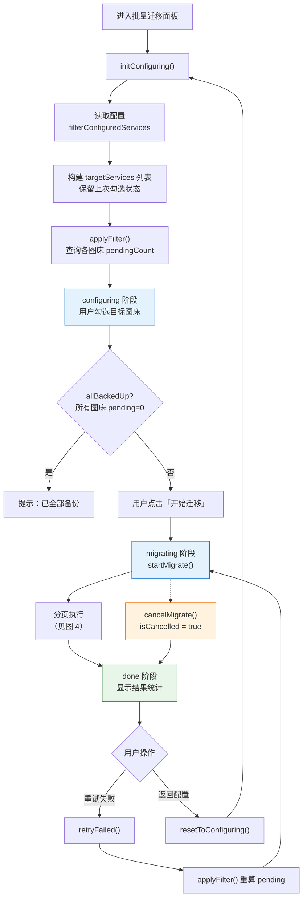
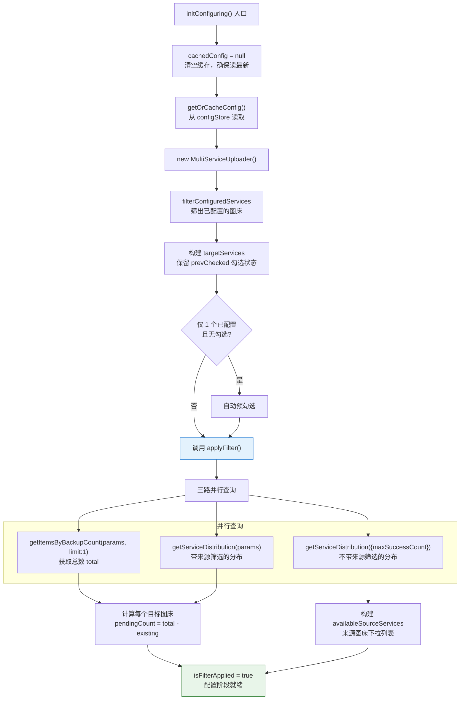
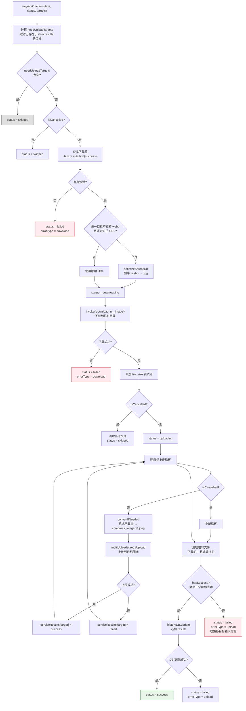
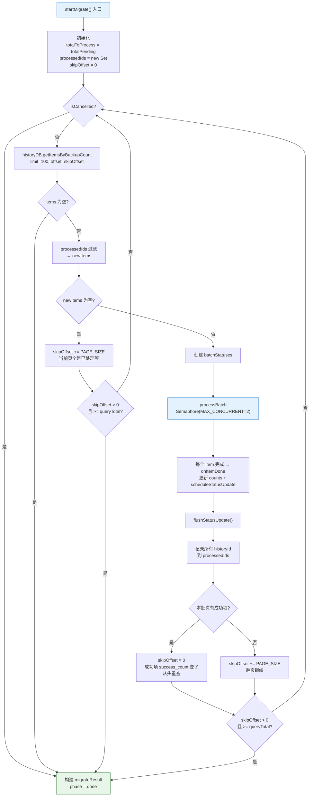
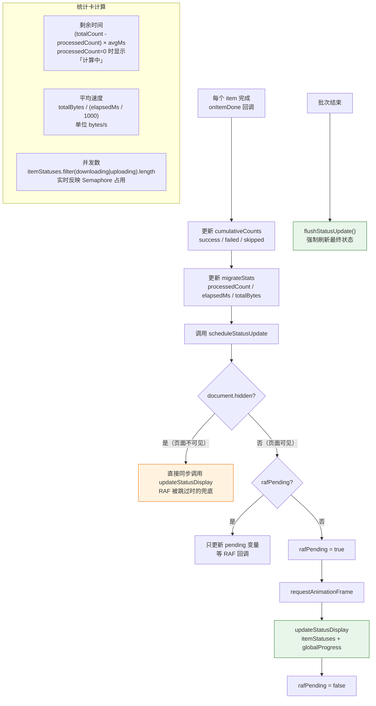

# 批量迁移流程

> 将图片从一个图床批量迁移到另一个图床。选择目标 → 筛选范围 → 下载 + 上传 → 更新历史记录。
> 排查「迁移速度慢」「格式转换失败」「重复迁移」时查看此文档。

---

## 图 1：四阶段总览

展示从 configuring 到 done 的整体流程，以及各阶段间的状态转移。

> **关键源文件**：`src/types/batchMigrate.ts`（`MigratePhase`）、`src/composables/useBatchMigrate.ts`（`useBatchMigrateManager`）

---

## 图 2：配置与筛选阶段

展示 `initConfiguring` 和 `applyFilter` 中双重分布查询的逻辑。解答「pendingCount 怎么算」。

> **关键源文件**：`src/composables/useBatchMigrate.ts`（`initConfiguring`、`applyFilter`）

### 双重分布查询说明

| 查询 | 参数 | 用途 |
|------|------|------|
| 带来源筛选 | `maxSuccessCount` + `hasServiceId` | 计算满足筛选条件的图片中，各目标图床的已有数量（total - existing = pending） |
| 不带来源筛选 | 仅 `maxSuccessCount` | 列出所有有记录的来源图床及其数量（构建筛选下拉列表） |

---

## 图 3：单图迁移管线

展示 `migrateOneItem` 中单张图片从下载到多目标上传的完整管线，包含格式转换逻辑。

> **关键源文件**：`src/composables/useBatchMigrate.ts`（`migrateOneItem`、`optimizeSourceUrl`、`convertIfNeeded`）

### 格式兼容性表

| 场景 | 检测方法 | 处理 |
|------|---------|------|
| 知乎 webp → 不支持 webp 的目标 | `needsFormatConversion(targetId, 'webp')` | URL 改后缀 `.webp` → `.jpg`（知乎原生支持） |
| 下载文件格式不被目标支持 | `needsFormatConversion(targetId, ext)` | `compress_image` 转 jpeg（quality=92） |

---

## 图 4：分页执行与 offset 策略

展示 `startMigrate` 中分页查询、去重、offset 重置的循环逻辑。排查「重复迁移」或「漏处理」。

> **关键源文件**：`src/composables/useBatchMigrate.ts`（`startMigrate`）

### offset 重置策略说明

| 场景 | skipOffset 变化 | 原因 |
|------|----------------|------|
| 本批次有成功项 | 重置为 0 | 成功项 `success_count` 变化影响排序，需从头重查 |
| 本批次无成功项 | +PAGE_SIZE | 这些项暂时无法迁移，翻页查找后续项 |
| 当前页全是已处理项 | +PAGE_SIZE | 通过 `processedIds` 过滤后 newItems 为空 |
| `skipOffset > 0 且 >= queryTotal` | 终止循环 | 防无限翻页（`> 0` 守卫确保 offset=0 时不误终止） |

---

## 图 5：RAF 节流与 UI 更新

展示 `scheduleStatusUpdate` 中 requestAnimationFrame 节流和页面隐藏同步更新的机制。

> **关键源文件**：`src/composables/useBatchMigrate.ts`（`scheduleStatusUpdate`、`flushStatusUpdate`、统计卡 computed）

### 实时统计卡计算

| 统计项 | 公式 | 边界情况 |
|--------|------|---------|
| 剩余时间 | `(totalCount - processedCount) × (elapsedMs / processedCount)` | `processedCount=0` 时显示「计算中」 |
| 平均速度 | `totalBytes / (elapsedMs / 1000)` bytes/s | `elapsedMs=0` 时返回 0 |
| 并发数 | `itemStatuses.filter(s => downloading \| uploading).length` | 实时反映 Semaphore(2) 占用数 |

---

## 排查指南

| 现象 | 可能原因 | 对照位置 |
|------|---------|---------|
| 目标图床 pendingCount 显示 0 | 所有图片已存在于该图床 | 图 2 `pendingCount = total - existing` |
| 迁移速度很慢 | `MAX_CONCURRENT=2` 限制 + 大文件下载耗时 | 图 3 信号量 / 图 4 循环 |
| webp 图片上传失败 | 目标图床不支持 webp 且格式转换失败 | 图 3 `convertIfNeeded` |
| 同一图片被重复迁移 | `processedIds` 未正确过滤或 offset 重置逻辑异常 | 图 4 去重 + offset 策略 |
| 进度条到 100% 但 phase 未变 done | 最后一批的 `flushStatusUpdate` 延迟 | 图 5 `flushStatusUpdate` |
| 统计卡一直显示「计算中」 | `processedCount` 始终为 0（可能全部 skipped 也算 processed） | 图 5 统计卡计算 |
| 知乎图片迁移后变模糊 | webp→jpg URL 优化生效但原图质量已低 | 图 3 知乎 URL 优化 |
| 迁移完成后历史记录未更新 | `historyDB.update` 失败 → `errorType='upload'` | 图 3 DB 更新失败分支 |
| 重试按钮点击后 pending=0 | `retryFailed` 先 `applyFilter` 重算，失败项可能已被其他操作处理 | 图 1 `retryFailed` |
| 高级筛选不生效 | `sourceServiceFilter` 为空数组表示「全部」，非「无」 | 图 2 `applyFilter` 参数 |

---

## 相关文档

- [上传流程](./upload-flow.md) — MultiServiceUploader 上传机制
- [数据持久化](./data-persistence.md) — historyDB 的查询和更新
- [链接监控流程](./link-check-flow.md) — 链接检测结果是迁移的数据来源
- [文档修复流程](./md-rescue-flow.md) — 另一个复用历史数据的功能
