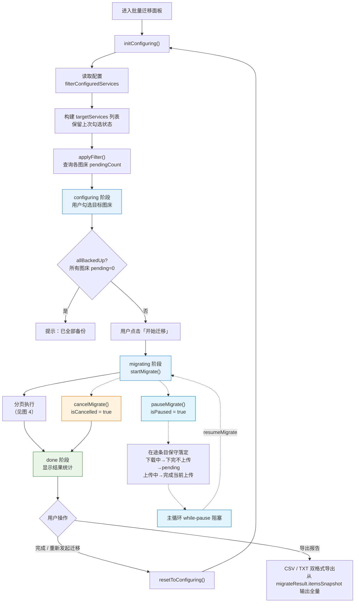
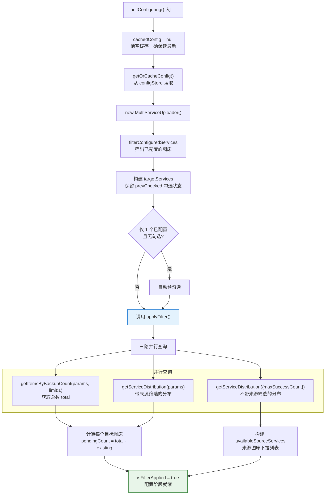
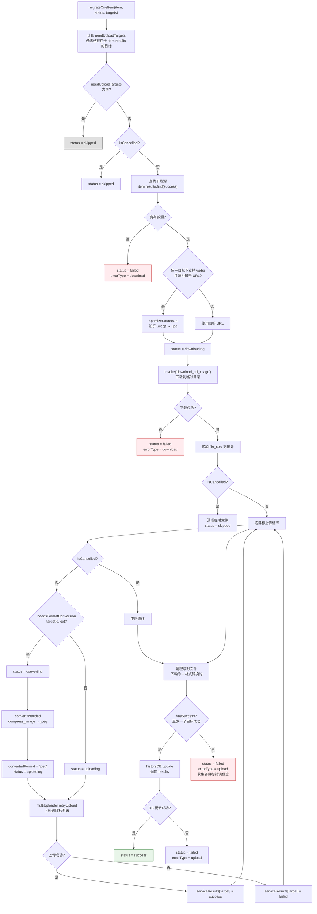
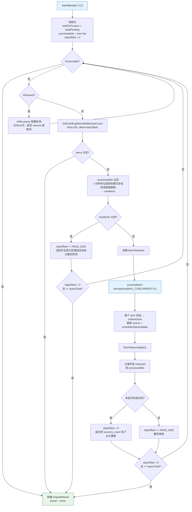
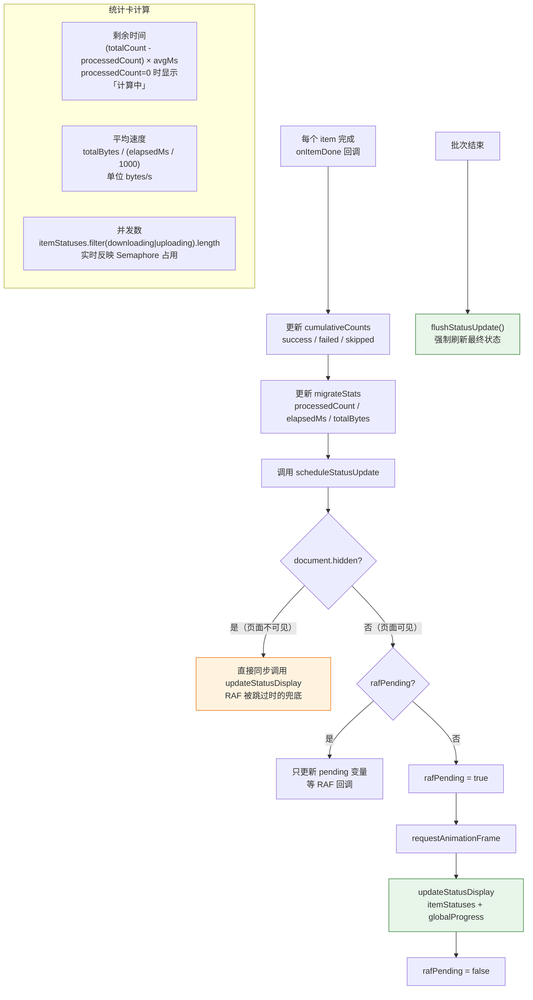
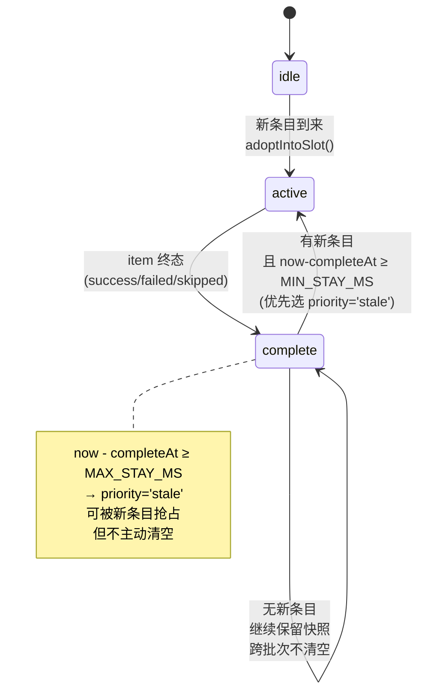
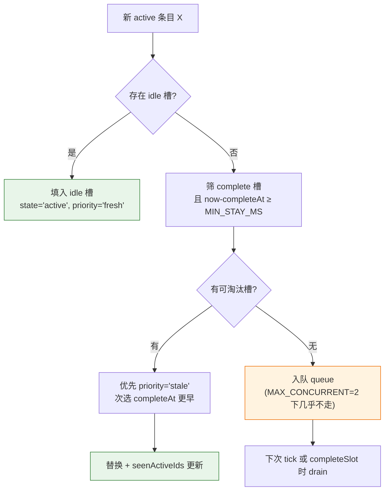

# 批量迁移流程

> 将图片从一个图床批量迁移到另一个图床。选择目标 → 筛选范围 → 下载 + 上传 → 更新历史记录。
> 排查「迁移速度慢」「格式转换失败」「重复迁移」时查看此文档。

---

## 图 1：四阶段总览

展示从 configuring 到 done 的整体流程，以及各阶段间的状态转移。

> **关键源文件**：`src/types/batchMigrate.ts`（`MigratePhase`）、`src/composables/useBatchMigrate.ts`（`useBatchMigrateManager`）
>
> **UI 组装**：`migrating` 与 `done` 阶段**共用同一个 `MigrateProgressPhase.vue` 面板**，通过子组件（`MigrateActiveCard`、`MigrateSkippedSection`、`MigrateCompletedSection`、`MigrateBottomBar`、`MigrateStatsSummary`）切换渲染。终态不再跳独立页面。顶部失败横幅已移除——失败项直接呈现在「已跳过/失败项」折叠区，用户心智更直接。
>
> **统计信息位置**：已完成数/速率/剩余时间/目标图床整合到 `MigrateStatsSummary`，显示在 `MigrateBottomBar` 左槽位；右侧是操作按钮组。

---

## 图 2：配置与筛选阶段

展示 `initConfiguring` 和 `applyFilter` 中双重分布查询的逻辑。解答「pendingCount 怎么算」。

> **关键源文件**：`src/composables/useBatchMigrate.ts`（`initConfiguring`、`applyFilter`）

### 双重分布查询说明

| 查询 | 参数 | 用途 |
|------|------|------|
| 带来源筛选 | `maxSuccessCount` + `hasServiceId` + `timestampAfter` | 计算满足筛选条件的图片中，各目标图床的已有数量（total - existing = pending） |
| 不带来源筛选 | `maxSuccessCount` + `timestampAfter` | 列出所有有记录的来源图床及其数量（构建筛选下拉列表） |

### UI 筛选维度（MigrateFilterPopover）

配置阶段的「从这里」栏目标签右侧有一个 `pi-sliders-h` 图标，点击打开 Popover 面板，聚合以下精细化筛选：

| 维度 | Composable 状态 | 作用面 | 默认值 |
|------|----------------|--------|--------|
| 备份数阈值 | `maxSuccessCount` | 数据库 `success_count <= X` | 999（全部） |
| 上传时间范围 | `timestampAfterMs` | 数据库 `timestamp >= X`（经 `timestampRangePresets` 转绝对时间戳） | null（全部时间） |

任一维度非默认时，触发按钮会挂徽章显示简短描述（如 `<2 · 最近 30 天`）。`resetToConfiguring()` 会把两者一并复位。

---

## 图 3：单图迁移管线

展示 `migrateOneItem` 中单张图片从下载到多目标上传的完整管线，包含格式转换逻辑。

> **关键源文件**：`src/composables/batchMigrate/migrateCore.ts`（`migrateOneItem`、`optimizeSourceUrl`、`convertIfNeeded`）
>
> **status 取值**：`pending | downloading | converting | uploading | success | failed | skipped`。`converting` 仅在目标图床格式白名单不含源扩展名时进入（探测通过 `needsFormatConversion`）。`convertedFormat` 字段在真触发 `compress_image` 时写入 `'jpeg'`，UI 用它区分「已转 JPEG」与「格式兼容」。

### 格式兼容性表

| 场景 | 检测方法 | 处理 | UI 适配阶段文案 |
|------|---------|------|--------------|
| 知乎 webp → 不支持 webp 的目标 | `needsFormatConversion(targetId, 'webp')` | URL 改后缀 `.webp` → `.jpg`（知乎原生支持），下载后 ext='jpg' | **格式兼容**（URL 优化已生效，未调 `compress_image`） |
| 下载文件格式不被目标支持 | `needsFormatConversion(targetId, ext)` 在循环内按 target 探测 | `status='converting'` → `compress_image` 转 jpeg（quality=92）→ `convertedFormat='jpeg'` → `status='uploading'` | **已转 JPEG** |
| 目标图床无格式白名单（对象存储类） | `needsFormatConversion` 返回 false | 直接上传原文件 | **格式兼容** |

> 公共图床（有白名单）：京东、牛客、B 站、知乎、超星、SM.MS、Imgur、奇遇；对象存储（无限制）：R2、腾讯云、阿里云、七牛、又拍、GitHub、微博、纳米。详见 `src/constants/serviceFormats.ts`。

> 转换失败统一归 `errorType='upload'`——不引入独立 `convert` errorType 是为了避免 `getErrorInfo` / `MigrateStatusBanner` / CSV 导出多处映射联动。

---

## 图 4：分页执行与 offset 策略

展示 `startMigrate` 中分页查询、去重、offset 重置的循环逻辑。排查「重复迁移」或「漏处理」。

> **关键源文件**：`src/composables/useBatchMigrate.ts`（`startMigrate`）

### offset 重置策略说明

| 场景 | skipOffset 变化 | 原因 |
|------|----------------|------|
| 本批次有成功项 | 重置为 0 | 成功项 `success_count` 变化影响排序，需从头重查 |
| 本批次无成功项 | +PAGE_SIZE | 这些项暂时无法迁移，翻页查找后续项 |
| 当前页全是已处理项 | +PAGE_SIZE | 通过 `processedIds` 过滤后 newItems 为空 |
| 当前页全是"所有勾选目标已备份"的项 | +PAGE_SIZE | 预过滤后 newItems 为空——不计入 skipped 统计，也不显示在结果列表 |
| 暂停期间被"持有"的 pending 条目 | 不入 processedIds | resume 后可以被下一批查询重新拾取；主循环的 while-pause 轮询在 resume 后解除阻塞 |
| `skipOffset > 0 且 >= queryTotal` | 终止循环 | 防无限翻页（`> 0` 守卫确保 offset=0 时不误终止） |

### 暂停的保守策略说明

用户点击暂停后 `isPaused.value = true`，主循环在拉取下一批前阻塞。在途条目的落定分三种情况：

| 在途阶段 | 保守策略 | 代码位置 |
|---------|---------|---------|
| 未开始下载（刚拿到 semaphore permit） | `migrateOneItem` 入口 `if (isPaused) return` —— 保持 `status='pending'`，`onItemDone` 不计入统计，不入 `processedIds` | `migrateCore.ts` `migrateOneItem` 入口 |
| 下载中 | 下载本身无法中断（Tauri `download_url_image` 无 abort），下载完成后检查 `isPaused`——清理临时文件 + 状态回退为 `'pending'` | `migrateCore.ts` 下载成功分支 |
| 上传中 | 不中断——完成当前目标上传后，若还有剩余目标循环入口会继续（现有 `isCancelled` 检查点即可兼任） | `migrateCore.ts` 上传循环 |

**UI 反馈**：`isPausing = isPaused && concurrentCount > 0` —— 只要有条目还在途就显示"正在暂停..."；所有在途条目落定后 `isPausing` 自然 flip 到 false，底栏切换为"已暂停 + 继续"按钮。

---

## 图 5：RAF 节流与 UI 更新

展示 `scheduleStatusUpdate` 中 requestAnimationFrame 节流和页面隐藏同步更新的机制。

> **关键源文件**：`src/composables/useBatchMigrate.ts`（`scheduleStatusUpdate`、`flushStatusUpdate`、统计卡 computed）

### 实时统计卡计算

| 统计项 | 公式 | 边界情况 |
|--------|------|---------|
| 剩余时间 | `(totalCount - processedCount) × (elapsedMs / processedCount)` | `processedCount=0` 时显示「计算中」 |
| 平均速度 | `totalBytes / (elapsedMs / 1000)` bytes/s | `elapsedMs=0` 时返回 0 |
| 并发数 | `itemStatuses.filter(s => downloading \| converting \| uploading).length` | 实时反映 Semaphore(2) 占用数 |

---

## 图 6：UI 槽位机制 + 最近完成快照

解耦 UI 显示节奏与数据层真实节奏，解决批次边界骨架屏抽搐、单卡 <100ms 闪过、完成瞬间消失三个视觉故障。

> **双重机制**：
> - `useActiveSlots`（固定 2 槽，与 `MAX_CONCURRENT=2` 对齐）：活跃槽 + 完成态收尾动画，跨批次延续
> - `useRecentCompleted`（FIFO 队列，最长 6 张）：活跃槽下方的"最近完成"快照区，让视觉信息密度更足

> **关键源文件**：
> - `src/composables/batchMigrate/useActiveSlots.ts`（`useActiveSlots`、`adoptIntoSlot`、`completeSlot`）
> - `src/composables/batchMigrate/useRecentCompleted.ts`（`useRecentCompleted`）
>
> **渲染位置**：`src/components/views/linkcheck/migrate/MigrateProgressPhase.vue`「正在处理」区：上方 `v-for` 活跃槽位（空态 `MigrateSkeletonCard`），下方"最近完成"网格渲染 `MigrateActiveCard variant="snapshot"`

### 常量与对齐

| 常量 | 值 | 对应 CSS token | 作用 |
|------|-----|---------------|------|
| `MIN_STAY_MS` | 800 | `--duration-spinner` | 吸附后最少停留，保证肉眼可辨 |
| `MAX_STAY_MS` | 1500 | `--duration-shimmer` | 完成态展示时长上限，过后 priority→stale |
| `TICK_INTERVAL_MS` | 200 | — | 驱动 stale 升级与队列 drain |
| `SLOT_COUNT` | 2 | — | 与 `MAX_CONCURRENT=2` 对齐 |

修改 JS 常量时必须同步更新 `styles/motion.css` 对应 token，反之亦然。

### adoptIntoSlot 决策树

### 三驱动源

| 驱动源 | 触发 | 主要动作 |
|--------|------|---------|
| `watch(itemStatuses, deep)` | 数据层状态变化 | 1. 已被槽持有的 id → 刷新引用，终态 → `completeSlot`；2. 新 active id → `adoptIntoSlot`；3. 批次换页找不到 id → **保留快照不动**（跨批次延续的关键） |
| `setInterval(tick, 200ms)` | 定时 | complete 且超 `MAX_STAY_MS` → `priority='stale'`；`drainQueue` 消费排队；`document.hidden` 时跳过 |
| `watch(phase)` | 阶段切换 | 进入 `migrating` 启动 tick；离开 `migrating` 停 tick + `reset()` |

### 问题→对策映射

| 原问题 | 槽位机制对策 |
|--------|-------------|
| 批次边界 activeItems=[] → 骨架屏抽搐 | complete 槽在批次切换时不清空，保留快照直到被下批新条目抢占 |
| 单卡 <100ms 闪过 | `MIN_STAY_MS=800` 兜底：complete 未满 800ms 不允许被替换 |
| 完成瞬间消失 | complete 态保留最长 `MAX_STAY_MS=1500`，同时 `data-slot-state="complete"` 触发呼吸停 + 边框渐弱，收尾动画 |
| shallowRef 反应性丢失（历史 bug） | 槽位读的是 `itemStatuses`（currentBatch），`updateStatusDisplay` 每 RAF 新数组赋值会正常触发 watch |

---

## 排查指南

| 现象 | 可能原因 | 对照位置 |
|------|---------|---------|
| 目标图床 pendingCount 显示 0 | 所有图片已存在于该图床 | 图 2 `pendingCount = total - existing` |
| 迁移速度很慢 | `MAX_CONCURRENT=2` 限制 + 大文件下载耗时 | 图 3 信号量 / 图 4 循环 |
| webp 图片上传失败 | 目标图床不支持 webp 且格式转换失败 | 图 3 `convertIfNeeded` |
| 同一图片被重复迁移 | `processedIds` 未正确过滤或 offset 重置逻辑异常 | 图 4 去重 + offset 策略 |
| 进度条到 100% 但 phase 未变 done | 最后一批的 `flushStatusUpdate` 延迟 | 图 5 `flushStatusUpdate` |
| 统计卡一直显示「计算中」 | `processedCount` 始终为 0（可能全部 skipped 也算 processed） | 图 5 统计卡计算 |
| 知乎图片迁移后变模糊 | webp→jpg URL 优化生效但原图质量已低 | 图 3 知乎 URL 优化 |
| 迁移完成后历史记录未更新 | `historyDB.update` 失败 → `errorType='upload'` | 图 3 DB 更新失败分支 |
| 重试按钮点击后 pending=0 | `retryFailed` 先 `applyFilter` 重算，失败项可能已被其他操作处理 | 图 1 `retryFailed` |
| 高级筛选不生效 | `sourceServiceFilter` 为空数组表示「全部」，非「无」 | 图 2 `applyFilter` 参数 |
| 「正在处理」卡片长时间是骨架屏 | 检查 `BatchMigratePanel` 是否正确 provide `slots`/`hasAnyActive`；旧版 `activeItems` 读 shallowRef 内部 mutation 无响应的 bug | 图 6 槽位机制 |
| 完成卡瞬间消失没停留 | `MAX_STAY_MS` 不生效，检查 tick 是否被 `document.hidden` 跳过；或 `MigrateActiveCard` 的 `data-slot-state` 未绑定 | 图 6 常量表 |
| 「适配」阶段显示「格式兼容」与期望不符 | `convertedFormat` 未写入 → 检查 `migrateCore` 里 `willConvert` 探测与 `status='converting'` 赋值顺序 | 图 3 converting 分支 |
| 暂停后按钮一直卡在"正在暂停..." | `isPausing` 依赖 `concurrentCount` 归零，若有条目卡在 downloading 下载本身无法中断必须等 HTTP 超时或完成 | 图 1 暂停分支 |
| 恢复后已暂停的条目没重新迁移 | 检查 `processedIds` 是否误收了 `status='pending'` 的持有条目 | 图 4 offset 策略表 |
| 失败项显示的错误信息是英文 | 原始错误未命中 `categorizeMigrateError` 的映射规则，fallback 到"未知错误"，悬停 ⓘ 看 tooltip 原文 | `src/utils/uploadFailureMessage.ts` 的 `MIGRATE_ERROR_PATTERNS` |

---

## 相关文档

- [上传流程](./upload-flow.md) — MultiServiceUploader 上传机制
- [数据持久化](./data-persistence.md) — historyDB 的查询和更新
- [链接监控流程](./link-check-flow.md) — 链接检测结果是迁移的数据来源
- [文档修复流程](./md-rescue-flow.md) — 另一个复用历史数据的功能
