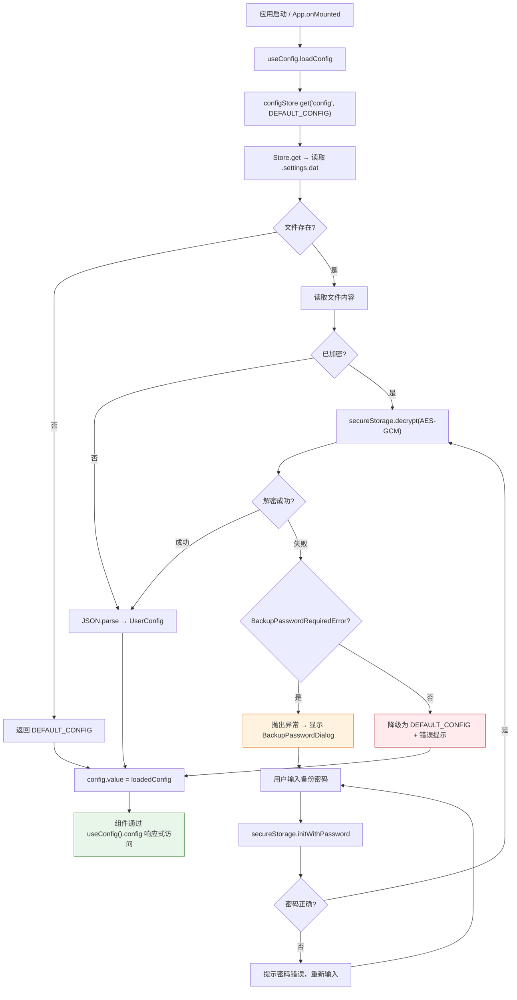
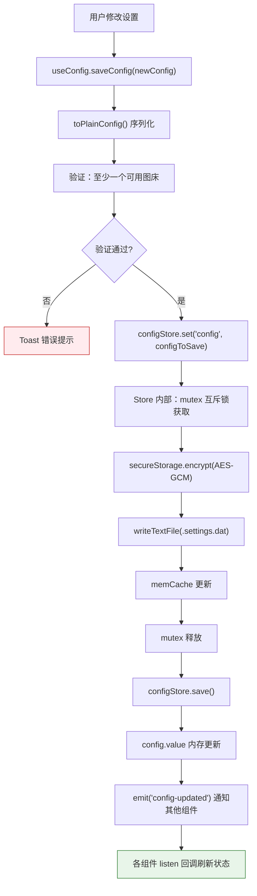
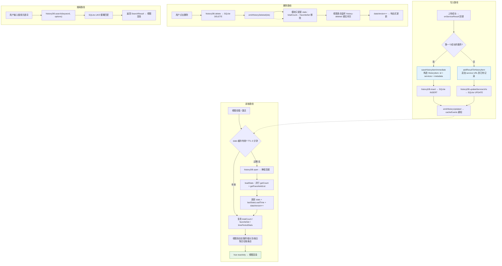
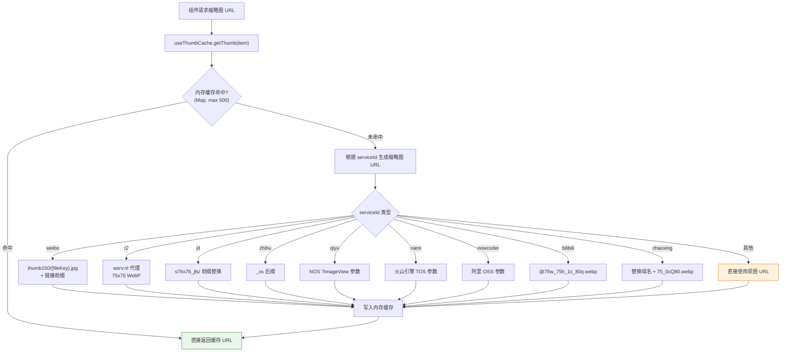

# 数据持久化

> 配置存储、历史记录、缩略图缓存的数据流图解。排查数据丢失或异常时查看此文档。

---

## 图 3：配置加载与保存流

展示 AES-GCM 加密配置的读写流程，重点关注**异常分支**（解密失败、备份密码）。

> **关键源文件**：`src/composables/useConfig.ts`、`src/store/instances.ts`、`src/crypto.ts`

### 配置加载

### 配置保存

---

## 图 4：历史记录数据流

展示上传历史的写入、读取和删除路径。排查**历史不显示**或**数据不同步**时重点查看。

> **关键源文件**：`src/composables/useHistory.ts`、`src/composables/useHistorySaver.ts`、`src/services/database/HistoryDatabase.ts`

---

## 图 5：缩略图缓存流

展示缩略图 URL 的生成策略。排查**缩略图不显示**或**加载慢**时查看。

> **关键源文件**：`src/composables/useThumbCache.ts`

---

## 排查指南

| 现象 | 可能原因 | 对照图表位置 |
|------|---------|-------------|
| 配置丢失/恢复默认 | .settings.dat 解密失败，降级为 DEFAULT_CONFIG | 图3 加载流节点 M |
| 弹出密码输入框 | 更换设备或密钥丢失，触发 BackupPasswordRequired | 图3 加载流节点 L |
| 配置保存后其他组件未更新 | `config-updated` 事件未触发或监听未注册 | 图3 保存流节点 N → O |
| 历史记录不显示 | TTL 缓存过期但 reloadSharedData 失败 | 图4 读取路径 R4 → R5 |
| 删除后列表未更新 | cacheEvents 监听未初始化 | 图4 删除路径 D3 → D4 |
| 缩略图显示原图（很大） | serviceId 未匹配到任何缩略图策略 | 图5 节点 G10 |
| 微博缩略图 404 | fileKey 缺失，回退到原图 URL | 图5 weibo 分支 G1 |

---

## 相关文档

- [Composables API](../reference/api/composables.md) — useConfig / useHistory / useThumbCache 接口索引
- [模块依赖图](../reference/architecture/dependencies.md) — 修改前查影响范围
- [历史查询流程](./history-flow.md) — 历史记录的缓存、搜索与分页
- [同步流程](./sync-flow.md) — 配置/历史的 WebDAV 云同步
- [上传流程](./upload-flow.md) — 上传完成后写入历史记录
- [批量迁移流程](./batch-migrate-flow.md) — 迁移过程中读写历史数据库
