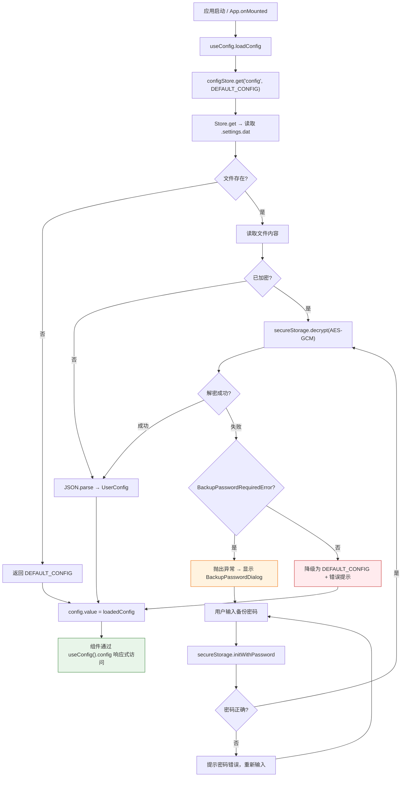
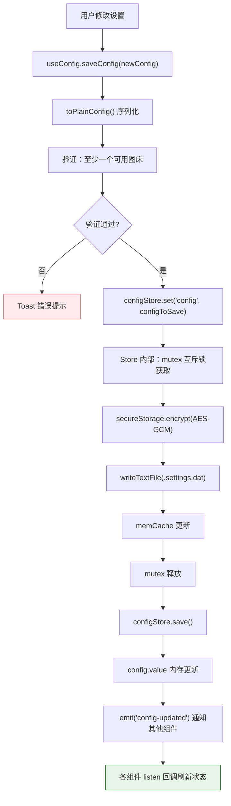
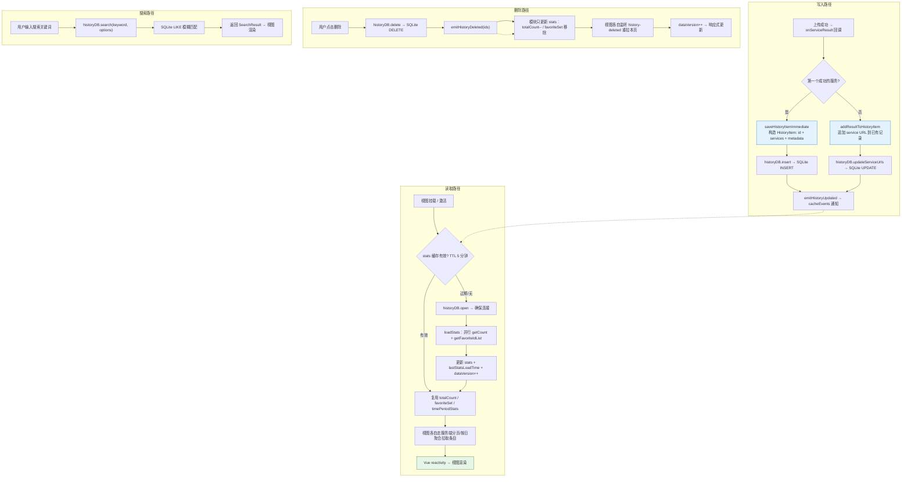
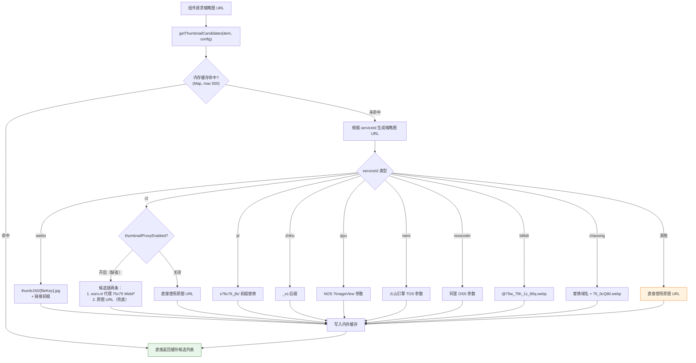

# 数据持久化

> 配置存储、历史记录、缩略图缓存的数据流图解。排查数据丢失或异常时查看此文档。

---

## 图 3：配置加载与保存流

展示 AES-GCM 加密配置的读写流程，重点关注**异常分支**（解密失败、备份密码）。

> **关键源文件**：`src/composables/useConfig.ts`、`src/store/instances.ts`、`src/security/crypto.ts`

### 配置加载

```mermaid
flowchart TD
    A[应用启动 / App.onMounted] --> B[useConfig.loadConfig]
    B --> C[configStore.get&lpar;'config', DEFAULT_CONFIG&rpar;]
    C --> D[Store.get → 读取 .settings.dat]

    D --> E{文件存在?}
    E -- 否 --> E1[返回 DEFAULT_CONFIG]
    E -- 是 --> F[读取文件内容]

    F --> G{已加密?}
    G -- 否 --> H[JSON.parse → UserConfig]
    G -- 是 --> I[secureStorage.decrypt&lpar;AES-GCM&rpar;]

    I --> J{解密成功?}
    J -- 成功 --> H
    J -- 失败 --> K{BackupPasswordRequiredError?}
    K -- 是 --> L[抛出异常 → 显示 BackupPasswordDialog]
    K -- 否 --> M[降级为 DEFAULT_CONFIG + 错误提示]

    L --> N[用户输入备份密码]
    N --> O[secureStorage.initWithPassword]
    O --> P{密码正确?}
    P -- 是 --> I
    P -- 否 --> Q[提示密码错误，重新输入]
    Q --> N

    H --> R[config.value = loadedConfig]
    E1 --> R
    M --> R
    R --> S[组件通过 useConfig&lpar;&rpar;.config 响应式访问]

    style L fill:#fff3e0,stroke:#ef6c00
    style M fill:#ffebee,stroke:#c62828
    style S fill:#e8f5e9,stroke:#2e7d32
```

### 配置保存

```mermaid
flowchart TD
    A[用户修改设置] --> B[useConfig.saveConfig&lpar;newConfig&rpar;]
    B --> C[toPlainConfig&lpar;&rpar; 序列化]
    C --> D[验证：至少一个可用图床]
    D --> E{验证通过?}
    E -- 否 --> E1[Toast 错误提示]
    E -- 是 --> F[configStore.set&lpar;'config', configToSave&rpar;]

    F --> G[Store 内部：mutex 互斥锁获取]
    G --> H[secureStorage.encrypt&lpar;AES-GCM&rpar;]
    H --> I[writeTextFile&lpar;.settings.dat&rpar;]
    I --> J[memCache 更新]
    J --> K[mutex 释放]

    K --> L[configStore.save&lpar;&rpar;]
    L --> M[config.value 内存更新]
    M --> N["emit('config-updated') 通知其他组件"]
    N --> O[各组件 listen 回调刷新状态]

    style E1 fill:#ffebee,stroke:#c62828
    style O fill:#e8f5e9,stroke:#2e7d32
```

---

## 图 4：历史记录数据流

展示上传历史的写入、读取和删除路径。排查**历史不显示**或**数据不同步**时重点查看。

> **关键源文件**：`src/composables/useHistory.ts`、`src/composables/useHistorySaver.ts`、`src/services/database/HistoryDatabase.ts`

```mermaid
flowchart TD
    subgraph 写入路径
        W1[上传成功 → onServiceResult 回调]
        W1 --> W2{第一个成功的服务?}
        W2 -- 是 --> W3["saveHistoryItemImmediate<br/>构造 HistoryItem: id + services + metadata"]
        W2 -- 否 --> W4["addResultToHistoryItem<br/>追加 service URL 到已有记录"]
        W3 --> W5[historyDB.insert → SQLite INSERT]
        W4 --> W6[historyDB.updateServiceUrls → SQLite UPDATE]
        W5 & W6 --> W7["emitHistoryUpdated → cacheEvents 通知"]
    end

    subgraph 读取路径
        R1[视图挂载 / 激活]
        R1 --> R2{stats 缓存有效? TTL 5 分钟}
        R2 -- 有效 --> R3[复用 totalCount / favoriteSet / timePeriodStats]
        R2 -- 过期/无 --> R4[historyDB.open → 确保连接]
        R4 --> R5["loadStats：并行 getCount + getFavoriteIdList"]
        R5 --> R6[更新 stats + lastStatsLoadTime + dataVersion++]
        R6 --> R3
        R3 --> R7[视图各自走服务端分页/按日聚合拉取条目]
        R7 --> R8[Vue reactivity → 视图渲染]
    end

    subgraph 删除路径
        D1[用户点击删除]
        D1 --> D2[historyDB.delete → SQLite DELETE]
        D2 --> D3["emitHistoryDeleted(ids)"]
        D3 --> D4["模块只更新 stats：totalCount-- / favoriteSet 移除"]
        D4 --> D5[视图各自监听 history-deleted 重拉本页]
        D5 --> D6[dataVersion++ → 响应式更新]
    end

    subgraph 搜索路径
        S1[用户输入搜索关键词]
        S1 --> S2["historyDB.search(keyword, options)"]
        S2 --> S3[SQLite LIKE 模糊匹配]
        S3 --> S4[返回 SearchResult → 视图渲染]
    end

    W7 -.-> R2
    D3 -.-> D4

    style W3 fill:#e3f2fd,stroke:#1976d2
    style W4 fill:#e3f2fd,stroke:#1976d2
    style R8 fill:#e8f5e9,stroke:#2e7d32
```

---

## 图 5：缩略图缓存流

展示缩略图 URL 的生成策略。排查**缩略图不显示**或**加载慢**时查看。

> **关键源文件**：`src/composables/useThumbCache.ts`

```mermaid
flowchart TD
    A[组件请求缩略图 URL] --> B[getThumbnailCandidates&lpar;item, config&rpar;]
    B --> C{"内存缓存命中?<br/>(Map, max 500)"}
    C -- 命中 --> D[直接返回缓存候选列表]
    C -- 未命中 --> E[根据 serviceId 生成缩略图 URL]

    E --> F{serviceId 类型}

    F -- weibo --> G1["thumb150/{fileKey}.jpg<br/>+ 链接前缀"]
    F -- r2 --> G2{"thumbnailProxyEnabled?"}
    G2 -- 开启（缺省） --> G2a["候选链两条：<br/>1. wsrv.nl 代理 75x75 WebP<br/>2. 原图 URL（兜底）"]
    G2 -- 关闭 --> G2b["直接使用原图 URL"]
    F -- jd --> G3["s76x76_jfs/ 前缀替换"]
    F -- zhihu --> G4["_xs 后缀"]
    F -- qiyu --> G5["NOS ?imageView 参数"]
    F -- nami --> G6["火山引擎 TOS 参数"]
    F -- nowcoder --> G7["阿里 OSS 参数"]
    F -- bilibili --> G8["@75w_75h_1c_80q.webp"]
    F -- chaoxing --> G9["替换域名 + 75_0cQ80.webp"]
    F -- 其他 --> G10[直接使用原图 URL]

    G1 & G2a & G2b & G3 & G4 & G5 & G6 & G7 & G8 & G9 & G10 --> H[写入内存缓存]
    H --> D

    style D fill:#e8f5e9,stroke:#2e7d32
    style G10 fill:#fff3e0,stroke:#ef6c00
```

> **默认开代理的依据**（2026-08-18 实测，同一张 37 KB 的 PNG，各 3 次取平均）：
> 走代理 271 ms / 366 B，直连原图 377 ms / 37892 B——**流量差 103 倍**。一屏 20 张就是 7 KB 对 7.6 MB。
> 别因为"少依赖一个第三方"就把默认值改回直连，那会让时间轴在图多时明显变卡；
> 要退，正确的做法是关掉开关（用户自己按隐私偏好决定），而不是改默认值。

> ⚠️ **R2 为什么是唯一带兜底条目的图床。** 其余图床的缩略图与原图同域同源（参数化 URL 或干脆就是原图），
> 首选加载不出来时原图多半也一样，多塞一条只会让失败路径多等一轮超时。R2 不同——开着代理时首选指向
> **第三方** wsrv.nl，它不通不代表用户自己的桶不通，所以把原图垫在第二位。判据集中在
> `isR2ThumbnailProxyOn()`，候选链在 `generateThumbnailUrls()` / `generateMediumThumbnailUrls()`。

> **代理不通只会拖慢第一张图。** wsrv.nl 在境内直连不可达，要是每张缩略图都老实先试代理、
> 再等满 5 秒才降级，滚动列表时每翻一屏都空等一次，比压根不用代理还难受。所以组件在候选翻页时
> 调 `reportThumbnailUrlFailed()` 回报：失败的若是代理那条，整个会话被标记为「代理不可用」，
> 候选缓存清空，后续列表直接只产出原图 URL。这个判定只记在内存（网络环境随时会变，重启重探一次），
> 并且进了 `candidatesConfigFingerprint`——否则时间轴/收藏页会一直停在旧的「代理在前」候选上。
>
> ⚠️ 这个标记**必须是 `shallowRef` 而不是普通模块级变量**。候选列表是在渲染期算的
> （历史表格一页 50 行、时间轴每行模板都会调 `get*Candidates`），普通变量 Vue 收集不到依赖，
> 第一张探测失败后**已渲染的其余几十行仍持有「代理在前」的旧候选**，滚下去每张照样空等一轮超时，
> 优化等于白做。回归测试在 `useThumbCache.spec.ts` 的「降级是响应式的」两条——
> 它们必须走 `computed` + `nextTick`，直接调函数测不出这个问题。
>
> 用户手动拨动开关时走的是 `resetProxyReachability()` 而非只清缓存：拨开关的语义是
> 「我要重新试」，只清缓存的话会话仍停在降级态，开关看着开着、实际一直走原图。

> ⚠️ **所有取「单条 URL」的入口都必须从候选链取首条**（`getMetaThumbnailUrl` /
> `getMediumImageUrl` 内部走 `generateMediumThumbnailUrls(...)[0]`）。直接调
> `generateMediumThumbnailUrl` 拿到的地址**不看降级状态**，代理不通后依然是代理地址。
> 时间轴预加载器曾踩过这个坑：预热拿到死链 → 把整条记录写进 `failedImages` →
> `TimelinePhotoItem` 走占位分支 → 候选链里垫底的原图永远没机会顶上，**正好复现 issue #4 症状②**。
> 现在预加载失败**既不上报也不标记**，交给真实渲染时的候选链定性——它只试一条 URL，
> 没有「下一条成功了」这个对照，无从判断是代理不通还是这张图本身没了（详见下方失败定性说明）。

> **候选链的消费逻辑统一在 [useThumbnailFallbackChain.ts](../../src/composables/useThumbnailFallbackChain.ts)**
> （时间轴、收藏页共用）。此前两个视图各写一份逐字相同的翻页逻辑，结果超时兜底只补进了时间轴，
> 收藏页在代理卡死时会一直停在骨架屏。新增消费方请复用它，别再抄第三份。

> ⚠️ **候选先过 `safeImageUrl` 这道安全闸，再进 ``。** 2026-08-19 给 CSP 的 `img-src`
> 放开 `http:`（又拍云一类图床只有明文 HTTP 域名）之后，CSP 不再兜底，这道闸是收藏页 / 时间轴
> 仅有的一道。调用方要把 `getConfirmedHttpHosts(config)` 的结果传进 `confirmedHttpHosts`，
> 否则用户已确认过的 HTTP 图床会被当危险链接整片挡掉。
> 两条配套行为：被过滤的候选**直接从链上剔除**（没发过请求，不能当失败证据）；
> 候选被过滤光时走 `onExhausted`，否则 `` 不渲染、等不到 error 事件，格子卡在骨架屏。
> 背景见 [http-image-host-2026-08-19.md](../audits/http-image-host-2026-08-19.md)。

> ⚠️ **消费方带 `loading="lazy"` 就必须传 `elementRef`。** 懒加载的图在视口外浏览器压根不发请求，
> 对它计时等于凭空判超时。收藏页一次渲染 80 格且**无虚拟化**，漏传会让视口外那 60 多张在 5 秒后
> 集体「失败」，把明明通着的代理判死——省流量的初衷一分没落地。时间轴不用传：虚拟列表只渲染
> 窗口内的项，`` 也没有 lazy。

> ⚠️ **失败不当场上报，要等下一条候选出结果才定性。** 单看一条失败分不清「代理不通」还是
> 「代理背后那张图被删了」（删对象是常规操作，wsrv.nl 对失效上游同样返回错误），而上报会把
> **整个会话**降级。判据是：前一条失败 + 后一条成功 → 确实是前一条那个服务的问题；
> 候选全挂 → 这张图本身没了，与代理无关。同理，**离屏预热不上报任何失败**——它只试一条，
> 没有「下一条成功了」这个对照，无从定性。

> **候选链靠两条路往后翻**：`` 的 `error` 事件，以及 5 秒超时
> （[ThumbnailImage.vue](../../src/components/common/ThumbnailImage.vue) /
> [TimelinePhotoItem.vue](../../src/components/views/timeline/TimelinePhotoItem.vue)）。
> 只有 error 不够——代理被墙时是连接卡死而非报错，浏览器可能几十秒才放弃，那段时间格子里一直是骨架屏。
> 超时只在**已进入视口**且**后面还有候选**时才计时：前者因为 `loading="lazy"` 的图在视口外压根没发请求，
> 计时会把整屏候选误翻一遍；后者因为掐断最后一条只会把「慢但最终能成」变成「直接失败」。

> ⚠️ **候选列表换新要按内容比，不能只看引用；重置索引时必须一并清掉待定的失败记录。**
> `getThumbnailCandidates` 对 QueueItem **明确不缓存**（状态会变），每次都返回一份内容相同的新数组，
> 上传进度每 tick 一次就产出一份。只比引用会把这些 tick 全当成「换图了」：已经退到原图的图被拽回
> 候选 0，而 `src` 根本没变 → 浏览器不再发 `load` 事件 → `isLoading` 永远停在 true，
> 格子里骨架屏和图各占一半且不自愈。而待定的失败记录（`pendingFailure`）若不跟着候选链一起清，
> 会在新链的候选加载成功时套用「前一条挂、这一条通」的判据，把上一张图的代理 URL 判死，
> 整个会话误降级。判据实现是 [useThumbnailFallbackChain.ts](../../src/composables/useThumbnailFallbackChain.ts)
> 顶层导出的 `hasUrlListChanged`，[ThumbnailImage.vue](../../src/components/common/ThumbnailImage.vue)
> 直接 import 复用——它因为自持 loading/error 状态、视口判定也在自己手里，没法用整个 composable，
> 但这条判据只有一份，不再靠「必须同步」的口头约定维系。
>
> ⚠️ **「候选换新」要判两次，只判内容变化不够。** 除了上面的内容比对，还有一条更隐蔽的：
> 内容**确实变了**，但解析后的首条 URL 恰好就是当前已经显示出来的那张——这时 `` 的
> `src` 依然不变，`load` 事件依然不会来，把 `isLoading` 打回 true 同样再也放不下来。
> 这不是边角案例，正是 **R2 降级的主路径**：原图加载成功 → `handleLoad` 上报代理不可达 →
> `clearThumbCache()` 重算 → 候选链从 `[代理, 原图]` 收成 `[原图]`。代理一挂，之后每张图都走这条。
> `ThumbnailImage.vue` 的 `loadImage` 为此加了一道短路：目标 URL 与已渲染且**已加载完成**的
> 那张相同时直接返回。「已加载完成」这个前提不能省——图还在加载中时列表可能刚变长，
> 短路掉就不会重新计时，卡住的首条永远翻不到垫底的原图。
>
> 时间轴与收藏页**没有**这个问题，别照搬这段：它们的加载状态由父组件按图片 id 持有
> （`useImageLoadManager.loadedImages` / `useFavoritesData.imageStates`），候选链换新不会把
> 已加载的图打回 loading；而这些状态被清空时列表整体重建，`` 是全新元素、必然重新发请求。
> `ThumbnailImage` 的 `isLoading` 是组件**自己**的内部状态，组件不重建却自己打回 loading——
> 差别就在这里。

> ⚠️ **被 `safeImageUrl` 拦下的候选不算失败证据。** 它压根没发出过请求，翻页时**不能**把它
> 当成「这条挂了」——`ThumbnailImage.vue` 的 `advanceToNextCandidate(failedUrl?)` 为此把失败 URL
> 做成显式形参，安全过滤那条分支不传。此前它直接调 `handleError()`，而 `handleError` 取的是
> `currentSrc`，那时还是**上一条链已经加载成功的旧图**，于是旧图被记进 `pendingFailure`，
> 等新链的候选加载成功就把无辜的服务判死。真实触发路径：同一个 QueueItem 里 R2 先传完
> （显示代理图），WebDAV 后传完，把未确认的局域网 http 地址插到候选链首位。
> 同理，这条分支也不能顺手把 `isLoading` 打回 true——那会用骨架屏盖住已经显示好的图。

---

## 排查指南

| 现象 | 可能原因 | 对照图表位置 |
|------|---------|-------------|
| 配置丢失/恢复默认 | .settings.dat 解密失败，降级为 DEFAULT_CONFIG | 图3 加载流节点 M |
| 弹出密码输入框 | 更换设备或密钥丢失，触发 BackupPasswordRequired | 图3 加载流节点 L |
| 设完备份密码后某个 WebDAV 密码解不开 | 内层字段密文没跟着换钥匙 → 孤儿密文，见 [排查](../reference/troubleshooting/orphan-field-ciphertext.md) | `rekeyFieldSecrets` |
| 启动时提示「部分密码已失效」 | 存量孤儿被 `purgeOrphanFieldSecrets` 清空，按提示重填即可 | `main.ts` 启动流程 2.1 |
| 配置保存后其他组件未更新 | `config-updated` 事件未触发或监听未注册 | 图3 保存流节点 N → O |
| 历史记录不显示 | TTL 缓存过期但 reloadSharedData 失败 | 图4 读取路径 R4 → R5 |
| 删除后列表未更新 | cacheEvents 监听未初始化 | 图4 删除路径 D3 → D4 |
| 缩略图显示原图（很大） | serviceId 未匹配到任何缩略图策略 | 图5 节点 G10 |
| 微博缩略图 404 | fileKey 缺失，回退到原图 URL | 图5 weibo 分支 G1 |
| R2 缩略图加载慢、约 5 秒后才出图 | 代理 wsrv.nl 连不上，走了超时兜底落到原图。**只有本次会话的第一张会等**，之后自动全走原图；长期连不上就在设置里关掉代理开关 | 图5 分支 G2a + 候选链说明 |
| 明明能访问 wsrv.nl，却全程走原图 | 会话早期有张图恰好失败过，触发了整体降级（误判代价小，故意从宽）。重启应用即可重新探测 | `reportThumbnailUrlFailed` |
| R2 缩略图全是占位图标 | 代理和原图两条都失败 → 桶或自定义域名本身不可达，先用浏览器直开原图 URL 验证 | 图5 分支 G2 |
| 改了 R2 代理开关但时间轴/收藏页没变 | 那两页只靠 `candidatesConfigFingerprint` 失效，新配置项漏加进指纹 | `candidatesConfigFingerprint` 注释 |

---

## 相关文档

- [Composables API](../reference/api/composables.md) — useConfig / useHistory / useThumbCache 接口索引
- [模块依赖图](../reference/architecture/dependencies.md) — 修改前查影响范围
- [历史查询流程](./history-flow.md) — 历史记录的缓存、搜索与分页
- [同步流程](./sync-flow.md) — 配置/历史的 WebDAV 云同步
- [上传流程](./upload-flow.md) — 上传完成后写入历史记录
- [批量迁移流程](./batch-migrate-flow.md) — 迁移过程中读写历史数据库
