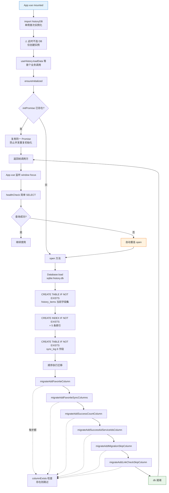
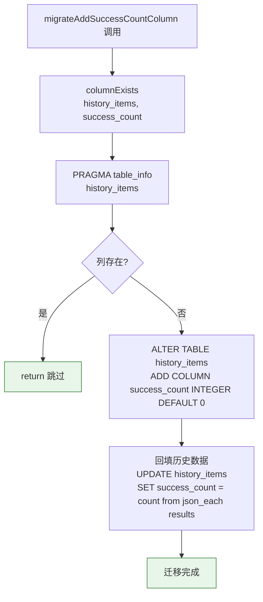
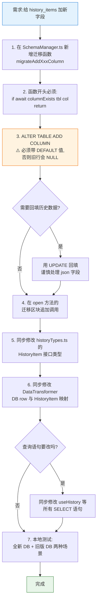
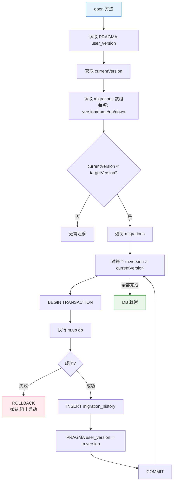

# SQLite Schema 迁移流程

> 历史数据库的初始化、建表、索引以及 schema 演进流程。**新增字段、改索引、处理旧版本用户升级**时优先查看此文档。

## 概览

PicNexus 的 SQLite 数据库由 `@tauri-apps/plugin-sql` 驱动，schema 管理集中在 `src/services/database/SchemaManager.ts`，由 `HistoryDatabase` 初始化时调用。

**当前机制采用"列存在性检查"而非"版本号标记"**:每次 `open()` 顺序执行所有迁移函数,每个函数先用 `columnExists()` 判断列是否存在,存在则跳过,不存在则 `ALTER TABLE` 添加并回填。

> ⚠️ **重要**:这是一个**弱版本机制**。下一节会详细说明其局限性与新增迁移的注意事项。

---

## 图 1:冷启动时的数据库初始化与迁移

展示从 App 挂载到 SQLite 文件就绪的完整路径。**延迟加载**是关键:`historyDB` 单例导入时不连接 DB,首次业务操作才触发。

> **关键源文件**:`src/services/database/HistoryDatabase.ts`、`src/services/database/SchemaManager.ts`、`src/App.vue`



---

## 图 2:当前的"列存在性"迁移模式

展示单个迁移函数的内部逻辑。以 `migrateAddSuccessCountColumn` 为例。

> **关键源文件**:`src/services/database/SchemaManager.ts`



**当前已实现的迁移**:

| 迁移函数 | 添加列 | 回填策略 | 备注 |
|----------|--------|----------|------|
| `migrateAddFavoriteColumn` | `is_favorited BOOLEAN DEFAULT 0` | 无需回填 | - |
| `migrateAddFavoriteSyncColumns` | `favorite_updated_at INTEGER DEFAULT 0`、`favorite_updated_by TEXT` | 仅对已收藏旧记录回填 `timestamp` / `legacy`，未收藏旧记录保持无版本 | - |
| `migrateAddSuccessCountColumn` | `success_count INTEGER DEFAULT 0` | `json_each(results)` 统计成功数 | - |
| `migrateAddSuccessfulServiceIdsColumn` | `successful_service_ids TEXT` | `json_group_array` 从 results 提取 service_id | - |
| `migrateAddMigrationSkipColumn` | `migration_skip INTEGER DEFAULT 0` | 无需回填 | - |
| `migrateAddLinkCheckSkipColumn` | `link_check_skip INTEGER DEFAULT 0` | 无需回填 | - |

---

## 图 3:现有机制的局限性与风险

```mermaid
flowchart LR
    subgraph P[潜在问题]
        P1[❌ 无 schema_version<br/>无法判断用户在哪个版本]
        P2[❌ 无 migration_history 表<br/>不知道哪些迁移跑过]
        P3[❌ 迁移顺序强依赖代码顺序<br/>调换函数调用顺序可能爆炸]
        P4[❌ 不支持 rollback<br/>ALTER TABLE DROP 不幂等]
        P5[❌ 不支持跨大版本迁移<br/>无法"只跑 v3→v4"]
    end

    subgraph S[触发场景]
        S1[用户降级回老版本]
        S2[新迁移依赖前一个迁移的新列]
        S3[数据损坏需要部分回滚]
    end

    S1 --> P1
    S2 --> P3
    S3 --> P4

    style P1 fill:#ffebee,stroke:#c62828
    style P2 fill:#ffebee,stroke:#c62828
    style P3 fill:#ffebee,stroke:#c62828
    style P4 fill:#ffebee,stroke:#c62828
    style P5 fill:#ffebee,stroke:#c62828
```

---

## 图 4:新增迁移的标准流程(当前机制)



---

## 图 5:推荐的版本化迁移演进方向(未实施)

> 📝 **本图是建议,不是现状**。未来如果迁移次数增多或需要支持降级,可以演进成这种版本化机制。



**演进的增量改动**(如果要实施):
- 新增 `migration_history` 表(version, name, applied_at)
- 引入 `migrations: Migration[]` 数组,按 version 排序
- `open()` 改为读 `PRAGMA user_version` 判断起点
- 保留现有列存在性检查作为兜底

---

## 排查指南

| 现象 | 可能原因 | 对照图表位置 |
|------|---------|-------------|
| 启动后历史列表空白 | 数据库文件被删除或损坏,`open` 重新建表但旧数据丢失 | 图1 F1~F4 |
| 首次加载卡顿 | `ensureInitialized` 首次触发,迁移回填大量行 | 图1 G |
| 部分字段前端显示 `undefined` | 迁移 ALTER 没加 DEFAULT,旧行是 NULL | 图4 D |
| 迁移函数抛错整个 app 崩 | 迁移 SQL 语法错 / 列名冲突 | 图2 D |
| 跨窗口数据不一致 | 某个窗口用了缓存,另一个窗口写了 DB,没广播事件 | — |
| 降级回老版本后启动失败 | 老版本代码不认识新加的列 | 图3 P1 |
| `healthCheck` 失败反复重连 | 数据库文件被外部锁定(如 DB 工具打开中) | 图1 L2 |

---

## 相关文档

- [数据持久化](./data-persistence.md) — 数据库的**运行时读写**(本图的下一环)
- [历史记录流程](./history-flow.md) — 上层业务怎么用 DB
- [系统总览](./system-overview.md) — 宏观架构分层
- [IPC 命令层](./ipc-command-flow.md) — `tauri-plugin-sql` 如何与后端连通
