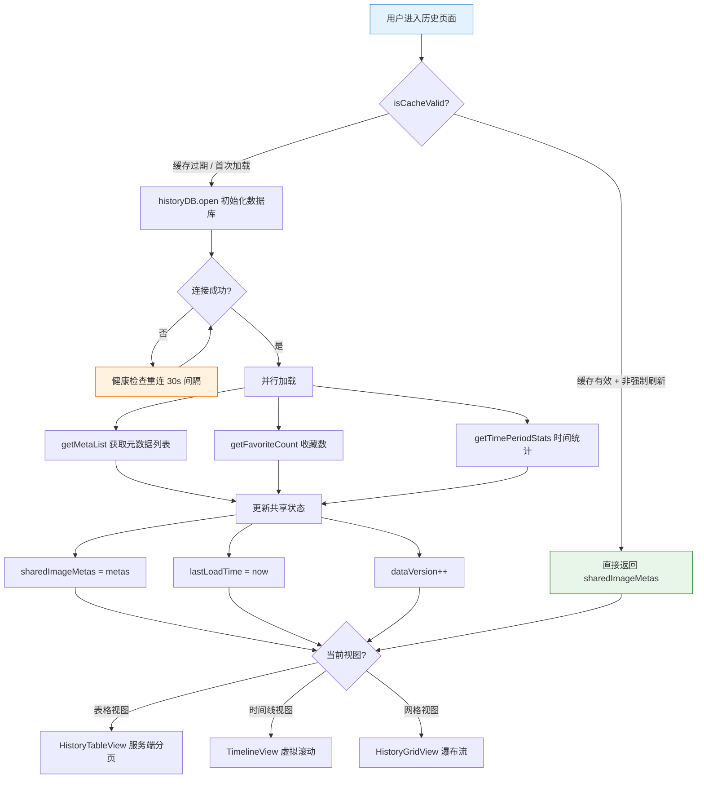
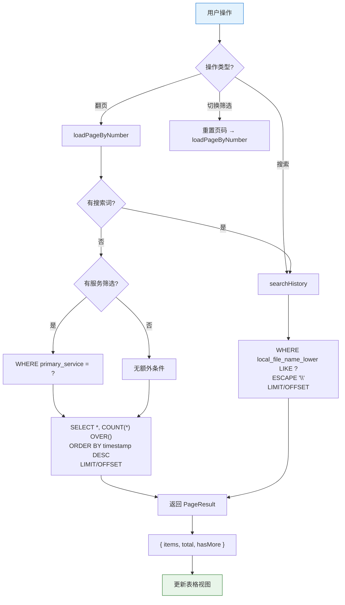
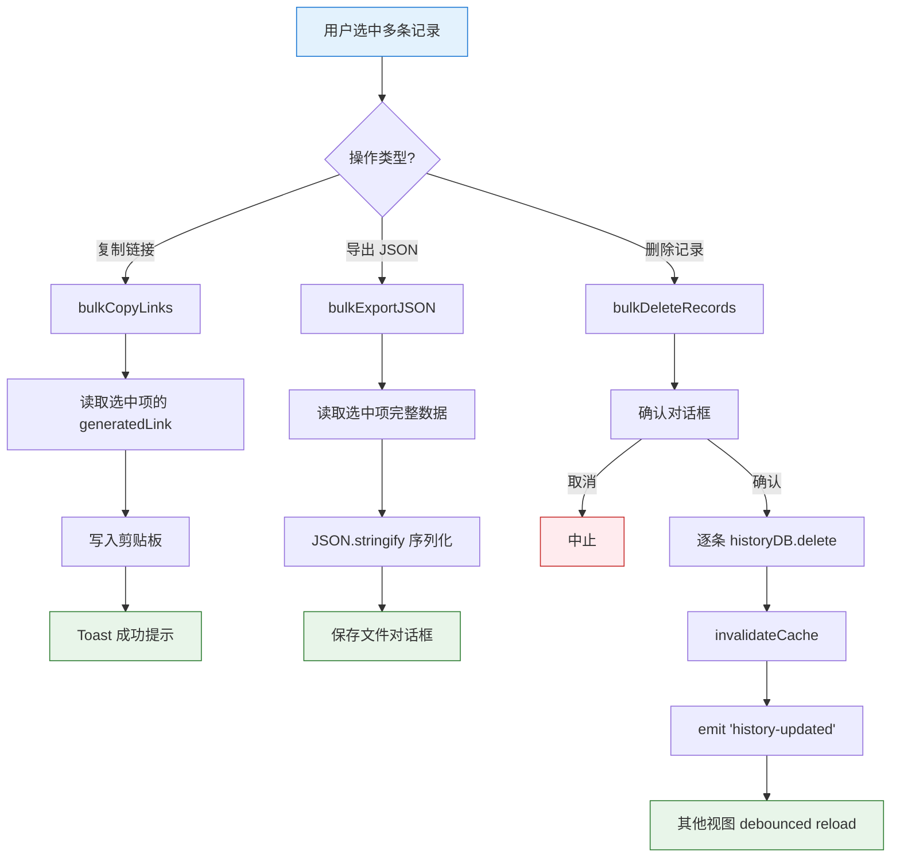

# 历史查询流程

> 历史记录加载、搜索、分页、批量操作的可视化图解。排查搜索无结果、列表不更新、批量操作失败时查看此文档。

---

## 图 1：历史记录加载主流程

展示从用户进入历史页面到数据展示的完整路径。重点关注**5 分钟 TTL 缓存**和**多视图共享状态**两个关键设计。

> **关键源文件**：`src/composables/useHistory.ts`、`src/services/database/HistoryDatabase.ts`

---

## 图 2：搜索与分页流程

展示表格视图的服务端分页和搜索逻辑。排查**搜索无结果**或**分页异常**时查看。

> **关键源文件**：`src/composables/useHistory.ts`、`src/services/database/HistoryDatabase.ts`

---

## 图 3：批量操作流程

展示批量复制链接、导出、删除的执行路径。

> **关键源文件**：`src/composables/useHistory.ts`

---

---

## 收藏视图（独立服务端分页）

收藏视图 **不走** sharedImageMetas 全量路径，而是独立调用 `historyDB.getFavoritesMetaPage({offset, limit, serviceFilter, searchTerm})`，SQL 直接 `WHERE is_favorited=1 ORDER BY timestamp DESC LIMIT ? OFFSET ?`。

- 首页由视图可见性触发（`useLazyLoadOnVisible`），默认每批 80 条
- 滚动至底部 300px 时累积加载下一批
- `favoriteSet` 变化：少量取消（≤5）→ 本地过滤保留 leave 动画；批量（>5）→ 重载首页
- 跨窗口 `history-deleted` / `history-cleared` 事件 → 重载首页
- 灯箱导航到倒数第 3 项时异步触发下一批加载
- Header 徽章读 `totalCount`（SQL COUNT(*) OVER()）而非数组长度

> **关键源文件**：`src/composables/favorites/useFavoritesData.ts`、`src/services/database/HistoryDatabase.ts` 的 `getFavoritesMetaPage`

---

## 缓存机制

| 层级 | 策略 | TTL | 失效条件 |
|------|------|-----|---------|
| 模块级（useHistory） | 共享 shallowRef | 5 分钟 | `isCacheValid()` 失败 / `history-updated` 事件 |
| 详情缓存（useImageDetailCache） | 按条目 LRU | 无限制 | 收藏切换 / 删除 / 清空 |
| 缩略图缓存（useThumbCache） | Blob URL | 会话级 | 组件卸载 |
| 分页状态 | 内存页缓冲 | 临时 | 筛选/搜索条件变化 |

---

## 排查指南

| 现象 | 可能原因 | 对照图表位置 |
|------|---------|-------------|
| 历史记录空白 | 缓存过期但 DB 重连失败 | 图1 节点 E → E1 |
| 搜索无结果 | 搜索词匹配的是 `local_file_name_lower`，不包含 URL | 图2 节点 I |
| 翻页后数据不变 | offset 计算错误或 pageSize 不一致 | 图2 节点 H |
| 删除后列表未更新 | `history-updated` 事件监听未初始化 | 图3 节点 E5 → E6 |
| 时间线视图白屏 | 虚拟滚动的 itemHeight 计算返回 0 | 图1 节点 J |
| 切换视图后数据丢失 | KeepAlive 缓存失效，触发重新加载但缓存已过期 | 图1 节点 B |
| 收藏状态不同步 | `favoriteSet` 更新后未触发视图刷新 | 图1 节点 G |

---

## 相关文档

- [数据持久化流程](./data-persistence.md) — 配置/历史/缩略图的完整数据流
- [同步流程](./sync-flow.md) — 历史记录的 WebDAV 云同步
- [Composables API](../reference/api/composables.md) — useHistory 接口索引
- [模块依赖图](../reference/architecture/dependencies.md) — 修改前查影响范围
- [时间线视图白屏修复](../reference/troubleshooting/timeline-view-switch-blank.md) — KeepAlive 缓存问题
