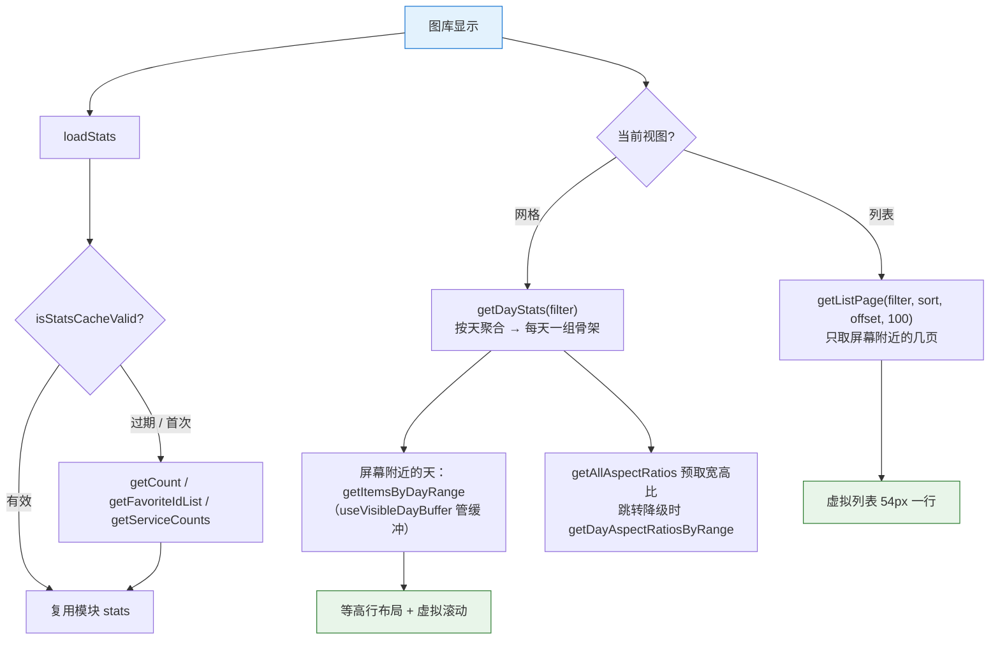
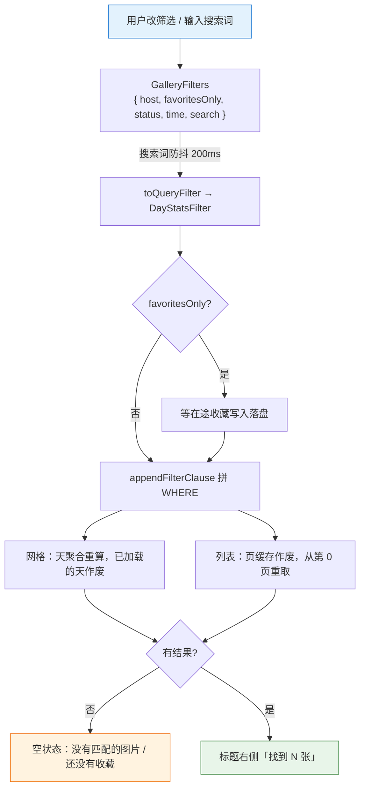
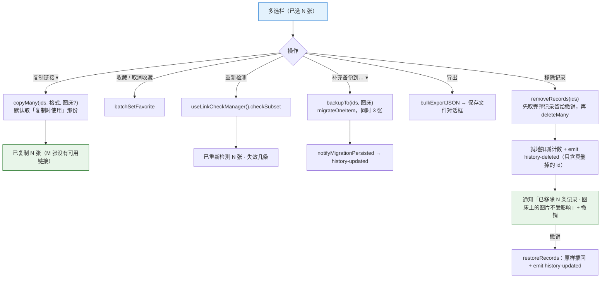

# 历史查询流程（图库）

> 图库（网格 / 列表）读取、筛选、搜索、批量操作的可视化图解。排查图片不显示、筛选结果不对、操作后列表不更新时查看此文档。

---

## 图 1：数据从哪来

`useHistory` 模块级只维护 **stats**（totalCount / favoriteSet / favoriteCount / serviceCounts / timePeriodStats），不全量加载记录。图库的两种视图各自按需查：

- **网格**：`useGalleryGrid` → `useTimelineDayPagination`。先按天聚合（`getDayStats`）画出每天的骨架，再只读屏幕附近那几天的记录（`getItemsByDayRange`，`useVisibleDayBuffer` 管前后缓冲）；等高行布局需要的宽高比先整批预取（`getAllAspectRatios`），量太大时跳过、跳转时按月补取（`getDayAspectRatiosByRange`）。
- **列表**：`useGalleryList` → `getListPage(filter, sort, offset, 100)`，只取屏幕附近的那几页，表头可按上传时间 / 文件名 / 大小排序。

两种视图用同一份筛选（图 2）。模块 stats 有 5 分钟 TTL，图库每次显示时 `loadStats()`，`history-updated` 事件 / `invalidateCache()` 让它失效。

> **关键源文件**：`src/composables/history/useHistory.ts`、`src/views/gallery/useGalleryGrid.ts`、`src/composables/timeline/useTimelineDayPagination.ts`、`src/views/gallery/useGalleryList.ts`、`src/services/database/TimelineQueryService.ts`

```mermaid
flowchart TD
    A[图库显示] --> B[loadStats]
    B --> B1{isStatsCacheValid?}
    B1 -- 有效 --> C[复用模块 stats]
    B1 -- 过期 / 首次 --> D["getCount / getFavoriteIdList / getServiceCounts"]
    D --> C

    A --> V{当前视图?}
    V -- 网格 --> G1["getDayStats(filter)\n按天聚合 → 每天一组骨架"]
    G1 --> G2["屏幕附近的天：getItemsByDayRange\n（useVisibleDayBuffer 管缓冲）"]
    G1 --> G3["getAllAspectRatios 预取宽高比\n跳转降级时 getDayAspectRatiosByRange"]
    G2 --> G4[等高行布局 + 虚拟滚动]
    V -- 列表 --> L1["getListPage(filter, sort, offset, 100)\n只取屏幕附近的几页"]
    L1 --> L2[虚拟列表 54px 一行]

    style A fill:#e3f2fd,stroke:#1976d2
    style G4 fill:#e8f5e9,stroke:#2e7d32
    style L2 fill:#e8f5e9,stroke:#2e7d32
```

---

## 图 2：筛选与搜索

工具栏的筛选（`GalleryFilters`）经 `toQueryFilter` 换成 `DayStatsFilter`，再由 `TimelineQueryService` 的 `appendFilterClause` 拼进每一条图库查询（网格的天聚合 / 按天取记录 / 宽高比，列表的分页）。

| 筛选 | 查询条件 |
|------|---------|
| 图床 | 这个图床上有成功的一份：`EXISTS (json_each(successful_service_ids) = 图床)` |
| ★ 收藏 | `is_favorited = 1`；查询前先等在途的收藏写入落盘（见下文「读己之写」） |
| 状态 | 失效 / 可能受限 / 尚未检测 = 「复制时使用」那份（`primary_service`）在 `link_check_status` 里的检测结果；仅 1 份 = `success_count = 1`；多选之间是「或」 |
| 时间 | `timestamp >= since`（最近 7 天 / 最近 30 天 / 今年 1 月 1 日起） |
| 搜索 | 只搜文件名：`local_file_name_lower LIKE %词% ESCAPE '\'`；输入后 200ms 才查 |

**读己之写**：点星标是「先乐观改 favoriteSet、后写盘」，而 tauri-plugin-sql 的连接池对读写不排队（WAL 下 SELECT 读提交前快照）。所以带「★ 收藏」筛选的图库查询，以及 `getFavoriteIdList` / `getFavoriteCount`，入口都先等在途收藏写入（`HistoryDatabase.pendingFavoriteWrites`）落盘再查。

> **关键源文件**：`src/views/gallery/galleryFilters.ts`、`src/services/database/TimelineQueryService.ts`、`src/services/database/HistoryDatabase.ts`

```mermaid
flowchart TD
    A[用户改筛选 / 输入搜索词] --> B["GalleryFilters\n{ host, favoritesOnly, status, time, search }"]
    B -- 搜索词防抖 200ms --> C["toQueryFilter → DayStatsFilter"]
    C --> D{favoritesOnly?}
    D -- 是 --> D1[等在途收藏写入落盘]
    D -- 否 --> E
    D1 --> E["appendFilterClause 拼 WHERE"]
    E --> F1[网格：天聚合重算，已加载的天作废]
    E --> F2[列表：页缓存作废，从第 0 页重取]
    F1 & F2 --> G{有结果?}
    G -- 否 --> G1["空状态：没有匹配的图片 / 还没有收藏"]
    G -- 是 --> G2["标题右侧「找到 N 张」"]

    style A fill:#e3f2fd,stroke:#1976d2
    style G2 fill:#e8f5e9,stroke:#2e7d32
    style G1 fill:#fff3e0,stroke:#ef6c00
```

---

## 图 3：批量操作（多选栏）

选中图片后，底部多选栏的操作都在 `src/views/gallery/useGalleryActions.ts`（导出与记录增删在 `useHistory`）。结果都报数字（「已复制 N 张」「N 张未能备份到…」）。

```mermaid
flowchart TD
    A["多选栏（已选 N 张）"] --> B{操作}

    B -- 复制链接 ▾ --> C["copyMany(ids, 格式, 图床?)\n默认取「复制时使用」那份"]
    C --> C1["已复制 N 张（M 张没有可用链接）"]

    B -- 收藏 / 取消收藏 --> D[batchSetFavorite]

    B -- 重新检测 --> E["useLinkCheckManager().checkSubset"]
    E --> E1["已重新检测 N 张 · 失效几条"]

    B -- 补充备份到… ▾ --> F["backupTo(ids, 图床)\nmigrateOneItem，同时 3 张"]
    F --> F1["notifyMigrationPersisted → history-updated"]

    B -- 导出 --> G["bulkExportJSON → 保存文件对话框"]

    B -- 移除记录 --> H["removeRecords(ids)\n先取完整记录留给撤销，再 deleteMany"]
    H --> H1["就地扣减计数 + emit history-deleted（只含真删掉的 id）"]
    H1 --> H2["通知「已移除 N 条记录 · 图床上的图片不受影响」+ 撤销"]
    H2 -- 撤销 --> H3["restoreRecords：原样插回 + emit history-updated"]

    style A fill:#e3f2fd,stroke:#1976d2
    style C1 fill:#e8f5e9,stroke:#2e7d32
    style H2 fill:#e8f5e9,stroke:#2e7d32
```

「移除记录」不弹确认，靠通知里的「撤销」反悔；只删本地记录，图床上的图片不动。

---

## 记录变化后视图怎么刷新

| 事件 | 网格（useTimelineDayPagination） | 列表（useGalleryList） | 模块 stats（useHistory） |
|------|------|------|------|
| `history-updated`（上传、重试、补充备份、撤销移除） | `reloadAll`：新的天以骨架进入，已加载的天不闪 | 页缓存作废重取 | 防抖 300ms 后重查 |
| `history-deleted` | `removeItemsByIds` 增量去掉；有 id 不在已加载的天里时兜底 `reloadAll` | 页缓存作废重取 | 本窗口删的已就地扣减，跳过；别的窗口删的按 ids 扣减 |
| `history-cleared` | `reloadAll` | 页缓存作废重取 | 清零 |
| 点星标 | 不重查，格子上的星标跟着 favoriteSet 变 | 同左 | favoriteSet 乐观更新，写盘失败回滚 |

---

## 缓存机制

| 层级 | 策略 | TTL | 失效条件 |
|------|------|-----|---------|
| 模块级 stats（useHistory） | totalCount + favoriteSet + serviceCounts + timePeriodStats | 5 分钟 | `isStatsCacheValid()` 失败 / `history-updated` 事件 / `invalidateCache()`；删除 / 清空路径就地扣减计数并重查 timePeriodStats（`refreshTimePeriodStats`） |
| 详情缓存（useImageDetailCache） | 按条目 LRU | 无限制 | 收藏切换 / 删除 / 清空 |
| 按天缓存（useTimelineDayPagination 的 dayMetaCache） | 已加载天的 ImageMeta | 页面存活期 | 筛选变化、`history-*` 事件 |
| 列表页缓存（useGalleryList） | 已取的页（每页 100 行） | 页面存活期 | 筛选 / 排序变化、`history-*` 事件 |
| 候选列表缓存 · HistoryItem 版（`thumbnailCandidatesCache`） | 按 `item.id` 的 Map，上限 500 | 会话级 | `history-updated/deleted/cleared` 事件 + 前缀 / 知乎配置 watch（**注册于 `useThumbCache()` 首次调用，目前只有图库灯箱会触发**） |
| 候选列表缓存 · ImageMeta 版（`metaCandidatesCache`） | 以 meta 对象为键的 WeakMap | 随 meta 对象被 GC | 换新 meta 对象（镜像变化后重查 DB）或配置指纹变化；**不接事件、不受上一行的 watch 影响** |

---

## 排查指南

| 现象 | 可能原因 | 对照图表位置 |
|------|---------|-------------|
| 图库空白、计数为 0 | 数据库没连上（`historyDB.open` 失败），或 `loadStats` 报错 | 图 1 节点 B / D |
| 一整天只有灰色占位块 | 那一天的记录没读回来：`getItemsByDayRange` 报错，或可见天缓冲没触发 | 图 1 节点 G2 |
| 搜索无结果 | 搜索只匹配文件名（`local_file_name_lower`），不包含链接 | 图 2 搜索一行 |
| 状态筛选「失效」漏了图 | 判的是「复制时使用」那份的检测结果；备份失效、复制来源正常的不算 | 图 2 状态一行 |
| 刚点了星标，打开「★ 收藏」却没有它 | 查询没等在途收藏写入：检查 `pendingFavoriteWrites` 的注册是否在写方法入口同步完成、查询是否走了 `dbForFilter` | 图 2「读己之写」 |
| 移除记录后列表没更新 | `history-deleted` 事件监听没挂上 | 记录变化表 |
| 移除后通知条数与选中数不符 | 部分记录已被别处删掉，按实际删除数上报是契约行为 | 图 3 节点 H1 |
| `jumpToMonth` 对某月份的判断与刻度条不一致 | 刻度条来自 `dayStats` 聚合，`jumpToMonth` 校验的是 `sharedTimePeriodStats`；删除 / 清空路径需触发 `refreshTimePeriodStats` | 缓存机制第 1 行 |
| 拖动刻度条停下后画面停在别的月份 | `useTimelineJump` 跳转中的请求只留最后一个、落地后接着跳；检查是否被改回了「跳转中直接丢弃」 | 图 1 网格 |
| 切回图库后数据丢失 | KeepAlive 缓存失效后重新加载，但 stats 缓存已过期 | 图 1 节点 B1 |

---

## 相关文档

- [数据持久化流程](./data-persistence.md) — 配置 / 历史 / 缩略图的完整数据流
- [多图床镜像与切换](./mirror-fallback-flow.md) — 详情面板里的「改用」「移除这条链接」
- [同步流程](./sync-flow.md) — 历史记录的 WebDAV 云同步
- [Composables API](../reference/api/composables.md) — useHistory 接口索引
- [模块依赖图](../reference/architecture/dependencies.md) — 修改前查影响范围
- [图库占位策略](../reference/troubleshooting/timeline-view-switch-blank.md) — 冷启动骨架、按天占位、跳转
