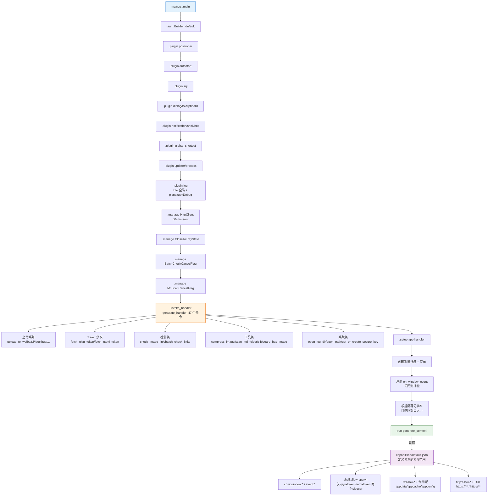

# Tauri IPC 命令层流程

> 前后端通过 Tauri Command + Event 的调用链路。新增命令、改入参/返回值、处理错误映射、订阅进度事件时优先查看此文档。

## 概览

PicNexus 后端目前注册了 **47 个 `#[tauri::command]`**(上传器、Token 获取、链接检测、MD 扫描、剪贴板、图片压缩、配置、日志路径等),前端通过 `invoke<T>(name, args)` 调用,长耗时任务用 `window.emit("xxx://progress")` 推送进度,前端 `listen<T>(name, handler)` 订阅。

错误统一走 `AppError` 枚举,序列化为 `{ type, data }` 结构,前端 `try/catch` 捕获后按 `type` 分支处理。

---

## 图 1:命令注册与初始化链路

展示 Tauri `Builder` 如何把「插件 → 全局状态 → 命令 → setup 回调」串成一条启动链。新增命令时重点关注 L145~L203 的 `generate_handler![]` 宏。

> **关键源文件**:`src-tauri/src/main.rs`(L99~L315)、`src-tauri/Cargo.toml`、`src-tauri/capabilities/default.json`



---

## 图 2:单次命令调用完整数据流

展示前端一次 `invoke()` 到后端 `Result` 返回的完整链路,包含**参数序列化**、**错误映射**和**进度事件并发推送**三个关键点。

> **关键源文件**:`src-tauri/src/commands/upload.rs`(upload_file_stream L167)、`src-tauri/src/error.rs`(AppError L10~L56)、各前端 `composables/`

```mermaid
sequenceDiagram
    participant VUE as Vue 组件
    participant API as @tauri-apps/api
    participant IPC as Tauri IPC Bridge
    participant CMD as #[tauri::command]
    participant STATE as State&lt;T&gt;
    participant EXT as 外部服务<br/>HTTP/FFI/sidecar
    participant WIN as Window.emit

    Note over VUE,WIN: —— 调用阶段 ——

    VUE->>API: invoke&lt;T&gt;("upload_file_stream", {<br/>id, filePath, weiboCookie})
    API->>API: 参数自动 camelCase → snake_case
    API->>IPC: 序列化 JSON

    IPC->>IPC: 权限校验<br/>capabilities/default.json
    alt 权限不足
        IPC-->>API: 拒绝
        API-->>VUE: Error("not allowed")
    end

    IPC->>CMD: 反射调用 rust 函数

    CMD->>STATE: 从 State&lt;HttpClient&gt; 取出共享客户端
    STATE-->>CMD: 返回 reqwest::Client 引用

    Note over CMD,WIN: —— 执行阶段(含进度推送) ——

    par 任务执行
        CMD->>EXT: 发起 HTTP 请求
    and 进度并发推送
        loop 每 N 字节
            CMD->>WIN: emit("upload://progress", {<br/>id, progress, total, step,<br/>step_index, total_steps})
            WIN-->>VUE: listen 回调触发<br/>Vue reactivity 更新 UI
        end
    end

    EXT-->>CMD: HTTP 响应

    Note over VUE,WIN: —— 返回阶段 ——

    alt 成功
        CMD-->>IPC: Ok(UploadResponse)
        IPC-->>API: JSON 序列化
        API-->>VUE: resolve(result)
    else 失败
        CMD-->>IPC: Err(AppError::Upload {<br/>service, code, message})
        Note over IPC: AppError 自动 serde<br/>#[serde(tag="type", content="data")]
        IPC-->>API: JSON 格式:<br/>{ type: "UPLOAD", data: {...} }
        API-->>VUE: reject(json 字符串)
        VUE->>VUE: try/catch 捕获<br/>按 err.type 分支提示
    end
```

---

## 图 3:AppError 错误类型映射与前端处理

展示**后端错误 → 前端 Toast** 的完整映射。新增错误类型时,需要同时改 Rust `AppError` 枚举和前端的错误分支。

> **关键源文件**:`src-tauri/src/error.rs`、`src/utils/errorHandler.ts`(或各 composable 的 try/catch)

```mermaid
flowchart LR
    %% Rust 侧错误源
    subgraph Rust[Rust 后端错误源]
        R1[reqwest::Error<br/>网络失败/超时]
        R2[std::io::Error<br/>文件读写]
        R3[serde_json::Error<br/>反序列化]
        R4[业务逻辑手动构造]
    end

    %% From trait 转换
    R1 -- From::from --> E1
    R2 -- From::from --> E2
    R3 -- From::from --> E3
    R4 --> E4 & E5 & E6 & E7 & E8

    %% AppError 枚举
    subgraph AppError[AppError 枚举<br/>#[serde tag=type content=data]]
        E1[Network<br/>message]
        E2[FileIo<br/>message]
        E3[Validation<br/>message]
        E4[Upload<br/>service/code/message]
        E5[Auth<br/>message]
        E6[Config<br/>message]
        E7[WebDAV/Storage/<br/>Clipboard/External]
        E8[Validation<br/>参数非法]
    end

    %% 序列化
    E1 & E2 & E3 & E4 & E5 & E6 & E7 & E8 -- serde --> J[JSON: type + data]

    %% 前端处理
    J -- invoke reject --> F[前端 try/catch]
    F --> F1{err.type?}
    F1 -- NETWORK --> T1[Toast: 网络不可用]
    F1 -- AUTH --> T2[Toast: 登录态失效<br/>跳转 Cookie 登录]
    F1 -- UPLOAD --> T3[Toast: 图床 X 失败<br/>code Y]
    F1 -- FILE_IO --> T4[Toast: 文件读写失败]
    F1 -- 其他 --> T5[Toast: 通用错误]

    style Rust fill:#fff3e0,stroke:#ef6c00
    style AppError fill:#e8f5e9,stroke:#2e7d32
    style F fill:#e3f2fd,stroke:#1976d2
```

---

## 图 4:事件系统命名规范与订阅时序

展示**长耗时任务**如何通过事件推送进度,以及前端 `listen()` 的生命周期管理(避免内存泄漏)。

> **事件命名规律**:`{feature}://{action}`,双冒号分隔符

| 事件名 | Payload | 发送位置 | 订阅位置 |
|--------|---------|----------|----------|
| `upload://progress` | `{id, progress, total, step, step_index, total_steps}` | 各 upload_to_* 命令 | `useUpload.ts` |
| `link-check://progress` | `{checked, total, current_url, current_result}` | `batch_check_links` | `useLinkCheck.ts` |
| `md-scan://progress` | `{scanned, total, current_file}` | `scan_md_folder` | `useMdScan.ts` |
| `config-updated` | `{timestamp}` | `useConfig.saveConfig` | 所有需要响应配置变更的 composable |
| `navigate-to` | `string`(路由标识) | 托盘菜单 / macOS 菜单栏 | `App.vue` |

```mermaid
sequenceDiagram
    participant C as Vue Composable
    participant L as tauri event listen
    participant B as Rust 后端
    participant W as Window.emit

    C->>L: const unlisten = await listen&lt;T&gt;(<br/>"xxx://progress", handler)
    L-->>C: 返回 unlisten 函数

    Note over C: 保存 unlisten 到 onUnmounted

    C->>B: invoke("batch_check_links", ...)

    loop 长耗时任务执行
        B->>W: window.emit("link-check://progress", payload)
        W->>L: 广播事件
        L->>C: handler(event.payload)
        C->>C: 更新响应式 ref → UI
    end

    B-->>C: invoke 返回最终结果

    Note over C: 组件卸载
    C->>L: unlisten() 解除监听
    L->>W: 释放事件通道

    Note over C,W: ⚠️ 忘记 unlisten 会导致:<br/>1. 组件重复挂载时多套回调<br/>2. 旧会话进度污染新会话
```

---

## 新增 Command 的标准流程

```mermaid
flowchart TD
    A[新增需求:需要后端实现 X] --> B[1. 新建 src-tauri/src/commands/x.rs]
    B --> C[2. 定义函数:<br/>#[tauri::command]<br/>pub async fn x_foo(...) -> Result<T, AppError>]
    C --> D{需要全局状态?}
    D -- 是 --> D1[参数加 State&lt;HttpClient&gt;]
    D -- 否 --> E
    D1 --> E
    E{需要发事件?}
    E -- 是 --> E1[参数加 window: Window<br/>用 window.emit]
    E -- 否 --> F
    E1 --> F
    F[3. 在 commands/mod.rs 导出]
    F --> G[4. main.rs 的 generate_handler!<br/>加入新命令名]
    G --> H{需要新权限?<br/>shell / fs 作用域等}
    H -- 是 --> H1[修改 capabilities/default.json]
    H -- 否 --> I
    H1 --> I
    I[5. 前端用 invoke&lt;T&gt; 调用]
    I --> J[6. 如需事件订阅,<br/>用 listen + onUnmounted 清理]
    J --> K[7. try/catch 按 AppError.type 分支处理]

    style A fill:#e3f2fd,stroke:#1976d2
    style K fill:#e8f5e9,stroke:#2e7d32
```

---

## 排查指南

| 现象 | 可能原因 | 对照图表位置 |
|------|---------|-------------|
| 前端 `invoke` 抛 "not allowed" | `capabilities/default.json` 未声明权限 | 图1 CAP 节点 |
| 前端 `invoke` 抛 "command xxx not found" | `generate_handler!` 宏没加入新命令名 | 图1 H 节点 |
| 前端收不到进度事件 | 没 `listen` 或 Payload 字段命名不匹配 (snake_case vs camelCase) | 图4 |
| 进度事件到错误组件 | 上次的 `unlisten` 没调用,旧监听残留 | 图4 末尾提示 |
| 错误 Toast 显示 `[object Object]` | 前端直接打印了 `err`,没解析 JSON | 图3 F 节点 |
| `State<HttpClient>` 获取失败 | `main.rs` 里 `.manage(HttpClient(...))` 调用缺失 | 图1 M1 节点 |
| 命令返回值前端收到 `undefined` | Rust 侧返回了 `()` 或字段没加 `#[serde]` | 图2 返回阶段 |
| Sidecar 命令报权限错误 | `shell:allow-spawn` 没配置该 sidecar 名 | 图1 CAP2 节点 |

---

## 相关文档

- [系统总览](./system-overview.md) — 宏观架构分层
- [上传流程](./upload-flow.md) — 最密集使用 IPC 的功能
- [链接检查](./link-check-flow.md) — `batch_check_links` 事件订阅样例
- [日志与诊断](./logger-diagnostics-flow.md) — `tauri-plugin-log` 如何集成
- [API 接口规范](../reference/api/) — 各 command 的入参/返回值详表
