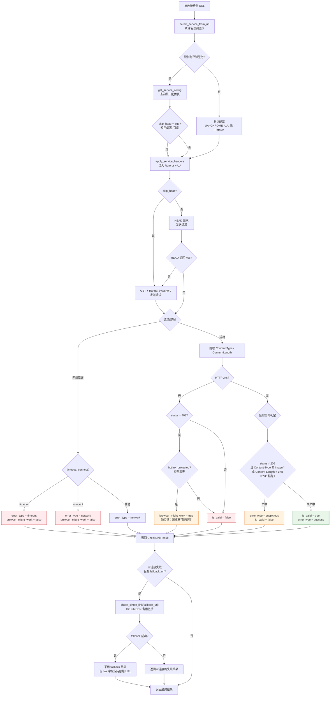
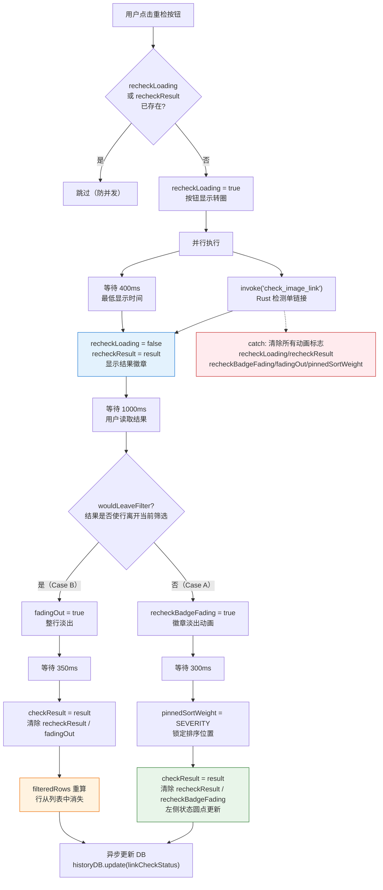
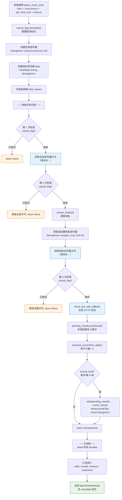
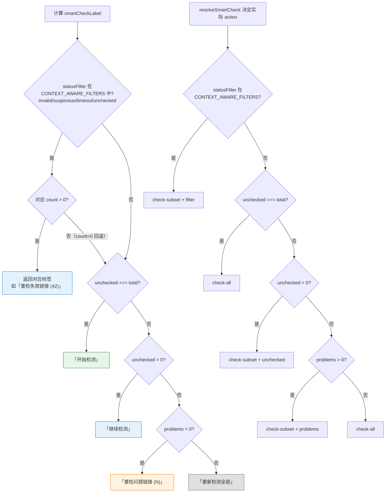
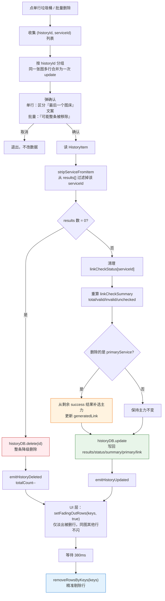

# 链接检测流程（深度展开）

> 链接检测的深层机制图解：服务感知请求、并发控制、单条重检动画、智能策略决策。
> 基础检测主流程见 [auxiliary-flows.md 图 11](./auxiliary-flows.md#图-11链接检测流程)，本文档是其深度展开。

---

## 图 1：服务感知请求流程

展示 Rust 后端 `check_single_link` 中从 URL 到最终判定的完整决策路径。排查「微博返回 403 但浏览器能看」「200 却标记为疑似」等问题时查看。

> **关键源文件**：`src-tauri/src/commands/link_checker.rs`（`detect_service_from_url`、`get_service_config`、`apply_service_headers`、`check_single_link`、`check_link_with_fallback`）

### 图床服务配置表

| 服务 ID | 域名匹配规则 | Referer | skip_head | hotlink_protected |
|---------|-------------|---------|-----------|-------------------|
| weibo | `*.sinaimg.cn` | `https://weibo.com/` | false | true |
| bilibili | `*.hdslb.com` | `https://mall.bilibili.com/` | false | true |
| jd | `*.360buyimg.com` | `https://jdcs.jd.com/...` | false | true |
| zhihu | `*.zhimg.com` | `https://www.zhihu.com/` | **true** | true |
| chaoxing | `*.chaoxing.com` | `https://notice.chaoxing.com/` | **true** | true |
| nowcoder | `*.nowcoder.com` | `https://www.nowcoder.com/...` | false | true |
| baidu | `image.baidu.com` | 无 | **true** | false |
| github | `raw.githubusercontent.com` 等 | 无 | false | false |
| imgur | `i.imgur.com` | 无 | false | false |
| oss | `*.aliyuncs.com` | 无 | false | false |
| cos | `*.myqcloud.com` | 无 | false | false |
| qiniu | `*.qiniudn.com` / `*.qnssl.com` / `*.qbox.me` | 无 | false | false |
| smms | `*.smms.app` / `i.loli.net` / `vip2.loli.io` | 无 | false | false |
| nami | `*.nami.observer` | 无 | false | false |

---

## 图 2：单条重检动画状态机

展示 `recheckSingle` 中从用户点击到行状态最终更新的完整时序。排查「重检后行闪烁」「行莫名消失」「徽章不消失」时查看。

> **关键源文件**：`src/composables/link-check/useLinkCheck.ts`（`recheckSingle`、`wouldLeaveFilter`、`updateRow`）

### wouldLeaveFilter 判定规则

| 当前筛选 | 结果为有效 | 结果为失效 | 结果为超时 | 结果为疑似 |
|---------|-----------|-----------|-----------|-----------|
| `all` | 留 | 留 | 留 | 留 |
| `null`（默认=问题链接） | **离开** | 留 | 留 | 留 |
| `unchecked` | **离开** | **离开** | **离开** | **离开** |
| `valid` | 留 | **离开** | **离开** | **离开** |
| `invalid` | **离开** | 留 | **离开** | **离开** |
| `timeout` | **离开** | **离开** | 留 | **离开** |
| `suspicious` | **离开** | **离开** | **离开** | 留 |

---

## 图 3：批量检测并发控制

展示 Rust `batch_check_links` 引擎内部的二级信号量机制。排查「检测速度异常慢」「某个图床被限速」「取消后仍有检测在跑」时查看。

> **关键源文件**：`src-tauri/src/commands/link_checker.rs`（`batch_check_links`、`cancel_batch_check`、`extract_host`）

### 并发参数说明

| 参数 | 默认值 | 范围 | 说明 |
|------|-------|------|------|
| `concurrency` | 10 | 1-50 | 全局最大并发数（tokio 信号量） |
| `per_host_limit` | 3 | 1-10 | 单域名最大并发（防止刷爆单图床） |
| `timeout_secs` | 10 | 3-30 | 单链接超时秒数 |

**为什么需要三次取消检查？**
- 第 1 次：任务开始前，避免无意义的信号量竞争
- 第 2 次：拿到全局许可后、域名许可前，快速释放资源
- 第 3 次：拿到双重许可后、发 HTTP 前，避免已取消仍发请求

### 暂停 / 恢复：轮询语义

`BatchCheckPauseFlag`（`AtomicBool`）与 `BatchCheckCancelFlag` 并行管理。三次取消检查点实际调用的是复合辅助函数 `await_resume_or_cancel(pause, cancel)`：

1. 循环：`while pause=true && cancel=false { sleep 100ms }`
2. 退出后返回 `cancel.load()` —— **true 则任务立即 `return None`**（cancel 优先 pause）

**关键不变量**：
- 暂停期间任务仍持有 semaphore permit（全局 + 域名），保证恢复后原地复工而非重新排队
- cancel 能"穿透"pause——已暂停的任务收到取消不会被 pause flag 阻塞
- HTTP 在途的请求无法中断（reqwest 不暴露 abort），暂停只影响尚未进入 HTTP 阶段的任务；正在下载的任务会完成后自然退出

**相关 command**：`pause_batch_check` / `resume_batch_check`（仅翻转 flag，不做其他工作）

### 实时反馈：进度事件携带批量结果

`BatchCheckProgress` 除 `checked` / `total` / `current_url` 外，还带 `recent_results: Vec<BatchCheckItemResult>` —— 自上次广播以来累积的逐条结果。

- **Rust 端**：每个任务完成后将 `BatchCheckItemResult` 推入 `pending_results` 缓冲（Mutex<Vec>）；触发节流广播时 `std::mem::take` 整批 drain 出来塞入 payload。事件频率仍由 `PROGRESS_EMIT_EVERY_N`（默认 10）控制，单次 IPC 数量不增加。
- **前端端**：`useLinkCheck` 在 `link-check://progress` 回调里调用 `applyRecentResults`，按 `${url}::${historyId}` 用 `rowIndexMap` 做 O(1) 定位，对命中行 mutate `checkResult` 后通过 `createRafScheduler()` 把"换数组引用"动作（`checkRows.value = checkRows.value.slice()`）合并到下一帧执行——同帧多次 mutation 只触发一次重渲染，跨过 `HistoryCheckPanel` 的 prop 边界唤醒下游 computed。
- **行级过渡（hold-with-fade）**：每条 mutation 同时打 `recentlyCompletedAt = Date.now()` 时间戳，并加入 `rowsInHold` Set。`liveFilter` 在「未检测」tab 内特别保留 `recentlyCompletedAt !== undefined` 的行，让用户能看到"灰点变绿/红"的状态变化。一个 250ms 间隔的 sweep interval 扫过 `rowsInHold`，到 `HOLD_MS=2000` 后清零时间戳→liveFilter 自然把它过滤掉→`<TransitionGroup name="row-list">` 走 leave 动画淡出（`opacity` 300ms + `position:absolute` 让下方行平滑上移）。目标 tab（valid/invalid 等）没有 hold 概念，新结果命中 matchesStatusFilter 立即出现。
- **取消时立即归位**：`cancelCheck` 调 `clearAllHolds()` 把所有 recentlyCompletedAt 清零，残留过渡态行 ≤ 一帧内全部归位，不再拖 2s。
- **Vue 3 同值跳过陷阱（历史教训）**：早期实现用 `lockedFilteredRows` 在检测期间冻结整个 filteredRows；Vue 3 的 `refreshComputed` 在 `hasChanged(newValue, oldValue)` 返回 false 时**不会**bump dep version，下游 visibleRows 收不到通知，即使 filteredRows 被标脏也不会重算——表现为"行级状态不更新，翻页才看到"。改为 hold-with-fade 后，每次 liveFilter 都返回 `.slice().sort()` 的新数组引用，hasChanged 总是 true，下游正常传播。

**为什么这样设计反馈节奏**：
- 2000ms hold 让用户"看清"新状态（dot 变色 + 徽章），低于这个时长容易看不清就消失了
- 300ms 淡出对应 `--duration-medium`，与项目其他过渡保持一致
- 高速场景（59/s）下，同一帧的多条 mutation 共享几乎相同的时间戳→2000ms 后整批同步淡出，节奏稳定不会一闪一闪
- 不引入额外动画噱头，符合"动效只在传递空间关系时才加"的设计原则——TransitionGroup 的 leave + move 传递的是"行进出列表"的空间关系，是必要的
- **flush 时机**：检测结束（成功/取消/出错）走 `finalizeCheck`，里面调 `scheduler.flush()` 强制落地最后一批 mutation，避免还在 rAF 队列时就被 `applyResultsToRows` 的全量重赋值覆盖。

**为什么这样设计**：单纯 `triggerRef(checkRows)` 在同作用域有效，但跨组件 prop 时 Vue 走引用比对——同一数组引用 = prop 没变 = 子组件不重渲染。早期实现踩过这个坑（chips/行徽章僵死），改成数组引用替换 + rAF 节流后才真正实时。冻结可见集合是为了"用户体验稳定"——失效行检测变绿时不应该当场消失，让用户能持续看到刚才在看的那批数据。

**与批量迁移共享实现**：[utils/rafScheduler.ts](../../src/utils/rafScheduler.ts) 提供通用 `createRafScheduler`，被 [composables/batchMigrate/rafThrottle.ts](../../src/composables/batchMigrate/rafThrottle.ts) 与 [composables/link-check/useLinkCheck.ts](../../src/composables/link-check/useLinkCheck.ts) 共用。任何"高频 shallowRef 数组刷新 → 跨 prop 边界生效"的场景都应优先复用。

### 进度反馈：速率 / ETA / 失速预警

逐行 dot 变色由于 per-host 限速 + 锁定快照排序，单看一屏感知不到检测在动；底栏聚合的数字反馈才是"系统是否活跃"的可靠锚点。

> **关键源文件**：[useCheckStats.ts](../../src/composables/link-check/useCheckStats.ts)（`progressRate` / `etaSeconds` / `stalled` / `rateLabel` / `etaLabel`）、[CheckBottomBar.vue](../../src/components/views/linkcheck/history-check/CheckBottomBar.vue)

| 字段 | 含义 | 计算方式 |
|------|------|---------|
| `progressRate` | 平滑后的检测速率（条/秒） | EWMA：每次 progress 事件取 `(Δchecked / Δt)` 做指数加权移动平均，α=0.3 |
| `etaSeconds` | 预估剩余秒数 | `(total - checked) / progressRate`；速率为 0 时为 null |
| `stalled` | 失速标志 | 每次 progress 事件重置 `setTimeout(10s)`，超时未刷新则置 true |
| `rateLabel` | 紧凑文字 | `>=10` 显示整数 `18/s`；`<10` 显示一位小数 `2.4/s` |
| `etaLabel` | 紧凑文字 | `<60s` → `45s`；`<60min` → `26m`；否则 `1h26m` |

**为什么聚合到底栏而非逐行**：
1. 用户的核心问题是"系统在干活吗 + 还要多久"，速率和 ETA 一并直答
2. 速率为 0 比"逐行 spinner 不动" 更早暴露真正的卡死（HTTP 全部 timeout 等场景）
3. 失速预警把 per-host 限流的副作用显式化——"在等微博等慢域名"，消除卡死焦虑
4. 不引入动画噱头，符合"动效只在传递空间关系时才加"的设计原则

**何时清零**：检测结束/取消时 `progress.value = null`（[useLinkCheck.ts](../../src/composables/link-check/useLinkCheck.ts)），watcher 重置所有派生状态；下次开检从首次 progress 事件重新建立基线。

---

## 图 4：智能检测策略决策

展示 `useCheckStrategy` 中检测主按钮的动态决策逻辑。开发者修改检测入口 UI 时参考。

> **关键源文件**：`src/composables/link-check/useCheckStrategy.ts`（`smartCheckLabel`、`resolveSmartCheck`）
>
> **设计决策**：检测主按钮是唯一入口，没有"检测全部 / 重检问题链接"等下拉备选。要重检某一类问题链接，先点顶部 chip 切到对应筛选 tab，主按钮的 label 与 action 会自动适配。

---

## 图 5：按行精准删除（per-link 删除语义）

展示链接检测视图中"删除一行"的数据层行为。链接检测列表的逻辑单位是**单个图床链接**（一张图如果上传到 N 个图床，会展开成 N 行），因此删除操作必须精准到 `(historyId, serviceId)`，而不是整条 `HistoryItem`。

> **关键源文件**：`src/composables/history/useHistoryResultOps.ts`（`deleteHistoryResult`、`bulkDeleteHistoryResults`、`stripServiceFromItem`）；`src/composables/link-check/useLinkCheck.ts`（`removeRowsByKeys`、`setFadingOutRows`）；`src/components/views/LinkCheckView.vue`（`handleDeleteRow`、`deleteRowsByTargets`）

### 关键不变量

| 不变量 | 说明 |
|--------|------|
| 行键 = `${historyId}::${serviceId}` | 淡出/移除只作用于该键对应的单行，不会牵连同图其他图床 |
| 删主力 → 补选 | 从剩余 `status === 'success' && result?.url` 的结果里挑第一个，更新 `generatedLink`；Timeline/收藏的缩略图会自动跟上 |
| 结果归零 → 整条删 | `results[]` 空壳记录没有展示价值，直接 `historyDB.delete` 降级 |
| 批量合并 | 同一 `historyId` 下多个 serviceId 合并为一次 `update`，不会 N 次写库 |
| 事件分流 | 整条删走 `emitHistoryDeleted`，仅改走 `emitHistoryUpdated`；其他视图依赖这两类事件刷新缓存 |

### 为什么不共用 `deleteHistoryItem`

`deleteHistoryItem` / `bulkDeleteRecords` 的语义是"删图"（Timeline、收藏、历史视图的逻辑单位是图片）。链接检测的逻辑单位是**链接**——同一张图的多个图床链接应当可以独立删除，共用会导致"删一个失效微博链接，顺手把有效的 GitHub 链接也删了"这种体验事故。

---

## 排查指南

| 现象 | 可能原因 | 对照位置 |
|------|---------|---------|
| 微博/B站图片显示失效但浏览器能看 | 防盗链 403 + `hotlink_protected=true` → `browser_might_work` | 图 1 防盗链判定分支 |
| 知乎/百度图片 HEAD 405 | 这些图床 `skip_head=true`，应直接走 GET+Range | 图 1 `skip_head` 决策 |
| 200 但标记为「疑似」 | Content-Type 非 `image/*` 或 Content-Length < 1KB（非 SVG） | 图 1 疑似异常判定 |
| GitHub CDN 链接误报失效 | 前端未传 `fallback_url`（rawUrl 缺失） | 图 1 Fallback 分支 |
| 重检后行莫名消失 | `wouldLeaveFilter=true`，行淡出到其他 Tab | 图 2 Case B 分支 |
| 重检徽章闪烁太快看不到 | 400ms 最低转圈 + 1000ms 读取时间 = 1.4s，检查是否被跳过 | 图 2 时间等待节点 |
| 重检后排序位置跳动 | `pinnedSortWeight` 未设置或被清除 | 图 2 Case A `pinnedSortWeight` |
| 检测速度异常慢 | 单域名大量链接被 `per_host_limit=3` 限制 | 图 3 域名信号量 |
| 取消后仍有检测在跑 | 已进入 HTTP 请求的任务无法中断，只能等其自然结束 | 图 3 三次取消检查 |
| 暂停后进度仍在少量增长 | HTTP 在途任务不可中断，pause 只阻塞尚未进入 HTTP 的任务 | 图 3 暂停 / 恢复：轮询语义 |
| 暂停后点取消无响应 | 不应出现——cancel 优先 pause；若确实发生检查 `await_resume_or_cancel` 返回值 | 图 3 暂停 / 恢复：轮询语义 |
| 按钮显示「继续检测」但想全量检测 | 等未检测全部跑完，按钮会自动变成「重新检测全部」；想跳过这步，可点顶部「失效/可疑」chip 切 tab 直接重检该类 | 图 4 主按钮决策 |
| 删除一条链接后同图其他行也消失了 | 逻辑退化成按 `historyId` 删整条——检查是否调的 `deleteHistoryResult` 而不是 `deleteHistoryItem` | 图 5 / useHistoryResultOps.ts |
| 删主力图床后 Timeline 卡片缩略图没换 | `primaryService` 未切换或 `emitHistoryUpdated` 未发 | 图 5 补选主力 + 事件分流 |
| 删完所有图床后历史里还有空壳 | `results[]` 归零兜底未触发，检查 `stripServiceFromItem` 返回值 | 图 5 结果归零分支 |

---

## 相关文档

- [辅助功能流程 图 11](./auxiliary-flows.md#图-11链接检测流程) — 基础检测主流程（两阶段加载、进度监听、取消分支）
- [链接检测性能优化](../reference/patterns/link-check-large-dataset.md) — 5 万条记录场景的优化方案
- [文档修复流程](./md-rescue-flow.md) — 复用 `checkUrls` 的文档修复功能
- [批量迁移流程](./batch-migrate-flow.md) — 复用链接检测结果的迁移功能
