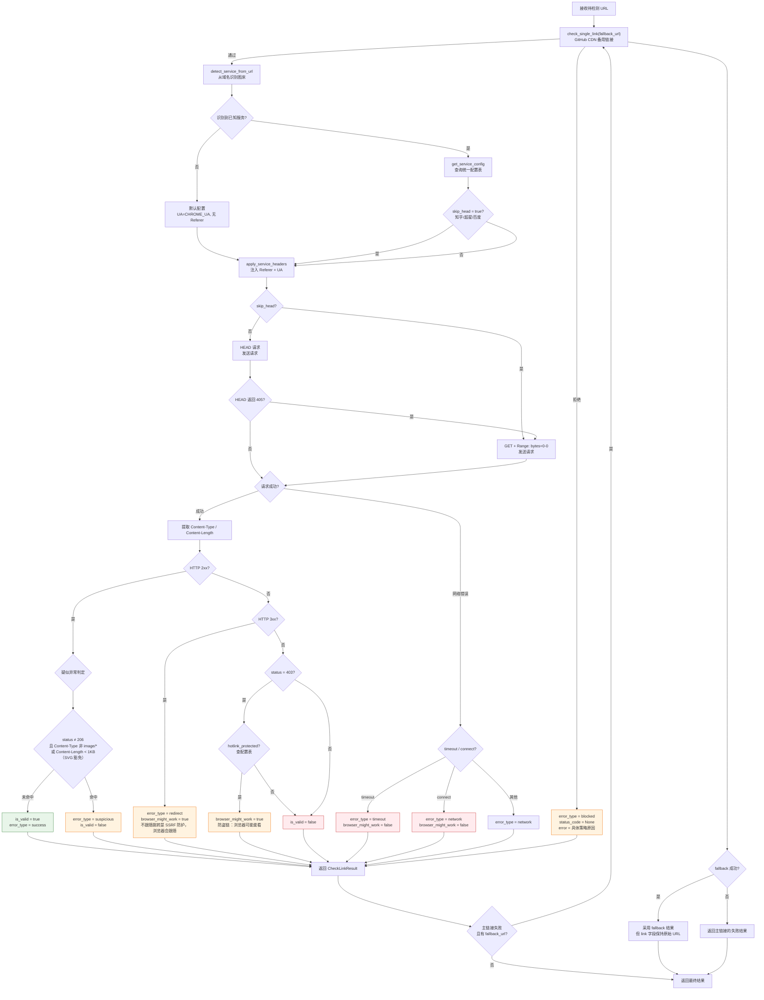
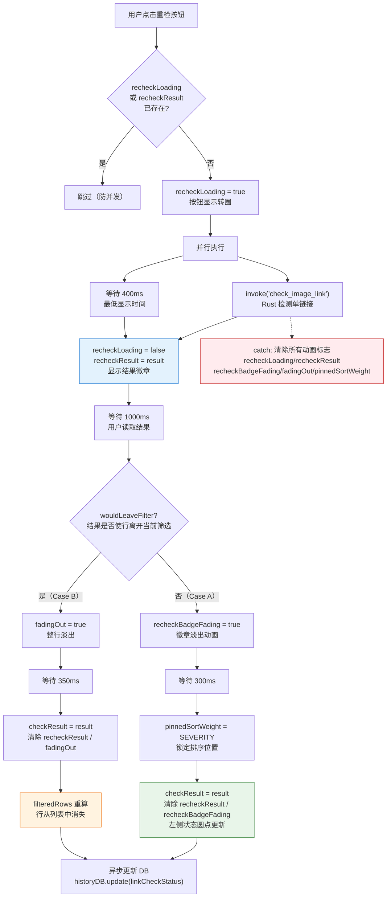
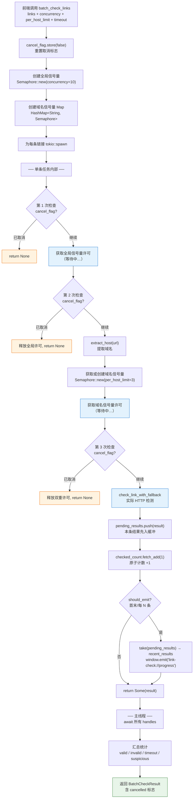
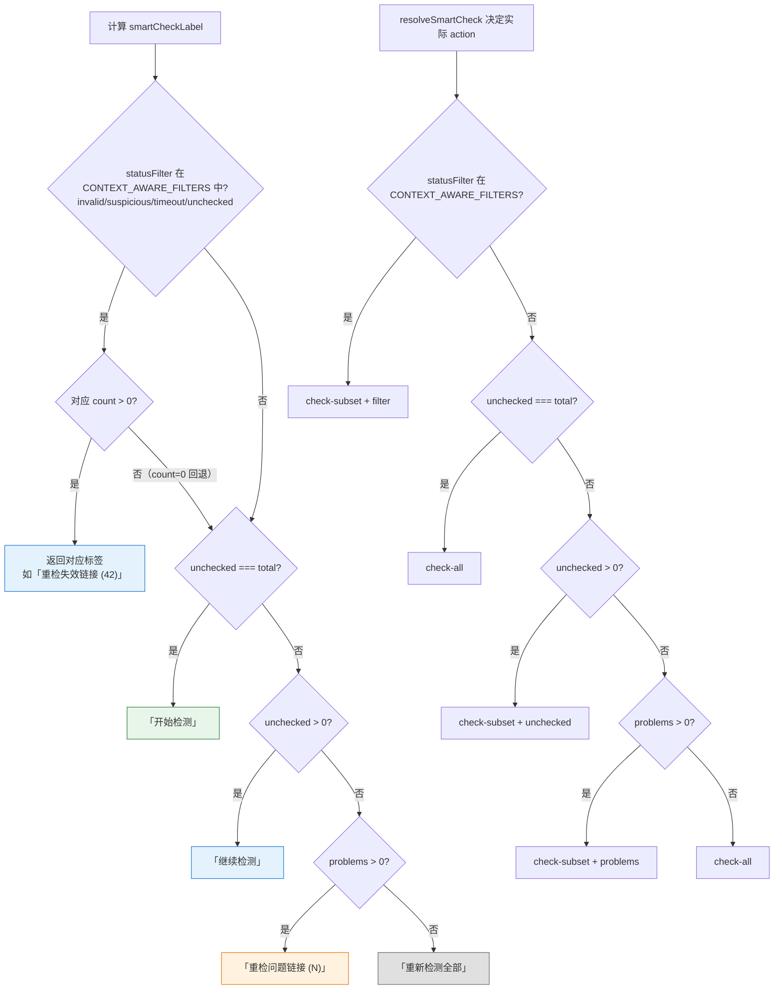
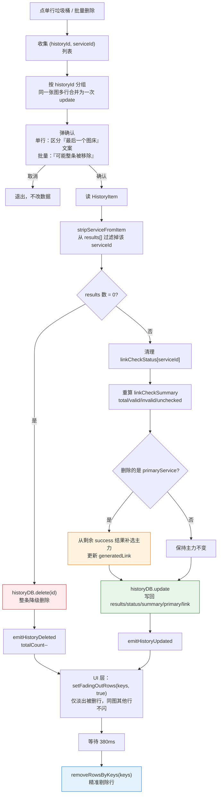

# 链接检测流程（深度展开）

> 链接检测的深层机制图解：服务感知请求、并发控制、单条重检动画、智能策略决策。
> 基础检测主流程见 [auxiliary-flows.md 图 11](./auxiliary-flows.md#图-11链接检测流程)，本文档是其深度展开。

---

## 图 1：服务感知请求流程

展示 Rust 后端 `check_single_link` 中从 URL 到最终判定的完整决策路径。排查「微博返回 403 但浏览器能看」「200 却标记为疑似」等问题时查看。

> **关键源文件**：`src-tauri/src/commands/link_checker.rs`（`detect_service_from_url`、`get_service_config`、`apply_service_headers`、`check_single_link`、`check_link_with_fallback`、`validate_probe_url`、`validate_fetch_url`、`dns_answer_is_forbidden`）

```mermaid
flowchart TD
    A["接收待检测 URL"] --> V{"validate_probe_url<br/>scheme + 字面量 IP + 凭证校验<br/>（同步，不查 DNS）"}
    V -- 拒绝 --> VB["error_type = blocked<br/>status_code = None<br/>error = 具体策略原因"]
    V -- 通过 --> B["detect_service_from_url<br/>从域名识别图床"]
    B --> C{识别到已知服务?}
    C -- 是 --> D["get_service_config<br/>查询统一配置表"]
    C -- 否 --> E["默认配置<br/>UA=CHROME_UA, 无 Referer"]

    D --> F{skip_head = true?<br/>知乎/超星/百度}
    E --> G["apply_service_headers<br/>注入 Referer + UA"]
    F -- 是 --> G
    F -- 否 --> G

    G --> H{skip_head?}
    H -- 是 --> H1["GET + Range: bytes=0-0<br/>发送请求"]
    H -- 否 --> H2["HEAD 请求<br/>发送请求"]

    H2 --> I{HEAD 返回 405?}
    I -- 是 --> H1
    I -- 否 --> K

    H1 --> K{请求成功?}
    K -- 网络错误 --> L{timeout / connect?}
    L -- timeout --> L1["error_type = timeout<br/>browser_might_work = false"]
    L -- connect --> L2["error_type = network<br/>browser_might_work = false"]
    L -- 其他 --> L3["error_type = network"]

    K -- 成功 --> M["提取 Content-Type / Content-Length"]
    M --> N{HTTP 2xx?}
    N -- 否 --> N3{HTTP 3xx?}
    N3 -- 是 --> N4["error_type = redirect<br/>browser_might_work = true<br/>不跟随跳转是 SSRF 防护，<br/>浏览器会跟随"]
    N3 -- 否 --> O{status = 403?}
    O -- 是 --> P{hotlink_protected?<br/>查配置表}
    P -- 是 --> P1["browser_might_work = true<br/>防盗链：浏览器可能能看"]
    P -- 否 --> P2["is_valid = false"]
    O -- 否 --> P2

    N -- 是 --> Q{疑似异常判定}
    Q --> Q1{"status ≠ 206<br/>且 Content-Type 非 image/*<br/>或 Content-Length < 1KB<br/>（SVG 豁免）"}
    Q1 -- 命中 --> R["error_type = suspicious<br/>is_valid = false"]
    Q1 -- 未命中 --> S["is_valid = true<br/>error_type = success"]

    %% Fallback 分支
    S --> T["返回 CheckLinkResult"]
    R --> T
    N4 --> T
    P1 --> T
    P2 --> T
    L1 --> T
    L2 --> T
    L3 --> T
    VB --> T

    T --> U{主链接失败<br/>且有 fallback_url?}
    U -- 是 --> V["check_single_link(fallback_url)<br/>GitHub CDN 备用链接"]
    U -- 否 --> W["返回最终结果"]
    V --> X{fallback 成功?}
    X -- 是 --> Y["采用 fallback 结果<br/>但 link 字段保持原始 URL"]
    X -- 否 --> Z["返回主链接的失败结果"]
    Y --> W
    Z --> W

    style S fill:#e8f5e9,stroke:#2e7d32
    style R fill:#fff3e0,stroke:#ef6c00
    style N4 fill:#fff3e0,stroke:#ef6c00
    style P1 fill:#fff3e0,stroke:#ef6c00
    style P2 fill:#ffebee,stroke:#c62828
    style L1 fill:#ffebee,stroke:#c62828
    style L2 fill:#ffebee,stroke:#c62828
    style VB fill:#fff3e0,stroke:#ef6c00
```

### 出站策略校验：只读探测 vs 下载重传

两条路径用不同的校验函数，差别只在**要不要用 DNS 解析结果做裁决**。

| 路径 | 命令 | 校验函数 | DNS 层裁决 | 理由 |
|------|------|----------|-----------|------|
| 只读探测 | `check_image_link` / `batch_check_links` | `validate_probe_url`（同步）= `validate_url_with_policy(AllowPrivate)` + 前端传入的确认主机名名单 | ❌ 不做 | 预解析结果并不绑定 reqwest 的实际连接（它会自己再解析一次），所以拦不住 DNS rebinding，只能拦「手滑粘了内网 URL」——而字面量 IP 判据已覆盖。批量上限 10 万条，每条还要多付一次 DNS 查询 |
| 下载重传 | `download_image_from_url` / `download_url_image` | `validate_fetch_url`（async）= `validate_external_url(Deny)` + DNS 裁决 | ✅ 做，但豁免 fake-ip 池 | 取回的字节会被重新上传到公网图床，误操作必须拦 |

除 DNS 外，两条路径 2026-08-21 起还差一个 **scheme × 地址段** 维度（探测对齐了上传 / 渲染 /
CSP 三处 2026-08 为局域网图床放开的判据，下载重传保持旧口径）：

| URL 形态 | 只读探测 | 下载重传 |
|----------|---------|---------|
| `https://` 公网 | ✅ | ✅（DNS 裁决通过后） |
| `http://` 回环 | ✅ | ✅ |
| `http://192.168.x.x` 等局域网字面量 | ✅ | ❌（字节会重传公网） |
| `https://` 内网字面量 | ✅ | ❌ |
| `http://nas.local` 等**已确认**主机名（fake-ip 逃生舱，前端随请求传名单） | ✅ | ❌（fetch 没有名单入口） |
| `http://` 公网 / 未确认主机名 | ❌ `PUBLIC_HTTP_DISABLED_MESSAGE` | ❌ |
| 链路本地 / 云元数据 / 文档段 / fake-ip 字面量 / 带凭证 | ❌ 任何 scheme | ❌ |

确认名单的语义与前端 `networkPolicy.ts` 的 `allowConfirmedHttp` 分支逐字对齐：命中名单仍复查
always-blocked 与凭证。名单由 5 个 invoke 调用点传入（`useLinkCheck.ts` 四处 +
`useMirrorFallback.ts` 一处），漏传的直接后果是已确认主机名图床被误判「策略拦截」。

> 📌 「探测路径不查 DNS」换来的口子（内网主机名会被真的探测一次）、为什么接受、以及真要收紧该怎么做，记在 [docs/TODO.md 已知取舍](../TODO.md#只读探测路径不做-dns-裁决)。**不要**用「把 DNS 预检加回来」来收紧——那正是被 a83ca54 删掉的东西。

**fake-ip 豁免**（`dns_answer_is_forbidden`）：`198.18.0.0/15` 是 RFC 2544 基准测试段，公网 BGP 不路由、企业内网不使用；现实中它只作为 Clash / sing-box / Surge 的**默认 fake-ip 池**出现（范围取 /15 是为了同时覆盖 mihomo 的 `198.18.0.1/16` 与 sing-box 的 `198.18.0.0/15`）。开了 TUN 的机器上任意域名都会解析进该段，把它当内网证据会让功能全废。

**v6 池同样豁免** `fdfe:dcba:9876::/64`（mihomo `fake-ip-range6` 默认值）：`lookup_host` 返回的是 A + AAAA 的**并集**，`validate_fetch_url` 逐条判定、任意一条被拒就整体失败。而 `fdfe:…` 落在 ULA（`fc00::/7`）里会被 `is_private_or_reserved_ip` 判成内网——只豁免 v4 的话，双栈 + TUN 的机器上「从 URL 下载图片」依然全量失败。判据都在 `is_fake_ip_pool_ip`。

> 📍 **基础判据的位置**：`normalize_host` / `is_loopback_host` / `is_loopback_ip` /
> `is_private_or_reserved_host` / `is_private_or_reserved_ip` 全部住在 `src-tauri/src/url_policy.rs`，
> `commands/link_checker.rs` 只 `use` 不实现。曾经两边各写一份，然后漂移了——link_checker
> 那份多拒 IPv6 文档段 `2001:db8::/32`，url_policy 那份没有，同一个地址两边结论相反。
> 合并时把漂移的那一半**吸收**进 url_policy（同时进 `is_always_blocked_host`，否则 WebDAV 会
> 反过来把文档段当局域网放行明文凭证）。本模块保留的只有策略层差异：fake-ip 的豁免方向。

> ⚠️ 豁免只发生在 **DNS 答案**判定点。字面量 `https://198.18.1.1/x.jpg` 仍然拒绝，`is_private_or_reserved_ipv4` 里的 198.18/15 一字未改——`src-tauri/src/url_policy.rs` 的跨模块一致性测试 `reserved_ranges_match_frontend_and_link_checker` 依赖它。

#### 同一判据的另一面：WebDAV 是**拒绝** fake-ip

判据 `is_fake_ip_pool_ip` 住在 `src-tauri/src/url_policy.rs`，由两个模块共用，但**默认值相反**：

| 模块 | 判定点 | 猜错的代价 | 对 fake-ip 的处置 |
|------|--------|-----------|------------------|
| 本模块（只读探测 / 下载重传） | `dns_answer_is_forbidden` | 多看一眼图片 | **豁免**（不拒绝） |
| `url_policy.rs`（WebDAV 明文 HTTP） | `is_allowed_lan_addr` | 账号密码明文出公网 | **拒绝**（不放行） |

共同前提是同一句话：`198.18.x.x` 出现在 DNS 答案里，对目标的真实网络位置**零信息量**——代理只是随手编了个号。分歧只在「零信息量时默认怎么办」，而那取决于赌注。

> 这也是为什么本模块「探测路径干脆不查 DNS」的结论**不能照搬**到 WebDAV：WebDAV 恰恰要靠 DNS 结果决定能不能走明文 HTTP，不查 DNS 这条路走不通。
>
> ⚠️ 改动 `is_fake_ip_pool_ip` 会同时影响两个方向——放宽会让 WebDAV 凭证泄露，收紧会让链接检测全量误判。修改前先看两侧的护栏测试：本模块的 `dns_answer_gate_allows_fake_ip_but_blocks_real_private` 与 url_policy 的 `fake_ip_pool_is_not_lan_evidence` / `real_lan_ranges_survive_the_fake_ip_gate`。

### error_type 取值表

| 取值 | 产生位置 | 前端呈现 |
|------|----------|----------|
| `success` | 2xx 且未命中疑似判定 | 绿点 / 状态码 |
| `http_4xx` / `http_5xx` | `classify_error` 按状态码分类 | 走 `STATUS_DESC` 文案表 |
| `timeout` | `err.is_timeout()` | 「超时」· 检测超时 · 网络延迟或图床响应过慢 |
| `network` | `err.is_connect()` 或兜底分支 | 「网络」· 网络不通 · 无法连接到图床服务器 |
| `suspicious` | `is_suspicious_image_response` 命中 | 「疑似」 |
| `blocked` | `validate_probe_url` 拒绝 / 空链接 | 「拦截」· 策略拦截 + Rust 给出的**具体原因**；筛选与计数上等同 `network`（归入「失效」），不新增 tab |
| `redirect` | 状态码落在 300–399 | 「跳转」· 同时置 `browser_might_work = true`，筛选/计数/CSV 上归入「疑似」而**不是**「失效」；不新增 tab |

> `blocked` 与 `network` 分家的意义：前者是**请求根本没发出去**（被本机策略拦下），后者是**发出去了但连不上对端**。合并会让"被自己程序拦了"伪装成"网络故障"，排查时误导性极强。

> ⚠️ **判 `suspicious` 前必须先归一化 Content-Type。** `is_suspicious_image_response` 走
> `content_type_mime()`：切掉 `; charset=...` 参数、去空白、转小写，再比 `image/` 前缀。
> RFC 9110 规定类型/子类型大小写不敏感且允许带参数，直接拿原串 `starts_with("image/")`
> 会把返回 `Image/JPEG` 的正常图误标成「疑似」。同文件的 `download_image_from_url`
> 与 `download_url_image`（前端 URL 下载走的就是它）用的是同一个函数，**三处判据不许各写一份**。
>
> 别在 `download_url_image` 里把结果绑到叫 `content_type_mime` 的局部变量上——那会遮住同名函数，
> 后来人想在这个函数里再调用它时会撞上「试图调用 String」的编译错误。

#### 3xx 为什么必须单独归类

检测器用 `redirect::Policy::none()` **刻意不跟随跳转**——这是防 SSRF 的设计，不会改。但浏览器会跟随，所以图床返回 301/302 时用户打开链接能正常看图。

3xx 以前落进 `classify_error` 的兜底 `network`，界面标红成「失效」。这条误判的代价不是"看着别扭"：链接检测页支持按失效批量删除，用户照着这个结论删下去，删掉的是**活链接**。

归类靠两个字段协同，缺一不可：

| 字段 | 值 | 作用 |
|------|----|------|
| `error_type` | `"redirect"` | 界面显示「跳转」、tooltip 解释「浏览器会自动跟随」、CSV 导出写「跳转」 |
| `browser_might_work` | `true` | 让**所有按排除法写的**筛选/计数（`!is_valid && ≠timeout && ≠suspicious && !browser_might_work` 才算失效）自动把它排除出「失效」 |

> ⚠️ 新增按 `error_type` **逐个点名**的分支时（CSV `statusLabel`、`recheckLabel` 这类没有 status_code 快捷出口的函数），漏点名 `redirect` 就会悄悄退回「失效」。按排除法写的地方（`useCheckFilter` / `useCheckStats` / Rust 汇总统计）靠 `browser_might_work` 自动归位，不用改。
>
> tooltip 里 `redirect` 必须判在 `browser_might_work` **之前**：两者都为 true，落到通用分支会输出「防盗链限制 (301)」，把用户引去查根本不存在的防盗链设置。

### 图床服务配置表

| 服务 ID | 域名匹配规则 | Referer | skip_head | hotlink_protected |
|---------|-------------|---------|-----------|-------------------|
| weibo | `*.sinaimg.cn` | `https://weibo.com/` | false | true |
| bilibili | `*.hdslb.com` | `https://mall.bilibili.com/` | false | true |
| jd | `*.360buyimg.com` | `https://jdcs.jd.com/...` | false | true |
| zhihu | `*.zhimg.com` | `https://www.zhihu.com/` | **true** | true |
| chaoxing | `*.chaoxing.com` | `https://notice.chaoxing.com/` | **true** | true |
| nowcoder | `*.nowcoder.com` | `https://www.nowcoder.com/...` | false | true |
| baidu | `image.baidu.com` | 无 | **true** | false |
| github | `raw.githubusercontent.com` 等 | 无 | false | false |
| imgur | `i.imgur.com` | 无 | false | false |
| oss | `*.aliyuncs.com` | 无 | false | false |
| cos | `*.myqcloud.com` | 无 | false | false |
| qiniu | `*.qiniudn.com` / `*.qnssl.com` / `*.qbox.me` | 无 | false | false |
| smms | `*.smms.app` / `i.loli.net` / `vip2.loli.io` | 无 | false | false |
| nami | `*.nami.observer` | 无 | false | false |

---

## 图 2：单条重检动画状态机

展示 `recheckSingle` 中从用户点击到行状态最终更新的完整时序。排查「重检后行闪烁」「行莫名消失」「徽章不消失」时查看。

> **关键源文件**：`src/composables/link-check/useLinkCheck.ts`（`recheckSingle`、`wouldLeaveFilter`、`updateRow`）

```mermaid
flowchart TD
    A["用户点击重检按钮"] --> B{recheckLoading<br/>或 recheckResult<br/>已存在?}
    B -- 是 --> B1["跳过（防并发）"]
    B -- 否 --> C["recheckLoading = true<br/>按钮显示转圈"]

    C --> D["并行执行"]
    D --> D1["invoke('check_image_link')<br/>Rust 检测单链接"]
    D --> D2["等待 400ms<br/>最低显示时间"]
    D1 & D2 --> E["recheckLoading = false<br/>recheckResult = result<br/>显示结果徽章"]

    E --> F["等待 1000ms<br/>用户读取结果"]

    F --> G{"wouldLeaveFilter?<br/>结果是否使行离开当前筛选"}

    %% Case A：行留在列表
    G -- "否（Case A）" --> H["recheckBadgeFading = true<br/>徽章淡出动画"]
    H --> H1["等待 300ms"]
    H1 --> H2["pinnedSortWeight = SEVERITY<br/>锁定排序位置"]
    H2 --> H3["checkResult = result<br/>清除 recheckResult / recheckBadgeFading<br/>左侧状态圆点更新"]

    %% Case B：行淡出消失
    G -- "是（Case B）" --> I["fadingOut = true<br/>整行淡出"]
    I --> I1["等待 350ms"]
    I1 --> I2["checkResult = result<br/>清除 recheckResult / fadingOut"]
    I2 --> I3["filteredRows 重算<br/>行从列表中消失"]

    %% 收尾
    H3 --> J["异步更新 DB<br/>historyDB.update(linkCheckStatus)"]
    I3 --> J

    %% 错误分支
    D1 -.-> ERR["catch: 清除所有动画标志<br/>recheckLoading/recheckResult<br/>recheckBadgeFading/fadingOut/pinnedSortWeight"]

    style E fill:#e3f2fd,stroke:#1976d2
    style H3 fill:#e8f5e9,stroke:#2e7d32
    style I3 fill:#fff3e0,stroke:#ef6c00
    style ERR fill:#ffebee,stroke:#c62828
```

### wouldLeaveFilter 判定规则

> 「疑似」列同时覆盖 `error_type = suspicious` 和 `browser_might_work = true`（防盗链 403 / 3xx 跳转）。

| 当前筛选 | 结果为有效 | 结果为失效 | 结果为超时 | 结果为疑似 |
|---------|-----------|-----------|-----------|-----------|
| `all` | 留 | 留 | 留 | 留 |
| `null` | 留 | 留 | 留 | 留 |
| `problems` | **离开** | 留 | 留 | 留 |
| `unchecked` | **离开** | **离开** | **离开** | **离开** |
| `valid` | 留 | **离开** | **离开** | **离开** |
| `invalid` | **离开** | 留 | **离开** | **离开** |
| `timeout` | **离开** | **离开** | 留 | **离开** |
| `suspicious` | **离开** | **离开** | **离开** | 留 |

> 📌 **默认筛选是 `'invalid'`，不是 `null`**（`useCheckFilter.ts` 的 `ref<StatusFilter>('invalid')`）。`null` 在 `wouldLeaveFilter` 里走的是「什么都不离开」的早退分支，实际界面上进不到这个状态；本表旧版把 `null` 写成"默认=问题链接"并标了离开，两处都与实现不符，已按代码修正。

---

## 图 3：批量检测并发控制

展示 Rust `batch_check_links` 引擎内部的二级信号量机制。排查「检测速度异常慢」「某个图床被限速」「取消后仍有检测在跑」时查看。

> **关键源文件**：`src-tauri/src/commands/link_checker.rs`（`batch_check_links`、`cancel_batch_check`、`extract_host`）

```mermaid
flowchart TD
    A["前端调用 batch_check_links<br/>links + concurrency + per_host_limit + timeout"] --> B["cancel_flag.store(false)<br/>重置取消标志"]
    B --> C["创建全局信号量<br/>Semaphore::new(concurrency=10)"]
    C --> D["创建域名信号量 Map<br/>HashMap&lt;String, Semaphore&gt;"]
    D --> E["为每条链接 tokio::spawn"]

    E --> F["── 单条任务内部 ──"]
    F --> G{第 1 次检查<br/>cancel_flag?}
    G -- 已取消 --> G1["return None"]
    G -- 继续 --> H["获取全局信号量许可<br/>（等待中…）"]

    H --> I{第 2 次检查<br/>cancel_flag?}
    I -- 已取消 --> I1["释放全局许可, return None"]
    I -- 继续 --> J["extract_host(url)<br/>提取域名"]
    J --> K["获取或创建域名信号量<br/>Semaphore::new(per_host_limit=3)"]
    K --> L["获取域名信号量许可<br/>（等待中…）"]

    L --> M{第 3 次检查<br/>cancel_flag?}
    M -- 已取消 --> M1["释放双重许可, return None"]
    M -- 继续 --> N["check_link_with_fallback<br/>实际 HTTP 检测"]

    N --> N1["pending_results.push(result)<br/>本条结果先入缓冲"]
    N1 --> O["checked_count.fetch_add(1)<br/>原子计数 +1"]
    O --> O1{should_emit?<br/>首末/每 N 条}
    O1 -- 否 --> Q["return Some(result)"]
    O1 -- 是 --> P["take(pending_results) → recent_results<br/>window.emit('link-check://progress')"]
    P --> Q

    %% 主流程汇总
    Q --> R["── 主线程 ──<br/>await 所有 handles"]
    R --> S["汇总统计<br/>valid / invalid / timeout / suspicious"]
    S --> T["返回 BatchCheckResult<br/>含 cancelled 标志"]

    style H fill:#e3f2fd,stroke:#1976d2
    style L fill:#e3f2fd,stroke:#1976d2
    style N fill:#e3f2fd,stroke:#1976d2
    style T fill:#e8f5e9,stroke:#2e7d32
    style G1 fill:#fff3e0,stroke:#ef6c00
    style I1 fill:#fff3e0,stroke:#ef6c00
    style M1 fill:#fff3e0,stroke:#ef6c00
```

### 并发参数说明

| 参数 | 默认值 | 范围 | 说明 |
|------|-------|------|------|
| `concurrency` | 10 | 1-50 | 全局最大并发数（tokio 信号量） |
| `per_host_limit` | 3 | 1-10 | 单域名最大并发（防止刷爆单图床） |
| `timeout_secs` | 10 | 3-30 | 单链接超时秒数 |

**为什么需要三次取消检查？**
- 第 1 次：任务开始前，避免无意义的信号量竞争
- 第 2 次：拿到全局许可后、域名许可前，快速释放资源
- 第 3 次：拿到双重许可后、发 HTTP 前，避免已取消仍发请求

### 暂停 / 恢复：轮询语义

`BatchCheckPauseFlag`（`AtomicBool`）与 `BatchCheckCancelFlag` 并行管理。三次取消检查点实际调用的是复合辅助函数 `await_resume_or_cancel(pause, cancel)`：

1. 循环：`while pause=true && cancel=false { sleep 100ms }`
2. 退出后返回 `cancel.load()` —— **true 则任务立即 `return None`**（cancel 优先 pause）

**关键不变量**：
- 暂停期间任务仍持有 semaphore permit（全局 + 域名），保证恢复后原地复工而非重新排队
- cancel 能"穿透"pause——已暂停的任务收到取消不会被 pause flag 阻塞
- HTTP 在途的请求无法中断（reqwest 不暴露 abort），暂停只影响尚未进入 HTTP 阶段的任务；正在下载的任务会完成后自然退出

**相关 command**：`pause_batch_check` / `resume_batch_check`（仅翻转 flag，不做其他工作）

### 实时反馈：进度事件携带批量结果

`BatchCheckProgress` 除 `checked` / `total` / `current_url` 外，还带 `recent_results: Vec<BatchCheckItemResult>` —— 自上次广播以来累积的逐条结果。

- **Rust 端**：每个任务完成后将 `BatchCheckItemResult` 推入 `pending_results` 缓冲（Mutex<Vec>）；触发节流广播时 `std::mem::take` 整批 drain 出来塞入 payload。事件频率仍由 `PROGRESS_EMIT_EVERY_N`（默认 10）控制，单次 IPC 数量不增加。
- **前端端**：`useLinkCheck` 在 `link-check://progress` 回调里调用 `applyRecentResults`，按 `${url}::${historyId}` 用 `rowIndexMap` 做 O(1) 定位，对命中行 mutate `checkResult` 后通过 `createRafScheduler()` 把"换数组引用"动作（`checkRows.value = checkRows.value.slice()`）合并到下一帧执行——同帧多次 mutation 只触发一次重渲染，跨过 `HistoryCheckPanel` 的 prop 边界唤醒下游 computed。
- **行级过渡（hold-with-fade）**：每条 mutation 同时打 `recentlyCompletedAt = Date.now()` 时间戳，并加入 `rowsInHold` Set。`liveFilter` 在「未检测」tab 内特别保留 `recentlyCompletedAt !== undefined` 的行，让用户能看到"灰点变绿/红"的状态变化。一个 250ms 间隔的 sweep interval 扫过 `rowsInHold`，到 `HOLD_MS=2000` 后清零时间戳→liveFilter 自然把它过滤掉→`<TransitionGroup name="row-list">` 走 leave 动画淡出（`opacity` 300ms + `position:absolute` 让下方行平滑上移）。目标 tab（valid/invalid 等）没有 hold 概念，新结果命中 matchesStatusFilter 立即出现。
- **取消时立即归位**：`cancelCheck` 调 `clearAllHolds()` 把所有 recentlyCompletedAt 清零，残留过渡态行 ≤ 一帧内全部归位，不再拖 2s。
- **Vue 3 同值跳过陷阱（历史教训）**：早期实现用 `lockedFilteredRows` 在检测期间冻结整个 filteredRows；Vue 3 的 `refreshComputed` 在 `hasChanged(newValue, oldValue)` 返回 false 时**不会**bump dep version，下游 visibleRows 收不到通知，即使 filteredRows 被标脏也不会重算——表现为"行级状态不更新，翻页才看到"。改为 hold-with-fade 后，每次 liveFilter 都返回 `.slice().sort()` 的新数组引用，hasChanged 总是 true，下游正常传播。

**为什么这样设计反馈节奏**：
- 2000ms hold 让用户"看清"新状态（dot 变色 + 徽章），低于这个时长容易看不清就消失了
- 300ms 淡出对应 `--duration-medium`，与项目其他过渡保持一致
- 高速场景（59/s）下，同一帧的多条 mutation 共享几乎相同的时间戳→2000ms 后整批同步淡出，节奏稳定不会一闪一闪
- 不引入额外动画噱头，符合"动效只在传递空间关系时才加"的设计原则——TransitionGroup 的 leave + move 传递的是"行进出列表"的空间关系，是必要的
- **flush 时机**：检测结束（成功/取消/出错）走 `finalizeCheck`，里面调 `scheduler.flush()` 强制落地最后一批 mutation，避免还在 rAF 队列时就被 `applyResultsToRows` 的全量重赋值覆盖。

**为什么这样设计**：单纯 `triggerRef(checkRows)` 在同作用域有效，但跨组件 prop 时 Vue 走引用比对——同一数组引用 = prop 没变 = 子组件不重渲染。早期实现踩过这个坑（chips/行徽章僵死），改成数组引用替换 + rAF 节流后才真正实时。冻结可见集合是为了"用户体验稳定"——失效行检测变绿时不应该当场消失，让用户能持续看到刚才在看的那批数据。

**与批量迁移共享实现**：[utils/rafScheduler.ts](../../src/utils/rafScheduler.ts) 提供通用 `createRafScheduler`，被 [composables/batchMigrate/rafThrottle.ts](../../src/composables/batchMigrate/rafThrottle.ts) 与 [composables/link-check/useLinkCheck.ts](../../src/composables/link-check/useLinkCheck.ts) 共用。任何"高频 shallowRef 数组刷新 → 跨 prop 边界生效"的场景都应优先复用。

### 进度反馈：速率 / ETA / 失速预警

逐行 dot 变色由于 per-host 限速 + 锁定快照排序，单看一屏感知不到检测在动；底栏聚合的数字反馈才是"系统是否活跃"的可靠锚点。

> **关键源文件**：[useCheckStats.ts](../../src/composables/link-check/useCheckStats.ts)（`progressRate` / `etaSeconds` / `stalled` / `rateLabel` / `etaLabel`）、[CheckBottomBar.vue](../../src/components/views/linkcheck/history-check/CheckBottomBar.vue)

| 字段 | 含义 | 计算方式 |
|------|------|---------|
| `progressRate` | 平滑后的检测速率（条/秒） | EWMA：每次 progress 事件取 `(Δchecked / Δt)` 做指数加权移动平均，α=0.3 |
| `etaSeconds` | 预估剩余秒数 | `(total - checked) / progressRate`；速率为 0 时为 null |
| `stalled` | 失速标志 | 每次 progress 事件重置 `setTimeout(10s)`，超时未刷新则置 true |
| `rateLabel` | 紧凑文字 | `>=10` 显示整数 `18/s`；`<10` 显示一位小数 `2.4/s` |
| `etaLabel` | 紧凑文字 | `<60s` → `45s`；`<60min` → `26m`；否则 `1h26m` |

**为什么聚合到底栏而非逐行**：
1. 用户的核心问题是"系统在干活吗 + 还要多久"，速率和 ETA 一并直答
2. 速率为 0 比"逐行 spinner 不动" 更早暴露真正的卡死（HTTP 全部 timeout 等场景）
3. 失速预警把 per-host 限流的副作用显式化——"在等微博等慢域名"，消除卡死焦虑
4. 不引入动画噱头，符合"动效只在传递空间关系时才加"的设计原则

**何时清零**：检测结束/取消时 `progress.value = null`（[useLinkCheck.ts](../../src/composables/link-check/useLinkCheck.ts)），watcher 重置所有派生状态；下次开检从首次 progress 事件重新建立基线。

### 批次归属：三个守卫，三种处置

`batch_check_links` 返回时，结果未必还属于"当前这一轮"。三个守卫**按顺序**判，处置各不相同——合并任意两个都会造成数据事故。

> **关键源文件**：[useLinkCheck.ts](../../src/composables/link-check/useLinkCheck.ts)（`isResultForBatch`、`historyClearedGeneration`、`latestStartedBatchSession`、`latestStartedBatchKeys`、`persistSupersededResult`）

| 顺序 | 守卫 | 触发场景 | 回填 UI | 写 DB |
|------|------|---------|--------|------|
| 1 | `batch_id` 对不上 | Rust 侧返回了别的批次的结果（防御性检查） | ❌ | ❌ |
| 2 | `historyClearedGeneration` 变了 | 检测途中历史被清空 | ❌ | ❌ **整批作废** |
| 3 | `latestStartedBatchSession` 变了 | 取消后又开了新批次 | ❌ | ✅ **仍然落库** |

**为什么第 3 条要落库**（这是修掉的 bug）：用户在几万条的全量检测中途点「取消」，toast 引导他"可通过「仅未检测」继续剩余部分"；他照做，新批次开跑、会话号变了。而旧批次的**在途 HTTP 请求几十秒后才陆续返回**（reqwest 不可中断，见图 3 说明）。旧实现在这里把结果连同落库一起跳过——旧批次已经完成的几千条真实检测结果全部丢弃，重启后回退成「未检测」，用户白等一轮。

这些结果早就通过 `applyRecentResults` 就地 patch 进 UI 了，所以补写入库不是制造分叉，反而是把 UI 与 DB 拉回一致。

**为什么第 2 条反过来不能落库**：历史清空后，结果指向的 `historyId` 已经不存在，写进去就是写幽灵数据，回填 UI 会造出幽灵行。这两条语义相反，所以用两个独立的计数器（`historyClearedGeneration` / `latestStartedBatchSession`）表达，不能共用一个。

**新旧批次重叠的行怎么办**：批次启动时把自己的行键存进 `latestStartedBatchKeys`；旧批次落库前按这个集合过滤，属于新批次的行直接跳过——那些行由新批次自己写，旧结果更陈旧，盖上去就是回退。

### 跨窗口事件同步

模块级 `onCacheEvent` 监听三类历史事件（[useLinkCheck.ts](../../src/composables/link-check/useLinkCheck.ts) 顶部）。不响应就会让检测视图持有**幽灵行**：别处已经删掉的图，检测页还显示、还计入统计、检测时还白发一次请求。

| 事件 | 处置 |
|------|------|
| `history-cleared` | 清空 `checkRows` + 重建索引 + 递增 `historyClearedGeneration` 让在途批次结果整批作废 + `cancel_batch_check` |
| `history-deleted` | 按 `data.ids` 调 `removeRowsByHistoryIds` 精准摘行；`lastLoadTime = 0` 让 TTL 缓存失效 |
| `history-updated` | 只置 `lastLoadTime = 0`（内容变了但行还在，下次进入重查即可） |

**三个容易写错的点**：

1. **ids 在 `payload.data.ids`，不在 payload 顶层**——`CacheEventPayload` 是 `{ type, timestamp, data }`，`data` 才是 `HistoryEventData`。放错位置读到 `undefined`，行为退化成"什么都不做"且不报错。
2. **不能按 `source === WINDOW_SESSION_ID` 过滤自发事件**。`useHistory.ts` 那样过滤是对的（它在本地删除时已经自己更新过状态），但历史页和检测页**同处一个窗口**——过滤掉就等于收不到"在历史页删图"这个最主要的场景。
3. **正在播放删除动画（`fadingOut`）的行要跳过**。那是检测页自己发起的删除，`setFadingOutRows` → 380ms 淡出 → `removeRowsByKeys` 收尾（图 5）；事件抢先摘掉会让过渡直接跳帧。

> 📌 `rowIndexMap` / `rebuildRowIndex` 挂在**模块级**而不是 composable 内：`checkRows` 本身是模块级单例，索引必须是同一份。否则模块级事件监听摘掉行之后，composable 实例里的索引还是旧的，`applyRecentResults` / `updateRow` 会按错位下标 patch 到别人的行上。
>
> 同理，`checkAllHistoryLinks` 回填结果前必须**重新读** `checkRows`，不能拿启动时的 `rows` 快照重新赋值——检测期间 `history-deleted` 摘掉的行会被"复活"。

---

## 图 4：智能检测策略决策

展示 `useCheckStrategy` 中检测主按钮的动态决策逻辑。开发者修改检测入口 UI 时参考。

> **关键源文件**：`src/composables/link-check/useCheckStrategy.ts`（`smartCheckLabel`、`resolveSmartCheck`）
>
> **设计决策**：检测主按钮是唯一入口，没有"检测全部 / 重检问题链接"等下拉备选。要重检某一类问题链接，先点顶部 chip 切到对应筛选 tab，主按钮的 label 与 action 会自动适配。

```mermaid
flowchart TD
    A["计算 smartCheckLabel"] --> B{statusFilter 在<br/>CONTEXT_AWARE_FILTERS 中?<br/>invalid/suspicious/timeout/unchecked}
    B -- 是 --> B2{对应 count > 0?}
    B2 -- 是 --> C["返回对应标签<br/>如「重检失效链接 (42)」"]
    B2 -- "否（count=0 回退）" --> D
    B -- 否 --> D{unchecked === total?}
    D -- 是 --> E["「开始检测」"]
    D -- 否 --> F{unchecked > 0?}
    F -- 是 --> G["「继续检测」"]
    F -- 否 --> H{problems > 0?}
    H -- 是 --> I["「重检问题链接 (N)」"]
    H -- 否 --> J["「重新检测全部」"]

    K["resolveSmartCheck 决定实际 action"] --> L{statusFilter 在<br/>CONTEXT_AWARE_FILTERS?}
    L -- 是 --> L1["check-subset + filter"]
    L -- 否 --> M{unchecked === total?}
    M -- 是 --> M1["check-all"]
    M -- 否 --> N{unchecked > 0?}
    N -- 是 --> N1["check-subset + unchecked"]
    N -- 否 --> O{problems > 0?}
    O -- 是 --> O1["check-subset + problems"]
    O -- 否 --> O2["check-all"]

    style C fill:#e3f2fd,stroke:#1976d2
    style E fill:#e8f5e9,stroke:#2e7d32
    style G fill:#e3f2fd,stroke:#1976d2
    style I fill:#fff3e0,stroke:#ef6c00
    style J fill:#e0e0e0,stroke:#616161
```

---

## 图 5：按行精准删除（per-link 删除语义）

展示链接检测视图中"删除一行"的数据层行为。链接检测列表的逻辑单位是**单个图床链接**（一张图如果上传到 N 个图床，会展开成 N 行），因此删除操作必须精准到 `(historyId, serviceId)`，而不是整条 `HistoryItem`。

> **关键源文件**：`src/composables/history/useHistoryResultOps.ts`（`deleteHistoryResult`、`bulkDeleteHistoryResults`、`stripServiceFromItem`）；`src/composables/link-check/useLinkCheck.ts`（`removeRowsByKeys`、`setFadingOutRows`）；`src/components/views/LinkCheckView.vue`（`handleDeleteRow`、`deleteRowsByTargets`）

```mermaid
flowchart TD
    A["点单行垃圾桶 / 批量删除"] --> B["收集 (historyId, serviceId) 列表"]
    B --> C["按 historyId 分组<br/>同一张图多行合并为一次 update"]
    C --> D["弹确认<br/>单行：区分『最后一个图床』文案<br/>批量：『可能整条被移除』"]
    D -- 取消 --> Z1["退出，不改数据"]
    D -- 确认 --> E["读 HistoryItem"]
    E --> F["stripServiceFromItem<br/>从 results[] 过滤掉该 serviceId"]
    F --> G{results 数 = 0?}

    G -- 是 --> H1["historyDB.delete(id)<br/>整条降级删除"]
    H1 --> H2["emitHistoryDeleted<br/>totalCount--"]

    G -- 否 --> I1["清理 linkCheckStatus[serviceId]"]
    I1 --> I2["重算 linkCheckSummary<br/>total/valid/invalid/unchecked"]
    I2 --> J{删除的是 primaryService?}
    J -- 是 --> K1["从剩余 success 结果补选主力<br/>更新 generatedLink"]
    J -- 否 --> K2["保持主力不变"]
    K1 --> L1["historyDB.update<br/>写回 results/status/summary/primary/link"]
    K2 --> L1
    L1 --> L2["emitHistoryUpdated"]

    H2 --> M["UI 层：setFadingOutRows(keys, true)<br/>仅淡出被删行，同图其他行不闪"]
    L2 --> M
    M --> M1["等待 380ms"]
    M1 --> M2["removeRowsByKeys(keys)<br/>精准剔除行"]

    style H1 fill:#ffebee,stroke:#c62828
    style K1 fill:#fff3e0,stroke:#ef6c00
    style L1 fill:#e8f5e9,stroke:#2e7d32
    style M2 fill:#e3f2fd,stroke:#1976d2
```

### 关键不变量

| 不变量 | 说明 |
|--------|------|
| 行键 = `${historyId}::${serviceId}` | 淡出/移除只作用于该键对应的单行，不会牵连同图其他图床 |
| 删主力 → 补选 | 从剩余 `status === 'success' && result?.url` 的结果里挑第一个，更新 `generatedLink`；Timeline/收藏的缩略图会自动跟上 |
| 结果归零 → 整条删 | `results[]` 空壳记录没有展示价值，直接 `historyDB.delete` 降级 |
| 批量合并 | 同一 `historyId` 下多个 serviceId 合并为一次 `update`，不会 N 次写库 |
| 事件分流 | 整条删走 `emitHistoryDeleted`，仅改走 `emitHistoryUpdated`；其他视图依赖这两类事件刷新缓存 |

### 为什么不共用 `deleteHistoryItem`

`deleteHistoryItem` / `bulkDeleteRecords` 的语义是"删图"（Timeline、收藏、历史视图的逻辑单位是图片）。链接检测的逻辑单位是**链接**——同一张图的多个图床链接应当可以独立删除，共用会导致"删一个失效微博链接，顺手把有效的 GitHub 链接也删了"这种体验事故。

---

## 排查指南

| 现象 | 可能原因 | 对照位置 |
|------|---------|---------|
| **所有链接都显示「网络不通」，浏览器却能正常打开** | 本机 TUN + fake-ip 把域名解析进 `198.18.0.0/15`，旧版 DNS 预检误判为内网。已由 `validate_probe_url` 去掉预检修复；若复现说明改动被回退 | 图 1 策略校验节点 + 出站策略校验小节 |
| **公网** `http://` 链接一律失效 | 公网明文 HTTP 判 `error_type = blocked`（设计行为，tooltip 写明原因）；局域网字面量与已确认主机名 2026-08-21 起已放行 | error_type 取值表 / 出站策略校验小节 |
| 局域网 / NAS 图床（`http://192.168.x.x` 或已确认的 `http://nas.local`）被判「策略拦截」 | 不应出现——字面量走 `AllowPrivate` 判据；主机名要查两件事：该 profile 是否已过 fake-ip 逃生舱确认、5 个 invoke 调用点是否漏传 `confirmed_http_hosts` 名单 | 出站策略校验小节的 scheme 矩阵 |
| 「从 URL 下载图片」开代理时全失败 | `validate_fetch_url` 的 DNS 裁决未豁免 fake-ip 池。**注意 v4 和 v6 两个池都要豁免**——只盖 v4 时，双栈机器上 AAAA 记录仍是 `fdfe:dcba:9876::/64`，循环里照样被拒 | `dns_answer_is_forbidden` / `is_fake_ip_pool_ip` |
| WebDAV 报「该地址属于代理软件的 fake-ip 地址池」 | 设计行为，不是故障：本机 TUN 让域名解析失真，程序无法确认它是不是局域网。改填 NAS 内网 IP 或改用 HTTPS | `url_policy.rs` / docs/TODO.md |
| 微博/B站图片显示失效但浏览器能看 | 防盗链 403 + `hotlink_protected=true` → `browser_might_work` | 图 1 防盗链判定分支 |
| 301/302 跳转的链接被标成「失效」 | 不应出现——3xx 归 `redirect` + `browser_might_work=true`，应显示「跳转」并落在「疑似」。若复现，检查是不是新加了按 `error_type` 逐个点名却漏了 `redirect` 的分支 | 3xx 为什么必须单独归类 |
| 跳转链接的 tooltip 写「防盗链限制」 | `redirect` 判在了 `browser_might_work` 之后——两者都为 true，通用分支会抢先 | `statusTooltip` / 3xx 归类小节 |
| 知乎/百度图片 HEAD 405 | 这些图床 `skip_head=true`，应直接走 GET+Range | 图 1 `skip_head` 决策 |
| 200 但标记为「疑似」 | Content-Type 非 `image/*` 或 Content-Length < 1KB（非 SVG） | 图 1 疑似异常判定 |
| S3 系图床（R2/COS/OSS/七牛/自定义 S3）整批标「疑似」 | 对象缺 Content-Type，以 `application/octet-stream` 落桶。**这是上传侧的问题，不是检测误报**；旧对象升级不自愈，补救见 [s3-legacy-content-type.md](../reference/troubleshooting/s3-legacy-content-type.md) | error_type 取值表 |
| 返回 `Image/JPEG` 之类大小写变体的图被标「疑似」 | 不应出现——判据已走 `content_type_mime()` 归一化。若复现，检查是不是新加了绕过该函数、直接比原串的分支 | error_type 取值表下的归一化告警 |
| GitHub CDN 链接误报失效 | 前端未传 `fallback_url`（rawUrl 缺失） | 图 1 Fallback 分支 |
| 重检后行莫名消失 | `wouldLeaveFilter=true`，行淡出到其他 Tab | 图 2 Case B 分支 |
| 重检徽章闪烁太快看不到 | 400ms 最低转圈 + 1000ms 读取时间 = 1.4s，检查是否被跳过 | 图 2 时间等待节点 |
| 重检后排序位置跳动 | `pinnedSortWeight` 未设置或被清除 | 图 2 Case A `pinnedSortWeight` |
| 检测速度异常慢 | 单域名大量链接被 `per_host_limit=3` 限制 | 图 3 域名信号量 |
| 取消后仍有检测在跑 | 已进入 HTTP 请求的任务无法中断，只能等其自然结束 | 图 3 三次取消检查 |
| 暂停后进度仍在少量增长 | HTTP 在途任务不可中断，pause 只阻塞尚未进入 HTTP 的任务 | 图 3 暂停 / 恢复：轮询语义 |
| 暂停后点取消无响应 | 不应出现——cancel 优先 pause；若确实发生检查 `await_resume_or_cancel` 返回值 | 图 3 暂停 / 恢复：轮询语义 |
| 按钮显示「继续检测」但想全量检测 | 等未检测全部跑完，按钮会自动变成「重新检测全部」；想跳过这步，可点顶部「失效/可疑」chip 切 tab 直接重检该类 | 图 4 主按钮决策 |
| 删除一条链接后同图其他行也消失了 | 逻辑退化成按 `historyId` 删整条——检查是否调的 `deleteHistoryResult` 而不是 `deleteHistoryItem` | 图 5 / useHistoryResultOps.ts |
| 删主力图床后 Timeline 卡片缩略图没换 | `primaryService` 未切换或 `emitHistoryUpdated` 未发 | 图 5 补选主力 + 事件分流 |
| 删完所有图床后历史里还有空壳 | `results[]` 归零兜底未触发，检查 `stripServiceFromItem` 返回值 | 图 5 结果归零分支 |
| 别的页面删了图，检测页还显示（最多 5 分钟） | `history-deleted` 分支没接上，或 ids 读成了 `payload.ids`（正确是 `payload.data.ids`） | 跨窗口事件同步 |
| 检测页删行时淡出动画跳帧 | `history-deleted` 分支没跳过 `fadingOut` 的行，抢在 380ms 动画前摘掉了 | 跨窗口事件同步 第 3 点 |
| 取消后立刻续检，重启发现前一批全回退「未检测」 | 旧批次结果被整批丢弃了——第 3 个守卫应当**只拦 UI 回填、不拦落库** | 批次归属：三个守卫 |
| 检测中在别处删了图，检测结束后被删的行又冒出来 | `checkAllHistoryLinks` 拿启动时的 `rows` 快照重新赋值，把已删行复活 | 跨窗口事件同步 末尾提示 |

---

## 相关文档

- [辅助功能流程 图 11](./auxiliary-flows.md#图-11链接检测流程) — 基础检测主流程（两阶段加载、进度监听、取消分支）
- [链接检测性能优化](../reference/patterns/link-check-large-dataset.md) — 5 万条记录场景的优化方案
- [文档修复流程](./md-rescue-flow.md) — 复用 `checkUrls` 的文档修复功能
- [批量迁移流程](./batch-migrate-flow.md) — 复用链接检测结果的迁移功能
