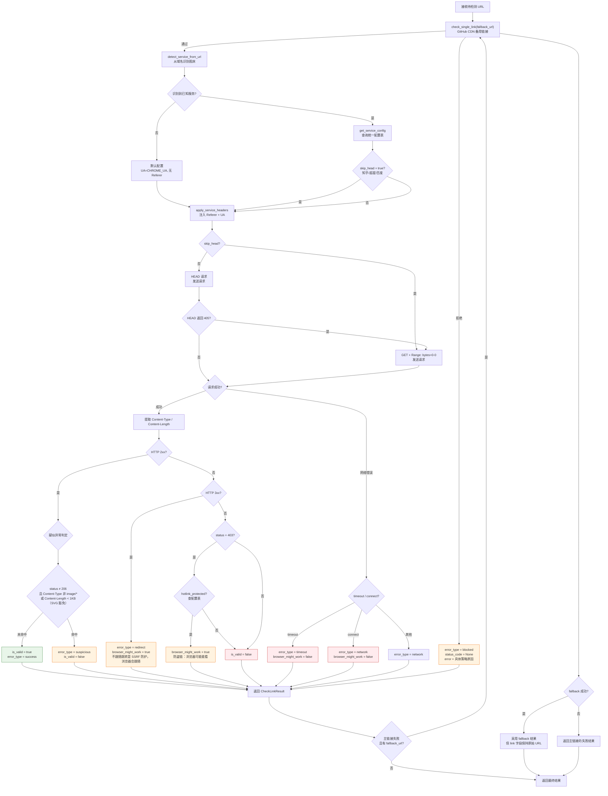
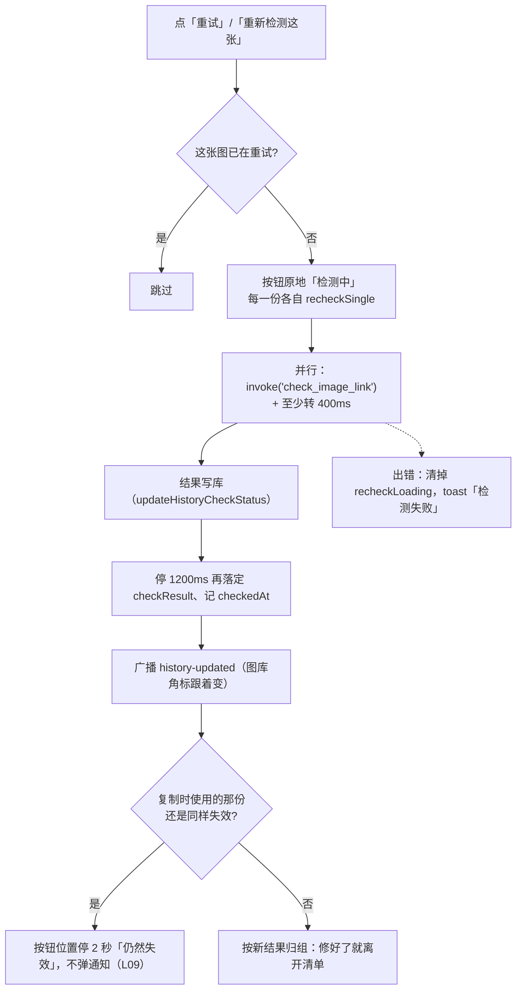
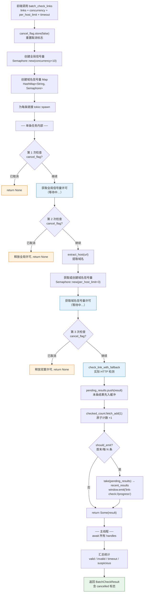
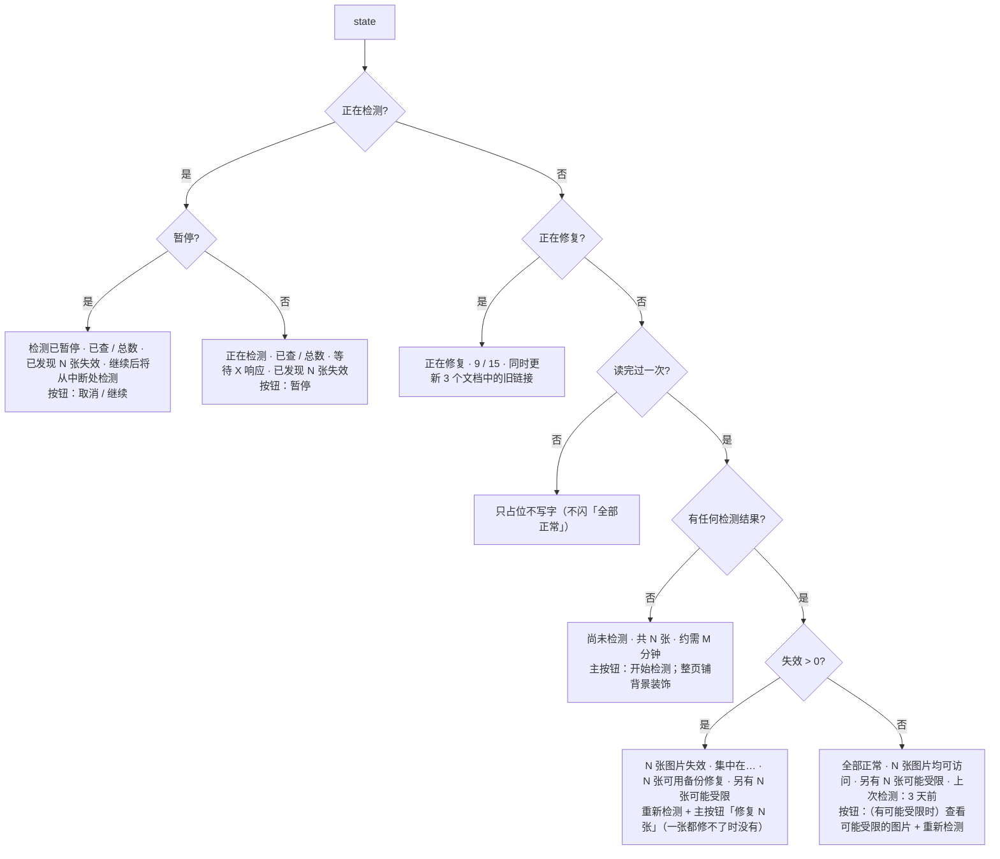
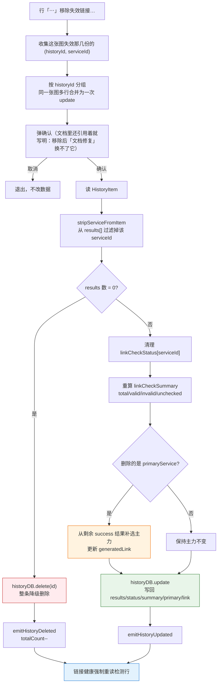

# 链接检测流程（深度展开）

> 链接检测的深层机制图解：服务感知请求、并发控制、单条重检、链接健康页的健康模型与状态。
> 基础检测主流程见 [auxiliary-flows.md 图 11](./auxiliary-flows.md#图-11链接检测流程)，本文档是其深度展开。

---

## 图 1：服务感知请求流程

展示 Rust 后端 `check_single_link` 中从 URL 到最终判定的完整决策路径。排查「微博返回 403 但浏览器能看」「200 却标记为疑似」等问题时查看。

> **关键源文件**：`src-tauri/src/commands/link_checker.rs`（`detect_service_from_url`、`get_service_config`、`apply_service_headers`、`check_single_link`、`check_link_with_fallback`、`validate_probe_url`、`validate_fetch_url`、`dns_answer_is_forbidden`）

```mermaid
flowchart TD
    A["接收待检测 URL"] --> V{"validate_probe_url<br/>scheme + 字面量 IP + 凭证校验<br/>（同步，不查 DNS）"}
    V -- 拒绝 --> VB["error_type = blocked<br/>status_code = None<br/>error = 具体策略原因"]
    V -- 通过 --> B["detect_service_from_url<br/>从域名识别图床"]
    B --> C{识别到已知服务?}
    C -- 是 --> D["get_service_config<br/>查询统一配置表"]
    C -- 否 --> E["默认配置<br/>UA=CHROME_UA, 无 Referer"]

    D --> F{skip_head = true?<br/>知乎/超星/百度}
    E --> G["apply_service_headers<br/>注入 Referer + UA"]
    F -- 是 --> G
    F -- 否 --> G

    G --> H{skip_head?}
    H -- 是 --> H1["GET + Range: bytes=0-0<br/>发送请求"]
    H -- 否 --> H2["HEAD 请求<br/>发送请求"]

    H2 --> I{HEAD 返回 405?}
    I -- 是 --> H1
    I -- 否 --> K

    H1 --> K{请求成功?}
    K -- 网络错误 --> L{timeout / connect?}
    L -- timeout --> L1["error_type = timeout<br/>browser_might_work = false"]
    L -- connect --> L2["error_type = network<br/>browser_might_work = false"]
    L -- 其他 --> L3["error_type = network"]

    K -- 成功 --> M["提取 Content-Type / Content-Length"]
    M --> N{HTTP 2xx?}
    N -- 否 --> N3{HTTP 3xx?}
    N3 -- 是 --> N4["error_type = redirect<br/>browser_might_work = true<br/>不跟随跳转是 SSRF 防护，<br/>浏览器会跟随"]
    N3 -- 否 --> O{status = 403?}
    O -- 是 --> P{hotlink_protected?<br/>查配置表}
    P -- 是 --> P1["browser_might_work = true<br/>防盗链：浏览器可能能看"]
    P -- 否 --> P2["is_valid = false"]
    O -- 否 --> P2

    N -- 是 --> Q{疑似异常判定}
    Q --> Q1{"status ≠ 206<br/>且 Content-Type 非 image/*<br/>或 Content-Length < 1KB<br/>（SVG 豁免）"}
    Q1 -- 命中 --> R["error_type = suspicious<br/>is_valid = false"]
    Q1 -- 未命中 --> S["is_valid = true<br/>error_type = success"]

    %% Fallback 分支
    S --> T["返回 CheckLinkResult"]
    R --> T
    N4 --> T
    P1 --> T
    P2 --> T
    L1 --> T
    L2 --> T
    L3 --> T
    VB --> T

    T --> U{主链接失败<br/>且有 fallback_url?}
    U -- 是 --> V["check_single_link(fallback_url)<br/>GitHub CDN 备用链接"]
    U -- 否 --> W["返回最终结果"]
    V --> X{fallback 成功?}
    X -- 是 --> Y["采用 fallback 结果<br/>但 link 字段保持原始 URL"]
    X -- 否 --> Z["返回主链接的失败结果"]
    Y --> W
    Z --> W

    style S fill:#e8f5e9,stroke:#2e7d32
    style R fill:#fff3e0,stroke:#ef6c00
    style N4 fill:#fff3e0,stroke:#ef6c00
    style P1 fill:#fff3e0,stroke:#ef6c00
    style P2 fill:#ffebee,stroke:#c62828
    style L1 fill:#ffebee,stroke:#c62828
    style L2 fill:#ffebee,stroke:#c62828
    style VB fill:#fff3e0,stroke:#ef6c00
```

### 出站策略校验

只读探测与下载重传用不同的出站校验函数，详见 [link-check-outbound-policy.md](./link-check-outbound-policy.md)。

### error_type 取值表

| 取值 | 产生位置 | 前端呈现（白话标签 `statusWord`，状态码与原因放 tooltip `statusTooltip`） |
|------|----------|----------|
| `success` | 2xx 且未命中疑似判定 | 「正常」 |
| `http_4xx` / `http_5xx` | `classify_error` 按状态码分类 | 「不存在」404 /「已删除」410 /「拒绝访问」403 /「需要登录」401 /「被限流」429 /「图床故障」5xx /「失效」其他；tooltip 走 `STATUS_DESC` 文案表 |
| `timeout` | `err.is_timeout()` | 「超时」· 检测超时 · 网络延迟或图床响应过慢 |
| `network` | `err.is_connect()` 或兜底分支 | 「连不上」· 网络不通 · 无法连接到图床服务器 |
| `suspicious` | `is_suspicious_image_response` 命中 | 「可疑」 |
| `blocked` | `validate_probe_url` 拒绝 / 空链接 | 「已拦截」· 策略拦截 + Rust 给出的**具体原因**；筛选与计数上等同 `network`（归入「失效」），不新增 tab |
| `redirect` | 状态码落在 300–399 | 「跳转」· 同时置 `browser_might_work = true`，筛选/计数/CSV 上归入「疑似」而**不是**「失效」；不新增 tab |

> 防盗链（403 + `browser_might_work`）显示「防盗链」；标签一律 ≤4 个字，状态药丸才排得齐。文档修复列表用同一套函数。

> `blocked` 与 `network` 分家的意义：前者是**请求根本没发出去**（被本机策略拦下），后者是**发出去了但连不上对端**。合并会让"被自己程序拦了"伪装成"网络故障"，排查时误导性极强。

> ⚠️ **判 `suspicious` 前必须先归一化 Content-Type。** `is_suspicious_image_response` 走
> `content_type_mime()`：切掉 `; charset=...` 参数、去空白、转小写，再比 `image/` 前缀。
> RFC 9110 规定类型/子类型大小写不敏感且允许带参数，直接拿原串 `starts_with("image/")`
> 会把返回 `Image/JPEG` 的正常图误标成「疑似」。同文件的 `download_url_image`
> （前端 URL 下载走的就是它）用的是同一个函数，**两处判据不许各写一份**。
>
> 别在 `download_url_image` 里把结果绑到叫 `content_type_mime` 的局部变量上——那会遮住同名函数，
> 后来人想在这个函数里再调用它时会撞上「试图调用 String」的编译错误。

#### 3xx 为什么必须单独归类

检测器用 `redirect::Policy::none()` **刻意不跟随跳转**——这是防 SSRF 的设计，不会改。但浏览器会跟随，所以图床返回 301/302 时用户打开链接能正常看图。

3xx 以前落进 `classify_error` 的兜底 `network`，界面标红成「失效」。这条误判的代价不是"看着别扭"：链接检测页支持按失效批量删除，用户照着这个结论删下去，删掉的是**活链接**。

归类靠两个字段协同，缺一不可：

| 字段 | 值 | 作用 |
|------|----|------|
| `error_type` | `"redirect"` | 界面显示「跳转」、tooltip 解释「浏览器会自动跟随」、CSV 导出写「跳转」 |
| `browser_might_work` | `true` | 让**所有按排除法写的**筛选/计数（`!is_valid && ≠timeout && ≠suspicious && !browser_might_work` 才算失效）自动把它排除出「失效」 |

> ⚠️ 新增按 `error_type` **逐个点名**的分支时（CSV `statusLabel`、界面白话标签 `statusWord` 这类逐个点名的函数），漏点名 `redirect` 就会悄悄退回「失效」。按排除法写的地方（`imageHealth.linkVerdict` / Rust 汇总统计）靠 `browser_might_work` 自动归位，不用改。
>
> tooltip 里 `redirect` 必须判在 `browser_might_work` **之前**：两者都为 true，落到通用分支会输出「防盗链限制 (301)」，把用户引去查根本不存在的防盗链设置。

### 图床服务配置表

| 服务 ID | 域名匹配规则 | Referer | skip_head | hotlink_protected |
|---------|-------------|---------|-----------|-------------------|
| weibo | `*.sinaimg.cn` | `https://weibo.com/` | false | true |
| bilibili | `*.hdslb.com` | `https://mall.bilibili.com/` | false | true |
| jd | `*.360buyimg.com` | `https://jdcs.jd.com/...` | false | true |
| zhihu | `*.zhimg.com` | `https://www.zhihu.com/` | **true** | true |
| chaoxing | `*.chaoxing.com` | `https://notice.chaoxing.com/` | **true** | true |
| nowcoder | `*.nowcoder.com` | `https://www.nowcoder.com/...` | false | true |
| baidu | `image.baidu.com` | 无 | **true** | false |
| github | `raw.githubusercontent.com` 等 | 无 | false | false |
| imgur | `i.imgur.com` | 无 | false | false |
| oss | `*.aliyuncs.com` | 无 | false | false |
| cos | `*.myqcloud.com` | 无 | false | false |
| qiniu | `*.qiniudn.com` / `*.qnssl.com` / `*.qbox.me` | 无 | false | false |
| smms | `*.smms.app` / `i.loli.net` / `vip2.loli.io` | 无 | false | false |
| nami | `*.nami.observer` | 无 | false | false |

---

## 图 2：单条重检

清单行上的「重试」或「⋯ → 重新检测这张」把这张图的每一份链接各查一次（`useLinkHealth.retry` → 每份 `recheckSingle`），不占全局「检测中」。排查「重试后行闪一下就没了」「转圈不停」时查看。

> **关键源文件**：`src/views/health/useLinkHealth.ts`（`retry`）、`src/composables/link-check/useLinkCheck.ts`（`recheckSingle`、`showRecheckResult`、`updateRow`）

```mermaid
flowchart TD
    A["点「重试」/「重新检测这张」"] --> B{这张图已在重试?}
    B -- 是 --> B1["跳过"]
    B -- 否 --> C["按钮原地「检测中」<br/>每一份各自 recheckSingle"]
    C --> D["并行：invoke('check_image_link')<br/>+ 至少转 400ms"]
    D --> E["结果写库（updateHistoryCheckStatus）"]
    E --> F["停 1200ms 再落定 checkResult、记 checkedAt"]
    F --> G["广播 history-updated（图库角标跟着变）"]
    G --> H{复制时使用的那份<br/>还是同样失效?}
    H -- 是 --> H1["按钮位置停 2 秒「仍然失效」，不弹通知（L09）"]
    H -- 否 --> H2["按新结果归组：修好了就离开清单"]
    D -.-> ERR["出错：清掉 recheckLoading，toast「检测失败」"]
```

**为什么停 1200ms 再落定**：健康模型只看已落定的 `checkResult`；停的这一下里行待在原位，直接落定的话修好的图会在眼前瞬间消失。

---

## 图 3：批量检测并发控制

展示 Rust `batch_check_links` 引擎内部的二级信号量机制。排查「检测速度异常慢」「某个图床被限速」「取消后仍有检测在跑」时查看。

> **关键源文件**：`src-tauri/src/commands/link_checker.rs`（`batch_check_links`、`cancel_batch_check`、`extract_host`）

```mermaid
flowchart TD
    A["前端调用 batch_check_links<br/>links + concurrency + per_host_limit + timeout"] --> B["cancel_flag.store(false)<br/>重置取消标志"]
    B --> C["创建全局信号量<br/>Semaphore::new(concurrency=10)"]
    C --> D["创建域名信号量 Map<br/>HashMap&lt;String, Semaphore&gt;"]
    D --> E["为每条链接 tokio::spawn"]

    E --> F["── 单条任务内部 ──"]
    F --> G{第 1 次检查<br/>cancel_flag?}
    G -- 已取消 --> G1["return None"]
    G -- 继续 --> H["获取全局信号量许可<br/>（等待中…）"]

    H --> I{第 2 次检查<br/>cancel_flag?}
    I -- 已取消 --> I1["释放全局许可, return None"]
    I -- 继续 --> J["extract_host(url)<br/>提取域名"]
    J --> K["获取或创建域名信号量<br/>Semaphore::new(per_host_limit=3)"]
    K --> L["获取域名信号量许可<br/>（等待中…）"]

    L --> M{第 3 次检查<br/>cancel_flag?}
    M -- 已取消 --> M1["释放双重许可, return None"]
    M -- 继续 --> N["check_link_with_fallback<br/>实际 HTTP 检测"]

    N --> N1["pending_results.push(result)<br/>本条结果先入缓冲"]
    N1 --> O["checked_count.fetch_add(1)<br/>原子计数 +1"]
    O --> O1{should_emit?<br/>首末/每 N 条}
    O1 -- 否 --> Q["return Some(result)"]
    O1 -- 是 --> P["take(pending_results) → recent_results<br/>window.emit('link-check://progress')"]
    P --> Q

    %% 主流程汇总
    Q --> R["── 主线程 ──<br/>await 所有 handles"]
    R --> S["汇总统计<br/>valid / invalid / timeout / suspicious"]
    S --> T["返回 BatchCheckResult<br/>含 cancelled 标志"]

    style H fill:#e3f2fd,stroke:#1976d2
    style L fill:#e3f2fd,stroke:#1976d2
    style N fill:#e3f2fd,stroke:#1976d2
    style T fill:#e8f5e9,stroke:#2e7d32
    style G1 fill:#fff3e0,stroke:#ef6c00
    style I1 fill:#fff3e0,stroke:#ef6c00
    style M1 fill:#fff3e0,stroke:#ef6c00
```

### 并发参数说明

| 参数 | 默认值 | 范围 | 说明 |
|------|-------|------|------|
| `concurrency` | 10 | 1-50 | 全局最大并发数（tokio 信号量） |
| `per_host_limit` | 3 | 1-10 | 单域名最大并发（防止刷爆单图床） |
| `timeout_secs` | 10 | 3-30 | 单链接超时秒数 |

**为什么需要三次取消检查？**
- 第 1 次：任务开始前，避免无意义的信号量竞争
- 第 2 次：拿到全局许可后、域名许可前，快速释放资源
- 第 3 次：拿到双重许可后、发 HTTP 前，避免已取消仍发请求

### 暂停 / 恢复：轮询语义

`BatchCheckPauseFlag`（`AtomicBool`）与 `BatchCheckCancelFlag` 并行管理。三次取消检查点实际调用的是复合辅助函数 `await_resume_or_cancel(pause, cancel)`：

1. 循环：`while pause=true && cancel=false { sleep 100ms }`
2. 退出后返回 `cancel.load()` —— **true 则任务立即 `return None`**（cancel 优先 pause）

**关键不变量**：
- 暂停期间任务仍持有 semaphore permit（全局 + 域名），保证恢复后原地复工而非重新排队
- cancel 能"穿透"pause——已暂停的任务收到取消不会被 pause flag 阻塞
- HTTP 在途的请求无法中断（reqwest 不暴露 abort），暂停只影响尚未进入 HTTP 阶段的任务；正在下载的任务会完成后自然退出

**相关 command**：`pause_batch_check` / `resume_batch_check`（仅翻转 flag，不做其他工作）

### 实时反馈：进度事件携带批量结果

`BatchCheckProgress` 除 `checked` / `total` / `current_url` 外，还带 `recent_results: Vec<BatchCheckItemResult>` —— 自上次广播以来累积的逐条结果。

- **Rust 端**：每个任务完成后将 `BatchCheckItemResult` 推入 `pending_results` 缓冲（Mutex<Vec>）；触发节流广播时 `std::mem::take` 整批 drain 出来塞入 payload。事件频率仍由 `PROGRESS_EMIT_EVERY_N`（默认 10）控制，单次 IPC 数量不增加。
- **前端端**：`useLinkCheck` 在 `link-check://progress` 回调里调用 `applyRecentResults`，按 `${url}::${historyId}` 用 `rowIndexMap` 做 O(1) 定位，对命中行 mutate `checkResult` 后通过 `createRafScheduler()` 把"换数组引用"动作（`checkRows.value = checkRows.value.slice()`）合并到下一帧执行——同帧多次 mutation 只触发一次重算。
- **页面跟得上但不卡**：链接健康的健康模型（`buildHealthImages`）最多每 300ms 重算一次（`useLinkHealth` 的 `CHECKING_REBUILD_MS`，`refThrottled`），检测结束立即重算。
- **flush 时机**：检测结束（成功/取消/出错）走 `finalizeCheck`，里面调 `scheduler.flush()` 强制落地最后一批 mutation，避免还在 rAF 队列时就被 `applyResultsToRows` 的全量重赋值覆盖。

**为什么换数组引用**：行对象是就地改的，只有换掉数组引用，依赖 `checkRows` 的 computed（健康模型）才会重算。

通用的节流实现在 [utils/rafScheduler.ts](../../src/utils/rafScheduler.ts)（`createRafScheduler`），任何「高频 shallowRef 数组刷新」的场景都应优先复用。

### 本轮覆盖哪些链接：`activeRun`

检测开始时 `useLinkCheck` 记下这一轮覆盖的行键与开始时间（`activeRun`），结束（含取消）清空。链接健康据此：

- 复制时使用的那份若属于这一轮、且检测时间早于开始，先当作待查——清单标题改「已发现的失效图片」，边查边出现（L02）；备份照旧用上一次的结果。
- 进度「等待 X 响应」的 X = 本轮还没查完的链接里最多的那个图床。
- 传输中心「链接检测」一组与标题栏数字都看它；结束时记一条「链接检测 · N 个链接」。

### 批次归属：三个守卫，三种处置

`batch_check_links` 返回时，结果未必还属于"当前这一轮"。三个守卫**按顺序**判，处置各不相同——合并任意两个都会造成数据事故。

> **关键源文件**：[useLinkCheck.ts](../../src/composables/link-check/useLinkCheck.ts)（`isResultForBatch`、`historyClearedGeneration`、`latestStartedBatchSession`、`latestStartedBatchKeys`、`persistSupersededResult`）

| 顺序 | 守卫 | 触发场景 | 回填 UI | 写 DB |
|------|------|---------|--------|------|
| 1 | `batch_id` 对不上 | Rust 侧返回了别的批次的结果（防御性检查） | ❌ | ❌ |
| 2 | `historyClearedGeneration` 变了 | 检测途中历史被清空 | ❌ | ❌ **整批作废** |
| 3 | `latestStartedBatchSession` 变了 | 取消后又开了新批次 | ❌ | ✅ **仍然落库** |

**为什么第 3 条要落库**（这是修掉的 bug）：用户在几万条的全量检测中途点「停止」，接着马上重新检测，新批次开跑、会话号变了。而旧批次的**在途 HTTP 请求几十秒后才陆续返回**（reqwest 不可中断，见图 3 说明）。旧实现在这里把结果连同落库一起跳过——旧批次已经完成的几千条真实检测结果全部丢弃，重启后回退成「未检测」，用户白等一轮。

这些结果早就通过 `applyRecentResults` 就地 patch 进 UI 了，所以补写入库不是制造分叉，反而是把 UI 与 DB 拉回一致。

**为什么第 2 条反过来不能落库**：历史清空后，结果指向的 `historyId` 已经不存在，写进去就是写幽灵数据，回填 UI 会造出幽灵行。这两条语义相反，所以用两个独立的计数器（`historyClearedGeneration` / `latestStartedBatchSession`）表达，不能共用一个。

**新旧批次重叠的行怎么办**：批次启动时把自己的行键存进 `latestStartedBatchKeys`；旧批次落库前按这个集合过滤，属于新批次的行直接跳过——那些行由新批次自己写，旧结果更陈旧，盖上去就是回退。

### 跨窗口事件同步

模块级 `onCacheEvent` 监听三类历史事件（[useLinkCheck.ts](../../src/composables/link-check/useLinkCheck.ts) 顶部）。不响应就会让检测视图持有**幽灵行**：别处已经删掉的图，检测页还显示、还计入统计、检测时还白发一次请求。

| 事件 | 处置 |
|------|------|
| `history-cleared` | 清空 `checkRows` + 重建索引 + 递增 `historyClearedGeneration` 让在途批次结果整批作废 + `cancel_batch_check` |
| `history-deleted` | 按 `data.ids` 调 `removeRowsByHistoryIds` 精准摘行；`lastLoadTime = 0` 让 TTL 缓存失效 |
| `history-updated` | 只置 `lastLoadTime = 0`（内容变了但行还在，下次进入重查即可） |

**两个容易写错的点**：

1. **ids 在 `payload.data.ids`，不在 payload 顶层**——`CacheEventPayload` 是 `{ type, timestamp, data }`，`data` 才是 `HistoryEventData`。放错位置读到 `undefined`，行为退化成"什么都不做"且不报错。
2. **不能按 `source === WINDOW_SESSION_ID` 过滤自发事件**。`useHistory.ts` 那样过滤是对的（它在本地删除时已经自己更新过状态），但图库和链接健康**同处一个窗口**——过滤掉就等于收不到「在图库删图」这个最主要的场景。
读取途中历史被清空（`historyClearedGeneration` 变了）：这次读到的行整体作废，不交出去。

> 📌 `rowIndexMap` / `rebuildRowIndex` 挂在**模块级**而不是 composable 内：`checkRows` 本身是模块级单例，索引必须是同一份。否则模块级事件监听摘掉行之后，composable 实例里的索引还是旧的，`applyRecentResults` / `updateRow` 会按错位下标 patch 到别人的行上。
>
> 同理，`checkAllHistoryLinks` 回填结果前必须**重新读** `checkRows`，不能拿启动时的 `rows` 快照重新赋值——检测期间 `history-deleted` 摘掉的行会被"复活"。

---

## 图 4：链接健康页的状态

状态栏的五种状态全由数据推出来（`useLinkHealth.state`），页面不另存「现在是哪种」。文字由纯函数 `statusText` 给，组件只摆出来。

> **关键源文件**：`src/views/health/useLinkHealth.ts`（`state`、`progress`）、`src/views/health/healthStatus.ts`（`statusText`）、`src/views/health/HealthStatusBar.vue`

```mermaid
flowchart TD
    A[state] --> C{正在检测?}
    C -- 是 --> C1{暂停?}
    C1 -- 是 --> P["检测已暂停 · 已查 / 总数 · 已发现 N 张失效 · 继续后将从中断处检测<br/>按钮：取消 / 继续"]
    C1 -- 否 --> R["正在检测 · 已查 / 总数 · 等待 X 响应 · 已发现 N 张失效<br/>按钮：暂停"]
    C -- 否 --> F{正在修复?}
    F -- 是 --> F1["正在修复 · 9 / 15 · 同时更新 3 个文档中的旧链接"]
    F -- 否 --> L{读完过一次?}
    L -- 否 --> L1["只占位不写字（不闪「全部正常」）"]
    L -- 是 --> N{有任何检测结果?}
    N -- 否 --> N1["尚未检测 · 共 N 张 · 约需 M 分钟<br/>主按钮：开始检测；整页铺背景装饰"]
    N -- 是 --> D{失效 > 0?}
    D -- 是 --> D1["N 张图片失效 · 集中在… · N 张可用备份修复 · 另有 N 张可能受限<br/>重新检测 + 主按钮「修复 N 张」（一张都修不了时没有）"]
    D -- 否 --> G["全部正常 · N 张图片均可访问 · 另有 N 张可能受限 · 上次检测：3 天前<br/>按钮：（有可能受限时）查看可能受限的图片 + 重新检测"]
```

- 「⋯」菜单：仅重新检测 N 张失效图片、导出结果（CSV）、自动检测 ›、清理找不回的图片…（每一份都是 404 / 410 才算）；数量为 0 的项不出现，检测 / 修复中没有「⋯」。
- 修复与撤销见 [文档修复流程](./md-rescue-flow.md)。

---

## 图 5：精准移除链接（per-link 删除语义）

展示链接检测里「移除记录」的数据层行为。列表按图片一行，但一张图在 N 个图床各有一份链接；移除只针对打不开的那几份，所以必须精准到 `(historyId, serviceId)`，而不是整条 `HistoryItem`——能打开的那份要留着。

> **关键源文件**：`src/composables/history/useHistoryResultOps.ts`（`bulkDeleteHistoryResults`、`stripServiceFromItem`）；`src/views/health/useHealthRowActions.ts`（`removeDead`）

```mermaid
flowchart TD
    A["行「⋯」移除失效链接…"] --> B["收集这张图失效那几份的 (historyId, serviceId)"]
    B --> C["按 historyId 分组<br/>同一张图多行合并为一次 update"]
    C --> D["弹确认（文档里还引用着就写明：移除后「文档修复」换不了它）"]
    D -- 取消 --> Z1["退出，不改数据"]
    D -- 确认 --> E["读 HistoryItem"]
    E --> F["stripServiceFromItem<br/>从 results[] 过滤掉该 serviceId"]
    F --> G{results 数 = 0?}

    G -- 是 --> H1["historyDB.delete(id)<br/>整条降级删除"]
    H1 --> H2["emitHistoryDeleted<br/>totalCount--"]

    G -- 否 --> I1["清理 linkCheckStatus[serviceId]"]
    I1 --> I2["重算 linkCheckSummary<br/>total/valid/invalid/unchecked"]
    I2 --> J{删除的是 primaryService?}
    J -- 是 --> K1["从剩余 success 结果补选主力<br/>更新 generatedLink"]
    J -- 否 --> K2["保持主力不变"]
    K1 --> L1["historyDB.update<br/>写回 results/status/summary/primary/link"]
    K2 --> L1
    L1 --> L2["emitHistoryUpdated"]

    H2 --> M2["链接健康强制重读检测行"]
    L2 --> M2

    style H1 fill:#ffebee,stroke:#c62828
    style K1 fill:#fff3e0,stroke:#ef6c00
    style L1 fill:#e8f5e9,stroke:#2e7d32
    style M2 fill:#e3f2fd,stroke:#1976d2
```

### 关键不变量

| 不变量 | 说明 |
|--------|------|
| 删主力 → 补选 | 从剩余可用镜像（`isUsableMirror`：success 且有 url）里挑第一个，更新 `generatedLink`；Timeline/收藏的缩略图会自动跟上 |
| 结果归零 → 整条删 | `results[]` 空壳记录没有展示价值，直接 `historyDB.delete` 降级；删主力后无可用接班镜像时同样整条删（避免 `generatedLink=''` 孤儿） |
| 批量合并 | 同一 `historyId` 下多个 serviceId 合并为一次 `update`，不会 N 次写库 |
| 移除前提醒文档修复 | 文档索引拿旧链接在记录里认图，删了就认不出来、换不了；文档文件夹里还引用着就在确认框里写明 |
| 批量部分失败 → 按记录隔离 | 底层逐条写库无法回滚，一条记录抛错不拖累其余；`applyChanges` 只对真落库的部分生效；返回 `BulkResultDeleteReport` 标明哪些记录动了、哪些失败 |
| 事件分流 | 整条删走 `emitHistoryDeleted`，仅改走 `emitHistoryUpdated`；其他视图依赖这两类事件刷新缓存 |

### 为什么不共用 `removeRecords`

`removeRecords` 的语义是"删整条记录"（图库的「移除记录」）。链接检测虽然按图片列出，移除的却是**打不开的那几份链接**——共用会导致"移除失效的微博链接，顺手把能用的 GitHub 链接也删了"这种体验事故。只有每一份都打不开时，记录才随最后一份链接一起消失。

---

## 健康模型：按图片归类与「改用备份」

一张图在每个图床各有一份链接，链接健康按图片一行。这一行的状态由它的几份链接推出来（`src/views/health/healthModel.ts`，纯函数），口径照交接说明 13.4。

| 一份链接 `copyStatus` | 判据 |
|------|------|
| `ok` | `is_valid` |
| `limited`（可能受限） | 防盗链（`browser_might_work`）或 3xx 跳转：浏览器多半能看，**不算失效** |
| `gone`（图片已不存在） | 图床回了 HTTP 4xx 且是 404 / 410。**必须是 `http_4xx`**：超时之类带着旧状态码不算 |
| `timeout`（连接超时） | 超时、连不上、图床 5xx |
| `denied`（拒绝访问） | 其余打不开的：401 / 403 / 429、被本机安全策略拦下、返回的不是图片…… |
| `unchecked` | 没查过 |

| 一张图 `state` | 条件 | 清单里 |
|------|------|------|
| `fixable` 可改用备份 | 复制时使用的那份失效，还有 `ok` 的副本 | 「改用 X」，X = 可访问的里最近一次响应最快的 |
| `unfixable` 无可用备份 | 复制时使用的那份失效，没有 `ok` 的副本 | 超时 / 拒绝访问给「重试」；「图片已不存在」不给 |
| `limited` | 复制时使用的那份可能受限 | 只在「原因 · 可能受限」筛选下、或全部正常时点「查看可能受限的图片」后出现 |
| `ok` / `unchecked` | — | 不出现 |

- **仅有 1 份**（补充备份的范围）= 没被查出失效的副本只剩 1 份（尚未检测的当作可用）。
- **找不回**（「清理找不回的图片」的范围）= 每一份都是 `gone`。
- 改用不弹确认，通知带撤销；修复的完整流程见 [文档修复流程](./md-rescue-flow.md)。

---

## 排查指南

| 现象 | 可能原因 | 对照位置 |
|------|---------|---------|
| **所有链接都显示「网络不通」，浏览器却能正常打开** | 本机 TUN + fake-ip 把域名解析进 `198.18.0.0/15`，旧版 DNS 预检误判为内网。已由 `validate_probe_url` 去掉预检修复；若复现说明改动被回退 | 图 1 策略校验节点 + 出站策略校验小节 |
| **公网** `http://` 链接一律失效 | 公网明文 HTTP 判 `error_type = blocked`（设计行为，tooltip 写明原因）；局域网字面量与已确认主机名放行 | error_type 取值表 / 出站策略校验小节 |
| 局域网 / NAS 图床（`http://192.168.x.x` 或已确认的 `http://nas.local`）被判「策略拦截」 | 不应出现——字面量走 `AllowPrivate` 判据；主机名要查两件事：该 profile 是否已过 fake-ip 逃生舱确认、5 个 invoke 调用点是否漏传 `confirmed_http_hosts` 名单 | 出站策略校验小节的 scheme 矩阵 |
| 「从 URL 下载图片」开代理时全失败 | `validate_fetch_url` 的 DNS 裁决未豁免 fake-ip 池。**注意 v4 和 v6 两个池都要豁免**——只盖 v4 时，双栈机器上 AAAA 记录仍是 `fdfe:dcba:9876::/64`，循环里照样被拒 | `dns_answer_is_forbidden` / `is_fake_ip_pool_ip` |
| WebDAV 报「该地址属于代理软件的 fake-ip 地址池」 | 设计行为，不是故障：本机 TUN 让域名解析失真，程序无法确认它是不是局域网。改填 NAS 内网 IP 或改用 HTTPS | `url_policy.rs` / docs/TODO.md |
| 微博/B站图片显示失效但浏览器能看 | 防盗链 403 + `hotlink_protected=true` → `browser_might_work` | 图 1 防盗链判定分支 |
| 301/302 跳转的链接被标成「失效」 | 不应出现——3xx 归 `redirect` + `browser_might_work=true`，应显示「跳转」并落在「疑似」。若复现，检查是不是新加了按 `error_type` 逐个点名却漏了 `redirect` 的分支 | 3xx 为什么必须单独归类 |
| 跳转链接的 tooltip 写「防盗链限制」 | `redirect` 判在了 `browser_might_work` 之后——两者都为 true，通用分支会抢先 | `statusTooltip` / 3xx 归类小节 |
| 知乎/百度图片 HEAD 405 | 这些图床 `skip_head=true`，应直接走 GET+Range | 图 1 `skip_head` 决策 |
| 200 但标记为「疑似」 | Content-Type 非 `image/*` 或 Content-Length < 1KB（非 SVG） | 图 1 疑似异常判定 |
| S3 系图床（R2/COS/OSS/七牛/自定义 S3）整批标「疑似」 | 对象缺 Content-Type，以 `application/octet-stream` 落桶。**这是上传侧的问题，不是检测误报**；旧对象升级不自愈，补救见 [s3-legacy-content-type.md](../reference/troubleshooting/s3-legacy-content-type.md) | error_type 取值表 |
| 返回 `Image/JPEG` 之类大小写变体的图被标「疑似」 | 不应出现——判据已走 `content_type_mime()` 归一化。若复现，检查是不是新加了绕过该函数、直接比原串的分支 | error_type 取值表下的归一化告警 |
| GitHub CDN 链接误报失效 | 前端未传 `fallback_url`（rawUrl 缺失） | 图 1 Fallback 分支 |
| 检测速度异常慢 | 单域名大量链接被 `per_host_limit=3` 限制 | 图 3 域名信号量 |
| 取消后仍有检测在跑 | 已进入 HTTP 请求的任务无法中断，只能等其自然结束 | 图 3 三次取消检查 |
| 暂停后进度仍在少量增长 | HTTP 在途任务不可中断，pause 只阻塞尚未进入 HTTP 的任务 | 图 3 暂停 / 恢复：轮询语义 |
| 暂停后点取消无响应 | 不应出现——cancel 优先 pause；若确实发生检查 `await_resume_or_cancel` 返回值 | 图 3 暂停 / 恢复：轮询语义 |
| 重试后那一行停了一下才挪走 | 设计行为：结果先在原位停 1200ms 再落定，落定后才按新结果归类 | 图 2 |
| 检测中清单比状态栏慢一拍 | 设计行为：健康模型检测中最多每 300ms 重算一次 | 实时反馈 |
| 检测刚开始清单就空了 | 设计行为：这一轮还没查到的「复制时使用」那份先当作待查，查出失效才出现（L02） | 本轮覆盖哪些链接 |
| 移除失效的链接后，同一张图能打开的链接也没了 | 逻辑退化成按 `historyId` 删整条——检查走的是 `bulkDeleteHistoryResults`（按 `(historyId, serviceId)`）而不是 `removeRecords` | 图 5 / useHistoryResultOps.ts |
| 移除后部分图还在，弹了「部分删除失败」 | 设计行为：处理失败的记录（DB 未改动）保留供重试 | 图 5 批量部分失败不变量 |
| 删主力图床后 Timeline 卡片缩略图没换 | `primaryService` 未切换或 `emitHistoryUpdated` 未发 | 图 5 补选主力 + 事件分流 |
| 删完所有图床后历史里还有空壳 | `results[]` 归零兜底未触发，检查 `stripServiceFromItem` 返回值 | 图 5 结果归零分支 |
| 别的页面删了图，检测页还显示（最多 5 分钟） | `history-deleted` 分支没接上，或 ids 读成了 `payload.ids`（正确是 `payload.data.ids`） | 跨窗口事件同步 |
| 取消后立刻续检，重启发现前一批全回退「未检测」 | 旧批次结果被整批丢弃了——第 3 个守卫应当**只拦 UI 回填、不拦落库** | 批次归属：三个守卫 |
| 检测中在别处删了图，检测结束后被删的行又冒出来 | `checkAllHistoryLinks` 拿启动时的 `rows` 快照重新赋值，把已删行复活 | 跨窗口事件同步 末尾提示 |

---

## 相关文档

- [辅助功能流程 图 11](./auxiliary-flows.md#图-11链接检测流程) — 基础检测主流程（读取、进度监听、取消分支）
- [链接检测性能优化](../reference/patterns/link-check-large-dataset.md) — 5 万条记录场景的优化方案
- [文档修复流程](./md-rescue-flow.md) — 复用 `checkUrls` 的文档修复功能
- [批量迁移流程](./batch-migrate-flow.md) — 复用链接检测结果的迁移功能
