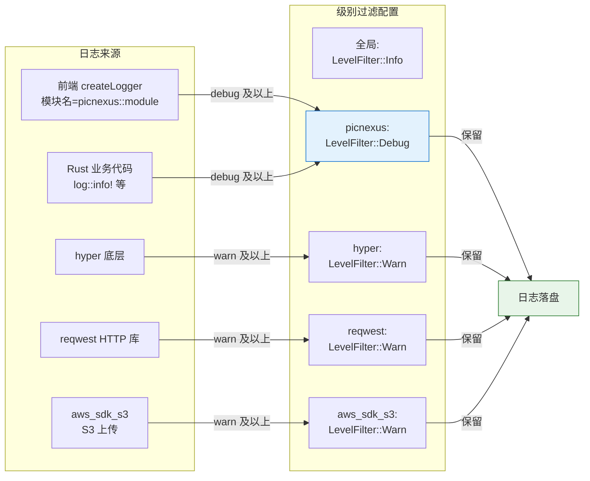
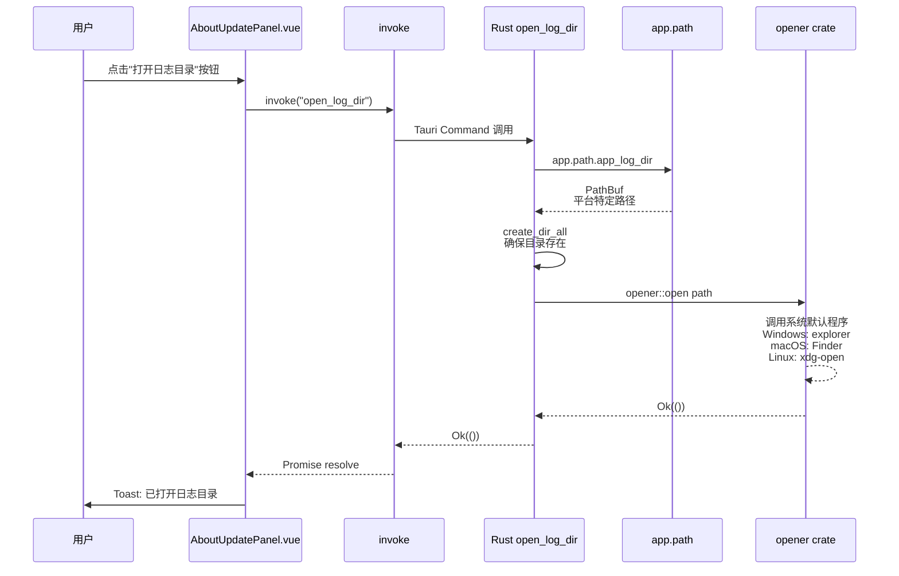
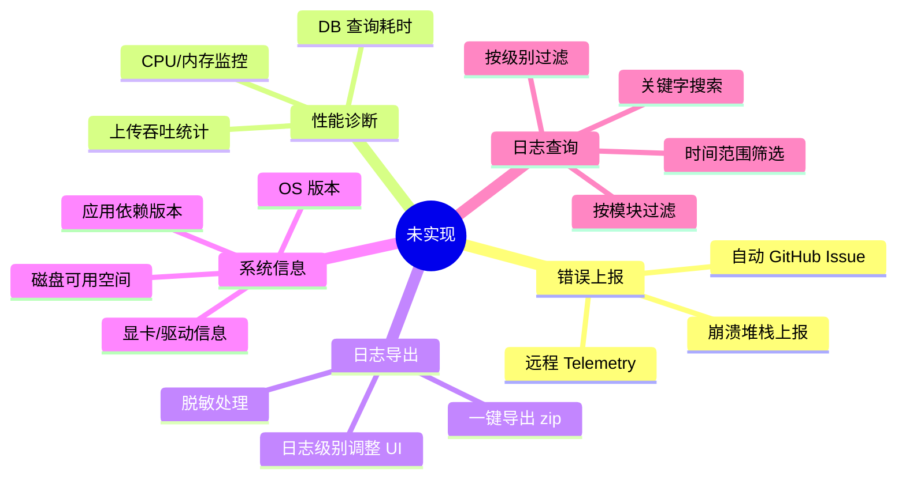

# 日志与诊断数据流

> 前后端统一的日志通道、落盘策略,以及诊断面板的数据来源。**新增日志、调试日志丢失、用户报障导出日志**时优先查看此文档。

## 概览

PicNexus 的日志系统采用 **前端 createLogger → @tauri-apps/plugin-log → Rust tauri_plugin_log** 的单一链路,所有日志最终汇聚到后端统一处理。

- **前端**:`src/utils/logger.ts` 提供 `createLogger(moduleName)`,强制禁用 `console.log`(CLAUDE.md 规定)
- **后端**:`tauri_plugin_log` 三目标输出(stdout + LogDir 文件 + Webview 回传前端 console)
- **级别**:全局 `Info`,`picnexus` 模块 `Debug`,噪音依赖(hyper/reqwest/aws_sdk_s3)降至 `Warn`
- **文件**:10MB 单文件上限,`KeepAll` 策略(不自动删除旧日志)
- **诊断面板**:`AboutUpdatePanel.vue` 仅暴露「版本号」和「打开日志目录」两个入口
- **错误上报**:**未实现**,所有错误仅本地记录

---

## 图 1:日志从前端调用到落盘的完整链路

展示一次 `logger.info('xxx')` 调用从 Vue 组件到 SQLite 同级目录日志文件的路径。

> **关键源文件**:`src/utils/logger.ts` L3~L34、`src-tauri/src/main.rs` L116~L136(tauri_plugin_log builder)、`src-tauri/Cargo.toml` L58~L59

```mermaid
flowchart TD
    %% 前端侧
    A[Vue 组件 / composable] --> B[import createLogger]
    B --> C[const log = createLogger 'ModuleName']
    C --> D{调用哪个方法?}
    D -- debug --> D1[log.debug msg ...args]
    D -- info --> D2[log.info msg ...args]
    D -- warn --> D3[log.warn msg ...args]
    D -- error err --> D4[log.error err ...args]

    D1 & D2 & D3 & D4 --> E[Logger 类格式化]
    E --> E1[拼接 [ModuleName] msg]
    E --> E2[Error 对象 → .message]
    E --> E3[其他 → JSON.stringify]

    E1 & E2 & E3 --> F[@tauri-apps/plugin-log<br/>debug/info/warn/error]

    F --> G[IPC 桥接]
    G --> H[Rust tauri_plugin_log]

    %% 后端分发
    H --> H1{全局 level 过滤<br/>Info 默认}
    H1 -- 通过 --> I{模块名过滤}
    I -- picnexus::* --> I1[Debug 级放行]
    I -- hyper/reqwest --> I2[Warn 以上放行]
    I -- 其他 --> I3[Info 以上放行]
    H1 -- 被过滤 --> X1[丢弃]

    I1 & I2 & I3 --> J[三目标并行写入]

    %% Target 1: stdout
    J --> T1[Target::Stdout<br/>开发模式终端可见]

    %% Target 2: LogDir
    J --> T2[Target::LogDir]
    T2 --> T2A[路径:<br/>Windows: %APPDATA%/us.picnex.app/logs<br/>macOS: ~/Library/Logs/us.picnex.app<br/>Linux: ~/.local/share/us.picnex.app/logs]
    T2A --> T2B{文件 &gt; 10MB?}
    T2B -- 是 --> T2C[轮转新文件<br/>KeepAll 保留所有]
    T2B -- 否 --> T2D[追加写入]

    %% Target 3: Webview
    J --> T3[Target::Webview]
    T3 --> T3A[前端 DevTools console 可见<br/>日志聚合]

    style A fill:#e3f2fd,stroke:#1976d2
    style T2D fill:#e8f5e9,stroke:#2e7d32
    style X1 fill:#ffebee,stroke:#c62828
```

---

## 图 2:级别过滤矩阵

展示「谁的日志会被保留」的决策表。改调试级别时对照这张图。

> **关键源文件**:`src-tauri/src/main.rs` L116~L136



**为什么降级 hyper/reqwest/aws_sdk_s3?** 这三个库在 Debug 级会刷屏,导致真正的业务日志被淹没。只保留 Warn 以上保证关键问题(超时、SSL 错误)仍可见。

---

## 图 3:诊断面板数据来源

展示 `AboutUpdatePanel.vue` 的「打开日志目录」按钮如何通过 IPC 打开平台特定文件夹。

> **关键源文件**:`src/components/settings/AboutUpdatePanel.vue`、`src-tauri/src/main.rs` `open_log_dir`(L1865~L1876)



**诊断面板当前仅暴露的信息**:
- 应用版本号(来自 `tauri.conf.json` 的 `version` 字段,通过 `getVersion()` API 读取)
- "打开日志目录" 按钮
- "检查更新" 按钮([auto-update-flow](./auto-update-flow.md))
- GitHub Issues 链接(用户反馈入口,手动打开)

---

## 图 4:当前未实现的诊断能力

展示未来可扩展的方向,便于后续需求规划时快速定位实施位置。



**当前的"用户报障"流程**:
1. 用户点"打开日志目录" → 手动定位日志文件
2. 用户自行压缩 logs 文件夹
3. 用户在 GitHub Issues 上传附件
4. 开发者手动分析文本日志

如未来要优化,优先实施**一键导出**(图 3 的按钮基础上加一步)。

---

## 排查指南

| 现象 | 可能原因 | 对照图表位置 |
|------|---------|-------------|
| 前端日志在终端不显示 | 开发模式下 Rust 的 Stdout target 正常,但 WebSocket 热更新期间可能丢失,刷新 DevTools 重试 | 图1 T1 |
| 生产环境日志文件找不到 | 用户不知道 `%APPDATA%/us.picnex.app/logs` 路径 → 教用户点 AboutUpdatePanel 按钮 | 图3 |
| 日志文件巨大占满磁盘 | `KeepAll` 策略不自动删除,10MB/文件累计 | 图1 T2C |
| `reqwest` 的 HTTP 请求细节看不到 | 被降级到 `Warn` 级别 | 图2 F4 |
| `console.log` 写了但看不到 | CLAUDE.md 禁止 `console.log`,应改用 `createLogger` | 图1 B |
| 前端组件日志没模块名前缀 | 忘记传 `createLogger('ModuleName')` 参数 | 图1 C |
| 某些错误前端有但后端日志没记录 | 错误被 `try/catch` 吞掉了,没调 `log.error` | 图1 D4 |
| 用户报障只有截图没有日志 | 诊断面板没有"一键导出" | 图4 未实现 |

---

## 相关文档

- [系统总览](./system-overview.md) — 宏观架构分层
- [IPC 命令层](./ipc-command-flow.md) — `open_log_dir` 作为 Command 的典型样例
- [应用生命周期](./app-lifecycle.md) — logger 初始化时机
- [故障排查索引](../reference/troubleshooting/) — 具体报错的分模块查询
