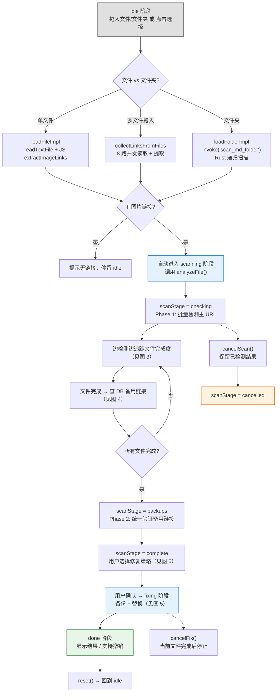
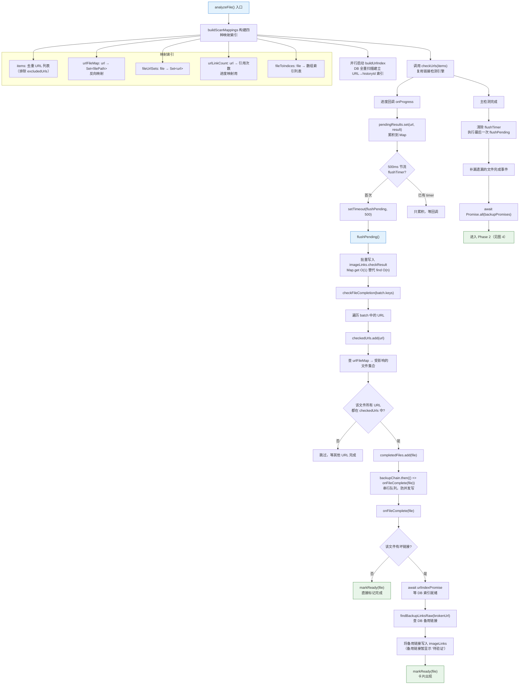
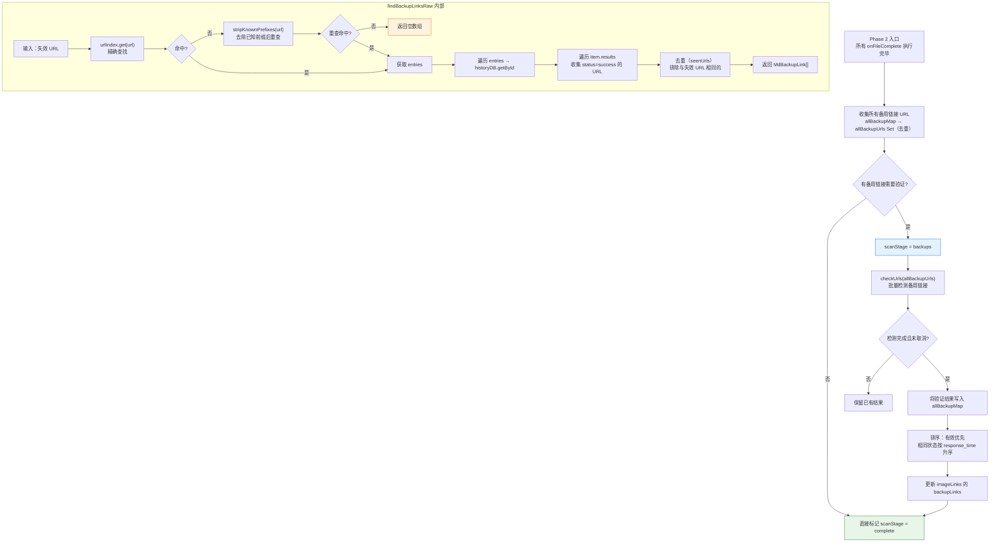
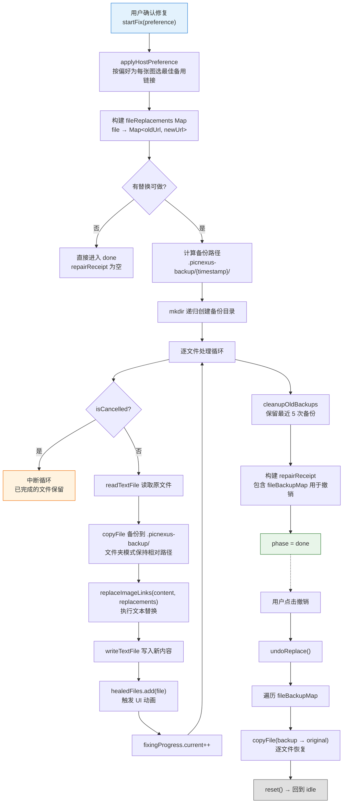
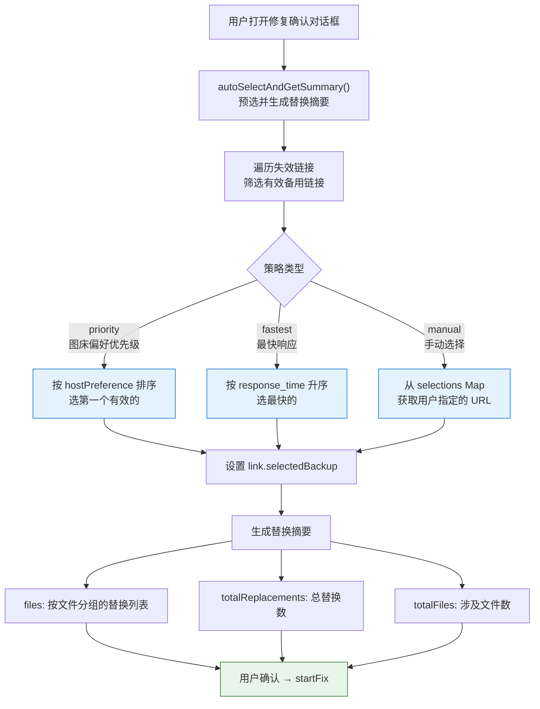

# 文档修复流程

> MD 文件中失效图片链接的自动检测与修复。拖入文件/文件夹 → 扫描失效链接 → 匹配备用图床 → 一键替换。
> 排查「扫描卡住」「备用链接不可用」「替换后乱码」时查看此文档。

---

## 图 1：四阶段总览

展示从 idle 到 done 的整体状态流转，是后续图的导航入口。

> **关键源文件**：`src/composables/md-rescue/shared.ts`（`RescuePhase`、`scanStage`）、`src/composables/md-rescue/useMdRescue.ts`（主编排）



### 阶段状态参数表

| 阶段 | `phase` | `scanStage` | 关键状态 | 可取消 |
|------|---------|-------------|---------|--------|
| 空闲 | `idle` | — | — | — |
| 收集中 | `idle`（`isCollecting=true`） | — | `collectProgress` | 是（`cancelCollect`） |
| 检测中 | `scanning` | `checking` | `scanProgress`, `readyFiles` | 是（`cancelScan`） |
| 查备用 | `scanning` | `backups` | `allBackupMap` | 是（`cancelScan`） |
| 扫描完成 | `scanning` | `complete` | 用户可操作 | — |
| 取消中 | `scanning` | `cancelling` | 等待当前任务结束 | — |
| 已取消 | `scanning` | `cancelled` | 保留已检测结果 | — |
| 修复中 | `fixing` | — | `fixingProgress`, `healedFiles` | 是（`cancelFix`） |
| 完成 | `done` | — | `repairReceipt` | — |

---

## 图 2：收集阶段 — 文件加载与链接提取

展示单文件和文件夹两条路径的具体实现差异，以及 Rust 侧的扫描细节。

> **关键源文件**：`src/composables/md-rescue/useMdFileLoader.ts`（`loadFileImpl`、`loadFolderImpl`、`collectLinksFromFiles`）、`src-tauri/src/commands/md_scanner.rs`

```mermaid
flowchart TD
    A["入口：handleDropPaths / selectMdFile / selectFolder"] --> B{判断输入类型}

    %% 单文件路径
    B -- "单文件" --> C["loadFileImpl(path)"]
    C --> C1["readTextFile(path)<br/>读取文件内容"]
    C1 --> C2["extractImageLinks(content)<br/>JS 正则提取"]
    C2 --> C3["跳过代码块<br/>``` 围栏 + 行内 backtick"]
    C3 --> C4["匹配  + &lt;img src&gt;"]
    C4 --> C5["返回 MdImageLinkWithFile[]"]

    %% 多文件拖入
    B -- "多文件拖入" --> D["筛选 .md / .markdown 后缀"]
    D --> D1{有 MD 文件?}
    D1 -- 否 --> D2["提示：未找到 MD 文件"]
    D1 -- 是 --> D3["collectLinksFromFiles(mdPaths)"]
    D3 --> D4["Semaphore(8) 并发控制"]
    D4 --> D5["逐文件：readTextFile → extractImageLinks"]
    D5 --> D6{getCollectCancelled()?}
    D6 -- 是 --> D7["中断收集"]
    D6 -- 否 --> D8["累积到 allLinks[]"]
    D8 --> C5

    %% 文件夹路径
    B -- "文件夹" --> E["loadFolderImpl(dir)"]
    E --> E1["invoke('scan_md_folder')<br/>单次 IPC"]
    E1 --> E2["Rust 侧：递归目录遍历<br/>收集 .md 文件列表"]
    E2 --> E3["Rust 侧：批量 read + 正则提取"]
    E3 --> E4["实时推送 md-scan://progress<br/>scannedFiles / processedFiles / foundLinks"]
    E4 --> E5{cancelled?}
    E5 -- 是 --> E6["return false"]
    E5 -- 否 --> E7["转换 RustScanResult → MdImageLinkWithFile[]"]
    E7 --> E8["保存 skippedDirs（无权限目录）"]
    E8 --> C5

    C5 --> F{imageLinks.length > 0?}
    F -- 是 --> G["自动调用 analyzeFile()"]
    F -- 否 --> H["提示无图片链接"]

    style G fill:#e8f5e9,stroke:#2e7d32
    style D2 fill:#fff3e0,stroke:#ef6c00
    style H fill:#fff3e0,stroke:#ef6c00
```

---

## 图 3：扫描阶段 — 边检测边处理

展示 `analyzeFile` 中「边检测边处理文件」的核心算法。这是本功能最复杂的部分。

> **关键源文件**：`src/composables/md-rescue/useMdRescue.ts`（`analyzeFile`、`buildScanMappings`、`checkFileCompletion`、`onFileComplete`、`flushPending`）



---

## 图 4：备用链接查找与验证

展示 Phase 2 中统一验证备用链接可用性的流程，以及 `findBackupLinksRaw` 的 DB 查询逻辑。

> **关键源文件**：`src/composables/md-rescue/useMdRescue.ts`（`analyzeFile` Phase 2 部分、`findBackupLinksRaw`、`buildUrlIndex`）



### buildUrlIndex 说明

`buildUrlIndex` 在 `analyzeFile` 开头与主检测**并行启动**，建立 URL → `{ historyId, serviceId }[]` 的内存索引：

1. `historyDB.getAllStream(1000)` 流式读取所有历史记录
2. 遍历每条记录的 `results`，取 `status=success` 的 URL
3. 对每个 URL 同时存储 rawUrl 和 `applyLinkPrefix` 后的 finalUrl（覆盖前缀改造）
4. 索引仅在 `analyzeFile` 期间存在，`reset()` 时清空

---

## 图 5：修复阶段 — 备份与替换

展示文件备份、文本替换、撤销的完整机制。

> **关键源文件**：`src/composables/md-rescue/useFileBackup.ts`（`executeReplace`、`undoReplace`、`cleanupOldBackups`）



---

## 图 6：修复策略决策

展示三种修复策略如何为每张失效图片选择备用链接。

> **关键源文件**：`src/composables/md-rescue/useRepairStrategy.ts`（`applyRepairStrategy`、`applyHostPreference`、`autoSelectAndGetSummary`）



### 策略类型说明

| 策略 | 适用场景 | 参数 | 选择逻辑 |
|------|---------|------|---------|
| `priority` | 偏好某些图床（如优先用自建 OSS） | `order: string[]`（图床 ID 优先级列表） | 按 order 排序有效备用链接，取第一个 |
| `fastest` | 追求最快加载速度 | 无 | 按 `response_time` 升序，取最快 |
| `manual` | 逐条手动选择（少量修复时） | `selections: Map<url, backupUrl>` | 直接使用用户指定的 URL |

---

## 排查指南

| 现象 | 可能原因 | 对照位置 |
|------|---------|---------|
| 拖入文件夹后长时间无响应 | 文件夹包含大量文件，Rust 侧仍在递归扫描 | 图 2 Rust 扫描流程 |
| 收集进度条不动 | `collectProgress` 依赖 Rust 事件 `md-scan://progress`，检查事件监听 | 图 2 实时推送 |
| 扫描进度跳跃不均匀 | `urlLinkCount` 映射导致进度按图片数而非 URL 数计算 | 图 3 进度映射 |
| 部分文件卡片一直不出现 | 该文件有 URL 共享于其他文件且那些 URL 尚未检测完 | 图 3 `checkFileCompletion` |
| 备用链接全部显示「不可用」 | urlIndex 未建立（DB 为空或 `buildUrlIndex` 失败） | 图 4 `buildUrlIndex` |
| 备用链接显示「待验证」不更新 | Phase 2 的 `checkUrls` 被取消或尚未开始 | 图 4 `scanStage=backups` |
| 替换后文件内容乱码 | 原文件编码非 UTF-8（`readTextFile` 默认 UTF-8） | 图 5 `readTextFile` |
| 撤销恢复失败 | `.picnexus-backup` 目录被手动删除 | 图 5 `undoReplace` |
| 「无法修复」数量比预期多 | 该图片未上传到其他图床（DB 中无备用记录） | 图 4 `findBackupLinksRaw` |
| 图床偏好设置不生效 | `hostPreference` 为空数组（未设置偏好则不排序） | 图 6 `priority` 策略 |
| 徽章/代理服务 URL 里的 `.js`/`.css` 被当图片扫 | `isValidImageUrl` / `is_valid_image_url` 按 URL path 末尾扩展名做黑名单过滤（`js/css/html/pdf/zip/mp4/...`），query/fragment 不参与 | `src/utils/mdParser.ts` `NON_IMAGE_EXTENSIONS`、`src-tauri/src/commands/md_scanner.rs` 同名常量（两侧必须保持一致） |

---

## 相关文档

- [辅助功能流程 图 11](./auxiliary-flows.md#图-11链接检测流程) — 复用的链接检测引擎
- [链接检测流程](./link-check-flow.md) — 服务感知请求和并发控制细节
- [批量迁移流程](./batch-migrate-flow.md) — 另一个复用历史数据的功能
