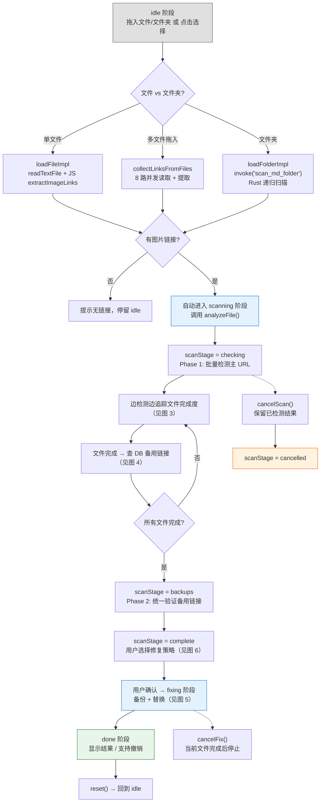
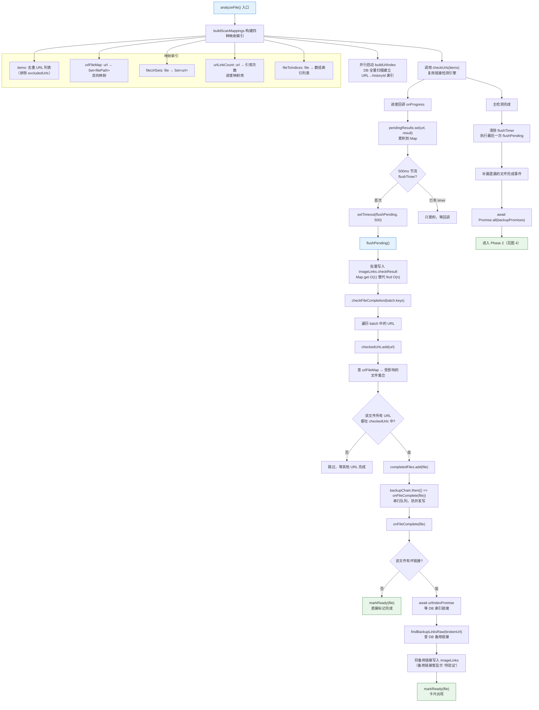
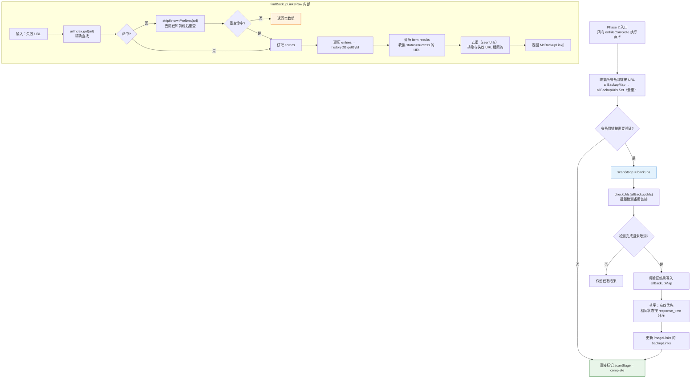
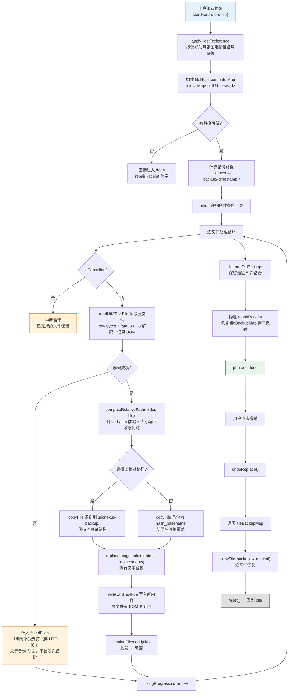
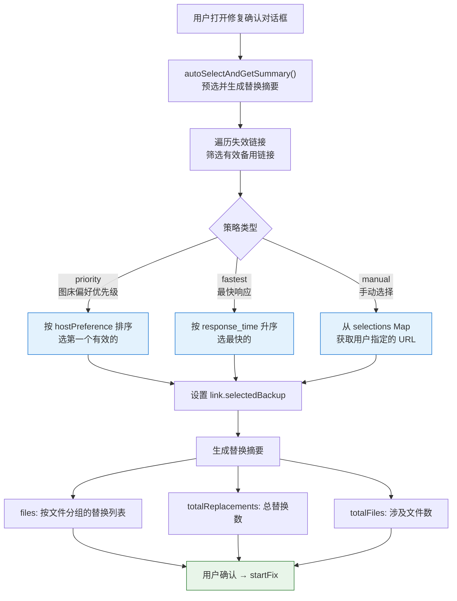

# 文档修复流程

> MD 文件中失效图片链接的自动检测与修复。拖入文件/文件夹 → 扫描失效链接 → 匹配备用图床 → 一键替换。
> 排查「扫描卡住」「备用链接不可用」「替换后乱码」时查看此文档。

---

## 图 1：四阶段总览

展示从 idle 到 done 的整体状态流转，是后续图的导航入口。

> **关键源文件**：`src/composables/md-rescue/shared.ts`（`RescuePhase`、`scanStage`）、`src/composables/md-rescue/useMdRescue.ts`（主编排）

```mermaid
flowchart TD
    A["idle 阶段<br/>拖入文件/文件夹 或 点击选择"] --> B{文件 vs 文件夹?}
    B -- 单文件 --> C["loadFileImpl<br/>readTextFile + JS extractImageLinks"]
    B -- 多文件拖入 --> D["collectLinksFromFiles<br/>8 路并发读取 + 提取"]
    B -- 文件夹 --> E["loadFolderImpl<br/>invoke('scan_md_folder')<br/>Rust 递归扫描"]

    C --> F{有图片链接?}
    D --> F
    E --> F
    F -- 否 --> F1["提示无链接，停留 idle"]
    F -- 是 --> G["自动进入 scanning 阶段<br/>调用 analyzeFile()"]

    G --> H["scanStage = checking<br/>Phase 1: 批量检测主 URL"]
    H --> I["边检测边追踪文件完成度<br/>（见图 3）"]
    I --> J["文件完成 → 查 DB 备用链接<br/>（见图 4）"]
    J --> K{所有文件完成?}
    K -- 否 --> I
    K -- 是 --> L["scanStage = backups<br/>Phase 2: 统一验证备用链接"]
    L --> M["scanStage = complete<br/>用户选择修复策略（见图 6）"]

    M --> N["用户确认 → fixing 阶段<br/>备份 + 替换（见图 5）"]
    N --> O["done 阶段<br/>显示结果 / 支持撤销"]
    O --> P["reset() → 回到 idle"]

    %% 取消分支
    H -.-> Q["cancelScan()<br/>保留已检测结果"]
    Q --> Q1["scanStage = cancelled"]
    N -.-> R["cancelFix()<br/>当前文件完成后停止"]

    style A fill:#e0e0e0,stroke:#616161
    style G fill:#e3f2fd,stroke:#1976d2
    style N fill:#e3f2fd,stroke:#1976d2
    style O fill:#e8f5e9,stroke:#2e7d32
    style Q1 fill:#fff3e0,stroke:#ef6c00
```

### 阶段状态参数表

| 阶段 | `phase` | `scanStage` | 关键状态 | 可取消 |
|------|---------|-------------|---------|--------|
| 空闲 | `idle` | — | — | — |
| 收集中 | `idle`（`isCollecting=true`） | — | `collectProgress` | 是（`cancelCollect`） |
| 检测中 | `scanning` | `checking` | `scanProgress`, `readyFiles` | 是（`cancelScan`） |
| 查备用 | `scanning` | `backups` | `allBackupMap` | 是（`cancelScan`） |
| 扫描完成 | `scanning` | `complete` | 用户可操作 | — |
| 取消中 | `scanning` | `cancelling` | 等待当前任务结束 | — |
| 已取消 | `scanning` | `cancelled` | 保留已检测结果 | — |
| 修复中 | `fixing` | — | `fixingProgress`, `healedFiles` | 是（`cancelFix`） |
| 完成 | `done` | — | `repairReceipt` | — |

---

## 图 2：收集阶段 — 文件加载与链接提取

展示单文件和文件夹两条路径的具体实现差异，以及 Rust 侧的扫描细节。

> **关键源文件**：`src/composables/md-rescue/useMdFileLoader.ts`（`loadFileImpl`、`loadFolderImpl`、`collectLinksFromFiles`）、`src-tauri/src/commands/md_scanner.rs`

```mermaid
flowchart TD
    A["入口：handleDropPaths / selectMdFile / selectFolder"] --> B{判断输入类型}

    %% 单文件路径
    B -- "单文件" --> C["loadFileImpl(path)"]
    C --> C1["readUtf8TextFile(path)<br/>raw bytes + fatal UTF-8 解码"]
    C1 --> C1a{解码成功?}
    C1a -- 否 --> C1b["提示「编码不受支持（非 UTF-8）」<br/>不加载，避免乱码进入修复链路"]
    C1a -- 是 --> C2["extractImageLinks(content)<br/>JS 正则提取"]
    C2 --> C3["跳过代码块<br/>``` 围栏 + 行内 backtick"]
    C3 --> C4["匹配 ![](url) + &lt;img src&gt;"]
    C4 --> C5["返回 MdImageLinkWithFile[]"]

    %% 多文件拖入
    B -- "多文件拖入" --> D["筛选 .md / .markdown 后缀"]
    D --> D1{有 MD 文件?}
    D1 -- 否 --> D2["提示：未找到 MD 文件"]
    D1 -- 是 --> D3["collectLinksFromFiles(mdPaths)"]
    D3 --> D4["Semaphore(8) 并发控制"]
    D4 --> D5["逐文件：readUtf8TextFile → extractImageLinks<br/>非 UTF-8 文件计入读取失败并跳过"]
    D5 --> D6{getCollectCancelled()?}
    D6 -- 是 --> D7["中断收集"]
    D6 -- 否 --> D8["累积到 allLinks[]"]
    D8 --> C5

    %% 文件夹路径
    B -- "文件夹" --> E["loadFolderImpl(dir)"]
    E --> E1["invoke('scan_md_folder')<br/>单次 IPC"]
    E1 --> E2["Rust 侧：递归目录遍历<br/>收集 .md 文件列表<br/>跳过 .picnexus-backup 备份目录"]
    E2 --> E2a["Rust 侧：strip_verbatim_prefix<br/>剥掉 canonicalize 产生的 \\\\?\\ 前缀"]
    E2a --> E3["Rust 侧：批量 read + 正则提取"]
    E3 --> E4["实时推送 md-scan://progress<br/>scannedFiles / processedFiles / foundLinks"]
    E4 --> E5{cancelled?}
    E5 -- 是 --> E6["return false"]
    E5 -- 否 --> E7["转换 RustScanResult → MdImageLinkWithFile[]"]
    E7 --> E8["保存 skippedDirs（无权限目录）"]
    E8 --> C5

    C5 --> F{imageLinks.length > 0?}
    F -- 是 --> G["自动调用 analyzeFile()"]
    F -- 否 --> H["提示无图片链接"]

    style G fill:#e8f5e9,stroke:#2e7d32
    style D2 fill:#fff3e0,stroke:#ef6c00
    style H fill:#fff3e0,stroke:#ef6c00
```

---

## 图 3：扫描阶段 — 边检测边处理

展示 `analyzeFile` 中「边检测边处理文件」的核心算法。这是本功能最复杂的部分。

> **关键源文件**：`src/composables/md-rescue/useMdRescue.ts`（`analyzeFile`、`buildScanMappings`、`checkFileCompletion`、`onFileComplete`、`flushPending`）

```mermaid
flowchart TD
    A["analyzeFile() 入口"] --> B["buildScanMappings 构建四种映射索引"]

    subgraph 映射索引
        B1["items: 去重 URL 列表<br/>（排除 excludedUrls）"]
        B2["urlFileMap: url → Set&lt;filePath&gt;<br/>反向映射"]
        B3["fileUrlSets: file → Set&lt;url&gt;"]
        B4["urlLinkCount: url → 引用次数<br/>进度映射用"]
        B5["fileToIndices: file → 数组索引列表"]
    end
    B --> B1 & B2 & B3 & B4 & B5

    B --> C["并行启动 buildUrlIndex<br/>DB 全量扫描建立 URL→historyId 索引"]
    B --> D["调用 checkUrls(items)<br/>复用链接检测引擎"]

    D --> E["进度回调 onProgress"]
    E --> E1["pendingResults.set(url, result)<br/>累积到 Map"]
    E1 --> E2{500ms 节流<br/>flushTimer?}
    E2 -- 首次 --> E3["setTimeout(flushPending, 500)"]
    E2 -- 已有 timer --> E4["只累积，等回调"]

    E3 --> F["flushPending()"]
    F --> F1["批量写入 imageLinks.checkResult<br/>Map.get O(1) 替代 find O(n)"]
    F1 --> F2["checkFileCompletion(batch.keys)"]

    F2 --> G["遍历 batch 中的 URL"]
    G --> G1["checkedUrls.add(url)"]
    G1 --> G2["查 urlFileMap → 受影响的文件集合"]
    G2 --> G3{"该文件所有 URL<br/>都在 checkedUrls 中?"}
    G3 -- 否 --> G4["跳过，等其他 URL 完成"]
    G3 -- 是 --> G5["completedFiles.add(file)"]
    G5 --> G6["backupChain.then(() => onFileComplete(file))<br/>串行队列，防并发写"]

    G6 --> H["onFileComplete(file)"]
    H --> H1{该文件有坏链接?}
    H1 -- 否 --> H2["markReady(file)<br/>直接标记完成"]
    H1 -- 是 --> H3["await urlIndexPromise<br/>等 DB 索引就绪"]
    H3 --> H4["findBackupLinksRaw(brokenUrl)<br/>查 DB 备用链接"]
    H4 --> H5["将备用链接写入 imageLinks<br/>（备用链接暂显示 '待验证'）"]
    H5 --> H6["markReady(file)<br/>卡片出现"]

    D --> I["主检测完成"]
    I --> I1["清除 flushTimer<br/>执行最后一次 flushPending"]
    I1 --> I2["补漏遗漏的文件完成事件"]
    I2 --> I3["await Promise.all(backupPromises)"]
    I3 --> J["进入 Phase 2（见图 4）"]

    style A fill:#e3f2fd,stroke:#1976d2
    style F fill:#e3f2fd,stroke:#1976d2
    style H2 fill:#e8f5e9,stroke:#2e7d32
    style H6 fill:#e8f5e9,stroke:#2e7d32
    style J fill:#e8f5e9,stroke:#2e7d32
```

---

## 图 4：备用链接查找与验证

展示 Phase 2 中统一验证备用链接可用性的流程，以及 `findBackupLinksRaw` 的 DB 查询逻辑。

> **关键源文件**：`src/composables/md-rescue/useMdRescue.ts`（`analyzeFile` Phase 2 部分、`findBackupLinksRaw`、`buildUrlIndex`）

```mermaid
flowchart TD
    A["Phase 2 入口<br/>所有 onFileComplete 执行完毕"] --> B["收集所有备用链接 URL<br/>allBackupMap → allBackupUrls Set（去重）"]
    B --> C{有备用链接需要验证?}
    C -- 否 --> D["直接标记 scanStage = complete"]
    C -- 是 --> E["scanStage = backups"]
    E --> F["checkUrls(allBackupUrls)<br/>批量检测备用链接"]
    F --> G{检测完成且未取消?}
    G -- 否 --> H["保留已有结果"]
    G -- 是 --> I["将验证结果写入 allBackupMap"]

    I --> J["排序：有效优先<br/>相同状态按 response_time 升序"]
    J --> K["更新 imageLinks 的 backupLinks"]
    K --> D

    subgraph findBackupLinksRaw 内部
        L["输入：失效 URL"] --> M["urlIndex.get(url)<br/>精确查找"]
        M --> N{命中?}
        N -- 否 --> O["stripKnownPrefixes(url)<br/>去除已知前缀后重查"]
        O --> P{重查命中?}
        P -- 否 --> Q["返回空数组"]
        P -- 是 --> R["获取 entries"]
        N -- 是 --> R
        R --> S["遍历 entries → historyDB.getById"]
        S --> T["遍历 item.results<br/>收集 status=success 的 URL"]
        T --> U["去重（seenUrls）<br/>排除与失效 URL 相同的"]
        U --> V["返回 MdBackupLink[]"]
    end

    style D fill:#e8f5e9,stroke:#2e7d32
    style E fill:#e3f2fd,stroke:#1976d2
    style Q fill:#fff3e0,stroke:#ef6c00
```

### buildUrlIndex 说明

`buildUrlIndex` 在 `analyzeFile` 开头与主检测**并行启动**，建立 URL → `{ historyId, serviceId }[]` 的内存索引：

1. `historyDB.getAllStream(1000)` 流式读取所有历史记录
2. 遍历每条记录的 `results`，取 `status=success` 的 URL
3. 对每个 URL 同时存储 rawUrl 和 `applyLinkPrefix` 后的 finalUrl（覆盖前缀改造）
4. 索引仅在 `analyzeFile` 期间存在，`reset()` 时清空

---

## 图 5：修复阶段 — 备份与替换

展示文件备份、文本替换、撤销的完整机制。

> **关键源文件**：`src/composables/md-rescue/useFileBackup.ts`（`executeReplace`、`undoReplace`、`cleanupOldBackups`、`computeRelativePath`）、`src/composables/md-rescue/mdTextIo.ts`（`readUtf8TextFile`、`writeUtf8TextFile`）

```mermaid
flowchart TD
    A["用户确认修复<br/>startFix(preference)"] --> B["applyHostPreference<br/>按偏好为每张图选最佳备用链接"]
    B --> C["构建 fileReplacements Map<br/>file → Map&lt;oldUrl, newUrl&gt;"]
    C --> D{有替换可做?}
    D -- 否 --> D1["直接进入 done<br/>repairReceipt 为空"]
    D -- 是 --> E["计算备份路径<br/>.picnexus-backup/{timestamp}/"]
    E --> F["mkdir 递归创建备份目录"]

    F --> G["逐文件处理循环"]
    G --> G1{isCancelled?}
    G1 -- 是 --> G2["中断循环<br/>已完成的文件保留"]
    G1 -- 否 --> H["readUtf8TextFile 读取原文件<br/>raw bytes + fatal UTF-8 解码，记录 BOM"]
    H --> H1{解码成功?}
    H1 -- 否 --> H2["计入 failedFiles<br/>「编码不受支持（非 UTF-8）」<br/>先于备份/写回，不留残次备份"]
    H2 --> M
    H1 -- 是 --> I0["computeRelativePath(folder, file)<br/>剥 verbatim 前缀 + 大小写不敏感比对"]
    I0 --> I1{算得出相对路径?}
    I1 -- 是 --> I["copyFile 备份到 .picnexus-backup/<br/>保持子目录结构"]
    I1 -- 否 --> I2["copyFile 备份为 hash_basename<br/>防同名互相覆盖"]
    I & I2 --> J["replaceImageLinks(content, replacements)<br/>执行文本替换"]
    J --> K["writeUtf8TextFile 写入新内容<br/>原文件有 BOM 则补回"]
    K --> L["healedFiles.add(file)<br/>触发 UI 动画"]
    L --> M["fixingProgress.current++"]
    M --> G

    G --> N["cleanupOldBackups<br/>保留最近 5 次备份"]
    N --> O["构建 repairReceipt<br/>包含 fileBackupMap 用于撤销"]
    O --> P["phase = done"]

    %% 撤销路径
    P -.-> Q["用户点击撤销"]
    Q --> R["undoReplace()"]
    R --> R1["遍历 fileBackupMap"]
    R1 --> R2["copyFile(backup → original)<br/>逐文件恢复"]
    R2 --> R3["reset() → 回到 idle"]

    style A fill:#e3f2fd,stroke:#1976d2
    style P fill:#e8f5e9,stroke:#2e7d32
    style G2 fill:#fff3e0,stroke:#ef6c00
    style H2 fill:#fff3e0,stroke:#ef6c00
    style R3 fill:#e0e0e0,stroke:#616161
```

### 备份路径不变量

备份路径必须**一文件一路径**，否则撤销时会把同一份备份写进两个原始文件，其中一个的原始内容永久丢失。三条防线：

1. **Rust 侧剥 verbatim 前缀**（根因）：`std::fs::canonicalize` 在 Windows 上返回 `\\?\C:\docs`，而文件选择对话框返回 `C:\docs`。两者拼不到一起，前端前缀比对必然落空。`scan_md_folder` 在返回前统一剥离（`strip_verbatim_prefix`），非盘符 verbatim 路径（`\\?\Volume{GUID}\`）与超过 MAX_PATH 的路径保留原样。
2. **前端 `computeRelativePath` 防御**：比对前再剥一次 verbatim 前缀、统一分隔符、大小写不敏感。
3. **兜底不退化为裸 basename**：相对路径算不出来时用 `hash_basename`（FNV-1a 32bit，8 字符），不同目录的同名文件天然分开。

### 备份目录排除

备份目录 `.picnexus-backup` 建在被扫描文件夹内部，Rust 递归扫描时按目录名跳过——否则下一轮扫描会把"修复前的原件"当正常文档再修一遍：失效数虚高、备份被改写、还会产生嵌套备份。目录名在 Rust（`md_scanner.rs` 的 `BACKUP_DIR_NAME`）与前端（`useFileBackup.ts` 的 `BACKUP_DIR_NAME`）各写一份，由 `scripts/check-cross-language-constants.mjs` 守着防漂移。

### 编码约束

修复链路只处理 UTF-8。plugin-fs 的 `readTextFile` 用非 fatal 的 `TextDecoder`，GBK 等非 UTF-8 字节会被静默替换成 `�` 并写回原文件——这是会永久损坏用户数据的静默失败。`mdTextIo.ts` 改为读原始字节 + `new TextDecoder('utf-8', { fatal: true })`：解码失败即拒绝该文件（单文件模式提示"编码不受支持"，批量模式计入 `failedFiles` / 读取失败）。原文件的 UTF-8 BOM 会被记录并在写回时补回，不静默改变文件字节。

### 文件访问白名单

`capabilities/default.json` 的静态 fs scope 只覆盖 app 自己的目录（appdata / temp / `$RESOURCE/data`），
**用户目录一概不在内**。文件选择对话框会自动把选中路径加进运行时白名单，
**拖放不会**——2026-08-15 实测：同一个文件点「选择单个文件」能读，拖进来是
`forbidden path ... allow-stat permission`，而拖放是本页最显眼的主入口。

补法是 [`allowUserPaths`](../../src/security/fsScope.ts) → Rust 的 `allow_user_path`
（[user_files.rs](../../src-tauri/src/commands/user_files.rs)），由它看过 metadata 后决定
目录递归授权还是单文件授权。**必须在第一个 `stat` 之前调**，否则第一步就被拦。

两个调用点：`handleDropPaths`（拖放）与 `handlePickRecent`（最近打开）。

> ⚠️ 授权只活在本次进程内——项目**未装** `persisted-scope`。所以「最近打开」每次点都要
> 重新授权一次，不能因为上次成功过就跳过。

### setup 上下文约束

`useToast()` / `useConfigManager()` 内部走 Vue 的 `inject()`，**只在 setup 栈期间可用**。
本链路有四个模块级函数的调用点全在 setup 之外——`executeReplace`（「修复链接」click）、
`undoReplace`（「撤销」click）、`saveHostPreference`（保存偏好 click）、
`loadHostPreference`（「扫描完成」的 watcher 回调）——所以依赖一律**由调用方在
setup 期间取好、当参数传进来**，由 `useMdRescueManager()` 里的四个包装完成注入。

> ⚠️ `e2a2137` 把大 composable 拆成子模块时，这四个函数被搬出 `useMdRescueManager()`，
> 各自在函数体里重新调了一次 `useToast()` / `useConfigManager()`——位置一变，inject 就失效。
> 表现：每次扫描完成控制台报 `No PrimeVue Toast provided!`，图床偏好静默不生效；
> 「修复链接」和「撤销」按钮一点就抛。
>
> **单测没抓到，是因为两个 spec 都 mock 了 `@/composables/useToast`**——mock 之后
> inject 永远成功，真实失败被盖住。护栏改由
> [`setupContextGuard.spec.ts`](../../tests/unit/composables/md-rescue/setupContextGuard.spec.ts)
> 钉着，**那个文件不得 mock 这两个模块**。

---

## 图 6：修复策略决策

展示三种修复策略如何为每张失效图片选择备用链接。

> **关键源文件**：`src/composables/md-rescue/useRepairStrategy.ts`（`applyRepairStrategy`、`applyHostPreference`、`autoSelectAndGetSummary`）

```mermaid
flowchart TD
    A["用户打开修复确认对话框"] --> B["autoSelectAndGetSummary()<br/>预选并生成替换摘要"]
    B --> C["遍历失效链接<br/>筛选有效备用链接"]

    C --> D{策略类型}

    D -- "priority<br/>图床偏好优先级" --> E["按 hostPreference 排序<br/>选第一个有效的"]
    D -- "fastest<br/>最快响应" --> F["按 response_time 升序<br/>选最快的"]
    D -- "manual<br/>手动选择" --> G["从 selections Map<br/>获取用户指定的 URL"]

    E --> H["设置 link.selectedBackup"]
    F --> H
    G --> H

    H --> I["生成替换摘要"]
    I --> I1["files: 按文件分组的替换列表"]
    I --> I2["totalReplacements: 总替换数"]
    I --> I3["totalFiles: 涉及文件数"]

    I1 & I2 & I3 --> J["用户确认 → startFix"]

    style E fill:#e3f2fd,stroke:#1976d2
    style F fill:#e3f2fd,stroke:#1976d2
    style G fill:#e3f2fd,stroke:#1976d2
    style J fill:#e8f5e9,stroke:#2e7d32
```

### 策略类型说明

| 策略 | 适用场景 | 参数 | 选择逻辑 |
|------|---------|------|---------|
| `priority` | 偏好某些图床（如优先用自建 OSS） | `order: string[]`（图床 ID 优先级列表） | 按 order 排序有效备用链接，取第一个 |
| `fastest` | 追求最快加载速度 | 无 | 按 `response_time` 升序，取最快 |
| `manual` | 逐条手动选择（少量修复时） | `selections: Map<url, backupUrl>` | 直接使用用户指定的 URL |

---

## 排查指南

| 现象 | 可能原因 | 对照位置 |
|------|---------|---------|
| 拖入文件夹后长时间无响应 | 文件夹包含大量文件，Rust 侧仍在递归扫描 | 图 2 Rust 扫描流程 |
| 收集进度条不动 | `collectProgress` 依赖 Rust 事件 `md-scan://progress`，检查事件监听 | 图 2 实时推送 |
| 扫描进度跳跃不均匀 | `urlLinkCount` 映射导致进度按图片数而非 URL 数计算 | 图 3 进度映射 |
| 部分文件卡片一直不出现 | 该文件有 URL 共享于其他文件且那些 URL 尚未检测完 | 图 3 `checkFileCompletion` |
| 备用链接全部显示「不可用」 | urlIndex 未建立（DB 为空或 `buildUrlIndex` 失败） | 图 4 `buildUrlIndex` |
| 备用链接显示「待验证」不更新 | Phase 2 的 `checkUrls` 被取消或尚未开始 | 图 4 `scanStage=backups` |
| 提示「编码不受支持（非 UTF-8）」 | 已拦截：原文件不是 UTF-8（如记事本 ANSI/GBK）。`readUtf8TextFile` 用 fatal 解码，宁可拒绝也不写回乱码——把文件转成 UTF-8 后重试 | 图 5 `readUtf8TextFile`、[编码约束](#编码约束) |
| 替换后文件内容乱码 | 不应再出现。若仍发生，检查是否有旁路仍在用 plugin-fs 的 `readTextFile`（非 fatal 解码）读用户 md 文件 | 图 5 [编码约束](#编码约束) |
| 备份目录被平铺、子目录结构丢失 | 相对路径算不出来（路径形态对不上），已退回 `hash_basename` 防撞命名，不会互相覆盖。若整体平铺，先看 Rust 返回的路径是否仍带 `\\?\` 前缀 | 图 5 [备份路径不变量](#备份路径不变量) |
| 撤销后两个同名文件内容互串 | 不应再出现。历史成因是 verbatim 前缀让相对路径退化为裸 basename，同名备份互相顶掉 | 图 5 [备份路径不变量](#备份路径不变量) |
| 修复过的文件夹再扫一次，失效数虚高 | 检查 `.picnexus-backup` 是否被扫进来（Rust 递归按 `BACKUP_DIR_NAME` 跳过）；目录名两侧漂移会被 `npm run lint` 拦下 | 图 2 Rust 扫描、[备份目录排除](#备份目录排除) |
| 撤销恢复失败 | `.picnexus-backup` 目录被手动删除 | 图 5 `undoReplace` |
| 控制台报 `No PrimeVue Toast provided!` / 图床偏好不生效 / 点「修复链接」「撤销」没反应 | 模块级函数自己调了 inject 类 composable，见 [setup 上下文约束](#setup-上下文约束) | 图 5、图 6 |
| 拖放文件报 `forbidden path ... allow-stat` | 路径没进 fs 运行时白名单，见 [文件访问白名单](#文件访问白名单)。按钮选文件能用而拖放不能，就是这条 | 图 2 加载入口 |
| 「无法修复」数量比预期多 | 该图片未上传到其他图床（DB 中无备用记录） | 图 4 `findBackupLinksRaw` |
| 图床偏好设置不生效 | `hostPreference` 为空数组（未设置偏好则不排序） | 图 6 `priority` 策略 |
| 徽章/代理服务 URL 里的 `.js`/`.css` 被当图片扫 | `isValidImageUrl` / `is_valid_image_url` 按 URL path 末尾扩展名做黑名单过滤（`js/css/html/pdf/zip/mp4/...`），query/fragment 不参与 | `src/utils/mdParser.ts` `NON_IMAGE_EXTENSIONS`、`src-tauri/src/commands/md_scanner.rs` 同名常量（两侧必须保持一致） |

---

## 相关文档

- [辅助功能流程 图 11](./auxiliary-flows.md#图-11链接检测流程) — 复用的链接检测引擎
- [链接检测流程](./link-check-flow.md) — 服务感知请求和并发控制细节
- [批量迁移流程](./batch-migrate-flow.md) — 另一个复用历史数据的功能
