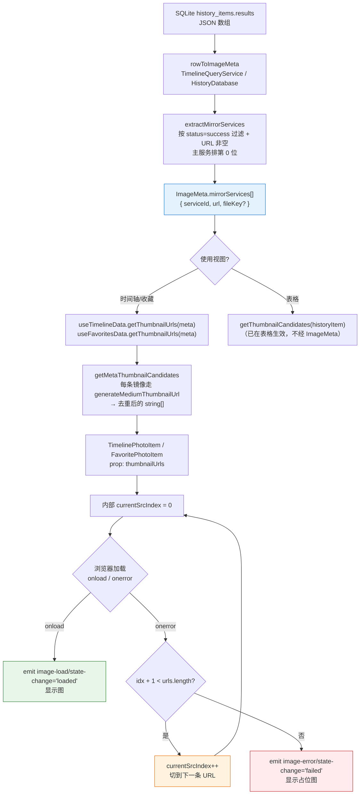
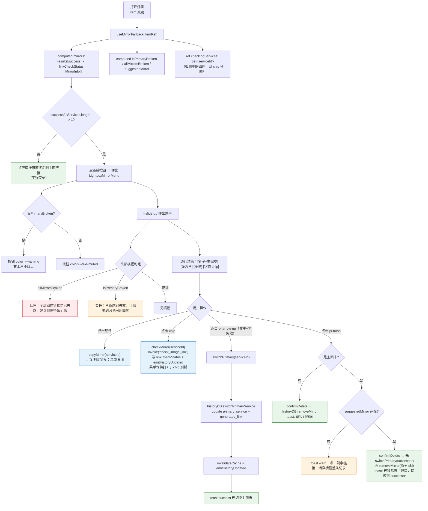
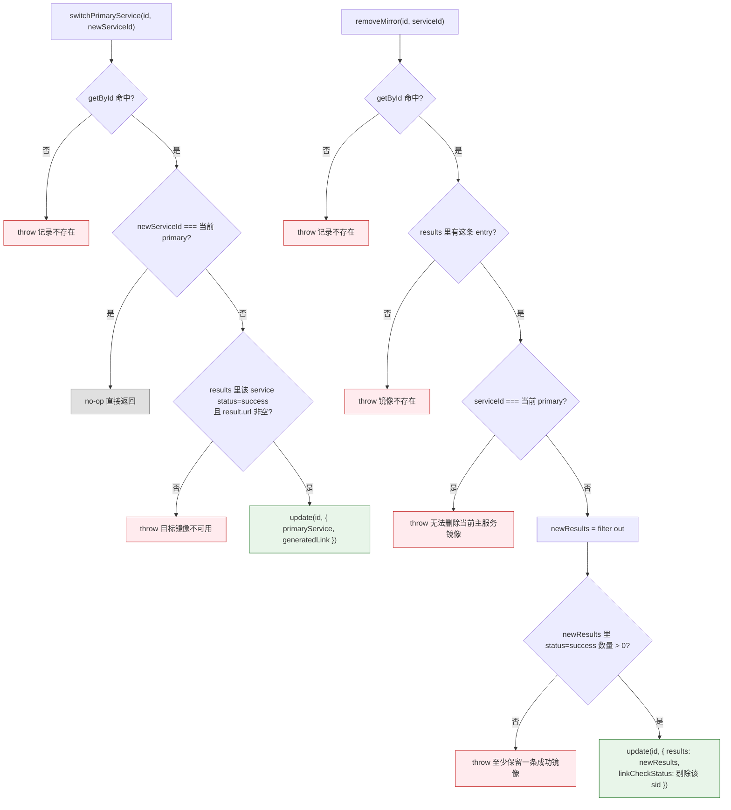

# 多图床备份 fallback 与切换流程

> 一张图片上传到多个图床时，浏览/灯箱如何选择显示链接、主图床失效如何兜底、用户如何切主图床/移除链接/重新检测单条。排查「列表图片加载失败」「灯箱复制按钮菜单不弹」「切主图床不生效」时查看本文档。
>
> **术语说明**：UI 文案使用"图床/备份链接"口径；内部类型名（`MirrorInfo` / `MirrorCheckState` / `useMirrorFallback`）仍沿用 mirror 词源，保持代码侧稳定。

---

## 核心理念

每条 HistoryItem 的 `results` 数组存储了**所有成功/失败的图床上传记录**，但对外只呈现一条"主图床"链接（`primaryService` + `generatedLink`）。备份兜底分两层：

| 层级 | 场景 | 机制 | 用户感知 |
|------|------|------|---------|
| **层 1：视觉兜底** | 主图 URL 在浏览器里 404/超时 | `` 自动尝试下一条备份 URL | 无感知，看到的一直是正常图 |
| **层 2：主动管理** | link-check 已标记主图床失效 | 灯箱底栏"复制/链接"按钮（`pi-link`）弹出图床菜单：复制 / 切主图床 / 移除此链接 / 重新检测单条 | 按钮变警告色 + 小红点提示 |

**为什么不全自动切主图床？** link-check 有误判（尤其防盗链 403 实际浏览器能看），自动改 DB 会把"能用的"换成"可能也能用的"且不可追溯。所以：**视觉兜底自动，数据层改动必须用户确认**。

---

## 图 1：层 1 视觉兜底数据流

浏览列表加载缩略图时，后端把 `results` JSON 里全部成功镜像抽成 `ImageMeta.mirrorServices[]`，前端组件按序尝试。主服务在数组首位，其余按 `results` 原顺序。

> **关键源文件**：
> - `src/types/image-meta.ts`（`extractMirrorServices`、`MirrorService`）
> - `src/services/database/TimelineQueryService.ts`（`rowToImageMeta`）
> - `src/services/database/HistoryDatabase.ts`（`rowToImageMeta`）
> - `src/composables/useThumbCache.ts`（`getMetaThumbnailCandidates`）
> - `src/components/views/timeline/TimelinePhotoItem.vue`、`src/components/views/favorites/FavoritePhotoItem.vue`

### 关键不变量

| 不变量 | 原因 |
|--------|------|
| `mirrorServices[0]` 总是当前主服务 | `extractMirrorServices` 把 `serviceId === primaryService` 单独抽出放首位 |
| 每条镜像必须有 `result.url` | 空 URL 无法作为 ``，直接跳过 |
| 预加载仍只加载主服务 URL | `useImagePreload` 调的是 `getThumbnailUrl(meta)`（单条），fallback 只在可视区域的 `` 真正失败时触发，避免浪费带宽 |
| 列表失败态不反映到 DB | 层 1 完全是客户端兜底。真正的"失效"判定只走 link-check |

---

## 图 2：层 2 主动管理交互流

灯箱底栏的**链接按钮（`pi-link`）**合并了"复制链接"和"管理图床备份"两件事：
- 单图床 → 直接复制主图链接，不弹菜单
- 多图床 → 弹出 `LightboxMirrorMenu`，四个动作：复制 / 切主图床 / 移除此链接 / 重新检测
- 主图床失效时按钮带红点 + 警告色（无论单多图床）

菜单每行三列按钮位严格对齐（设为主 / 移除 / 状态 chip），主行的"设为主"以禁用态渲染。状态 chip 兼职"重新检测"按钮。

> **关键源文件**：
> - `src/composables/history/useMirrorFallback.ts`（派生态 + 四个动作封装）
> - `src/components/views/history/LightboxMirrorMenu.vue`（弹出菜单）
> - `src/components/views/history/LightboxBottomBar.vue`（按钮 + 徽标）
> - `src/components/views/history/HistoryLightbox.vue`（接入）
> - `src/services/database/HistoryDatabase.ts`（`switchPrimaryService`、`removeMirror`）

---

## 图 3：DB 层写入守卫

`switchPrimaryService` / `removeMirror` 都基于现有 `update(id, Partial<HistoryItem>)` 路径，但额外带三重守卫防止数据损坏。

> **关键源文件**：`src/services/database/HistoryDatabase.ts`（`switchPrimaryService`、`removeMirror`、`update`）

### 为什么删除"最后一条成功镜像"抛错而非自动删整条记录？

让用户做显式选择。如果自动连锁删除整条历史记录：
- 用户本意可能只是想清理某个失效链接
- 删整条会丢掉 timestamp/localFileName/favorite 状态等元信息
- 没有撤销机制时风险太高

所以 UI 在 `allMirrorsBroken` 时只**提示**"建议删除整条记录"，不代用户决定。

---

## 状态判定规则

`MirrorCheckState` 来自 `useMirrorFallback`，由 `item.linkCheckStatus[serviceId]` 推导：

| linkCheckStatus[sid] | MirrorCheckState | UI 芯片 | 可设为主图床 |
|---------------------|------------------|---------|-------------|
| `{ isValid: true }` | `valid` | 绿色"可用" | ✅ |
| `{ isValid: false }` | `invalid` | 红色"已失效" | ❌ |
| `undefined`（未跑过检测） | `unchecked` | 灰色"未检测" | ✅ |

> **注意**：`isValid: false` 包含了所有 HTTP 4xx/5xx/timeout/network，也包括 link-check 的误判（尤其防盗链 403 + `browser_might_work=true` 的场景）。因此 UI 明确禁用"把失效图床设为主"是**保护用户**免于切错。当用户怀疑误报时，可直接点菜单里的状态 chip 触发单条重新检测，或打开浏览器验证。

---

## 边界情况与处理

| # | 场景 | 行为 |
|---|------|------|
| 1 | 只有 1 条成功图床 | 链接按钮直接复制，不弹菜单（无可管理对象） |
| 2 | 全部图床链接失效 | 菜单顶端红色横幅 + 按钮右上角红点 + 警告色 |
| 3 | 从未跑过 link-check | 所有 chip 为灰色"未检测"，点 chip 可触发单条检测 |
| 4 | 防盗链误报失效 | 点 chip 重新检测刷新；或通过"在浏览器打开"验证后手动切 |
| 5 | 切主后 `generatedLink` | DB 层写入时已同步更新为新主图床的 `result.url` |
| 6 | 删最后一条成功图床 | DB 层抛错；composable 层在"删主图床但无 successor"时前置 toast 拦截，提示走"删除整条记录"入口 |
| 7 | 删主图床（有 successor） | composable 先 `switchPrimary(successor)` 再 `removeMirror(原主)`，避免碰到 DB 层"不能删当前 primary"的守卫 |
| 8 | 单条重新检测并发 | `checkingServices` Set 按 serviceId 守卫，同一条检测中再点 chip 直接忽略 |
| 9 | 撤销 | 第一版无撤销；切主/移除都带二次确认 |
| 10 | linkCheckStatus 陈旧 | 菜单显示"未检测/可用/已失效"快照，用户可点 chip 重新检测刷新 |
| 11 | `onerror` 触发后如何同步到 DB | 层 1 完全不同步。失效判定只通过 link-check 写入 `linkCheckStatus` |
| 12 | WebDAV 同步 | `switchPrimaryService` / `removeMirror` 都走 `update()`，复用现有脏标记机制 |
| 13 | 批量操作多条记录 | 第一版不支持，仅单条。灯箱外（表格/时间轴/收藏）都不暴露切换/删除/检测 UI |

---

## 排查指南

| 现象 | 可能原因 | 对照位置 |
|------|---------|---------|
| 列表图片加载失败显示占位图 | 该条 mirrorServices 所有 URL 都返回错误；或从未填充 mirrorServices | 图 1 `extractMirrorServices`；检查 `results` 是否都含 `result.url` |
| 灯箱链接按钮点了不弹菜单 | `successfulServices.length <= 1` → 单图床直接复制，不弹菜单 | `LightboxBottomBar.handleCopyClick` 分支 |
| 链接按钮没警告色/红点 | 主图床没被 link-check 标记失效。去跑 link-check 或点 chip 单条检测 | 图 2 `isPrimaryBroken` 判定 |
| 点行没反应（没触发复制） | 检查菜单是否真弹出；确认父层没吞 click | `LightboxMirrorMenu.handleRowClick` |
| 点 chip 没触发检测 | 该 serviceId 正在检测中（`checkingServices` 里），并发守卫拦截 | `useMirrorFallback.checkMirror` |
| 切主图床后其他视图图标没刷新 | `emitHistoryUpdated` 事件未被该视图监听 | `src/events/cacheEvents.ts`，检查各视图 `onCacheEventType('history-updated')` 注册 |
| "主图床已失效"但图片实际能看 | link-check 误判（通常是防盗链 403）。点 chip 重新检测单条，或手动在浏览器验证 | [link-check-flow.md 图 1](./link-check-flow.md#图-1服务感知请求流程) 防盗链分支 |
| 点"移除"主图床提示"请直接删整条记录" | 唯一剩余链接禁止移除（会丢整个历史）。从底栏垃圾桶删整条即可 | `useMirrorFallback.removeMirror` 主图床分支 |
| 移除链接后 link-check 总计没变 | `linkCheckSummary` 汇总字段未自动重算 | `removeMirror` 只清理 `linkCheckStatus[sid]` 不动 `linkCheckSummary`，后续全量 link-check 会覆盖 |

---

## 相关文档

- [历史查询流程](./history-flow.md) — 历史记录 CRUD + 搜索，镜像管理是其上的扩展动作
- [链接监控流程](./link-check-flow.md) — `linkCheckStatus` 的写入源，判定哪些镜像被标记失效
- [辅助功能流程 图 11](./auxiliary-flows.md#图-11链接检测流程) — 链接检测主流程
- [数据持久化流程](./data-persistence.md) — `results` JSON 字段的序列化位置
