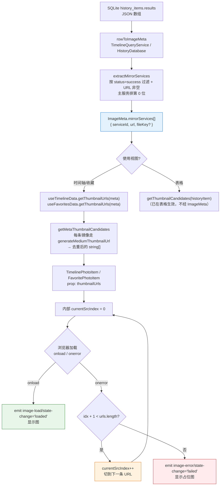
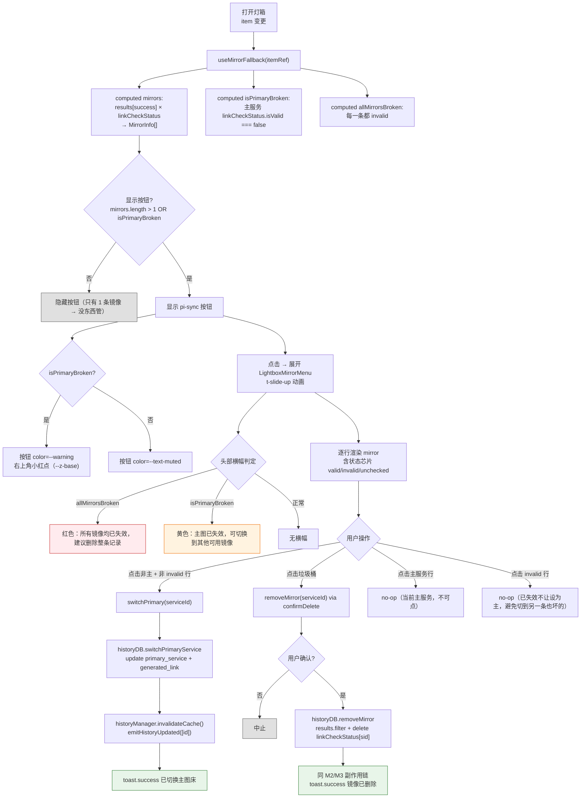
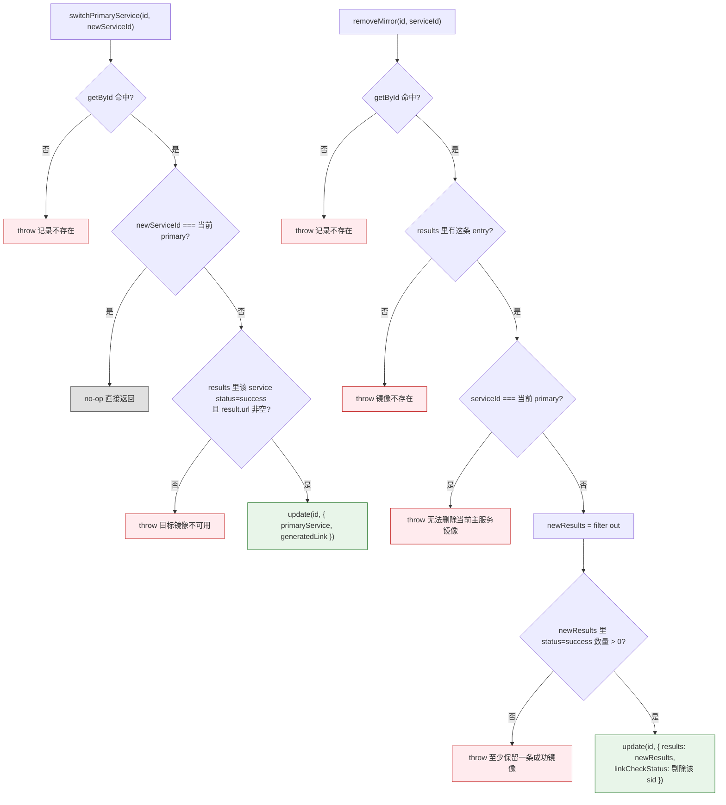

# 镜像 fallback 与切换流程

> 一张图片上传到多个图床时，浏览/灯箱如何选择显示链接、主图失效如何兜底、用户如何切换主服务和删除镜像。排查「列表图片加载失败」「灯箱管理镜像按钮不出现」「切换主服务不生效」时查看本文档。

---

## 核心理念

每条 HistoryItem 的 `results` 数组存储了**所有成功/失败的图床上传记录**，但对外只呈现一条"主服务"链接（`primaryService` + `generatedLink`）。镜像兜底分两层：

| 层级 | 场景 | 机制 | 用户感知 |
|------|------|------|---------|
| **层 1：视觉兜底** | 主图 URL 在浏览器里 404/超时 | `` 自动尝试下一条镜像 URL | 无感知，看到的一直是正常图 |
| **层 2：主动管理** | link-check 已标记主图失效 | 灯箱底栏"管理镜像"按钮 + 弹出菜单，用户手动选新主服务或删除失效镜像 | 按钮变警告色 + 小红点提示 |

**为什么不全自动切主服务？** link-check 有误判（尤其防盗链 403 实际浏览器能看），自动改 DB 会把"能用的"换成"可能也能用的"且不可追溯。所以：**视觉兜底自动，数据层改动必须用户确认**。

---

## 图 1：层 1 视觉兜底数据流

浏览列表加载缩略图时，后端把 `results` JSON 里全部成功镜像抽成 `ImageMeta.mirrorServices[]`，前端组件按序尝试。主服务在数组首位，其余按 `results` 原顺序。

> **关键源文件**：
> - `src/types/image-meta.ts`（`extractMirrorServices`、`MirrorService`）
> - `src/services/database/TimelineQueryService.ts`（`rowToImageMeta`）
> - `src/services/database/HistoryDatabase.ts`（`rowToImageMeta`）
> - `src/composables/useThumbCache.ts`（`getMetaThumbnailCandidates`）
> - `src/components/views/timeline/TimelinePhotoItem.vue`、`src/components/views/favorites/FavoritePhotoItem.vue`

### 关键不变量

| 不变量 | 原因 |
|--------|------|
| `mirrorServices[0]` 总是当前主服务 | `extractMirrorServices` 把 `serviceId === primaryService` 单独抽出放首位 |
| 每条镜像必须有 `result.url` | 空 URL 无法作为 ``，直接跳过 |
| 预加载仍只加载主服务 URL | `useImagePreload` 调的是 `getThumbnailUrl(meta)`（单条），fallback 只在可视区域的 `` 真正失败时触发，避免浪费带宽 |
| 列表失败态不反映到 DB | 层 1 完全是客户端兜底。真正的"失效"判定只走 link-check |

---

## 图 2：层 2 主动管理交互流

灯箱底栏新增 `pi pi-sync` **"管理镜像"按钮**。触发条件、菜单行为和最终副作用如下。

> **关键源文件**：
> - `src/composables/history/useMirrorFallback.ts`（派生态 + 动作封装）
> - `src/components/views/history/LightboxMirrorMenu.vue`（弹出菜单）
> - `src/components/views/history/LightboxBottomBar.vue`（按钮 + 徽标）
> - `src/components/views/history/HistoryLightbox.vue`（接入）
> - `src/services/database/HistoryDatabase.ts`（`switchPrimaryService`、`removeMirror`）

---

## 图 3：DB 层写入守卫

`switchPrimaryService` / `removeMirror` 都基于现有 `update(id, Partial<HistoryItem>)` 路径，但额外带三重守卫防止数据损坏。

> **关键源文件**：`src/services/database/HistoryDatabase.ts`（`switchPrimaryService`、`removeMirror`、`update`）

### 为什么删除"最后一条成功镜像"抛错而非自动删整条记录？

让用户做显式选择。如果自动连锁删除整条历史记录：
- 用户本意可能只是想清理某个失效链接
- 删整条会丢掉 timestamp/localFileName/favorite 状态等元信息
- 没有撤销机制时风险太高

所以 UI 在 `allMirrorsBroken` 时只**提示**"建议删除整条记录"，不代用户决定。

---

## 状态判定规则

`MirrorCheckState` 来自 `useMirrorFallback`，由 `item.linkCheckStatus[serviceId]` 推导：

| linkCheckStatus[sid] | MirrorCheckState | UI 芯片 | 可设为主服务 |
|---------------------|------------------|---------|-------------|
| `{ isValid: true }` | `valid` | 绿色"可用" | ✅ |
| `{ isValid: false }` | `invalid` | 红色"已失效" | ❌ |
| `undefined`（未跑过检测） | `unchecked` | 灰色"未检测" | ✅ |

> **注意**：`isValid: false` 包含了所有 HTTP 4xx/5xx/timeout/network，也包括 link-check 的误判（尤其防盗链 403 + `browser_might_work=true` 的场景）。因此 UI 明确提示"不让切到失效镜像"是**保护用户**免于切错，但代价是：遇到防盗链假阳性时用户需要先跑"重新检测"才能切回。

---

## 边界情况与处理

| # | 场景 | 行为 |
|---|------|------|
| 1 | 只有 1 条成功镜像 | `canManageMirrors=false` → 按钮隐藏 |
| 2 | 所有镜像失效 | 菜单顶端红色横幅 + 按钮右上角红点 + 警告色 |
| 3 | 从未跑过 link-check | 所有芯片为灰色"未检测"，可以切换，不阻挡操作 |
| 4 | 防盗链误报失效 | 目前无法区分，用户必须重跑检测或直接在浏览器打开验证后手动切换 |
| 5 | 切主后 `generatedLink` | DB 层写入时已同步更新为新镜像的 `result.url` |
| 6 | 删最后一条成功镜像 | DB 层抛错 + 前端 toast；建议改为删整条记录 |
| 7 | 删主服务镜像 | UI 不渲染垃圾桶 + composable 先判断 + DB 层再抛错，三重保险 |
| 8 | 撤销 | 第一版无撤销；`confirmDelete` 二次确认兜底 |
| 9 | linkCheckStatus 陈旧 | 菜单显示"未检测/可用/已失效"快照，不标注陈旧度。后续可叠加"检测于 X 天前" |
| 10 | `onerror` 触发后如何同步到 DB | 层 1 完全不同步。失效判定只通过 link-check 写入 `linkCheckStatus` |
| 11 | WebDAV 同步 | `switchPrimaryService` / `removeMirror` 都走 `update()`，复用现有脏标记机制 |
| 12 | 批量操作多条记录 | 第一版不支持，仅单条。灯箱外（表格/时间轴/收藏）都不暴露切换/删除 UI |

---

## 排查指南

| 现象 | 可能原因 | 对照位置 |
|------|---------|---------|
| 列表图片加载失败显示占位图 | 该条 mirrorServices 所有 URL 都返回错误；或从未填充 mirrorServices | 图 1 `extractMirrorServices`；检查 `results` 是否都含 `result.url` |
| 灯箱"管理镜像"按钮不出现 | `mirrors.length ≤ 1` 且 `isPrimaryBroken=false` | 图 2 `canManageMirrors` |
| 按钮出现但没有警告色/红点 | 主服务没被 link-check 标记失效。去跑 link-check 或等检测完成 | 图 2 `isPrimaryBroken` 判定 |
| 点击镜像行没反应 | 要么是当前主服务（有 mirror-row--primary class），要么状态为 invalid | `LightboxMirrorMenu.handleRowClick` 守卫 |
| 切换主服务后图标在其他视图不刷新 | `emitHistoryUpdated` 事件未被该视图监听 | `src/events/cacheEvents.ts`，检查各视图 `onCacheEventType('history-updated')` 注册 |
| "主图已失效"但图片实际能看 | link-check 误判（通常是防盗链 403）。跑"重新检测单条"或手动在浏览器验证 | [link-check-flow.md 图 1](./link-check-flow.md#图-1服务感知请求流程) 防盗链分支 |
| 删除镜像后 link-check 还显示"总计 N 条"没变 | `linkCheckSummary` 汇总字段未自动重算 | `removeMirror` 只清理 `linkCheckStatus[sid]` 不动 `linkCheckSummary`，后续全量 link-check 会覆盖 |

---

## 相关文档

- [历史查询流程](./history-flow.md) — 历史记录 CRUD + 搜索，镜像管理是其上的扩展动作
- [链接监控流程](./link-check-flow.md) — `linkCheckStatus` 的写入源，判定哪些镜像被标记失效
- [辅助功能流程 图 11](./auxiliary-flows.md#图-11链接检测流程) — 链接检测主流程
- [数据持久化流程](./data-persistence.md) — `results` JSON 字段的序列化位置
