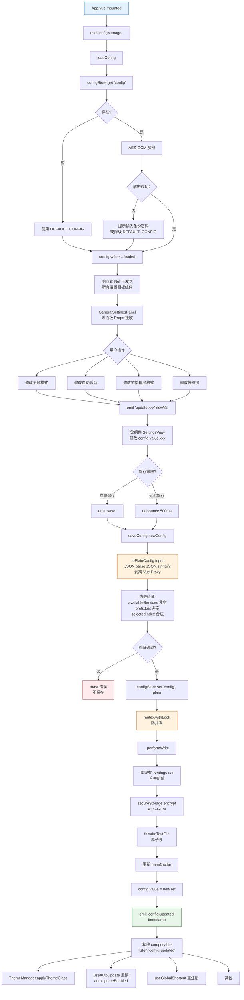
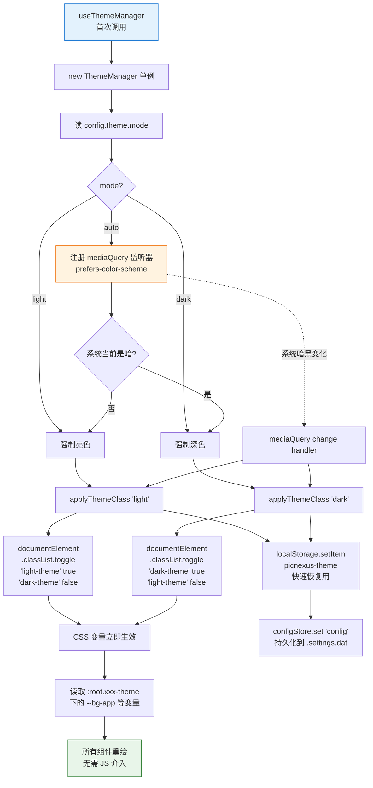
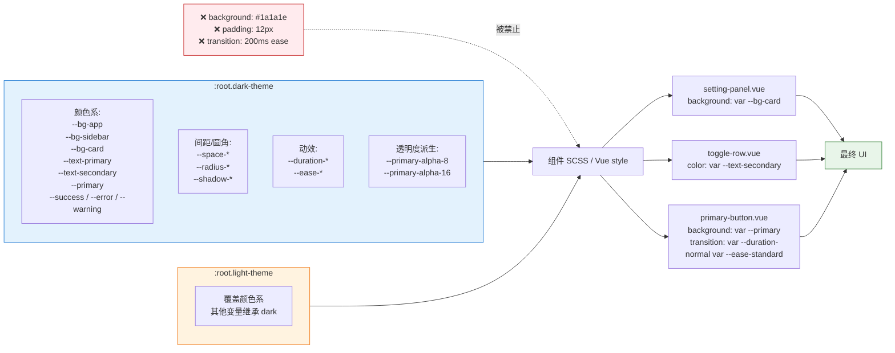
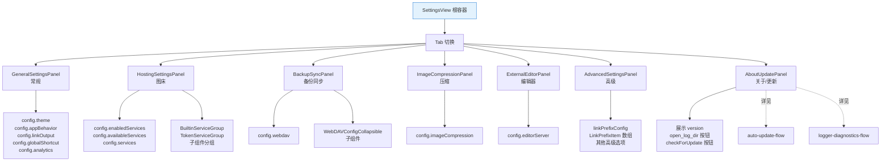

# 设置面板 + 主题架构流程

> 从「用户修改设置项」到「加密落盘 + 跨组件同步 + 主题切换生效」的完整闭环。**新增设置项、改主题切换逻辑、排查配置丢失/未持久化**时优先查看此文档。

## 概览

PicNexus 的配置系统绕开了 `tauri-plugin-store`,采用**自写 SimpleStore + AES-GCM 加密 + 互斥锁**的方案:

- **配置存储**:`configStore = new Store('.settings.dat')`,单例,**禁止再次 new**(CLAUDE.md 规定)
- **加密**:AES-GCM,支持"随机密钥"和"备份密码"两种格式(v2.8+)
- **并发控制**:全局互斥锁,防止多处同时写入导致数据损坏(v2.9+)
- **配置入口**:`useConfigManager()` composable,返回响应式 `config` + `loadConfig` + `saveConfig`
- **主题切换**:`ThemeManager` 通过 `document.documentElement.classList` 切换 `.dark-theme` / `.light-theme`
- **跨组件同步**:保存后 `emit('config-updated')`,其他 composable 通过 `listen('config-updated')` 重新读取
- **强制规则**:序列化 config 时必须先调 `toPlainConfig()` 剥离 Vue Proxy

---

## 图 1:设置面板数据流(读 → 改 → 写 → 广播)

展示从组件挂载读配置到用户修改后落盘的完整链路,核心关注 `toPlainConfig` 和 `emit('config-updated')` 两个关键节点。

> **关键源文件**:`src/composables/useConfig.ts`、`src/store/instances.ts`、`src/store.ts` (SimpleStore)、`src/components/settings/GeneralSettingsPanel.vue`



---

## 图 2:主题切换的运行时机制

展示 `ThemeManager` 如何在三种模式(`light` / `dark` / `auto`)下正确切换 CSS 类,以及与系统深色模式的联动。

> **关键源文件**:`src/theme/ThemeManager.ts`、`src/composables/useTheme.ts`、`src/theme/dark-theme.css`、`src/theme/light-theme.css`



**关键细节**:

- **切换方式是 `classList` 而非 `data-theme` 属性**(与 `docs/design/themes.md` 约定一致)
- **localStorage 是性能优化**:下次启动时 `index.html` 的内联脚本可以第一时间读 localStorage 应用主题,避免白屏闪烁(FOUC)
- **PrimeVue 集成**:PrimeVue 组件读取 `:root.xxx-theme` 下的 CSS 变量,不需要 JS 调用 PrimeVue API
- **auto 模式切换时的 listener 生命周期**:`setTheme(mode)` 先 `removeEventListener` 旧的,再按需 `addEventListener` 新的,避免重复触发

---

## 图 3:CSS 变量体系与组件消费

展示 CSS 变量从 `:root` 定义到各组件 `var(--xxx)` 引用的层级关系,帮助新增设置项时正确使用变量而非硬编码(CLAUDE.md 禁止硬编码)。

> **关键源文件**:`src/theme/dark-theme.css`、`src/theme/light-theme.css`、`src/styles/motion.css`、`docs/design/tokens.md`



---

## 图 4:设置面板组件清单与职责

展示 `src/components/settings/` 下各面板的职责划分。新增设置项时先判断归属哪个面板,避免新建冗余面板。



---

## 新增设置项的标准流程

```mermaid
flowchart TD
    A[需求:加一个新设置项<br/>比如 "上传后自动清空剪贴板"] --> B[1. 确定归属面板<br/>→ GeneralSettingsPanel]
    B --> C[2. src/config/types.ts<br/>在 UserConfig 接口加字段<br/>autoClearClipboard: boolean]
    C --> D[3. src/config/defaults.ts<br/>DEFAULT_CONFIG 加默认值]
    D --> E[4. 面板组件:<br/>Props 接收 autoClearClipboard<br/>v-model 绑定 Switch/Input]
    E --> F[5. 修改时 emit update:xxx<br/>+ emit save]
    F --> G[6. 父组件 SettingsView<br/>更新 config.value.autoClearClipboard<br/>调用 saveConfig]
    G --> H{需要业务消费?}
    H -- 是 --> H1[在对应 composable<br/>比如 useUpload<br/>读取 config.autoClearClipboard]
    H -- 否 --> I
    H1 --> I
    I{需要跨组件重新初始化?}
    I -- 是 --> I1[listen 'config-updated'<br/>在相关 composable]
    I -- 否 --> J
    I1 --> J
    J[7. UI 层样式:<br/>禁止硬编码<br/>复用 .toggle-row 等 class]
    J --> K[8. 文档:<br/>同步更新<br/>reference/api/config.md 等]

    style A fill:#e3f2fd,stroke:#1976d2
    style K fill:#e8f5e9,stroke:#2e7d32
    style C fill:#fff3e0,stroke:#ef6c00
```

---

## 链接前缀（微博代理）数据结构

`config.linkPrefixConfig.prefixList` 是 `LinkPrefixItem[]`（不是字符串数组）：

```ts
interface LinkPrefixItem { name: string; template: string }
```

`template` 支持 4 种占位符，由 `src/utils/linkPrefixTemplate.ts` 解析：

| 占位符 | 含义 | 典型用法 |
|--------|------|---------|
| `{url}` | 完整原 URL | 显式声明位置 |
| `{url_no_scheme}` | 去掉 `https://` / `http://` | Jetpack 风格 |
| `{path}` | 去掉协议和域名，仅保留路径 | IPFS Scan 风格 |
| `{url_encoded}` | `encodeURIComponent` | 搜狗 / query 参数型 |

**兼容规则**：template 若不含任何占位符，拼接时自动在末尾追加 `{url}`，等价于旧版纯前缀行为。

默认列表定义在 [src/config/configInterface.ts](../../src/config/configInterface.ts) 的 `DEFAULT_LINK_PREFIXES`，当前包含搜狗图片 / CDN JSON / Jetpack / IPFS Scan 四项。

新增/编辑由 [LinkPrefixEditDialog.vue](../../src/components/settings/hosting/LinkPrefixEditDialog.vue) 弹窗承载，用户填写 `name` + `template`，保存后 emit 到 `useSettingsForm.addPrefix` / `updatePrefix`。

反向解析（MD 解析器把带前缀的 URL 剥回原始 URL）由 `stripPrefixTemplate()` 完成，[mdParser.ts](../../src/utils/mdParser.ts) 的 `stripKnownPrefixes` 遍历 `prefixList` 尝试匹配。

---

## 排查指南

| 现象 | 可能原因 | 对照图表位置 |
|------|---------|-------------|
| 改完设置刷新后丢失 | 忘记 `emit('save')` 或 `saveConfig` 未调用 | 图1 K |
| 保存报 `Converting circular structure to JSON` | 没调 `toPlainConfig`,直接序列化 Vue Proxy | 图1 L1 |
| 多处写配置偶尔丢数据 | 没过 `mutex.withLock`(自己 new Store 绕过了单例) | 图1 M1 |
| 修改主题后部分组件没变色 | 该组件用了硬编码颜色,不消费 CSS 变量 | 图3 X |
| auto 模式系统切换不生效 | `setTheme('auto')` 没正确注册 mediaQuery listener | 图2 E3 |
| 启动时短暂白屏闪烁(FOUC) | `index.html` 的内联脚本没读 localStorage | 图2 I |
| 保存后其他组件没重新响应 | 没 `listen('config-updated')`,或监听后没 unlisten 导致重复 | 图1 P |
| 配置文件打不开/解密失败 | 备份密码机制触发,需要引导用户输入 | 图1 D5 |
| 新增字段迁移老配置报错 | 新字段没在 DEFAULT_CONFIG 加默认值,老 config 读到 undefined | 新增流程 C、D |
| 样式被硬编码污染 | 违反 CLAUDE.md,用 `docs/design/tokens.md` 里的变量替换 | 图3 |
| 新加的链接前缀没生效 / 搜狗风格 URL 不对 | template 占位符拼错,或调用方没过 `applyPrefixTemplate` 直接字符串拼接 | 链接前缀数据结构 |

---

## 相关文档

- [设计规范总集](../design/) — tokens / themes / ui-patterns / settings-layout
- [数据持久化](./data-persistence.md) — `.settings.dat` 的加密存储细节
- [应用生命周期](./app-lifecycle.md) — `loadConfig` 的启动时机
- [IPC 命令层](./ipc-command-flow.md) — `emit/listen` 的事件系统基础
- [自动更新](./auto-update-flow.md) — `autoUpdateEnabled` 开关消费样例
- [日志与诊断](./logger-diagnostics-flow.md) — `AboutUpdatePanel` 另一功能
