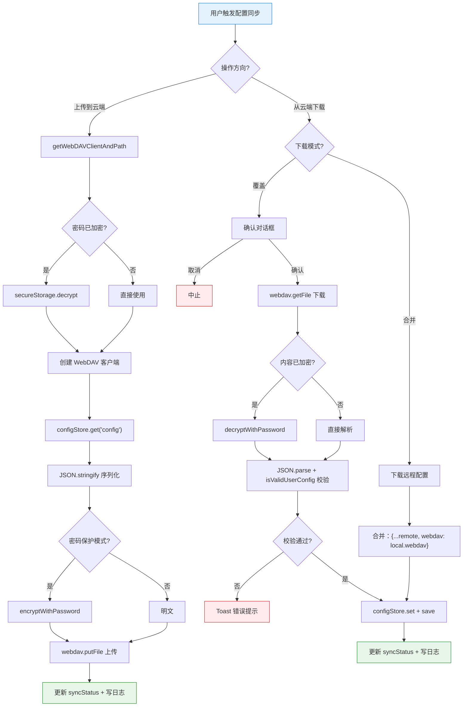
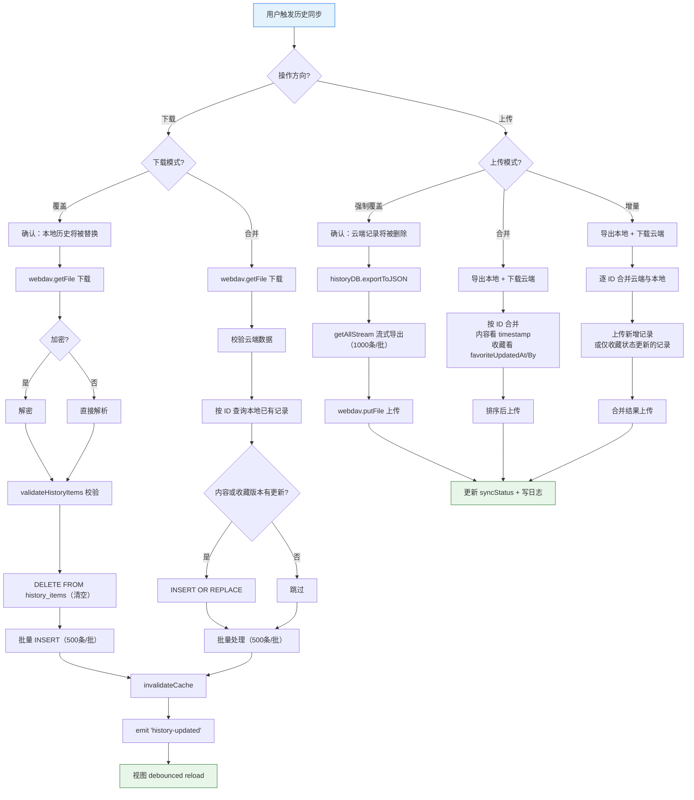
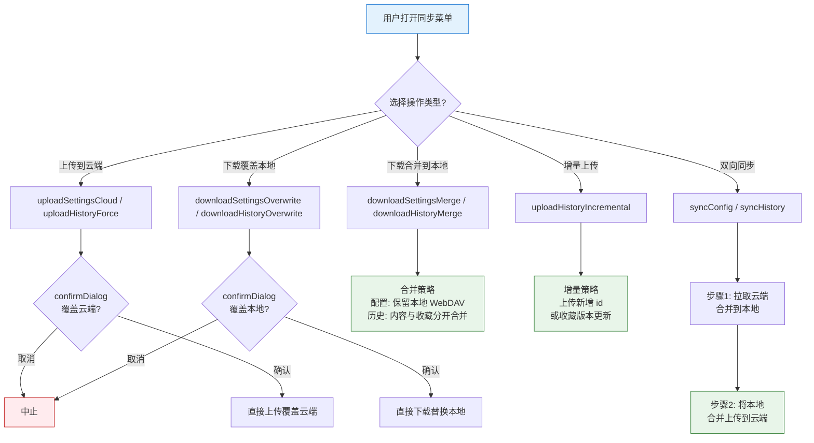

# 同步流程

> WebDAV 云同步的完整流程图解。排查同步失败、冲突、数据丢失时查看此文档。

---

## 图 1：配置同步流程

展示配置文件的上传和下载路径。重点关注**可选加密**和**合并策略**两个关键设计。

> **关键源文件**：`src/composables/backup-sync/useBackupCloud.ts`、`src/store/instances.ts`

> **注意**：合并模式会**保留本地 WebDAV 凭证**，防止下载后凭证被远程配置覆盖。

---

## 图 2：历史记录同步流程

展示历史记录的三种上传模式和两种下载模式。重点关注**增量同步**和**合并去重**逻辑。

> **关键源文件**：`src/composables/backup-sync/HistorySync.ts`、`src/composables/useWebDAVSync.ts`、`src/services/database/HistoryMerge.ts`

---

## 图 3：冲突处理策略（用户预选式）

> **关键源文件**：`src/composables/backup-sync/useBackupCloud.ts`
>
> **设计说明**：当前实现**不做运行时冲突检测**，而是让用户通过 UI 菜单**提前选择处理策略**。每种策略都有明确的覆盖/合并语义，系统按选择直接执行。破坏性操作（覆盖类）会有二次确认对话框防止误操作。

> **关键点**：
> - 配置上传与配置双向同步必须先设置备份密码；UI 会打开密码设置对话框，`ConfigSync` 底层也会在联网和加锁前拒绝无密码调用
> - 云端配置下载仍可独立使用；本地明文导出保留风险确认流程
> - 代码中**没有** JSON 内容比对和三路冲突对话框，用户通过菜单选项预先声明意图
> - 覆盖类操作（`downloadSettingsOverwrite` / `downloadHistoryOverwrite` / `uploadHistoryForce`）统一用 `confirmDialog` 做破坏性确认
> - 合并类操作（`downloadSettingsMerge` / `downloadHistoryMerge` / `uploadHistoryMerge`）直接执行，合并策略见图 2 说明
> - 历史记录内容与收藏状态分开裁决：上传内容仍按 `timestamp`，收藏状态按 `favoriteUpdatedAt`，同毫秒再用 `favoriteUpdatedBy` 稳定裁决
> - 双向同步（`syncConfig` / `syncHistory`）本质是"拉取合并 → 推送合并"的自动化组合

---

## 进度追踪

同步过程通过 `currentProgress` 实时更新 UI：

| 阶段 | 百分比 | 说明 |
|------|--------|------|
| connecting | 10% | 建立 WebDAV 连接 |
| checking | 30% | 检查云端数据是否存在 |
| downloading | 40-50% | 下载云端数据 |
| merging | 60-70% | 合并处理 |
| uploading | 70-80% | 上传到云端 |
| done | 100% | 完成 |
| error | — | 失败，显示错误信息 |

---

## 排查指南

| 现象 | 可能原因 | 对照图表位置 |
|------|---------|-------------|
| 同步按钮无反应 | `isSyncing` 锁未释放（上次同步异常退出） | — |
| 认证失败 (401) | WebDAV 用户名/密码错误 | 图1 节点 C → D |
| 远程路径不存在 (404) | WebDAV 路径配置错误或目录未创建 | 图1 节点 H / 图2 节点 D3 |
| 存储空间不足 (507) | 云端空间满 | 图2 上传路径 |
| 连接超时 | 网络问题或 WebDAV 服务器不可达 | 图1 节点 D |
| 解密失败 | 备份密码不正确 | 图1 节点 M1 / 图2 节点 H3 |
| 合并后数据比预期少 | 远端文件缺少对应 ID，或旧备份没有收藏版本字段导致只能按已有版本合并 | 图2 合并分支 E1 / I3 |
| 下载后配置未生效 | 需要刷新页面应用新配置 | 图1 节点 O → P |
| 历史记录下载后列表空 | `history-updated` 事件未触发视图刷新 | 图2 节点 J → K |
| SSL 证书错误 | 自签名证书未被信任 | 图1 节点 D |

---

## 相关文档

- [辅助功能流程](./auxiliary-flows.md) — WebDAV 同步在辅助功能中的位置
- [数据持久化流程](./data-persistence.md) — 配置存储和历史数据库的底层机制
- [历史查询流程](./history-flow.md) — 同步的历史数据来源与查询机制
- [Composables API](../reference/api/composables.md) — useWebDAVSync / useAutoSync 接口索引
- [休眠白屏修复](../reference/troubleshooting/sleep-resume-white-screen.md) — 休眠后 SQLite 连接丢失可能影响同步
