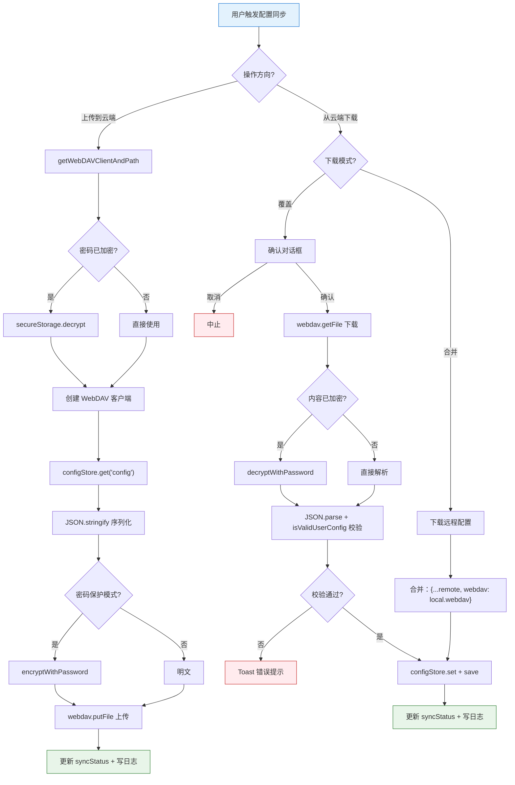
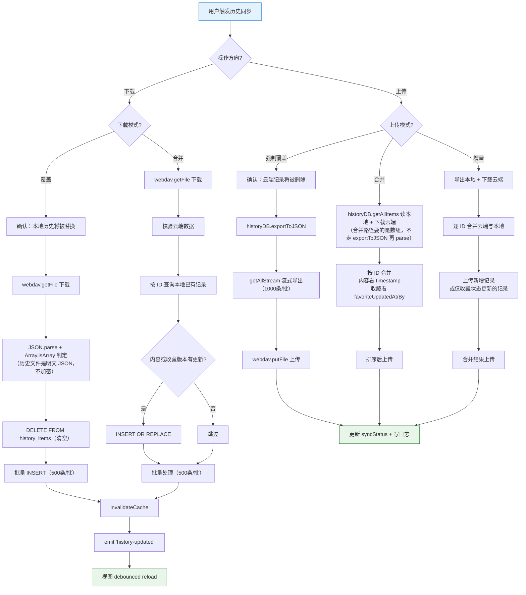
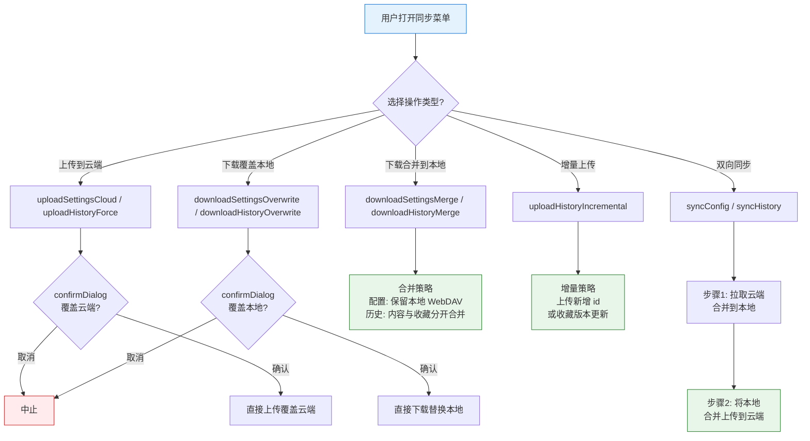

# 同步流程

> WebDAV 云同步的完整流程图解。排查同步失败、冲突、数据丢失时查看此文档。

---

## 图 1：配置同步流程

展示配置文件的上传和下载路径。重点关注**可选加密**和**合并策略**两个关键设计。

> **关键源文件**：`src/composables/backup-sync/useBackupCloud.ts`、`src/store/instances.ts`

```mermaid
flowchart TD
    A[用户触发配置同步] --> B{操作方向?}

    %% 上传配置
    B -- 上传到云端 --> C[getWebDAVClientAndPath]
    C --> C1{密码已加密?}
    C1 -- 是 --> C2[secureStorage.decrypt]
    C1 -- 否 --> C3[直接使用]
    C2 & C3 --> D[创建 WebDAV 客户端]
    D --> E["configStore.get('config')"]
    E --> F[JSON.stringify 序列化]
    F --> G{密码保护模式?}
    G -- 是 --> G1[encryptWithPassword]
    G -- 否 --> G2[明文]
    G1 & G2 --> H[webdav.putFile 上传]
    H --> I[更新 syncStatus + 写日志]

    %% 下载配置
    B -- 从云端下载 --> J{下载模式?}
    J -- 覆盖 --> K[确认对话框]
    K -- 取消 --> K1[中止]
    K -- 确认 --> L[webdav.getFile 下载]
    L --> M{内容已加密?}
    M -- 是 --> M1[decryptWithPassword]
    M -- 否 --> M2[直接解析]
    M1 & M2 --> N[JSON.parse + isValidUserConfig 校验]
    N --> N1{校验通过?}
    N1 -- 否 --> N2[Toast 错误提示]
    N1 -- 是 --> O[configStore.set + save]
    O --> P[更新 syncStatus + 写日志]

    J -- 合并 --> Q[下载远程配置]
    Q --> R["合并：{...remote, webdav: local.webdav}"]
    R --> O

    %% 样式
    style A fill:#e3f2fd,stroke:#1976d2
    style I fill:#e8f5e9,stroke:#2e7d32
    style P fill:#e8f5e9,stroke:#2e7d32
    style K1 fill:#ffebee,stroke:#c62828
    style N2 fill:#ffebee,stroke:#c62828
```

> **注意**：合并模式会**保留本地 WebDAV 凭证**，防止下载后凭证被远程配置覆盖。

> **关于 C1「密码已加密?」这个分支**：备份密码现在**全程保持密文**，加载设置页时不再解密，
> 所以正常情况下走的都是 C2。C3「直接使用」只剩下兼容老配置的作用——那些还没被重新保存过、
> 密码仍是明文的 profile，会在下一次保存时由 `encryptBackupProfiles` 加密掉。
> 明文只在两个地方短暂出现：用户正在输入时，以及点眼睛查看的那 15 秒。
> 契约见 [sensitive-field-contract.md](../reference/patterns/sensitive-field-contract.md)。
>
> ⚠️ `handleWebDAVTest`（`SettingsView.vue`）**绕开了** `fromEncryptedConfig`，自己解密后调
> `testWebDAVConnection`。改这条链路时两处都要顾到。

---

## 图 2：历史记录同步流程

展示历史记录的三种上传模式和两种下载模式。重点关注**增量同步**和**合并去重**逻辑。

> **关键源文件**：`src/composables/backup-sync/HistorySync.ts`、`src/composables/backup-sync/backupSyncUtils.ts`、`src/services/database/HistoryMerge.ts`

```mermaid
flowchart TD
    A[用户触发历史同步] --> B{操作方向?}

    %% 上传历史
    B -- 上传 --> C{上传模式?}

    C -- 强制覆盖 --> D[确认：云端记录将被删除]
    D --> D1[historyDB.exportToJSON]
    D1 --> D2["getAllStream 流式导出（1000条/批）"]
    D2 --> D3[webdav.putFile 上传]

    C -- 合并 --> E["historyDB.getAllItems 读本地 + 下载云端<br/>（合并路径要的是数组，不走 exportToJSON 再 parse）"]
    E --> E1["按 ID 合并<br/>内容看 timestamp<br/>收藏看 favoriteUpdatedAt/By"]
    E1 --> E2[排序后上传]

    C -- 增量 --> F[导出本地 + 下载云端]
    F --> F1["逐 ID 合并云端与本地"]
    F1 --> F2["上传新增记录<br/>或仅收藏状态更新的记录"]
    F2 --> F3["合并结果上传"]

    %% 下载历史
    B -- 下载 --> G{下载模式?}

    G -- 覆盖 --> H[确认：本地历史将被替换]
    H --> H1[webdav.getFile 下载]
    H1 --> H5["JSON.parse + Array.isArray 判定<br/>（历史文件是明文 JSON，不加密）"]
    H5 --> H6["DELETE FROM history_items（清空）"]
    H6 --> H7["批量 INSERT（500条/批）"]

    G -- 合并 --> I[webdav.getFile 下载]
    I --> I1[校验云端数据]
    I1 --> I2["按 ID 查询本地已有记录"]
    I2 --> I3{"内容或收藏版本有更新?"}
    I3 -- 是 --> I4[INSERT OR REPLACE]
    I3 -- 否 --> I5[跳过]
    I4 & I5 --> I6["批量处理（500条/批）"]

    H7 & I6 --> J[invalidateCache]
    J --> K["emit 'history-updated'"]
    K --> L[视图 debounced reload]

    D3 & E2 & F3 --> M[更新 syncStatus + 写日志]

    %% 样式
    style A fill:#e3f2fd,stroke:#1976d2
    style M fill:#e8f5e9,stroke:#2e7d32
    style L fill:#e8f5e9,stroke:#2e7d32
```

---

## 图 3：冲突处理策略（用户预选式）

> **关键源文件**：`src/composables/backup-sync/useBackupCloud.ts`
>
> **设计说明**：当前实现**不做运行时冲突检测**，而是让用户通过 UI 菜单**提前选择处理策略**。每种策略都有明确的覆盖/合并语义，系统按选择直接执行。破坏性操作（覆盖类）会有二次确认对话框防止误操作。

```mermaid
flowchart TD
    A[用户打开同步菜单] --> B{选择操作类型?}

    B -- 上传到云端 --> U1[uploadSettingsCloud / uploadHistoryForce]
    B -- 下载覆盖本地 --> D1[downloadSettingsOverwrite / downloadHistoryOverwrite]
    B -- 下载合并到本地 --> D2[downloadSettingsMerge / downloadHistoryMerge]
    B -- 增量上传 --> U2[uploadHistoryIncremental]
    B -- 双向同步 --> S1[syncConfig / syncHistory]

    %% 覆盖类操作：二次确认
    U1 --> U1C{confirmDialog<br/>覆盖云端?}
    D1 --> D1C{confirmDialog<br/>覆盖本地?}
    U1C -- 取消 --> X[中止]
    D1C -- 取消 --> X
    U1C -- 确认 --> U1E[直接上传覆盖云端]
    D1C -- 确认 --> D1E[直接下载替换本地]

    %% 合并类操作：无确认直接执行
    D2 --> D2E["合并策略<br/>配置: 保留本地 WebDAV<br/>历史: 内容与收藏分开合并"]
    U2 --> U2E["增量策略<br/>上传新增 id<br/>或收藏版本更新"]

    %% 双向同步：先拉取合并 → 再上传合并
    S1 --> S1A[步骤1: 拉取云端<br/>合并到本地]
    S1A --> S1B[步骤2: 将本地<br/>合并上传到云端]

    %% 样式
    style A fill:#e3f2fd,stroke:#1976d2
    style X fill:#ffebee,stroke:#c62828
    style D2E fill:#e8f5e9,stroke:#2e7d32
    style U2E fill:#e8f5e9,stroke:#2e7d32
    style S1B fill:#e8f5e9,stroke:#2e7d32
```

> **⚠️ 上传方向的「云端数据不可用」判定（防静默覆盖）**
>
> 三个会**覆盖云端**的入口（`uploadHistoryMerge` / `uploadHistoryIncremental` / `syncHistory` 第一步，
> 以及配置侧的 `syncConfig`）在拉取云端后把结果分成三态，只有第一态允许继续上传：
>
> | `getFile` 返回 | 含义 | 处置 |
> |---------------|------|------|
> | `null`（HTTP 404） | 云端还没有这个文件 | **首次同步的正常路径**，继续全量上传 |
> | `''`（200 + 空响应体） | 文件在，但是 0 字节 | **中止**，提示改用「强制覆盖云端」自愈 |
> | 合法 JSON 但非数组 | 文件在，但读不出记录 | **中止** |
>
> 判定逻辑收在 `backupSyncUtils.parseCloudHistoryForUpload`，**只给上传方向用**。
> 下载方向（`downloadHistoryOverwrite` / `downloadHistoryMerge`）不能复用：那边 `null` 的正确
> 含义是「没东西可恢复，必须中止」，若当成空数组继续走，`importFromJSON(空, 'replace')`
> 会把本地历史整库清空。
>
> 中止用的是「置标志位 → 在 `catch` 块**之外**抛出」，而不是直接在 `try` 里 throw：
> 内层 catch 要过一道 `isWebDAVNotFoundError`，而它是**子串匹配**——错误文案里只要出现
> 「文件不存在」/`404`/`not found`，中止就会被当成「云端没这个文件」吞掉，静默退化回覆盖云端。

> **关键点**：
> - 配置上传与配置双向同步必须先设置备份密码；UI 会打开密码设置对话框，`ConfigSync` 底层也会在联网和加锁前拒绝无密码调用
> - 云端配置下载仍可独立使用；本地明文导出保留风险确认流程
> - 代码中**没有** JSON 内容比对和三路冲突对话框，用户通过菜单选项预先声明意图
> - 覆盖类操作（`downloadSettingsOverwrite` / `downloadHistoryOverwrite` / `uploadHistoryForce`）统一用 `confirmDialog` 做破坏性确认
> - 合并类操作（`downloadSettingsMerge` / `downloadHistoryMerge` / `uploadHistoryMerge`）直接执行，合并策略见图 2 说明
> - 历史记录内容与收藏状态分开裁决：上传内容仍按 `timestamp`，收藏状态按 `favoriteUpdatedAt`，同毫秒再用 `favoriteUpdatedBy` 稳定裁决
> - 双向同步（`syncConfig` / `syncHistory`）本质是"拉取合并 → 推送合并"的自动化组合

---

## 进度追踪

同步过程通过 `currentProgress` 实时更新 UI：

| 阶段 | 百分比 | 说明 |
|------|--------|------|
| connecting | 10% | 建立 WebDAV 连接 |
| checking | 30% | 检查云端数据是否存在 |
| downloading | 40-50% | 下载云端数据 |
| merging | 60-70% | 合并处理 |
| uploading | 70-80% | 上传到云端 |
| done | 100% | 完成 |
| error | — | 失败，显示错误信息 |

---

## 排查指南

| 现象 | 可能原因 | 对照图表位置 |
|------|---------|-------------|
| 同步按钮无反应 | `isSyncing` 锁未释放（上次同步异常退出） | — |
| 认证失败 (401) | WebDAV 用户名/密码错误 | 图1 节点 C → D |
| 远程路径不存在 (404) | WebDAV 路径配置错误或目录未创建 | 图1 节点 H / 图2 节点 D3 |
| 存储空间不足 (507) | 云端空间满 | 图2 上传路径 |
| 连接超时 | 网络问题或 WebDAV 服务器不可达 | 图1 节点 D |
| 解密失败 | 备份密码不正确 | 图1 节点 M1（**仅配置同步**；历史文件是明文 JSON，不涉及解密） |
| 合并后数据比预期少 | 远端文件缺少对应 ID，或旧备份没有收藏版本字段导致只能按已有版本合并 | 图2 合并分支 E1 / I3 |
| 提示「云端历史文件为空，已中止」 | 云端 `history.json` 是 0 字节（多半是上次 PUT 中断留下的）。这是**防覆盖保护**不是故障：若确认云端本就无数据，用「强制覆盖云端」推上去即可 | 图3 上方「云端数据不可用」表 |
| 提示「云端历史数据格式错误：期望数组格式」 | 远端路径下的 `history.json` 不是 PicNexus 导出的格式 | 图3 上方「云端数据不可用」表 |
| 下载后提示「跳过 N 条格式无效记录」 | 云端文件里有记录缺必需字段（`timestamp` / `localFileName` / `primaryService` / `results`）。这些记录不入库，但本地同 id 的旧记录**会被保留**不删 | `ImportExportService.importHistoryFromJson` |
| 同步失败但文案是 `[object Object]` | 已修（2026-08-24）：`webdav.ts` 未解包 Tauri `AppError` 对象。若再次出现，检查该处是否又改回了 `String(error)` | 图3 / `src/types/errors.ts` |
| 下载后配置未生效 | 需要刷新页面应用新配置 | 图1 节点 O → P |
| 历史记录下载后列表空 | `history-updated` 事件未触发视图刷新 | 图2 节点 J → K |
| SSL 证书错误 | 自签名证书未被信任 | 图1 节点 D |

---

## 相关文档

- [辅助功能流程](./auxiliary-flows.md) — WebDAV 同步在辅助功能中的位置
- [数据持久化流程](./data-persistence.md) — 配置存储和历史数据库的底层机制
- [历史查询流程](./history-flow.md) — 同步的历史数据来源与查询机制
- [Composables API](../reference/api/composables.md) — useBackupSync 接口索引
- [休眠白屏修复](../reference/troubleshooting/sleep-resume-white-screen.md) — 休眠后 SQLite 连接丢失可能影响同步
