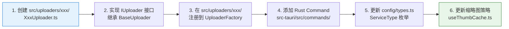

# 系统总览

> 项目的宏观架构和上传器类关系。新功能规划、新增图床时查看此文档。

---

## 图 6：系统分层架构

展示 PicNexus 从 UI 到 Rust 后端的 6 层架构。每层只能依赖**下方**的层，不能反向依赖。

> **关键源文件**：`docs/reference/architecture/overview.md`

```mermaid
flowchart TD
    subgraph Views["视图层 (src/components/views/)"]
        V1[UploadView<br/>上传界面]
        V2[HistoryView<br/>历史记录]
        V3[TimelineView<br/>时间线]
        V4[SettingsView<br/>设置面板]
        V5[LinkCheckView<br/>链接检测]
    end

    subgraph Layout["布局层 (src/components/layout/)"]
        L1[MainLayout]
        L2[TitleBar]
        L3[Sidebar]
    end

    subgraph Composables["Composables 层 (src/composables/)"]
        C1[useUpload<br/>上传编排]
        C2[useHistory<br/>历史管理]
        C3[useConfig<br/>配置管理]
        C4[useThumbCache<br/>缩略图缓存]
        C5[useWebDAVSync<br/>云同步]
        C6[useLinkCheck<br/>链接检测]
        C7[useServiceSelector<br/>服务选择]
    end

    subgraph Core["核心层 (src/core/)"]
        K1[MultiServiceUploader<br/>多图床并行上传]
        K2[LinkGenerator<br/>链接生成]
        K3[UploadQueueManager<br/>队列管理]
    end

    subgraph Uploaders["上传器层 (src/uploaders/)"]
        U0["UploaderFactory（工厂）"]
        U1[WeiboUploader]
        U2[R2Uploader]
        U3[JDUploader]
        U4[SmmsUploader]
        U5[GithubUploader]
        U6["... 共 17+ 个"]
    end

    subgraph Services["服务层 (src/services/ + src/store/)"]
        S1["HistoryDatabase<br/>(SQLite)"]
        S2["configStore<br/>(AES-GCM JSON)"]
        S3["ThumbCache<br/>(文件系统)"]
        S4["WebDAVClient<br/>(HTTP)"]
    end

    subgraph Rust["Rust 后端 (src-tauri/src/)"]
        R1[upload.rs<br/>微博上传]
        R2[s3_compatible.rs<br/>S3 兼容存储]
        R3[github.rs<br/>GitHub]
        R4[smms.rs<br/>SM.MS]
        R5[clipboard.rs<br/>剪贴板]
        R6[link_checker.rs<br/>链接检测]
        R7[image_meta.rs<br/>图片元数据]
    end

    Views --> Composables
    Layout --> Views
    Composables --> Core
    Composables --> Services
    Core --> Uploaders
    Uploaders -->|"Tauri invoke (IPC)"| Rust

    style Views fill:#e3f2fd,stroke:#1976d2
    style Layout fill:#e3f2fd,stroke:#1976d2
    style Composables fill:#e8f5e9,stroke:#2e7d32
    style Core fill:#fff3e0,stroke:#ef6c00
    style Uploaders fill:#fce4ec,stroke:#c62828
    style Services fill:#f3e5f5,stroke:#7b1fa2
    style Rust fill:#efebe9,stroke:#4e342e
```



---

## 图 7：上传器类关系

展示上传器的接口、基类、工厂和 17 个具体实现之间的关系。**新增图床**时参照此图。

> **关键源文件**：`src/uploaders/base/IUploader.ts`、`src/uploaders/base/BaseUploader.ts`、`src/uploaders/base/UploaderFactory.ts`

```mermaid
classDiagram
    class IUploader {
        <<interface>>
        +serviceId: string
        +serviceName: string
        +validateConfig(config) Promise~ValidationResult~
        +upload(filePath, options, onProgress?) Promise~UploadResult~
        +getPublicUrl(result) string
        +testConnection?(config?) Promise~ConnectionTestResult~
    }

    class BaseUploader {
        <<abstract>>
        +serviceId: string
        +serviceName: string
        +validateConfig(config)*
        +upload(filePath, options, onProgress?)*
        +getPublicUrl(result)*
    }

    class UploaderFactory {
        -registry: Map~string, Function~
        +register(serviceId, factory)$ void
        +create(serviceId)$ IUploader
        +getAvailableServices()$ string[]
        +isRegistered(serviceId)$ boolean
        +unregister(serviceId)$ boolean
    }

    IUploader <|.. BaseUploader : 实现
    UploaderFactory ..> IUploader : 创建

    BaseUploader <|-- WeiboUploader
    BaseUploader <|-- R2Uploader
    BaseUploader <|-- JDUploader
    BaseUploader <|-- NamiUploader
    BaseUploader <|-- SmmsUploader
    BaseUploader <|-- GithubUploader
    BaseUploader <|-- ImgurUploader
    BaseUploader <|-- QiniuUploader
    BaseUploader <|-- AliyunUploader
    BaseUploader <|-- TencentUploader
    BaseUploader <|-- UpyunUploader
    BaseUploader <|-- ZhihuUploader
    BaseUploader <|-- BilibiliUploader
    BaseUploader <|-- ChaoxingUploader
    BaseUploader <|-- NowcoderUploader
    BaseUploader <|-- QiyuUploader
    BaseUploader <|-- CustomS3Uploader

    class WeiboUploader { +serviceId = "weibo" }
    class R2Uploader { +serviceId = "r2" }
    class JDUploader { +serviceId = "jd" }
    class NamiUploader { +serviceId = "nami" }
    class SmmsUploader { +serviceId = "smms" }
    class GithubUploader { +serviceId = "github" }
    class ImgurUploader { +serviceId = "imgur" }
    class QiniuUploader { +serviceId = "qiniu" }
    class AliyunUploader { +serviceId = "aliyun" }
    class TencentUploader { +serviceId = "tencent" }
    class UpyunUploader { +serviceId = "upyun" }
    class ZhihuUploader { +serviceId = "zhihu" }
    class BilibiliUploader { +serviceId = "bilibili" }
    class ChaoxingUploader { +serviceId = "chaoxing" }
    class NowcoderUploader { +serviceId = "nowcoder" }
    class QiyuUploader { +serviceId = "qiyu" }
    class CustomS3Uploader { +serviceId = "custom_s3:*" }
```



---

## 新增图床参考流程

根据上述类图，新增图床需要以下步骤：



> 详细步骤参见 `docs/reference/guides/add-new-uploader.md`

---

## 状态管理总览

三个 Composable 与三个持久化层的横向对应关系：

```
┌─────────────────────────────────────────────────────────────────────┐
│                        全局状态 (Composables)                        │
├─────────────────┬─────────────────┬─────────────────────────────────┤
│   useConfig     │   useHistory    │      useUpload                  │
│   ─────────     │   ──────────    │      ────────                   │
│   config        │   totalCount    │      selectedServices           │
│   isLoading     │   favoriteSet   │      isUploading                │
│   isSaving      │   isLoading     │      serviceConfigStatus        │
└────────┬────────┴────────┬────────┴────────┬────────────────────────┘
         │                 │                 │
         ▼                 ▼                 ▼
┌─────────────────────────────────────────────────────────────────────┐
│                        持久化层                                      │
├─────────────────┬─────────────────┬─────────────────────────────────┤
│   Store         │ HistoryDatabase │      ThumbCache                 │
│   (JSON+AES)    │   (SQLite)      │      (File System)              │
└─────────────────┴─────────────────┴─────────────────────────────────┘
```

---

## 排查指南

| 现象 | 可能原因 | 定位层级 |
|------|---------|---------|
| 上传按钮无反应 | Composables 层 useUpload 状态锁定 | Composables |
| 某图床始终失败 | 该 Uploader 的 validateConfig 或 upload 实现 | Uploaders |
| 所有图床都失败 | MultiServiceUploader 的 filterConfiguredServices | Core |
| 进度不更新 | Rust Command 未 emit progress 事件 | Rust 后端 |
| 历史记录异常 | HistoryDatabase SQLite 操作 | Services |
| 配置不生效 | configStore 加解密或 config-updated 事件 | Services |

---

## 相关文档

### 业务功能流程
- [上传流程](./upload-flow.md) — 上传主流程与多图床并行机制
- [历史记录流程](./history-flow.md) — 加载/搜索/分页/批量操作
- [同步备份流程](./sync-flow.md) — WebDAV 同步与冲突处理
- [数据持久化](./data-persistence.md) — 配置/历史/缩略图的底层存储机制
- [应用生命周期](./app-lifecycle.md) — 启动流程与 Cookie 登录
- [辅助流程](./auxiliary-flows.md) — 链接检测/压缩/备份摘要
- [链接监控(深度)](./link-check-flow.md) — 服务感知/并发/策略决策
- [文档修复](./md-rescue-flow.md) — MD 失效链接检测与修复
- [批量迁移](./batch-migrate-flow.md) — 批量迁移图片至目标图床

### 平台/基础设施层流程
- [Tauri IPC 命令层](./ipc-command-flow.md) — 命令注册、错误映射、事件系统
- [数据库 Schema 迁移](./db-migration-flow.md) — SQLite 版本演进与迁移模式
- [窗口/托盘/快捷键](./window-system-integration.md) — 桌面集成层
- [日志与诊断](./logger-diagnostics-flow.md) — Logger 链路与诊断面板
- [自动更新](./auto-update-flow.md) — 版本检查、签名、下载、重启
- [设置 UI 架构](./settings-ui-architecture.md) — 设置面板 + 主题切换闭环

### 其他参考
- [架构总览](../reference/architecture/overview.md) — 技术栈、目录结构、核心模块详解
- [设计规范](../design/) — CSS 变量体系与 UI 模式
