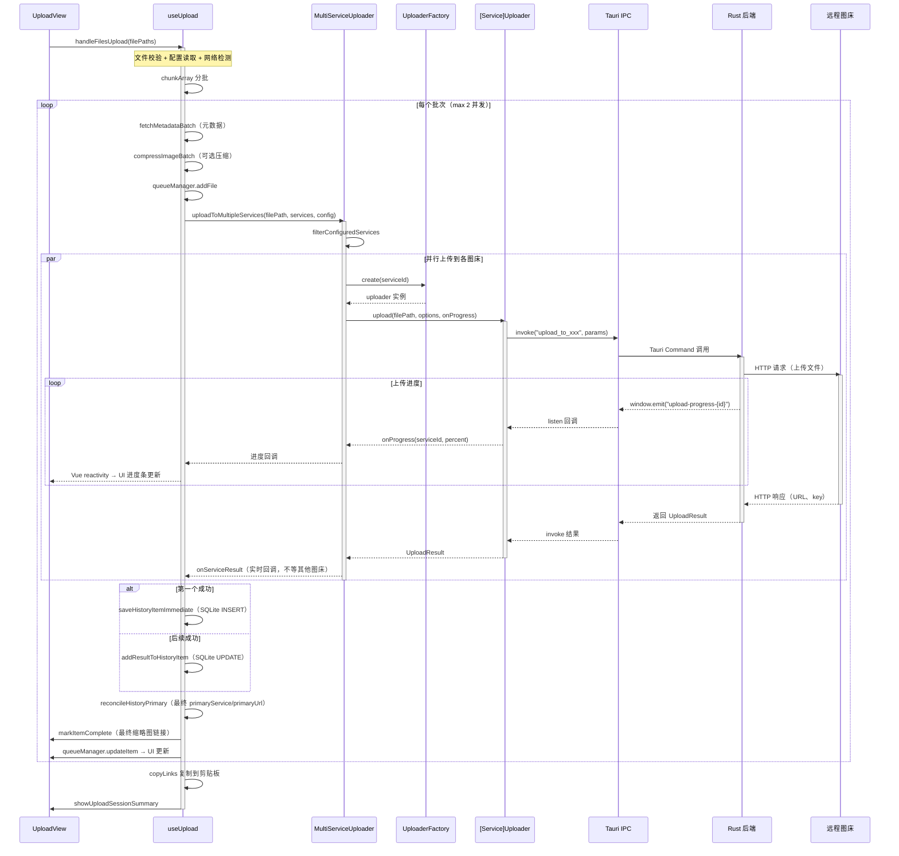

# 上传流程

> 核心业务逻辑的可视化图解。排查上传失败、进度异常时优先查看此文档。

---

## 图 1：上传主流程

展示从用户操作到最终结果的完整路径。重点关注**分批处理**和**多图床并行**两个关键设计。

> **关键源文件**：`src/composables/useUpload.ts`、`src/core/MultiServiceUploader.ts`

```mermaid
flowchart TD
    %% 用户输入
    A1[拖拽图片] --> B
    A2[点击选择文件] --> B
    A3[粘贴剪贴板] --> B

    B[UploadView 接收文件路径列表]
    B --> C{isUploading?}
    C -- 是 --> C1[提示：上传进行中]
    C -- 否 --> D

    %% 前置校验
    D[锁定 isUploading = true]
    D --> E[filterValidFiles 文件类型校验]
    E --> F{有有效文件?}
    F -- 否 --> F1[提示：没有有效图片]
    F --> G{超过 200 张?}
    G -- 是 --> G1[截断并提示]
    G1 --> H
    G -- 否 --> H

    %% 配置与网络
    H[configStore.get 读取配置]
    H --> I{读取成功?}
    I -- 失败 --> I1[回退 DEFAULT_CONFIG]
    I1 --> J
    I -- 成功 --> J
    J{enabledServices 为空?}
    J -- 是 --> J1[提示：请选择图床]
    J -- 否 --> K

    K[checkNetworkConnectivity 网络检测]
    K --> L{网络可用?}
    L -- 否 --> L1[提示：网络不可用]
    L -- 是 --> M

    %% 分批处理
    M[chunkArray 按 50 张分批]
    M --> N[并发批次控制 max=2]
    N --> O[processBatch 批次处理]

    %% 单批次流水线
    O --> P[fetchMetadataBatch 获取元数据]
    P --> Q{压缩已启用?}
    Q -- 是 --> Q1[compressImageBatch 图片压缩]
    Q1 --> R
    Q -- 否 --> R

    R[queueManager.addFile 加入上传队列]
    R --> S[MultiServiceUploader.uploadToMultipleServices]

    %% 多图床并行
    S --> T[filterConfiguredServices 过滤已配置服务]
    T --> U[并行上传到所有图床]
    U --> V1[图床 A 上传]
    U --> V2[图床 B 上传]
    U --> V3[图床 C 上传...]

    %% 单个图床上传
    V1 & V2 & V3 --> W[UploaderFactory.create 创建上传器]
    W --> X[validateConfig 配置校验]
    X --> Y[uploader.upload → Tauri invoke → Rust 后端]
    Y --> Z[远程图床服务]

    %% 实时回调
    Z --> AA{上传成功?}
    AA -- 成功 --> AB[onServiceResult 实时回调]
    AA -- 失败 --> AC[记录 StructuredError]
    AC --> AB

    AB --> AD{第一个成功的服务?}
    AD -- 是 --> AE[saveHistoryItemImmediate 立即创建历史]
    AD -- 否 --> AF[addResultToHistoryItem 追加结果]
    AE & AF --> AG[queueManager.updateItem 更新 UI]

    %% 收尾
    AG --> AH{当前文件所有图床完成?}
    AH -- 否 --> U
    AH -- 是 --> AH1[reconcileHistoryPrimary<br/>按配置顺序收口主图床]
    AH1 --> AH2[markItemComplete<br/>统一缩略图主链接]
    AH2 --> AH3{所有批次完成?}
    AH3 -- 否 --> O
    AH3 -- 是 --> AI[copyLinks 复制最终主链接到剪贴板]
    AI --> AJ[showUploadSessionSummary Toast 通知]
    AJ --> AK[解锁 isUploading = false]

    %% 样式
    style A1 fill:#e3f2fd,stroke:#1976d2
    style A2 fill:#e3f2fd,stroke:#1976d2
    style A3 fill:#e3f2fd,stroke:#1976d2
    style F1 fill:#ffebee,stroke:#c62828
    style J1 fill:#ffebee,stroke:#c62828
    style L1 fill:#ffebee,stroke:#c62828
    style C1 fill:#fff3e0,stroke:#ef6c00
    style AK fill:#e8f5e9,stroke:#2e7d32
```

---

## 图 2：上传事件时序

展示前后端通过 Tauri Event System 的实时通信过程。排查**进度更新卡住**或**事件丢失**时重点查看。

> **关键源文件**：`src/core/MultiServiceUploader.ts`、各 Uploader 实现

---

## 排查指南

| 现象 | 可能原因 | 对照图表位置 |
|------|---------|-------------|
| 点击上传无反应 | `isUploading` 未释放（上次上传异常退出） | 图1 节点 C |
| 提示"没有有效图片" | 文件格式不在白名单 | 图1 节点 F |
| 提示"请选择图床" | `enabledServices` 为空 | 图1 节点 J |
| 进度条卡在 0% | Rust 后端未发送 progress 事件 | 图2 进度循环 |
| 部分图床失败 | 单个服务 StructuredError | 图1 节点 AA → AC |
| 历史记录缺少某图床 URL | `addResultToHistoryItem` 未触发 | 图1 节点 AD → AF |
| 历史主图床与复制链接不一致 | `reconcileHistoryPrimary` 未完成 | 图1 节点 AH1 |

---

## 相关文档

- [添加新图床指南](../reference/guides/add-new-uploader.md) — 新增图床的完整操作步骤
- [上传器接口规范](../reference/api/uploaders.md) — IUploader 接口定义
- [架构总览](../reference/architecture/overview.md) — 系统分层与核心模块
- [系统总览](./system-overview.md) — 宏观架构分层与上传器类关系
- [批量迁移流程](./batch-migrate-flow.md) — 复用 MultiServiceUploader 的批量迁移
