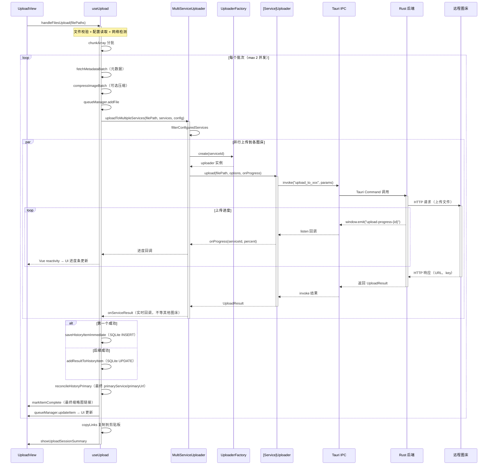

# 上传流程

> 核心业务逻辑的可视化图解。排查上传失败、进度异常时优先查看此文档。

---

## 图 1：上传主流程

展示从用户操作到最终结果的完整路径。重点关注**分批处理**和**多图床并行**两个关键设计。

> **关键源文件**：`src/composables/useUpload.ts`、`src/core/MultiServiceUploader.ts`


```mermaid
flowchart TD
    %% 用户输入
    A1[拖拽图片] --> B
    A2[点击选择文件] --> B
    A3[粘贴剪贴板] --> B

    B[UploadView 接收文件路径列表]
    B --> C{isUploading?}
    C -- 是 --> C1[提示：上传进行中]
    C -- 否 --> D

    %% 前置校验
    D[锁定 isUploading = true]
    D --> E[filterValidFiles 文件类型校验]
    E --> F{有有效文件?}
    F -- 否 --> F1[提示：没有有效图片]
    F --> G{超过 200 张?}
    G -- 是 --> G1[截断并提示]
    G1 --> H
    G -- 否 --> H

    %% 配置与网络
    H[configStore.get 读取配置]
    H --> I{读取成功?}
    I -- 失败 --> I1[回退 DEFAULT_CONFIG]
    I1 --> J
    I -- 成功 --> J
    J{enabledServices 为空?}
    J -- 是 --> J1[提示：请选择图床]
    J -- 否 --> K

    K[checkNetworkConnectivity 网络检测]
    K --> L{网络可用?}
    L -- 否 --> L1[提示：网络不可用]
    L -- 是 --> M

    %% 分批处理
    M[chunkArray 按 50 张分批]
    M --> N[并发批次控制 max=2]
    N --> O[processBatch 批次处理]

    %% 单批次流水线
    O --> P[fetchMetadataBatch 获取元数据]
    P --> Q{压缩已启用?}
    Q -- 是 --> Q1[compressImageBatch 图片压缩]
    Q1 --> R
    Q -- 否 --> R

    R[queueManager.addFile 加入上传队列]
    R --> S[MultiServiceUploader.uploadToMultipleServices]

    %% 多图床并行
    S --> T[filterConfiguredServices 过滤已配置服务]
    T --> U[并行上传到所有图床]
    U --> V1[图床 A 上传]
    U --> V2[图床 B 上传]
    U --> V3[图床 C 上传...]

    %% 单个图床上传
    V1 & V2 & V3 --> W[UploaderFactory.create 创建上传器]
    W --> X[validateConfig 配置校验]
    X --> Y[uploader.upload → Tauri invoke → Rust 后端]
    Y --> Z[远程图床服务]

    %% 实时回调
    Z --> AA{上传成功?}
    AA -- 成功 --> AB[onServiceResult 实时回调]
    AA -- 失败 --> AC[记录 StructuredError]
    AC --> AB

    AB --> AD{第一个成功的服务?}
    AD -- 是 --> AE[saveHistoryItemImmediate 立即创建历史]
    AD -- 否 --> AF[addResultToHistoryItem 追加结果]
    AE & AF --> AG[queueManager.updateItem 更新 UI]

    %% 收尾
    AG --> AH{当前文件所有图床完成?}
    AH -- 否 --> U
    AH -- 是 --> AH1[reconcileHistoryPrimary<br/>按配置顺序收口主图床]
    AH1 --> AH2[markItemComplete<br/>统一缩略图主链接]
    AH2 --> AH3{所有批次完成?}
    AH3 -- 否 --> O
    AH3 -- 是 --> AI[copyLinks 复制最终主链接到剪贴板]
    AI --> AJ[showUploadSessionSummary Toast 通知]
    AJ --> AK[解锁 isUploading = false]

    %% 样式
    style A1 fill:#e3f2fd,stroke:#1976d2
    style A2 fill:#e3f2fd,stroke:#1976d2
    style A3 fill:#e3f2fd,stroke:#1976d2
    style F1 fill:#ffebee,stroke:#c62828
    style J1 fill:#ffebee,stroke:#c62828
    style L1 fill:#ffebee,stroke:#c62828
    style C1 fill:#fff3e0,stroke:#ef6c00
    style AK fill:#e8f5e9,stroke:#2e7d32
```

---

## 图 2：上传事件时序

展示前后端通过 Tauri Event System 的实时通信过程。排查**进度更新卡住**或**事件丢失**时重点查看。

> **关键源文件**：`src/core/MultiServiceUploader.ts`、各 Uploader 实现


```mermaid
sequenceDiagram
    participant UV as UploadView
    participant UU as useUpload
    participant MSU as MultiServiceUploader
    participant UF as UploaderFactory
    participant UP as [Service]Uploader
    participant IPC as Tauri IPC
    participant RS as Rust 后端
    participant RM as 远程图床

    UV->>UU: handleFilesUpload(filePaths)
    activate UU

    Note over UU: 文件校验 + 配置读取 + 网络检测
    UU->>UU: chunkArray 分批

    loop 每个批次（max 2 并发）
        UU->>UU: fetchMetadataBatch（元数据）
        UU->>UU: compressImageBatch（可选压缩）
        UU->>UU: queueManager.addFile

        UU->>MSU: uploadToMultipleServices(filePath, services, config)
        activate MSU

        MSU->>MSU: filterConfiguredServices

        par 并行上传到各图床
            MSU->>UF: create(serviceId)
            UF-->>MSU: uploader 实例
            MSU->>UP: upload(filePath, options, onProgress)
            activate UP

            UP->>IPC: invoke("upload_to_xxx", params)
            IPC->>RS: Tauri Command 调用
            activate RS

            RS->>RM: HTTP 请求（上传文件）
            activate RM

            loop 上传进度
                RS-->>IPC: window.emit("upload-progress-{id}")
                IPC-->>UP: listen 回调
                UP-->>MSU: onProgress(serviceId, percent)
                MSU-->>UU: 进度回调
                UU-->>UV: Vue reactivity → UI 进度条更新
            end

            RM-->>RS: HTTP 响应（URL、key）
            deactivate RM
            RS-->>IPC: 返回 UploadResult
            deactivate RS
            IPC-->>UP: invoke 结果
            UP-->>MSU: UploadResult
            deactivate UP

            MSU-->>UU: onServiceResult（实时回调，不等其他图床）
        end

        deactivate MSU

        alt 第一个成功
            UU->>UU: saveHistoryItemImmediate（SQLite INSERT）
        else 后续成功
            UU->>UU: addResultToHistoryItem（SQLite UPDATE）
        end

        UU->>UU: reconcileHistoryPrimary（最终 primaryService/primaryUrl）
        UU->>UV: markItemComplete（最终缩略图链接）

        UU->>UV: queueManager.updateItem → UI 更新
    end

    UU->>UU: copyLinks 复制到剪贴板
    UU->>UV: showUploadSessionSummary
    deactivate UU
```

---

## S3 系图床：对象名与 Content-Type

适用于全部 6 个走 `upload_to_s3_compatible` 的图床：**阿里云 OSS / 腾讯云 COS / 七牛云 / 又拍云 / Cloudflare R2 / 自定义 S3**（它们都继承 `BaseS3Uploader`，`R2Uploader` 也不例外——`src-tauri/src/commands/r2.rs` 的 `upload_to_r2` 目前无前端调用方）。

### 对象名（key）唯一化

```
key = {配置里的 path}/{yyyyMMdd}_{4位base36随机}_{原文件名}
例：images/20260813_a3f9_screenshot.png
```

> **关键源文件**：`src/uploaders/s3/objectKey.ts`（`buildObjectKey`）→ `src/uploaders/s3/BaseS3Uploader.ts`

**不变量：同一个对象名只对应一次上传。**

大白话：以前 key 就是「路径 + 原文件名」，你把两张不同内容但都叫 `screenshot.png` 的图先后传上去，第二张会**直接把第一张顶掉**——桶里只剩第二张，而第一条历史记录的链接还指向那个 key，于是点开旧记录看到的是新图，旧图永久没了。加上「日期 + 随机段」前缀后，每次上传都落在自己的 key 上，谁也顶不掉谁。

设计取舍：

- **原文件名留在末尾**，不是开头——既保住可读性，也保住扩展名（Rust 侧靠扩展名推断 Content-Type，见下）。
- **随机段 4 位 base36**（约 168 万种）。碰撞需要「同一天 + 同一个原文件名 + 同一个随机段」三者同时命中，日常量级下可忽略。
- **只影响新上传**：旧记录的 URL 结构不变，历史里的 `fileKey` 始终取 Rust 回传值，不是前端自算的那个字符串。
- **代价**：上传失败后重试会生成新 key。若前一次其实已经落桶只是响应丢了，桶里会留一个孤儿对象（旧行为是覆盖同名对象、不留孤儿）。用「多一个几十 KB 的孤儿文件」换「不再静默覆盖用户的图」，是划算的。
- 文件名本身**不做净化**（空格、`#`、中文原样保留），与改动前一致。

### Content-Type

> **关键源文件**：`src-tauri/src/commands/s3_compatible.rs`（`guess_object_content_type`）

`put_object` 按**文件扩展名**用 `mime_guess` 推断 Content-Type，未知扩展名回退 `application/octet-stream`。与 `r2.rs` 共用同一套 `mime_guess` 映射，不另维护扩展名表。

大白话：不带这个头的话，对象会以「二进制文件」的身份存进桶里，浏览器直接打开图片链接时不会显图，而是弹出下载框。

已覆盖：`png / jpg / jpeg / webp / gif / svg / avif / bmp / ico`（大小写不敏感）。

---

## 排查指南

| 现象 | 可能原因 | 对照图表位置 |
|------|---------|-------------|
| 点击上传无反应 | `isUploading` 未释放（上次上传异常退出） | 图1 节点 C |
| 提示"没有有效图片" | 文件格式不在白名单 | 图1 节点 F |
| 提示"请选择图床" | `enabledServices` 为空 | 图1 节点 J |
| 进度条卡在 0% | Rust 后端未发送 progress 事件 | 图2 进度循环 |
| 部分图床失败 | 单个服务 StructuredError | 图1 节点 AA → AC |
| 历史记录缺少某图床 URL | `addResultToHistoryItem` 未触发 | 图1 节点 AD → AF |
| 历史主图床与复制链接不一致 | `reconcileHistoryPrimary` 未完成 | 图1 节点 AH1 |
| S3 图床链接在浏览器里变成下载而不是显图 | 对象缺 Content-Type；确认 `curl -I` 返回的是否为 `application/octet-stream`。旧对象是改动前传的，需重传才会带上正确类型 | S3 系图床 → Content-Type |
| S3 桶里出现 `20260813_a3f9_` 之类的前缀 | 预期行为，key 唯一化前缀 | S3 系图床 → 对象名唯一化 |
| 想按固定文件名覆盖桶里的旧对象 | 已刻意不支持——覆盖会让旧历史记录的链接指向新图 | S3 系图床 → 对象名唯一化 |
| S3 桶里有对象但历史里查不到 | 上传失败重试留下的孤儿对象（重试用新 key，不覆盖） | S3 系图床 → 对象名唯一化「代价」 |
| 未知扩展名的文件上传后类型是 `application/octet-stream` | `mime_guess` 无法识别该扩展名，按设计回退 | S3 系图床 → Content-Type |

---

## 相关文档

- [添加新图床指南](../reference/guides/add-new-uploader.md) — 新增图床的完整操作步骤
- [上传器接口规范](../reference/api/uploaders.md) — IUploader 接口定义
- [架构总览](../reference/architecture/overview.md) — 系统分层与核心模块
- [系统总览](./system-overview.md) — 宏观架构分层与上传器类关系
- [批量迁移流程](./batch-migrate-flow.md) — 复用 MultiServiceUploader 的批量迁移
