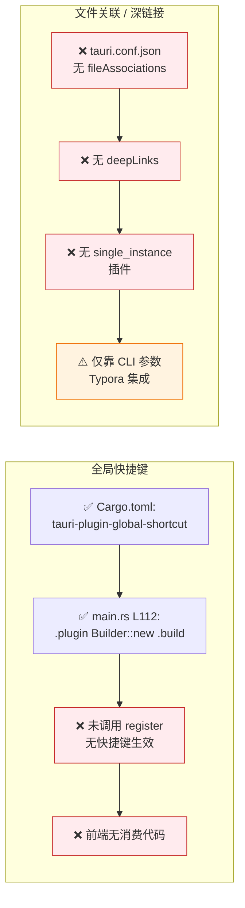

# 窗口 / 托盘 / 快捷键 / 文件关联流程

> 桌面集成层:窗口生命周期、关闭到托盘、系统托盘菜单、CLI 启动参数、以及全局快捷键/文件关联的实现状态。修改这些行为时优先查看此文档。

## 概览

PicNexus 是**单窗口 + 系统托盘** 架构:

- **窗口**:无标题栏(`decorations: false`,使用自定义装饰条),启动时隐藏(`visible: false`),根据屏幕分辨率自适应初始大小
- **关闭行为**:默认 `closeToTray = true`,点 × 只隐藏到托盘,不退出进程;可通过 `set_close_to_tray` 命令切换
- **系统托盘**:三项菜单(打开设置/上传历史/退出),左键点击图标直接唤起主窗口
- **全局快捷键**:插件已加载,**但当前未注册任何快捷键**(预留扩展点)
- **文件关联**:`tauri.conf.json` 未配置 `fileAssociations`,但通过 CLI 参数支持 Typora/Obsidian 调用(`picnexus.exe /path/to/img.jpg`)

---

## 图 1:窗口生命周期与关闭到托盘

展示应用启动后,主窗口如何创建、显示、最小化、关闭(到托盘)的完整状态机。

> **关键源文件**:`src-tauri/tauri.conf.json`(L17~L33 windows 配置)、`src-tauri/src/main.rs`(L353~L390 自适应大小、L408~L417 on_window_event、L488 set_close_to_tray)

```mermaid
stateDiagram-v2
    [*] --> Starting: cargo tauri dev / 双击启动

    Starting --> ConfigLoad: 读取 tauri.conf.json<br/>(visible:false 启动隐藏)
    ConfigLoad --> ScreenDetect: setup 回调
    ScreenDetect --> SizeAdjust: 读取屏幕分辨率
    SizeAdjust --> W4K: 4K → 1600×1200
    SizeAdjust --> W1080: 1080P → 1280×900
    SizeAdjust --> WSmall: 小屏 → 800×600

    W4K --> Visible: window.show()
    W1080 --> Visible
    WSmall --> Visible

    Visible --> Focused: 用户操作

    Focused --> Minimized: 用户点最小化
    Minimized --> Focused: 任务栏/托盘唤起

    Focused --> CloseRequested: 用户点 ×
    Minimized --> CloseRequested

    CloseRequested --> CheckCloseToTray: on_window_event
    CheckCloseToTray --> HiddenToTray: closeToTray = true<br/>(默认)<br/>api.prevent_close + hide
    CheckCloseToTray --> Quit: closeToTray = false

    HiddenToTray --> Focused: 托盘左键 / 菜单项<br/>window.show + unminimize + focus
    HiddenToTray --> Quit: 托盘菜单 → 退出<br/>std::process::exit(0)

    Quit --> [*]

    note right of CheckCloseToTray
      set_close_to_tray(bool)
      命令可前端动态切换
    end note

    note right of Visible
      Windows 高分屏:
      main.rs L345~L350 替换
      128×128@2x 任务栏图标
    end note
```

---

## 图 2:系统托盘构建与事件分发

展示托盘图标的创建过程和菜单项事件如何路由到前端。

> **关键源文件**:`src-tauri/src/main.rs`(L275~L331)

```mermaid
flowchart TD
    A[setup 回调] --> B[MenuBuilder::new]
    B --> B1[MenuItem: open_settings<br/>文本: 打开设置]
    B --> B2[MenuItem: open_history<br/>文本: 上传历史]
    B --> B3[PredefinedMenuItem: separator]
    B --> B4[MenuItem: quit<br/>文本: 退出]

    B1 & B2 & B3 & B4 --> M[menu.build]

    M --> T[TrayIconBuilder]
    T --> T1[.icon<br/>128×128@2x PNG]
    T --> T2[.menu menu]
    T --> T3[.show_menu_on_left_click false]
    T --> T4[.on_menu_event<br/>分发]
    T --> T5[.on_tray_icon_event<br/>左键处理]
    T --> T6[tauri-plugin-positioner<br/>托盘弹窗定位]

    %% 菜单事件分发
    T4 --> E1{event.id.as_ref}
    E1 -- open_settings --> ES1[window.show +<br/>emit navigate-to settings]
    E1 -- open_history --> ES2[window.show +<br/>emit navigate-to history]
    E1 -- quit --> ES3[std::process::exit 0]

    %% 左键事件
    T5 --> L1{MouseButton + State}
    L1 -- Left + Up --> L2[window.show<br/>+ unminimize<br/>+ set_focus]

    %% 前端接收
    ES1 & ES2 --> F[前端 App.vue]
    F --> F1[listen navigate-to]
    F1 --> F2[router.push<br/>切换 View]

    style A fill:#e3f2fd,stroke:#1976d2
    style F2 fill:#e8f5e9,stroke:#2e7d32
    style ES3 fill:#ffebee,stroke:#c62828
```

---

## 图 3:CLI 模式与文件关联(当前实现)

展示 `picnexus.exe /path/to/img.jpg` 从命令行启动的流程。这是当前支持 Typora 等外部编辑器集成的**唯一方式**。

> **关键源文件**:`src-tauri/src/cli.rs`(L56~L83 参数解析、L124~L223 上传逻辑)、`%APPDATA%/us.picnex.app/cli-config.json`

```mermaid
flowchart TD
    A[外部调用<br/>picnexus.exe arg] --> B[main.rs 启动前]
    B --> C[cli::parse_args]

    C --> D{ARGV 含什么?}
    D -- --help --> D1[打印帮助<br/>exit 0]
    D -- --version --> D2[打印版本<br/>exit 0]
    D -- --json path --> D3[JSON 输出模式]
    D -- path --> D4[普通上传模式]
    D -- 无参数 --> D5[进入 GUI 模式<br/>启动 Tauri Builder]

    D3 --> E[读取 cli-config.json<br/>APPDATA/us.picnex.app]
    D4 --> E

    E --> F{配置有效?}
    F -- 否 --> F1[stderr 输出错误<br/>exit 1]
    F -- 是 --> G[根据 config 选图床上传]

    G --> H[HTTP 请求 → 图床 API]
    H --> I{成功?}
    I -- 是 JSON 模式 --> I1[stdout:<br/>{url, width, height}]
    I -- 是 普通模式 --> I2[stdout: url]
    I -- 否 --> I3[stderr: 错误<br/>exit 1]

    I1 & I2 --> Z[exit 0]
    I3 --> Z

    D5 --> GUI[tauri::Builder 正常启动]

    %% 特点
    note1[⚠️ 每次 CLI 上传都是<br/>独立进程,无单实例守护<br/>与 GUI 实例不通信]:::noteStyle
    D4 -.-> note1

    style A fill:#e3f2fd,stroke:#1976d2
    style GUI fill:#e8f5e9,stroke:#2e7d32
    style Z fill:#e8f5e9,stroke:#2e7d32
    classDef noteStyle fill:#fff3e0,stroke:#ef6c00
```

---

## 图 4:已加载但未使用的扩展点

展示两个「基础设施就绪但业务层未接」的集成点,用于后续快速启用。



**启用全局快捷键的步骤**(如果要做):
1. 在 `main.rs` 的 `.plugin(global_shortcut::Builder::new()...)` 链式调用中加 `.with_shortcuts([...])?.with_handler(...)`
2. 前端在 `useConfig` 的 `globalShortcut` 配置区域加开关
3. 配置变化时通过命令调用 `unregister_all` + `register_multiple`

**启用文件关联的步骤**:
1. `tauri.conf.json` 加 `bundle.fileAssociations: [{ ext: ["png","jpg"], role: "Editor" }]`
2. 加载 `tauri-plugin-single-instance`,在 `main.rs` 把 `second_instance` 回调里的 `argv` 转发到主窗口
3. 前端 `listen("open-file", ...)` 接收文件路径,触发上传

---

## 插件清单(Cargo.toml)

| 插件 | 用途 | 本图关联 |
|------|------|----------|
| `tauri-plugin-positioner` | 托盘弹窗定位 | 图2 T6 |
| `tauri-plugin-autostart` | 开机自启 | — |
| `tauri-plugin-sql` | SQLite 驱动 | [db-migration-flow](./db-migration-flow.md) |
| `tauri-plugin-dialog` | 文件对话框 | — |
| `tauri-plugin-fs` | 文件系统 | — |
| `tauri-plugin-clipboard-manager` | 剪贴板 | [上传流程](./upload-flow.md) |
| `tauri-plugin-notification` | 系统通知 | — |
| `tauri-plugin-shell` | Shell / sidecar | — |
| `tauri-plugin-http` | HTTP 客户端 | — |
| `tauri-plugin-global-shortcut` | 全局快捷键 | 图4 R1 |
| `tauri-plugin-updater` | 自动更新 | [auto-update-flow](./auto-update-flow.md) |
| `tauri-plugin-process` | 进程管理 / relaunch | — |
| `tauri-plugin-log` | 日志系统 | [logger-diagnostics](./logger-diagnostics-flow.md) |

---

## 排查指南

| 现象 | 可能原因 | 对照图表位置 |
|------|---------|-------------|
| 点 × 直接退出而不是隐藏 | `CloseToTrayState` 被设为 `false` | 图1 CheckCloseToTray |
| 托盘菜单点击无反应 | `on_menu_event` 分支没匹配到 id,或前端没 listen `navigate-to` | 图2 F1 |
| 启动时窗口一闪而过 | `visible:true` 配置下 `show()` 时机错乱,应保持 `visible:false` + 代码控制显示 | 图1 Visible |
| Windows 任务栏图标模糊 | 没加载 128×128@2x 大图标 | 图1 note |
| Typora 调用 `picnexus.exe` 报错 | `cli-config.json` 缺失或图床未配置 | 图3 F1 |
| CLI 上传成功但 GUI 历史没更新 | CLI 是独立进程,不与 GUI 实例共享 DB 连接 | 图3 note1 |
| 配置全局快捷键不生效 | **当前未实现**,插件已加载但无 `register` 调用 | 图4 R1C |
| 设置 `fileAssociations` 拖图标打开无反应 | **当前未实现**,需要同时加 `single_instance` | 图4 R2 |

---

## 相关文档

- [系统总览](./system-overview.md) — 宏观架构分层
- [应用生命周期](./app-lifecycle.md) — 启动初始化顺序
- [IPC 命令层](./ipc-command-flow.md) — 托盘菜单如何通过 `emit` 通知前端
- [上传流程](./upload-flow.md) — CLI 上传链路复用的上传器
